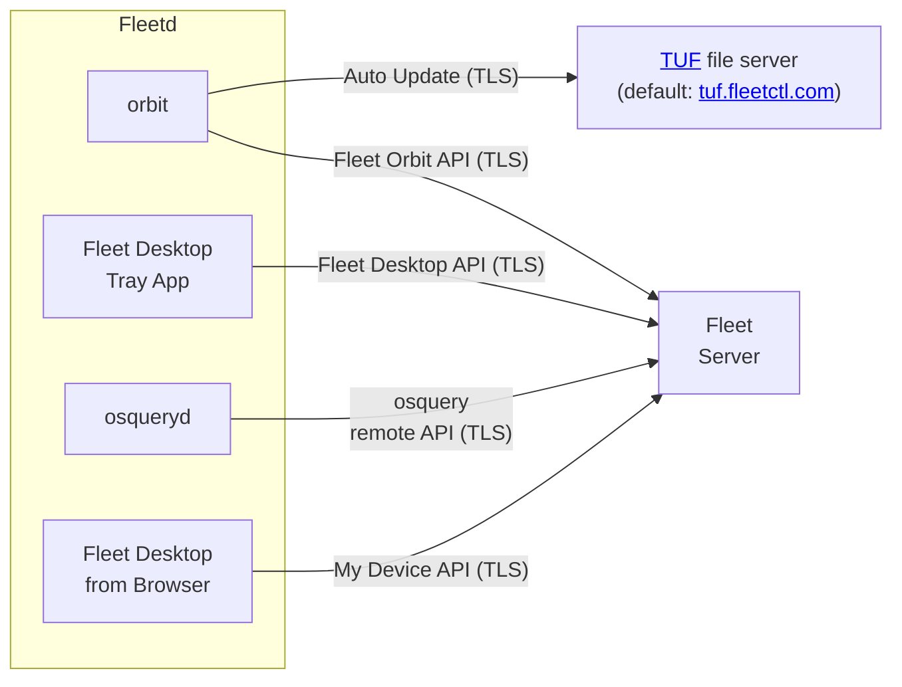

# Fleetd


- [Fleetd](#fleetd)
  - [Overview](#overview)
    - [Components](#components)
    - [Capabilities](#capabilities)
  - [Packaging](#packaging)
    - [Dependencies](#dependencies)
    - [Packaging support](#packaging-support)
    - [Building packages](#building-packages)
      - [Configuration options](#configuration-options)
      - [Fleet Desktop](#fleet-desktop)
      - [Update channels](#update-channels)
      - [macOS signing \& notarization](#macos-signing--notarization)
      - [Fleetd osquery result and status logs](#fleetd-osquery-result-and-status-logs)
      - [Fleetd mTLS support](#fleetd-mtls-support)
      - [Debug](#debug)
  - [Orbit](#orbit)
    - [Usage](#usage)
      - [Permissions](#permissions)
        - [macOS/Linux](#macoslinux)
        - [Windows](#windows)
    - [Osquery shell](#osquery-shell)
    - [Connect to a Fleet server](#connect-to-a-fleet-server)
    - [Osquery flags](#osquery-flags)
    - [Osquery extensions](#osquery-extensions)
    - [Orbit development](#orbit-development)
      - [Run Orbit from source](#run-orbit-from-source)
      - [Generate installer packages from Orbit source](#generate-installer-packages-from-orbit-source)
    - [Troubleshooting](#troubleshooting)
      - [Logs](#logs)
    - [Uninstall](#uninstall)
      - [Windows](#windows-1)
      - [Linux](#linux)
      - [macOS](#macos)
  - [Bugs](#bugs)
  - [Try Fleetd](#try-fleetd)
    - [With `fleetctl preview` already running](#with-fleetctl-preview-already-running)

## Overview

Fleetd is the bundle of agents that includes:

- [osquery](https://osquery.io/)
- [Orbit](#orbit)
- [Fleet Desktop](./fleet-desktop.md)

## Components




## Capabilities

| Capability                           | Status |
| ------------------------------------ | ------ |
| Secure autoupdate for osquery        | ✅      |
| Secure autoupdate for Orbit          | ✅      |
| Configurable update channels         | ✅      |
| Full osquery flag customization      | ✅      |
| Package tooling for macOS `.pkg`     | ✅      |
| Package tooling for Linux `.deb`     | ✅      |
| Package tooling for Linux `.rpm`     | ✅      |
| Package tooling for Windows `.msi`   | ✅      |
| Manage/update osquery extensions     | ✅      |
| Manage cgroups for Linux performance | 🔜      |


## Packaging

Fleetd is typically deployed via OS-specific packages. Tooling is provided with this repository to generate installation packages.

### Dependencies

Fleetd currently supports building packages on macOS and Linux.

Before building packages, clone or download [this repository](https://github.com/fleetdm/fleet/tree/main) and [install Go](https://golang.org/doc/install).

Building Windows packages requires Docker to be installed.

### Packaging support

- **macOS** - `.pkg` package generation with (optional) [notarization](https://developer.apple.com/documentation/xcode/notarizing_macos_software_before_distribution) and codesigning - Persistence via `launchd`.

- **Linux** - `.deb` (Debian, Ubuntu, etc.) & `.rpm` (RHEL, CentOS, etc.) package generation - Persistence via `systemd`.

- **Windows** - `.msi` package generation - Persistence via Services.

### Building packages

Use `fleetctl package` to run the packaging tools.

The only required parameter is `--type`, use one of `deb`, `rpm`, `pkg`, or `msi`.

Configure osquery to connect to a Fleet (or other TLS) server with the `--fleet-url` and `--enroll-secret` flags.

A minimal invocation for communicating with Fleet:

```sh
fleetctl package --type deb --fleet-url=fleet.example.com --enroll-secret=notsosecret
```

This will build a `.deb` package configured to communicate with a Fleet server at `fleet.example.com` using the enroll secret `notsosecret`.

When the Fleet server uses a self-signed (or otherwise invalid) TLS certificate, package with the `--insecure` or `--fleet-certificate` options.

#### Configuration options

The following command-line flags allow you to configure an osquery installer further to communicate with a specific Fleet instance.

| Flag                       | Options                                                                                                                                 |
| -------------------------- | --------------------------------------------------------------------------------------------------------------------------------------- |
| --type                     | **Required** - Type of package to build.<br> Options: `pkg`(macOS),`msi`(Windows), `deb`(Debian based Linux), `rpm`(RHEL, CentOS, etc.) |
| --fleet-desktop            | Include Fleet Desktop.                                                                                                                  |
| --enroll-secret            | Enroll secret for authenticating to Fleet server                                                                                        |
| --fleet-url                | URL (`host:port`) of Fleet server                                                                                                       |
| --fleet-certificate        | Path to server certificate bundle                                                                                                       |
| --identifier               | Identifier for package product (default: `com.fleetdm.orbit`)                                                                           |
| --version                  | Version for package product (default: `0.0.3`)                                                                                          |
| --insecure                 | Disable TLS certificate verification (default: `false`)                                                                                 |
| --service                  | Install osquery with a persistence service (launchd, systemd, etc.) (default: `true`)                                                   |
| --sign-identity            | Identity to use for macOS codesigning                                                                                                   |
| --notarize                 | Whether to notarize macOS packages (default: `false`)                                                                                   |
| --disable-updates          | Disable auto updates on the generated package (default: false)                                                                          |
| --osqueryd-channel         | Update channel of osqueryd to use (default: `stable`)                                                                                   |
| --orbit-channel            | Update channel of Orbit to use (default: `stable`)                                                                                      |
| --desktop-channel          | Update channel of desktop to use (default: `stable`)                                                                                    |
| --update-url               | URL for update server (default: `https://tuf.fleetctl.com`)                                                                             |
| --update-roots             | Root key JSON metadata for update server (from fleetctl updates roots)                                                                  |
| --use-system-configuration | Try to read --fleet-url and --enroll-secret using configuration in the host (currently only macOS profiles are supported)               |
| --debug                    | Enable debug logging (default: `false`)                                                                                                 |
| --verbose                  | Log detailed information when building the package (default: false)                                                                     |
| --help, -h                 | show help (default: `false`)                                                                                                            |

#### Fleet Desktop

[Fleet Desktop](./Fleet-desktop.md) is a menu bar icon available on macOS, Windows, and Linux that gives your end users visibility into the security posture of their machine.

You can include Fleet Desktop in the orbit package by including the `--fleet-desktop`option. 

#### Update channels

Fleetd uses the concept of "update channels" to determine the version of Orbit, Fleet Desktop, osquery, and any extensions (extension support coming soon) to run. This concept is modeled from the common versioning convention for Docker containers.

Configure update channels for Fleetd and osqueryd with the `--orbit-channel`, `--desktop-channel` and `--osqueryd-channel` flags when packaging.

| Channel | Versions |
| ------- | -------- |
| `4`     | 4.x.x    |
| `4.6`   | 4.6.x    |
| `4.6.0` | 4.6.0    |

Additionally, `stable` and `edge` are special channel names. The `stable` channel will provide the most recent osquery version that Fleet deems to be stable. When a new version of osquery is released, it's added to the `edge` channel for beta testing. Fleet then provides input to the osquery TSC based on testing. After the version is declared stable by the osquery TSC, Fleet will promote the version to `stable` ASAP.

#### macOS signing & notarization

Fleetd's packager can automate the codesigning and notarization steps to allow the resulting package to generate packages that appear "trusted" when installed on macOS hosts. Signing and notarization are supported only on macOS hosts.

For signing, a "Developer ID Installer" certificate must be available on the build machine ([generation instructions](https://help.apple.com/xcode/mac/current/#/dev154b28f09)). Use `security find-identity -v` to verify the existence of this certificate and make note of the identifier provided in the left column.

For notarization, valid App Store Connect credentials must be available on the build machine. Set these in the environment variables `AC_USERNAME` and `AC_PASSWORD`. It's common to configure this via [app-specific passwords](https://support.apple.com/en-ca/HT204397). Some organizations (notably those with Apple Enterprise Developer Accounts) may also need to specify `AC_TEAM_ID`. This value can be found on the [Apple Developer "Membership" page](https://developer.apple.com/account/#!/membership) under "Team ID."

Build a signed and notarized macOS package with an invocation like the following:

```sh
AC_USERNAME=zach@example.com AC_PASSWORD=llpk-sije-kjlz-jdzw fleetctl package --type=pkg --fleet-url=fleet.example.com --enroll-secret=63SBzTT+2UyW --sign-identity 3D7260BF99539C6E80A94835A8921A988F4E6498 --notarize
```

This process may take several minutes, as the notarization process completes on Apple's servers.

After successful notarization, the generated "ticket" is automatically stapled to the package.

#### Fleetd osquery result and status logs

If the `logger_path` configuration is set to `filesystem`, Fleetd will store osquery's "result" and
"status" logs to the following directories:
  - Windows: C:\Program Files\Orbit\osquery_log
  - macOS: /opt/orbit/osquery_log
  - Linux: /opt/orbit/osquery_log

#### Fleetd mTLS support

Fleetd supports using TLS client certificates for authentication to the Fleet server and [TUF](https://theupdateframework.io/) server.
This functionality is licensed under the Fleet EE License. Usage requires a current Fleet EE subscription.

> The mTLS feature requires Orbit to be version v1.10.0 or greater and `fleetctl` v4.31.0 or greater.

When generating the packages, use the following flags:
```sh
fleetctl package \
  [...]
  --fleet-tls-client-certificate=fleet-client.crt \
  --fleet-tls-client-key=fleet-client.key \
  --update-tls-client-certificate=update-client.crt \
  --update-tls-client-key=update-client.key \
  [...]
```
The certificates must be in PEM format.

The client certificates can also be pushed to existing installations by placing them in the following locations:
- For macOS and Linux:
  - `/opt/orbit/fleet_client.crt`
  - `/opt/orbit/fleet_client.key`
  - `/opt/orbit/update_client.crt`
  - `/opt/orbit/update_client.key`
- For Windows:
  - `C:\Program Files\Orbit\fleet_client.crt`
  - `C:\Program Files\Orbit\fleet_client.key`
  - `C:\Program Files\Orbit\update_client.crt`
  - `C:\Program Files\Orbit\update_client.key`

If using Fleet Desktop, you may need to specify an alternative host for the "My device" URL (in the Fleet tray icon).
Such alternative host should not require client certificates on the TLS connection.
```sh
fleetctl package
  [...]
  --fleet-desktop \
  --fleet-desktop-alternative-browser-host=fleet-desktop.example.com \
  [...]
```
If this setting is not used, you will need to configure client TLS certificates on devices' browsers.

#### Debug

You can use the `--debug` option in `fleetctl package` to generate installers in "debug mode." This mode increases the verbosity of logging for orbit and osqueryd (log DEBUG level).

## Orbit

Orbit is an [osquery](https://github.com/osquery/osquery) runtime and autoupdater that is bundled in Fleetd. With Orbit, it's easy to deploy osquery, manage configurations, and stay up to date. Orbit eases the deployment of osquery connected with a [Fleet server](https://github.com/fleetdm/fleet) and is a (near) drop-in replacement for osquery in a variety of deployment scenarios.

Orbit is the recommended agent for Fleet. But Orbit can be used with or without Fleet, and Fleet can be used with or without Orbit.

### Usage

General information and flag documentation can be accessed by running `orbit --help`.

#### Permissions

Orbit generally expects root permissions to be able to create and access its working files.

To get root level permissions:

##### macOS/Linux

Prefix `orbit` commands with `sudo` (`sudo orbit ...`) or run in a root shell.

##### Windows

Run Powershell or cmd.exe with "Run as administrator" and start `orbit` commands from that shell.

#### Osquery shell

Run an `osqueryi` shell with `orbit osqueryi` or `orbit shell`.

#### Connect to a Fleet server

Use the `--fleet-url` and `--enroll-secret` flags to connect to a Fleet server.

For example:

```sh
orbit --fleet-url=https://localhost:8080 --enroll-secret=the_secret_value
```

Use `--fleet_certificate` to provide a path to a certificate bundle when necessary for osquery to verify the authenticity of the Fleet server (typically when using a Windows client or self-signed certificates):

```sh
orbit --fleet-url=https://localhost:8080 --enroll-secret=the_secret_value --fleet-certificate=cert.pem
```

Add the `--insecure` flag for connections using otherwise invalid certificates:

```sh
orbit --fleet-url=https://localhost:8080 --enroll-secret=the_secret_value --insecure
```

#### Osquery flags

Orbit can be used as a near drop-in replacement for `osqueryd`, enhancing standard osquery with autoupdate capabilities. Orbit passes through any options after `--` directly to the `osqueryd` instance.

For example, the following would be a typical drop-in usage of Orbit:

```sh
orbit -- --flagfile=flags.txt
```

#### Osquery extensions

Orbit can be used to remotely deploy and manage osquery extensions. This saves the time and energy required to maintain extensions using a separate tool like Munki or an MDM solution.

[Learn how](https://fleetdm.com/docs/using-fleet/configuration-files#code-extensions-code-option)

#### Orbit development

##### Run Orbit from source

To execute orbit from source directly, run the following command:

```sh
go run github.com/fleetdm/fleet/v4/orbit/cmd/orbit \
    --dev-mode \
    --disable-updates \
    --root-dir /tmp/orbit \
    --fleet-url https://localhost:8080 \
    --insecure \
    --enroll-secret Pz3zC0NMDdZfb3FtqiLgwoexItojrYh/ \
    -- --verbose
```

Or, using a `flagfile.txt` for osqueryd:
```sh 
go run github.com/fleetdm/fleet/v4/orbit/cmd/orbit \
    --dev-mode \
    --disable-updates \
    --root-dir /tmp/orbit \
    -- --flagfile=flagfile.txt --verbose
```

##### Generate installer packages from Orbit source

The `fleetctl package` command generates installers by fetching the targets/executables from a [TUF](https://theupdateframework.io/) repository.
To generate an installer that contains an Orbit built from source, you need to setup a local TUF repository.
The following document explains how you can generate a TUF repository and installers that use it: [tools/tuf/test](https://github.com/fleetdm/fleet/tree/main/tools/tuf/test/README.md).

#### Troubleshooting

##### Logs

Orbit captures and streams osqueryd's stdout/stderr into its own stdout/stderr output.
These are the log destinations for each platform:
- Linux: Orbit and osqueryd stdout/stderr output is sent to syslog (`/var/log/syslog` on Debian systems and `/var/log/messages` on CentOS).
- macOS: `/private/var/log/orbit/orbit.std{out|err}.log`.
- Windows: `C:\Windows\system32\config\systemprofile\AppData\Local\FleetDM\Orbit\Logs\orbit-osquery.log` (the log file is rotated).
 Users will need administrative permissions on the host to access these log destinations.


#### Uninstall

##### Windows

Use the "Add or remove programs" dialog to remove Orbit.

##### Linux

Uninstall the package with the corresponding package manager:

- Ubuntu
```sh
sudo apt remove fleet-osquery -y
```
- CentOS
```sh
sudo rpm -e fleet-osquery-X.Y.Z.x86_64
```

##### macOS

Run the [cleanup script](https://github.com/fleetdm/fleet/tree/main/orbit/tools/cleanup/cleanup_macos.sh).

## Bugs

[Create an issue](https://github.com/fleetdm/fleet/issues) to report a bug or request a feature.


## Try Fleetd

### With [`fleetctl preview` already running](https://github.com/fleetdm/fleet#try-fleet):

```bash
# With fleetctl in your $PATH
# Generate a macOS installer pointed at your local Fleet
fleetctl package --type=pkg --fleet-url=localhost:8412 --insecure --enroll-secret=YOUR_FLEET_ENROLL_SECRET_HERE
```

> With fleetctl preview running, you can find your Fleet enroll secret by selecting the "Add hosts" button on the Hosts page in the Fleet UI.

An installer configured to point at your Fleet instance has now been generated.

Now run that installer (double click, on a Mac) to enroll your own computer as a host in Fleet. Refresh after several seconds (≈30s), and you should now see your local computer as a new host in Fleet.

<meta name="pageOrderInSection" value="600">
<meta name="navSection" value="The basics">
