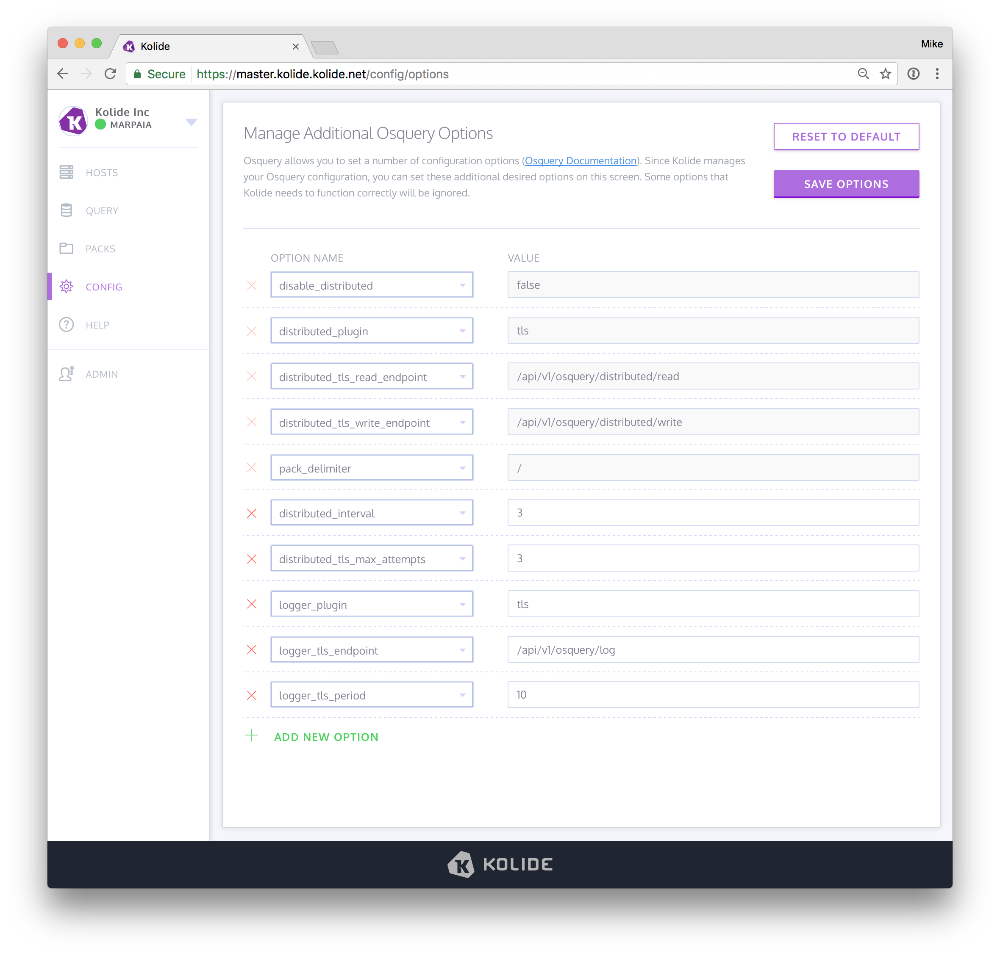

Configuring Osquery Options
===========================

To connect a host to Kolide, you have to launch `osqueryd` with some very specific options (which are further outlined in the [Adding Hosts To Kolide](../infrastructure/adding-hosts-to-kolide.md) documentation). Once a host has connected, many global osquery configuration options can be changed without necessitating a reboot of osquery. These options can be edited and managed by selecting the "Config" sidebar.

Note that this is a more advanced feature. The Kolide application will not allow you to configure osquery such that it can't talk to Kolide anymore, but you can significantly modify the behavior of osquery via configuration.
