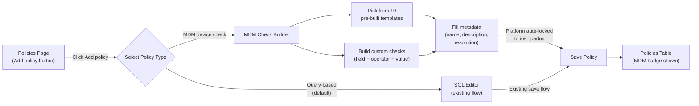

# iOS MDM Policy Engine — UI Mockups

## 1. Policy Creation Flow



## 2. MDM Check Builder — Component Layout

```
┌──────────────────────────────────────────────────────────┐
│  MDM Device Checks                                        │
│                                                           │
│  ┌─────────────────────────────────────────────────────┐ │
│  │ 📋 Start from template                        ▼     │ │
│  └─────────────────────────────────────────────────────┘ │
│                                                           │
│  ┌─────────────────────────────────────────────────────┐ │
│  │ Check 1:                                            │ │
│  │ ┌──────────────┐ ┌───────────┐ ┌──────────┐  ┌──┐ │ │
│  │ │ Passcode Set ▼│ │ equals   ▼│ │ true     │  │ ✕│ │ │
│  │ │  (Security)   │ │           │ │          │  │  │ │ │
│  │ └──────────────┘ └───────────┘ └──────────┘  └──┘ │ │
│  └─────────────────────────────────────────────────────┘ │
│                                                           │
│  ┌─────────────────────────────────────────────────────┐ │
│  │ Check 2:                                            │ │
│  │ ┌──────────────┐ ┌───────────┐ ┌──────────┐  ┌──┐ │ │
│  │ │ OS Version  ▼│ │ at least ▼│ │ 17.0     │  │ ✕│ │ │
│  │ │  (Device)    │ │           │ │          │  │  │ │ │
│  │ └──────────────┘ └───────────┘ └──────────┘  └──┘ │ │
│  └─────────────────────────────────────────────────────┘ │
│                                                           │
│  ┌─────────────────────────────────────────────────────┐ │
│  │ Check 3:                                            │ │
│  │ ┌──────────────┐ ┌───────────┐ ┌──────────┐  ┌──┐ │ │
│  │ │ Find My     ▼│ │ equals   ▼│ │ true     │  │ ✕│ │ │
│  │ │  (Security)   │ │           │ │          │  │  │ │ │
│  │ └──────────────┘ └───────────┘ └──────────┘  └──┘ │ │
│  └─────────────────────────────────────────────────────┘ │
│                                                           │
│  [ + Add check ]                                          │
│                                                           │
│  ┌─────────────────────────────────────────────────────┐ │
│  │ Preview (all checks must pass):                     │ │
│  │  ✓ Passcode is set = true                           │ │
│  │  ✓ OS Version >= 17.0                               │ │
│  │  ✓ Find My enabled = true                           │ │
│  └─────────────────────────────────────────────────────┘ │
└──────────────────────────────────────────────────────────┘
```

### Field Catalog (grouped dropdowns)

| Category | Fields |
|----------|--------|
| **Security** | Passcode Set, Passcode Compliant, Activation Lock, Find My Enabled, iCloud Backup, Lost Mode Active |
| **Device Info** | OS Version, Device Name, Device Supervised, Total Storage (GB), Available Storage (GB), Battery Level |
| **Network** | Device Roaming, Personal Hotspot |

### Operator Mapping

| Field Type | Available Operators |
|------------|-------------------|
| **boolean** | equals |
| **version** | at least, at most, exactly |
| **number** | equals, greater than, greater than or equal, less than, less than or equal |
| **string** | equals, does not equal, contains, does not contain |

## 3. Policies Table with MDM Badge

```
┌──────────────────────────────────────────────────────────────────────┐
│  Policies                                              [Add policy]  │
│──────────────────────────────────────────────────────────────────────│
│  Name                          │ Automations  │   Pass   │   Fail   │
│──────────────────────────────────────────────────────────────────────│
│  🍎 Disk encryption enabled    │              │  1,204   │    23    │
│     darwin                     │              │          │          │
│──────────────────────────────────────────────────────────────────────│
│  🍎 Chrome up to date  [Patch] │ 📦 Install   │    892   │   156    │
│     darwin                     │              │          │          │
│──────────────────────────────────────────────────────────────────────│
│  📱 iOS Passcode Required [MDM]│              │    341   │    12    │
│     ios, ipados                │              │          │          │
│──────────────────────────────────────────────────────────────────────│
│  📱 Minimum iOS 17       [MDM] │ 📋 Webhook   │    329   │    24    │
│     ios, ipados                │              │          │          │
│──────────────────────────────────────────────────────────────────────│
│  🖥️ Windows Defender active    │              │    567   │    89    │
│     windows                    │              │          │          │
│──────────────────────────────────────────────────────────────────────│
│  📱 Device Supervised    [MDM] │              │    312   │    41    │
│     ios, ipados                │              │          │          │
└──────────────────────────────────────────────────────────────────────┘
```

**Badge styling:**
- `[Patch]` — existing teal badge
- `[MDM]` — new green badge (same PillBadge component)
- Tooltip on MDM badge: "This policy evaluates iOS/iPadOS devices via MDM device information queries"

## 4. Save New Policy Modal with Type Selector

```
┌──────────────────────────────────────────────┐
│  Save policy                            [✕]  │
│                                              │
│  Policy type:                                │
│  ◉ Query-based          ○ MDM device check   │
│                                              │
│  ┌─── (when MDM selected) ─────────────────┐│
│  │ MDM Device Checks                       ││
│  │ [Check builder form as shown above]     ││
│  └─────────────────────────────────────────┘│
│                                              │
│  Name *                                      │
│  ┌──────────────────────────────────────┐   │
│  │ iOS Passcode Required               │   │
│  └──────────────────────────────────────┘   │
│                                              │
│  Description                                 │
│  ┌──────────────────────────────────────┐   │
│  │ Ensures all iOS/iPadOS devices have │   │
│  │ a passcode configured.              │   │
│  └──────────────────────────────────────┘   │
│                                              │
│  Resolution                                  │
│  ┌──────────────────────────────────────┐   │
│  │ Go to Settings > Face ID & Passcode │   │
│  │ and set a passcode.                 │   │
│  └──────────────────────────────────────┘   │
│                                              │
│  Platform: ios, ipados  (auto-selected)      │
│                                              │
│  ☐ Critical                                  │
│                                              │
│              [Cancel]  [Save]                │
└──────────────────────────────────────────────┘
```

## 5. GitOps YAML Example

```yaml
policies:
  # Existing query-based policy (unchanged)
  - name: Disk encryption enabled
    query: SELECT 1 FROM disk_encryption WHERE encrypted = 1
    platform: darwin,windows
    critical: true

  # New MDM policy type
  - name: iOS Passcode Required
    type: mdm
    platform: ios,ipados
    description: Ensures all iOS/iPadOS devices have a passcode configured
    resolution: Go to Settings > Face ID & Passcode and set a passcode
    critical: true
    mdm_checks:
      - field: PasscodePresent
        operator: eq
        expected: "true"

  - name: Minimum iOS 17
    type: mdm
    platform: ios,ipados
    description: Ensures devices are running iOS/iPadOS 17.0 or later
    resolution: Go to Settings > General > Software Update
    mdm_checks:
      - field: OSVersion
        operator: version_gte
        expected: "17.0"

  - name: iOS Security Baseline
    type: mdm
    platform: ios,ipados
    description: Comprehensive security baseline for managed iOS devices
    resolution: Contact IT for device configuration assistance
    critical: true
    mdm_checks:
      - field: PasscodePresent
        operator: eq
        expected: "true"
      - field: PasscodeCompliant
        operator: eq
        expected: "true"
      - field: OSVersion
        operator: version_gte
        expected: "17.0"
      - field: IsSupervised
        operator: eq
        expected: "true"
      - field: IsActivationLockEnabled
        operator: eq
        expected: "true"
```
