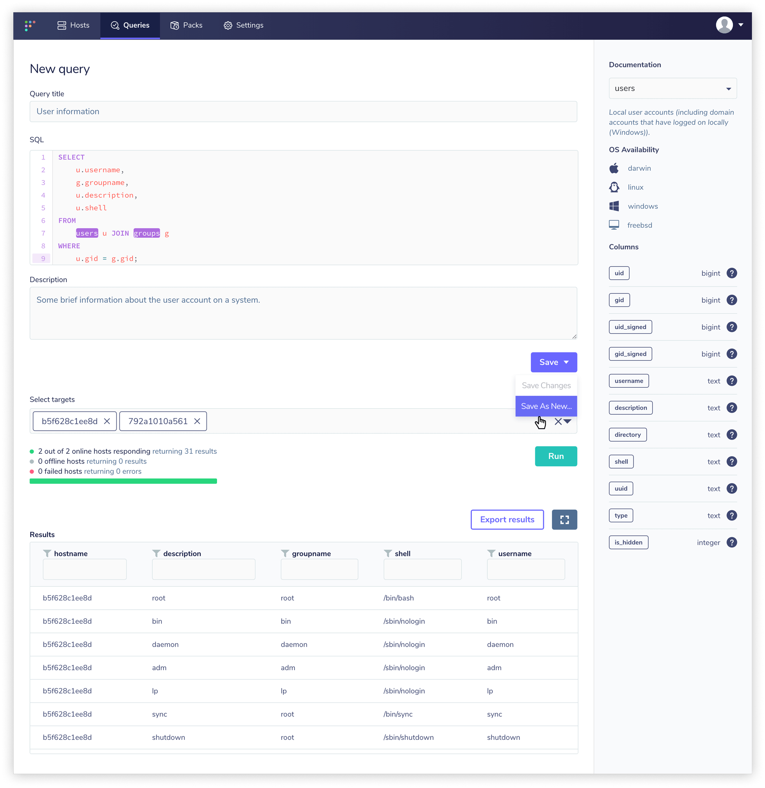

Running Queries
===============

The Fleet application allows you to query hosts which you have installed osquery on. To run a new query, use the "Query" sidebar and select "New Query". From this page, you can compose your query, view SQL table documentation via the sidebar, select arbitrary hosts (or groups of hosts), and execute your query. As results are returned, they will populate the interface in real time. You can use the integrated filtering tool to perform useful initial analytics and easily export the entire dataset for offline analysis.

After you've composed a query that returns the information you were looking for, you may choose to save the query. You can still continue to execute the query on whatever set of hosts you would like after you have saved the query.

Saved queries can be accessed if you select "Manage Queries" from the "Query" section of the sidebar. Here, you will find all of the queries you've ever saved. You can filter the queries by query name, so name your queries something memorable!

To learn more about scheduling queries so that they run on an on-going basis, see the [Scheduling Queries](./scheduling-queries.md) guide.
