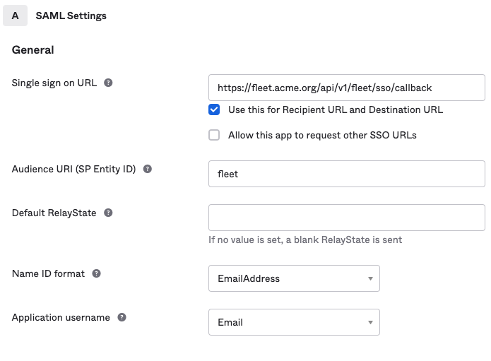

Configuring Single Sign On
===========================

Fleet supports SAML single sign on capability. This feature is convenient for users and offloads responsibility for user authentication to a third party identity provider such as Salesforce or Onelogin. Fleet supports the SAML Web Browser SSO Profile using the HTTP Redirect Binding. Fleet only supports SP-initiated SAML login and not IDP-initiated login.

## Identity Provider (IDP) Configuration

Several items are required to configure an IDP to provide SSO services to Fleet. Note that the names of these items may vary from provider to provider and may not conform to the SAML spec. Individual users must also be setup on the IDP before they can sign in to Fleet. The particulars of setting up the connected application (Fleet) and users will vary for different identity providers but will generally require the following information.

* _Assertion Consumer Service_ - This is the call back URL that the identity provider
will use to send security assertions to Fleet. In Okta, this field is called *Single sign on URL*. The value that you supply will be a fully qualified URL
consisting of your Fleet web address and the callback path `/api/v1/kolide/sso/callback`. For example,
if your Fleet web address is https://fleet.acme.org, then the value you would
use in the identity provider configuration would be:

  ```
  https://fleet.acme.org/api/v1/kolide/sso/callback
  ```

* _Entity ID_ - This value is a URI that you define. It identifies your Fleet instance as the service provider that issues authorization requests. The value must exactly match the
Entity ID that you define in the Fleet SSO configuration.

* _Name ID Format_ - The value should be `urn:oasis:names:tc:SAML:1.1:nameid-format:emailAddress`. This may be shortened in the IDP setup to something like `email` or `EmailAddress`.

* _Subject Type (Application username in Okta)_ - `username`.

  #### Example Salesforce IDP Configuration

  

  #### Example Okta IDP Configuration

  

The IDP will generate an issuer URI and a metadata URL that will be used to configure
Fleet as a service provider.

## Fleet SSO Configuration

A user must be an admin to configure Fleet for SSO.  The SSO configuration is
found in App Settings. If your IDP supports dynamic configuration, like Okta, you only need to provide an _Identity Provider Name_ and _Entity ID_, then paste a link in the metadata URL field. Otherwise, the following values are required.

* _Identity Provider Name_ - A human friendly name of the IDP.

* _Entity ID_ - A URI that identifies your Fleet instance as the issuer of authorization
requests. Assuming your company name is Acme, an example might be `fleet.acme.org` although
the value could be anything as long as it is unique to Fleet as a service provider
and matches the entity provider value used in the IDP configuration.

* _Issuer URI_ - This value is obtained from the IDP.

* _Metadata URL_ - This value is obtained from the IDP and is used by Fleet to
issue authorization requests to the IDP.

* _Metadata_ - If the IDP does not provide a metadata URL, the metadata must
be obtained from the IDP and entered. Note that the metadata URL is preferred if
the IDP provides metadata in both forms.

### Example Fleet SSO Configuration


## Creating SSO Users in Fleet

When an admin invites a new user to Fleet, they may select the `Enable SSO` option. The
SSO enabled users will not be able to sign in with a regular user ID and password. It is
strongly recommended that at least one admin user is set up to use the traditional password
based log in so that there is a fallback method for logging into Fleet in the event of SSO
configuration problems.

[SAML Bindings](http://docs.oasis-open.org/security/saml/v2.0/saml-bindings-2.0-os.pdf)

[SAML Profiles](http://docs.oasis-open.org/security/saml/v2.0/saml-profiles-2.0-os.pdf)
