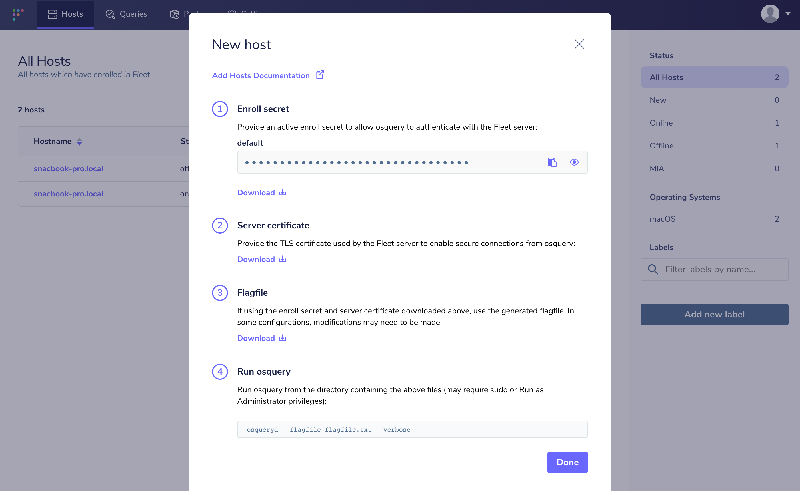

Kolide Fleet on CentOS
======================

In this guide, we're going to install Kolide Fleet and all of it's application dependencies on a CentOS 7.1 server. Once we have Fleet up and running, we're going to install osquery on that same CentOS 7.1 host and enroll it in Fleet. This should give you a good understanding of both how to install Fleet as well as how to install and configure osquery such that it can communicate with Fleet.

## Setting up a host

Acquiring a CentOS host to use for this guide is largely an exercise for the reader. If you don't have an CentOS host readily available, feel free to use [Vagrant](https://www.vagrantup.com/). In a clean, temporary directory, you can run the following to create a vagrant box, start it, and log into it:

```
$ echo 'Vagrant.configure("2") do |config|
  config.vm.box = "bento/centos-7.1"
  config.vm.network "forwarded_port", guest: 8080, host: 8080
end' > Vagrantfile
$ vagrant up
$ vagrant ssh
```

## Installing Fleet

To install Fleet, run the following:

```
$ sudo rpm -ivh https://dl.kolide.co/yum/kolide-yum-repo-1.0.0-1.noarch.rpm
$ sudo yum install kolide
```

## Installing and configuring dependencies

### MySQL

To install the MySQL server files, run the following:

```
$ wget http://repo.mysql.com/mysql-community-release-el7-5.noarch.rpm
$ sudo rpm -i mysql-community-release-el7-5.noarch.rpm
$ sudo yum update
$ sudo yum install mysql-server
```

To start the MySQL service:

```
$ sudo systemctl start mysqld
```

Let's set a password for the MySQL root user.

For MySQL 5.7.6 and newer, use the following command:

```
echo 'ALTER USER "root"@"localhost" IDENTIFIED BY "toor";' | mysql -u root
```

For MySQL 5.7.5 and older, use:

```
echo 'SET PASSWORD FOR "root"@"localhost" = PASSWORD("toor");' | mysql -u root
```

It's also worth creating a MySQL database for us to use at this point. Run the following to create the `kolide` database in MySQL. Note that you will be prompted for the password you created above.

```
$ echo 'CREATE DATABASE kolide;' | mysql -u root -p
```

### Redis

To install the Redis server files, run the following:

```
$ sudo rpm -Uvh http://dl.fedoraproject.org/pub/epel/6/i386/epel-release-6-8.noarch.rpm
$ sudo yum install redis
```

To start the Redis server in the background, you can run the following:

```
$ sudo service redis start
```

## Running the Fleet server

Now that we have installed Fleet, MySQL, and Redis, we are ready to launch Fleet! First, we must "prepare" the database. We do this via `kolide prepare db`:

```
$ /usr/bin/kolide prepare db \
    --mysql_address=127.0.0.1:3306 \
    --mysql_database=kolide \
    --mysql_username=root \
    --mysql_password=toor
```

The output should look like:

```
OK    20161118193812_CreateTableAppConfigs.go
OK    20161118211713_CreateTableDistributedQueryCampaignTargets.go
...
OK    20170124230432_CreateTableEmailChanges.go
goose: no migrations to run. current version: 20170124230432
OK    20161223115449_InsertOsqueryOptions.go
OK    20161229171615_InsertBuiltinLabels.go
goose: no migrations to run. current version: 20161229171615
```

Before we can run the server, we need to generate some TLS keying material. If you already have tooling for generating valid TLS certificates, then you are encouraged to use that instead. You will need a TLS certificate and key for running the Fleet server. If you'd like to generate self-signed certificates, you can do this via:

```
$ openssl genrsa -out /tmp/server.key 4096
$ openssl req -new -key /tmp/server.key -out /tmp/server.csr
$ openssl x509 -req -days 366 -in /tmp/server.csr -signkey /tmp/server.key -out /tmp/server.cert
```

You should now have three new files in `/tmp`:

- `/tmp/server.cert`
- `/tmp/server.key`
- `/tmp/server.csr`

Now we are ready to run the server! We do this via `kolide serve`:

```
$ /usr/bin/kolide serve \
  --mysql_address=127.0.0.1:3306 \
  --mysql_database=kolide \
  --mysql_username=root \
  --mysql_password=toor \
  --redis_address=127.0.0.1:6379 \
  --server_cert=/tmp/server.cert \
  --server_key=/tmp/server.key \
  --logging_json
```

Now, if you go to [https://localhost:8080](https://localhost:8080) in your local browser, you should be redirected to [https://localhost:8080/setup](https://localhost:8080/setup) where you can create your first Fleet user account.

## Installing and running osquery

> Note that this whole process is outlined in more detail in the [Adding Hosts To Fleet](./adding-hosts-to-fleet.md) document. The steps are repeated here for the sake of a continuous tutorial.

To install osquery on CentOS, you can run the following:

```
$ sudo rpm -ivh https://osquery-packages.s3.amazonaws.com/centos7/noarch/osquery-s3-centos7-repo-1-0.0.noarch.rpm
$ sudo yum install osquery
```

You will need to set the osquery enroll secret and osquery server certificate. If you head over to the manage hosts page on your Fleet instance (which should be [https://localhost:8080/hosts/manage](https://localhost:8080/hosts/manage)), you should be able to click "Add New Hosts" and see a modal like the following:



If you select "Fetch Kolide Certificate", your browser will download the appropriate file to your downloads directory (to a file probably called `localhost-8080.pem`). Copy this file to your CentOS host at `/var/osquery/server.pem`.

You can also select "Reveal Secret" on that modal and the enrollment secret for your Fleet instance will be revealed. Copy that text and create a file with it's contents:

```
$ echo 'LQWzGg9+/yaxxcBUMY7VruDGsJRYULw8' > /var/osquery/enroll_secret
```

Now you're ready to run the `osqueryd` binary:

```
sudo /usr/bin/osqueryd \
  --enroll_secret_path=/var/osquery/enroll_secret \
  --tls_server_certs=/var/osquery/server.pem \
  --tls_hostname=localhost:8080 \
  --host_identifier=uuid \
  --enroll_tls_endpoint=/api/v1/osquery/enroll \
  --config_plugin=tls \
  --config_tls_endpoint=/api/v1/osquery/config \
  --config_tls_refresh=10 \
  --disable_distributed=false \
  --distributed_plugin=tls \
  --distributed_interval=3 \
  --distributed_tls_max_attempts=3 \
  --distributed_tls_read_endpoint=/api/v1/osquery/distributed/read \
  --distributed_tls_write_endpoint=/api/v1/osquery/distributed/write \
  --logger_plugin=tls \
  --logger_tls_endpoint=/api/v1/osquery/log \
  --logger_tls_period=10
```

If you go back to [https://localhost:8080/hosts/manage](https://localhost:8080/hosts/manage), you should have a host successfully enrolled in Fleet! For information on how to further use the Fleet application, see the [Application Documentation](../application/README.md).
