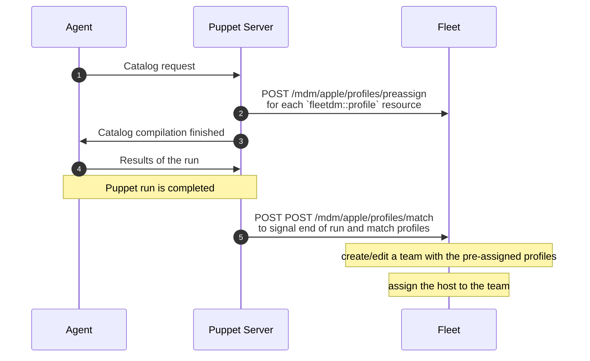

# Contributing to the fleetdm module

## Setup

For a simple local environment setup where your computer acts as the server and client, you'll need to install the following:

- [`pdk`](https://www.puppet.com/docs/pdk/latest/pdk_install.html)
- [`puppet` agent](https://www.puppet.com/docs/puppet/8/install_agents.html)

If you also want to emulate a real-world environment, you'll need to [set up a Puppet server](#set-up-a-puppet-server).

## How the module works



The sequence diagram above illustrates a typical run:

1. The agent initiates communication with the Puppet server, similar to how `osquery` checks in with the Fleet server.
2. The server builds a catalog (a JSON with instructions) based on the resources defined by the IT admin in manifests (files with `.pp` extension). 
     - Inside manifests, one or more [`fleetdm::profile`](https://github.com/fleetdm/fleet/blob/main/ee/tools/puppet/fleetdm/manifests/profile.pp) resources can be declared.
     - Each time the Puppet server finds a `fleetdm::profile`, it makes a request to the Fleet server to ["pre-assign" the profile](https://fleetdm.com/docs/contributing/api-for-contributors#preassign-profiles-to-devices).
    - On each request, the Fleet server stores information about the profile and the host in Redis.
3. The Puppet server sends the catalog back. Unlike typical modules, this catalog doesn't contain instructions related to profiles; all the work is done by the Fleet server through the MDM protocol.
4. The agent applies the catalog and signals to the Puppet server when it finishes.
5. After the run, the server can send one or more [reports](https://www.puppet.com/docs/puppet/8/reporting_about.html) about the run, containing information like the duration of the run. We utilize this feature to send a [match request](https://fleetdm.com/docs/contributing/api-for-contributors#match-preassigned-profiles) to the Fleet server to signal that the run for the node is done in our [custom reporter](https://github.com/fleetdm/fleet/blob/main/ee/tools/puppet/fleetdm/lib/puppet/reports/fleetdm.rb).

Once the run is complete, the server collects all pre-assigned profiles from Redis and performs the following:

1. Creates/edits a team with the set of pre-assigned profiles.
2. Adds the host to the team.

## Set up a Puppet server

The easiest way to set-up a local instance is by using [`puppetlabs/pupperware`](https://github.com/puppetlabs/pupperware). Follow the instructions on their README to get a server running.

> Note: `pupperware` doesn't work on macOS with ARM processors.

After the server is running, edit your hosts file (in macOS `/etc/hosts`,) to resove the `puppet` hostname to the IP of your Puppet server, for example:

```
192.168.100.13    puppet 
```

> Note: there are ways to configure Puppet if you don't want to edit your hosts file, but doing this will save you some trouble.

Once your server is running, you need to configure it, some usefult paths are:

- `/etc/puppetlabs/code` to manage modules and different environments
- `/opt/puppetlabs/server` for server-specific stuff

The only thing left to do is to add the `fleetdm/fleetdm` module to your server. You can either:

- Copy and paste the contents of this directory in `/etc/puppetlabs/code/environments/production/modules` (the whole `/etc/puppetlabs/code` directory is a Docker volume)
- Install the module running `puppet module install fleetdm-fleetdm --version 0.2.1` and tweak the installed code.

> **Important** if you make changes to the `utils` folder of the module, you need to run `puppetserver reload` in your Puppet server afterwards, files in that folder are not autoloaded.

## Releasing

1. Bump the module version in the [metadata.json](https://github.com/fleetdm/fleet/blob/main/ee/tools/puppet/fleetdm/metadata.json) file.
2. Ensure all new changes are documented in `./CHANGELOG.md`
3. From the `ee/tools/puppet/fleetdm` directory, run `pdk build`. This will generate a `tar.gz` file in the `ee/tools/puppet/fleetdm/pkg/` directory.
4. Perform a last sanity check running `pdk validate`
5. Test the build by extracting the file you just created and executing a Puppet run:
```
# extract the build
rm -rf /tmp/puppet-module/fleetdm
mkdir -p /tmp/puppet-module/fleetdm
tar -xzf pkg/fleetdm-fleetdm-0.2.4.tar.gz -C /tmp/puppet-module/fleetdm --strip-components=1

# run Puppet
puppet apply --debug --test --modulepath="/tmp/puppet-module" --reports=fleetdm  --hiera_config hiera.yaml examples/multiple-teams.pp
```
6. Login into the [Puppet Forge](https://forge.puppet.com/), credentials are in 1Password.
7. Visit the [upload page](https://forge.puppet.com/upload) and upload the `tar.gz` file you generated.


## Development cheatsheet

Add your environment info to `ee/tools/puppet/fleetdm/data/common.yaml`.

Ensure that the computer you are using for development has MDM turned on in your Fleet instance.

From the `ee/tools/puppet/fleetdm` directory, trigger a puppet run using the same machine as the server and client:

```
puppet apply --debug --test --modulepath="$(pwd)/.." --reports=fleetdm  --hiera_config hiera.yaml examples/multiple-teams.pp
```

To trigger a puppet run to a remote server use:

```
puppet agent --server puppet --serverport 8140 -t --debug
``` 

Install pdk bundle dependencies required for linting, formatting, and testing:

```
pdk bundle install
```

To lint/fix Puppet (`.pp`) files, use:

```
pdk bundle exec puppet-lint --fix .
```

To lint/fix Ruby (`.rb`) files, use:

```
pdk bundle exec rubocop -A
```

To run tests, use:

```
pdk test unit
```
