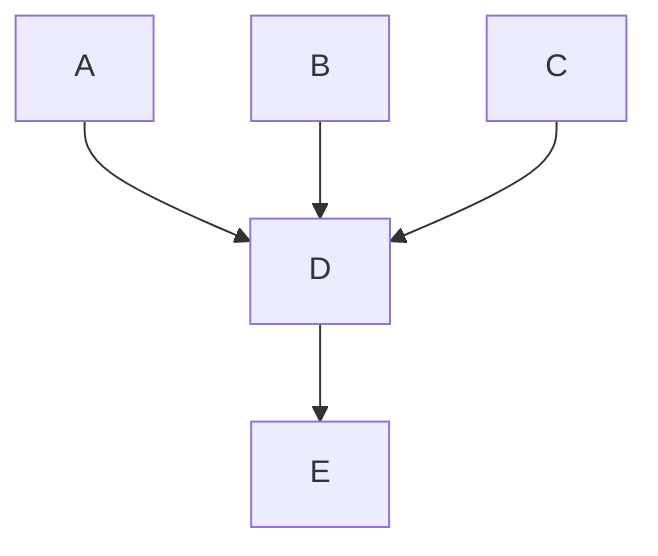

# Community

As an open-core company, Fleet endeavors to build a community of engaged users, customers, and
contributors.

## Communities

Fleet's users and broader audience are spread across many online platforms.  Here are the most active communities where Fleet's developer relations and social media team members participate at least once every weekday:

- [Osquery Slack](https://join.slack.com/t/osquery/shared_invite/zt-h29zm0gk-s2DBtGUTW4CFel0f0IjTEw) (`#fleet` channel)
- [MacAdmins Slack](https://www.macadmins.org/) (`#fleet` channel)
- [osquery discussions on LinkedIn](https://www.linkedin.com/search/results/all/?keywords=osquery)
- [osquery discussions on Twitter](https://twitter.com/search?q=osquery&src=typed_query)
- [reddit.com/r/sysadmins](https://www.reddit.com/r/sysadmin/)
- [reddit.com/r/SysAdminBlogs](https://www.reddit.com/r/SysAdminBlogs/)
- [r/sysadmin Discord](https://discord.gg/sysadmin)

### Goals
Our primary quality objectives are *customer service* and *defect reduction*. We try to optimize the following:

- Customer response time
- The number of bugs resolved per release cycle
- Staying abreast of what our community wants and the problems they're having
- Making people feel heard and understood
- Celebrating contributions
- Triaging bugs, identifying community feature requests, community pull requests, and community questions

### How?

- Folks who post a new comment in Slack or issue on GitHub should receive a response **within one business day**. The response doesn't need to include an immediate answer.
- If you feel confused by a question or comment raised, [request more details](#requesting-more-details) to better your understanding of the next steps.
- If an appropriate response is outside of your scope, please post to `#help-engineering` (in the Fleet Slack)), tagging `@oncall`.
- If things get heated, remember to stay [positive and helpful](https://canny.io/blog/moderating-user-comments-diplomatically/). If you aren't sure how best to respond positively, or if you see behavior that violates the Fleet code of conduct, get help.

### Requesting more details

Typically, the *questions*, *bug reports*, and *feature requests* raised by community members will be missing helpful context, recreation steps, or motivations.

❓ For questions that you don't immediately know the answer to, it's helpful to ask follow-up questions to receive additional context.

- Let's say a community member asks, "How do I do X in Fleet?" A follow-up question could be, "What are you attempting to accomplish by doing X?"
- This way, you have additional details when you bring this to the Roundup meeting. In addition, the community member receives a response and feels heard.

🦟 For bug reports, it's helpful to ask for re-creation steps so you're later able to verify the bug exists.

- Let's say a community member submits a bug report. An example follow-up question could be, "Can you please walk me through how you encountered this issue so that I can attempt to recreate it?"
- This way, you now have steps that verify whether the bug exists in Fleet or if the issue is specific to the community member's environment. If the latter, you now have additional information for further investigation and question-asking.

💡 For feature requests, it's helpful to ask follow-up questions to understand better the "Why?" or underlying motivation behind the request.

- Let's say a community member submits the feature request "I want the ability to do X in Fleet." A follow-up question could be "If you were able to do X in Fleet, what's the next action you would take?" or "Why do you want to do X in Fleet?."
- Both of these questions provide helpful context on the underlying motivation behind the feature request when brought to the Roundup meeting. In addition, the community member receives a response and feels heard.

### Closing issues

It is often good to let the original poster (OP) close their issue themselves since they are usually well equipped to decide to mark the issue as resolved. In some cases, circling back with the OP can be impractical, and for the sake of speed, issues might get closed.

Keep in mind that this can feel jarring to the OP. The effect is worse if issues are closed automatically by a bot (See [balderashy/sails#3423](https://github.com/balderdashy/sails/issues/3423#issuecomment-169751072) and [balderdashy/sails#4057](https://github.com/balderdashy/sails/issues/4057) for examples of this).

### Version support

To provide the most accurate and efficient support, Fleet will only target fixes based on the latest released version. In the current version fixes, Fleet will not backport to older releases.

Community version supported for bug fixes: **Latest version only**

Community support for support/troubleshooting: **Current major version**

Premium version supported for bug fixes: **Latest version only**

Premium support for support/troubleshooting: **All versions**

### Tools

Find the script in `scripts/oncall` for use during oncall rotation (only been tested on macOS and Linux).
Its use is optional but contains several useful commands for checking issues and PRs that may require attention.
You will need to install the following tools to use it:

- [GitHub CLI](https://cli.github.com/manual/installation)
- [JQ](https://stedolan.github.io/jq/download/)

### Resources

There are several locations in Fleet's public and internal documentation that can be helpful when answering questions raised by the community:

1. Find the frequently asked question (FAQ) documents in each section in the `/docs` folder. These documents are the [Using Fleet FAQ](../docs/Using-Fleet/FAQ.md), [Deploying FAQ](../docs/Deploying/FAQ.md), and [Contributing FAQ](../docs/Contributing/FAQ.md).

2. Use the [internal FAQ](https://docs.google.com/document/d/1I6pJ3vz0EE-qE13VmpE2G3gd5zA1m3bb_u8Q2G3Gmp0/edit#heading=h.ltavvjy511qv) document.

### Assistance from engineering

Community team members can reach the engineering oncall for assistance by writing a message with `@oncall` in the `#help-engineering` channel of the Fleet Slack.

## Fleet docs

### How to request a review for Markdown changes to the docs

When creating a pull request for Markdown changes in the docs, request a review from Desmi Dizney, who will do an editor pass, and then hand over the review to the [on-call engineer](https://fleetdm.com/handbook/engineering#oncall-rotation) if necessary.

### Markdown
Fleet's documentation and handbook are written in [Markdown](https://about.gitlab.com/handbook/markdown-guide/). Using Markdown lets us keep our documentation consistently formatted and viewable directly from the Fleet GitHub repo. The Markdown files in the `/docs` and `/handbook` folders are converted to HTML for the Fleet website. 

When making changes to the Fleet docs or handbook, there are a few differences in how the Markdown will render on GitHub and the Fleet website.

#### Linebreaks and newlines
Any time you need to add a line break in Markdown, you should add a new line. It is vital to make sure paragraphs are separated by new lines. Otherwise, they will render as the same HTML element.

For example, if you were adding this section to the docs:

```
line one
line two
```

The Markdown would render on the Fleet website as

line one
line two

To make sure formatting is consistent across GitHub and the Fleet website, you need to add a new line anywhere you want a line break. For example, if we separate the lines with a new line:

```
line one

line two
```


The Markdown will render correctly as

line one

line two

#### Ordered lists

Content nested within an ordered list needs to be indented. If the list is not formatted correctly, the number will reset on each list item.

For example, this list:

```
1. Item one

Paragraph about item one

2. Item two
```

On the Fleet website, this ordered list would be rendered as

1. Item one

Paragraph about item one

2. Item two

To make sure that ordered lists increment on the Fleet website, you can indent the content nested within the list. For example, the same ordered list with indentation:

```
1. Item one

   Paragraph about item one

2. Item two
```

This ordered list will render correctly as

1. Item one

   Paragraph about item one

2. Item two

### Docs style guide

#### Headings

Headings help readers quickly scan content to find what they need. Organize page content using clear headings specific to the topic they describe.

Keep headings brief, organized, and in a logical order:

* H1: Page title
* H2: Main headings
* H3: Subheadings
* H4: Sub-subheadings (headings nested under subheadings)

Try to stay within three or four heading levels. Complicated documents may use more, but pages with a simpler structure are easier to read.

### SQL statements

When adding SQL statements, all SQL reserved words should be uppercase, and all identifiers (such as tables and columns) should be lowercase. Here is an example:

```sql
   SELECT days, hours, total_seconds FROM uptime;
```

### Adding a link to the Fleet docs

You can link documentation pages to each other using relative paths. For example, in `docs/Using-Fleet/Fleet-UI.md`, you can link to `docs/Using-Fleet/Permissions.md` by writing `[permissions](./Permissions.md)`. This will automatically be transformed into the appropriate URL for `fleetdm.com/docs`.

However, the `fleetdm.com/docs` compilation process does not account for relative links to directories **outside** of `/docs`.
This is why it’s essential to follow the file path exactly when adding a link to Fleet docs.
When directly linking to a specific section, always format the spaces within a section name to use a hyphen instead of an underscore. For example, when linking to the `osquery_result_log_plugin` section of the configuration reference docs, use a relative link like the following: `./Configuration.md#osquery-result-log-plugin`.

### Linking to a location on GitHub
When adding a link to a location on GitHub outside of `/docs`, be sure to use the canonical form of the URL.

Navigate to the file's location on GitHub, and press "y" to transform the URL into its canonical form.

### How to fix a broken link
For instances when a broken link is discovered on fleetdm.com, always check if the link is a relative link to a directory outside of `/docs`. 

An example of a link that lives outside of `/docs` is:

```
../../tools/app/prometheus
```

If the link lives outside `/docs`, head to the file's location on GitHub (in this case, [https://github.com/fleetdm/fleet/blob/main/tools/app/prometheus.yml)](https://github.com/fleetdm/fleet/blob/main/tools/app/prometheus.yml)), and press "y" to transform the URL into its canonical form (a version of the link that will always point to the same version of the file) ([https://github.com/fleetdm/fleet/blob/194ad5963b0d55bdf976aa93f3de6cabd590c97a/tools/app/prometheus.yml](https://github.com/fleetdm/fleet/blob/194ad5963b0d55bdf976aa93f3de6cabd590c97a/tools/app/prometheus.yml)). Replace the relative link with this link in the Markdown file. 

> Note that the instructions above also apply to adding links in the Fleet handbook.

### Ordering a page in the Fleet docs
The order we display documentation pages on fleetdm.com is determined by `pageOrderInSection` meta tags. These pages are sorted in their respective sections in **ascending** order by the `pageOrderInSection` value. Every Markdown file (except readme and faq pages) in the `docs/` folder must have a meta tag with a positive 'pageOrderInSection' value.


We leave large gaps between values to make future changes easier. For example, the first page in the "Using Fleet" section of the docs has a `pageOrderInSection` value of 100, and the next page has a value of 200. The significant difference between values allows us to add, remove and reorder pages without changing the value of multiple pages at a time.

When adding or reordering a page, try to leave as much room between values as possible. If you were adding a new page that would go between the two pages from the example above, you would add `<meta name="pageOrderInSection" value="150">` to the page.

### Adding an image to the Fleet docs
Try to keep images in the docs at a minimum. Images can be a quick way to help users understand a concept or direct them towards a specific user interface(UI) element. Still, too many can make the documentation feel cluttered and more difficult to maintain.

When adding images to the Fleet documentation, follow these guidelines:
- UI screenshots should be a 4:3 aspect ratio (1280x960). This is an optimal size for the container width of the docs and ensures that content in screenshots is as clear as possible to view in the docs (and especially on mobile devices).
- You can set up a custom preset in the Google Chrome device toolbar (in Developer Tools) to quickly adjust your browser to the correct size for taking a screenshot.
- Keep the images as simple as possible to maintain. Screenshots can get out of date quickly as UIs change.
- Exclude unnecessary images. Images should be used to help emphasize information in the docs, not replace it.
- Minimize images per doc page. For doc maintainers and users, more than one or two per page can get overwhelming.
- The goal is for the docs to look good on every form factor, from 320px window width all the way up to infinity. Full window screenshots and images with too much padding on the sides will be less than the width of the user's screen. When adding a large image, make sure it is easily readable at all widths.

Images can be added to the docs using the Markdown image link format, e.g., ``
The images used in the docs live in `docs/images/`. Note that you must provide the URL of the image in the Fleet GitHub repo for it to display properly on both GitHub and the Fleet website.

> Note that the instructions above also apply to adding images in the Fleet handbook.

### Adding a mermaid diagram to the Fleet Docs

The Fleet Docs support diagrams that are written in mermaid.js syntax. Take a look at the [Mermaid docs](https://mermaid-js.github.io/mermaid/#/README) to learn about the syntax language and what types of diagrams you can display.

To add a mermaid diagram to the docs, you need to add a code block and specify that it is written in the mermaid language by adding `mermaid` to the opening backticks (i.e., ` ```mermaid`).

For example, the following code block is a mermaid diagram that has **not** been specified as a mermaid code block:

```
graph TD;
    A-->D
    B-->D
    C-->D
    D-->E
```
Once we specify the `mermaid` as the language in the code block, it will render as a mermaid diagram on fleetdm.com and GitHub.



If the mermaid syntax is incorrect, the diagram will be replaced with an image displaying an error, as shown in the following example where the code block was written with **intentional** syntax errors:

```mermaid
graph TD;
    A--D
```

## Pull requests

The most important thing when community members contribute to Fleet is to show them we value their time and effort. We need to get eyes on community pull requests quickly (within one business day) and get them merged or give feedback as soon as we can.

### Process for managing community contributions

The Community Engagement DRI is responsible for keeping an eye out for new community contributions, getting them merged if possible, and getting the right eyes on them if they require a review. 

Each business day, the Community Engagement DRI will check open pull requests to

1. check for new pull requests (PRs) from the Fleet community. 
2. approve and merge any community PRs that are ready to go.
3. make sure there aren't any existing community PRs waiting for a follow-up from Fleet. 


#### Identify community contributions

When a new pull request is submitted by a community contributor (someone not a member of the Fleet organization):

- Add the `:community` label.
- Self-assign for review.
- Check whether the PR can be merged or needs to be reviewed by the Product team.
    - Things that generally don't need additional review:
        - Minor changes to the docs.
        - Small bug fixes.

        - Additions or fixes to the Standard Query Library (as long as the SQL works properly and is attributed correctly).
    - If a review is needed:
        - Request a review from the [Product DRI](./product.md#product-dris). They should approve extensive changes and new features. Ask in the #g-product channel in Fleet's Slack for more information.
        - Tag the DRI and the contributor in a comment on the PR, letting everyone know why an additional review is needed. Make sure to say thanks!
        - Find any related open issues and make a note in the comments.

> Please refer to our [PRs from the community](https://docs.google.com/document/d/13r0vEhs9LOBdxWQWdZ8n5Ff9cyB3hQkTjI5OhcrHjVo/edit?usp=sharing) guide and use your best judgment. 

#### Communicate with contributors

Community contributions are fantastic, and it's important that the contributor knows how much they are appreciated. The best way to do that is to keep in touch while we're working on getting their PR approved.

While each team member is responsible for monitoring their active issues and pull requests, the Community Engagement DRI will check in on pull requests with the `:community ` label daily to make sure everything is moving along. If there's a comment or question from the contributor that hasn't been addressed, reach out on Slack to get more information and update the contributor. 

#### Merge Community PRs

When merging a pull request from a community contributor:

- Ensure that the checklist for the submitter is complete.
- Verify that all necessary reviews have been approved.
- Merge the PR.
- Thank and congratulate the contributor.
- Share the merged PR with the team in the #help-promote channel of Fleet Slack to be publicized on social media. Those who contribute to Fleet and are recognized for their contributions often become great champions for the project.

### Reviewing PRs from the community

If you're assigned a community pull request for review, it is important to keep things moving for the contributor. The goal is to not go more than one business day without following up with the contributor.

A PR should be merged if:

- It's a change that is needed and useful. 
- The CI is passing.
- Tests are in place.
- Documentation is updated.
- Changes file is created.

For PRs that aren't ready to merge:

- Thank the contributor for their hard work and explain why we can't merge the changes yet.
- Encourage the contributor to reach out in the #fleet channel of osquery Slack to get help from the rest of the community.
- Offer code review and coaching to help get the PR ready to go (see note below).
- Keep an eye out for any updates or responses.

> Sometimes (typically for Fleet customers), a Fleet team member may add tests and make any necessary changes to merge the PR. 

If everything is good to go, approve the review.

For PRs that will not be merged:

- Thank the contributor for their effort and explain why the changes won't be merged.
- Close the PR.

## Updating Docs and FAQ

When someone asks a question in a public channel, it's pretty safe to assume that they aren't the only person looking for an answer to the same question. To make our docs as helpful as possible, the Community team gathers these questions and uses them to make a weekly documentation update. 

Our goal is to answer every question with a link to the docs and/or result in a documentation update.

> **Remember**, when submitting any pull request that changes Markdown files in the docs, request an editor review from Desmi Dizney.

### Tracking

When responding to a question or issue in the [#fleet](https://osquery.slack.com/join/shared_invite/zt-h29zm0gk-s2DBtGUTW4CFel0f0IjTEw#/) channel of the osquery Slack workspace, push the thread to Zapier using the `TODO: Update docs` Zap. This will add information about the thread to the [Slack Questions Spreadsheet](https://docs.google.com/spreadsheets/d/15AgmjlnV4oRW5m94N5q7DjeBBix8MANV9XLWRktMDGE/edit#gid=336721544). In the `Notes` field, you can include any information that you think will be helpful when making weekly doc updates. That may be something like

- proposed change to the documentation.
- documentation link that was sent as a response.
- link to associated thread in [#help-oncall](https://fleetdm.slack.com/archives/C024DGVCABZ).

### Making the updates

Every week, the Community Engagement DRI will:

- Create a new `Weekly Doc Update` issue on Monday and add it to the [Community board](https://github.com/orgs/fleetdm/projects/36).
- Review the Slack Questions Spreadsheet and make sure that any necessary updates to the documentation are made. 
    - Update the spreadsheet to indicate what action was taken (Doc change, FAQ added, or None) and add notes if need be. 
- Set up a single PR to update the Docs. 
    - In the notes, include a list of changes made as well as a link to the related thread. 
- Bring any questions to DevRel Office Hours (time TBD).
- Submit the PR by the end of the day on Thursday. 
- Once the PR is approved, share in the [#fleet channel](https://osquery.slack.com/archives/C01DXJL16D8) of Osquery Slack Workspace and thank the community for being involved and asking questions. 

## Fleet swag

We want to recognize and congratulate community members for their contributions to Fleet. Nominating a contributor for Fleet swag is a great way to show our appreciation.

### How to order swag

1. Reach out to the contributor to thank them for their contribution and ask if they would like any swag.

2. Fill out our [swag request sheet](https://docs.google.com/spreadsheets/d/1bySsYVYHY8EjxWhhAKMLVAPLNjg3IYVNpyg50clfB6I/edit?usp=sharing).

3. Once approved, place the order through our Printful account (credentials in 1Password).

4. If available through the ordering process, add a thank you note for their contribution and "Feel free to tag us on Twitter."

## Rituals

The following table lists the Community group's rituals, frequency, and Directly Responsible Individual (DRI).

| Ritual                       | Frequency                | Description                                         | DRI               |
|:-----------------------------|:-----------------------------|:----------------------------------------------------|-------------------|
| Community Slack  | Daily   | Check Fleet and osquery Slack channels for community questions, make sure questions are responded to and logged. | Kathy Satterlee |
| Social media check-in |  Daily | Check social media for community questions and make sure to respond to them. Generate dev advocacy-related content. | Kelvin Omereshone   |
| Issue check-in | Daily | Check GitHub for new issues submitted by the community, check the status of existing requests, and follow up when needed. | Kathy Satterlee |
| Outside contributor follow-up | Weekly | Bring pull requests from outside contributors to engineering and make sure they are merged promptly and promoted. | Kathy Satterlee |
| Documentation update | Weekly | Turn questions answered from Fleet and osquery Slack into FAQs in Fleet’s docs. | Kathy Satterlee |
| StackOverflow  | Weekly | Search StackOverflow for “osquery,” answer questions with Grammarly, and find a way to feature Fleet in your StackOverflow profile prominently. | Rotation: Community team |


## Slack channels

This group maintains the following [Slack channels](https://fleetdm.com/handbook/company#group-slack-channels):

| Slack channel               | [DRI](https://fleetdm.com/handbook/company#group-slack-channels)    |
|:----------------------------|:--------------------------------------------------------------------|
| `#g-community`              | Kathy Satterlee


<meta name="maintainedBy" value="ksatter">
<meta name="title" value="🪂 Community">
