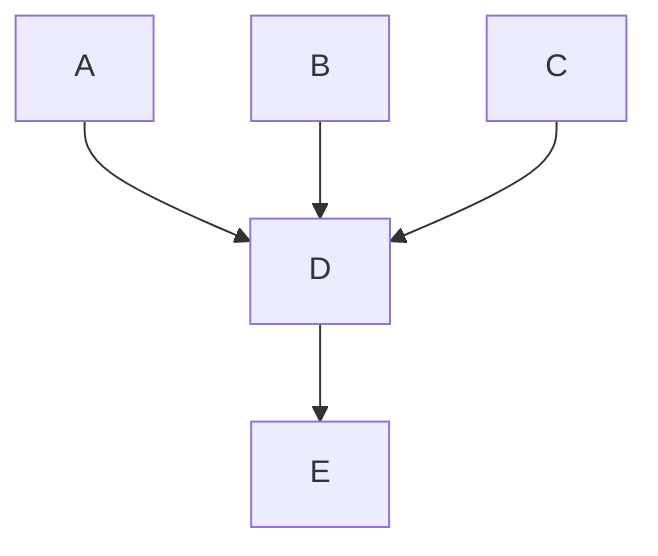

# Community

As an open-core company, Fleet endeavors to build a community of engaged users, customers, and
contributors.

## Communities

Fleet's users and broader audience are spread across many online platforms.  Here are the most active communities where Fleet's developer relations and social media team members participate at least once every weekday:

- [Osquery Slack](https://join.slack.com/t/osquery/shared_invite/zt-h29zm0gk-s2DBtGUTW4CFel0f0IjTEw) (`#fleet` channel)
- [MacAdmins Slack](https://www.macadmins.org/) (`#fleet` channel)
- [osquery discussions on LinkedIn](https://www.linkedin.com/search/results/all/?keywords=osquery)
- [osquery discussions on Twitter](https://twitter.com/search?q=osquery&src=typed_query)
- [reddit.com/r/sysadmins](https://www.reddit.com/r/sysadmin/)
- [reddit.com/r/SysAdminBlogs](https://www.reddit.com/r/SysAdminBlogs/)
- [r/sysadmin Discord](https://discord.gg/sysadmin)


## Fleet docs

### Markdown
Fleet's documentation and handbook are written in [Markdown](https://about.gitlab.com/handbook/markdown-guide/). Using Markdown lets us keep our documentation consistently formatted and viewable directly from the Fleet GitHub repo. The Markdown files in the `/docs` and `/handbook` folders are converted to HTML for the Fleet website.

When making changes to the Fleet docs or handbook, there are a few differences in how the Markdown will render on GitHub and the Fleet website.

#### Linebreaks and newlines
Any time you need to add a line break in Markdown, you should add a new line. It is vital to make sure paragraphs are separated by new lines otherwise they will render as the same HTML element.

For example, if you were adding this section to the docs:

```
line one
line two
```

The Markdown would render on the Fleet Website as:

line one
line two

To ensure formatting is consistent across GitHub and the Fleet website, you'll need to add a new line anywhere you want a line break. For example, if we separate the lines with a new line:

```
line one

line two
```


The Markdown will render correctly as:

line one

line two

#### Ordered lists

Content nested within an ordered list needs to be indented. If the list is not formatted correctly, the number will reset on each list item.

For example, this list:

```
1. Item one

Paragraph about item one

2. Item two
```

On the Fleet website, this ordered list would be rendered as:

1. Item one

Paragraph about item one

2. Item two

To ensure that ordered lists increment on the Fleet website, you can indent the content nested within the list. For example, the same ordered list with indentation:

```
1. Item one

   Paragraph about item one

2. Item two
```

This ordered list will render correctly as:

1. Item one

   Paragraph about item one

2. Item two

### Docs style guide

#### Headings

Headings help readers quickly scan content to find what they need. Organize page content using clear headings specific to the topic they describe.

Keep headings brief, organized, and in a logical order:

* H1: Page title
* H2: Main headings
* H3: Subheadings
* H4: Sub-subheadings (headings nested under subheadings)

Try to stay within 3 or 4 heading levels. Complicated documents may use more, but pages with a simpler structure are easier to read.

### Adding a link to the Fleet docs

You can link documentation pages to each other using relative paths. For example, in `docs/Using-Fleet/Fleet-UI.md`, you can link to `docs/Using-Fleet/Permissions.md` by writing `[permissions](./Permissions.md)`. This will automatically transformed into the appropriate URL for `fleetdm.com/docs`.

However, the `fleetdm.com/docs` compilation process does not account for relative links to directories **outside** of `/docs`.
This is why it’s essential to follow the file path exactly when adding a link to Fleet docs.

In the Fleet documentation, when directly linking to a specific section, always format the spaces within a section name to use a hyphen  "-" instead of an underscore "_". For example, when linking to the `osquery_result_log_plugin` section of the configuration reference docs, use a relative link like the following: `./Configuration.md#osquery-result-log-plugin`.

### Linking to a location on GitHub
When adding a link to a location on GitHub outside of `/docs`, be sure to use the canonical form of the URL.

To do this, navigate to the file's location on GitHub, and press "y" to transform the URL into its canonical form.

### How to fix a broken link
For instances in which a broken link is discovered on fleetdm.com, always check if the link is a relative link to a directory outside of `/docs`. 

An example of a link that lives outside of `/docs` is:

```
../../tools/app/prometheus
```

If the link lives outside `/docs`, head to the file's location on GitHub (in this case, [https://github.com/fleetdm/fleet/blob/main/tools/app/prometheus.yml)](https://github.com/fleetdm/fleet/blob/main/tools/app/prometheus.yml)), and press "y" to transform the URL into its canonical form ([https://github.com/fleetdm/fleet/blob/194ad5963b0d55bdf976aa93f3de6cabd590c97a/tools/app/prometheus.yml](https://github.com/fleetdm/fleet/blob/194ad5963b0d55bdf976aa93f3de6cabd590c97a/tools/app/prometheus.yml)). Replace the relative link with this link in the markdown file.

> Note that the instructions above also apply to adding links in the Fleet handbook.

### Ordering a page in the Fleet docs
The order we display documentation pages on fleetdm.com is determined by `pageOrderInSection` meta tags. These pages are sorted in their respective section by the `pageOrderInSection` value in **ascending** order. Every markdown file (except readme and faq pages) in the `docs/` folder must have a meta tag with a positive 'pageOrderInSection' value.


We leave large gaps between values to make future changes easier. For example, the first page in the "Using Fleet" section of the docs has a `pageOrderInSection` value of 100, and the next page has a value of 200. The significant difference between values allows us to add, remove and reorder pages without the need for changing the value of multiple pages at a time.

When adding or reordering a page, try to leave as much room between values as possible. If you were adding a new page that would go between the two pages from the example above, you would add `<meta name="pageOrderInSection" value="150">` to the page.

### Adding an image to the Fleet docs
Try to keep images in the docs at a minimum. Images can be a quick way to help users understand a concept or direct them towards a specific user interface(UI) element. Still, too many can make the documentation feel cluttered and more difficult to maintain.

When adding images to the Fleet documentation, follow these guidelines:
- Keep the images as simple as possible to maintain. Screenshots can get out of date quickly as UIs change.
- Exclude unnecessary images. An image should be used to help emphasize information in the docs, not replace it.
- Minimize images per doc page. More than one or two per page can get overwhelming, for doc maintainers and users.
- The goal is for the docs to look good on every form factor, from 320px window width all the way up to infinity. Full window screenshots and images with too much padding on the sides will be less than the width of the user's screen. When adding a large image, make sure it is easily readable at all widths.

Images can be added to the docs using the Markdown image link format, e.g. ``
The images used in the docs live in `docs/images/`. Note that you must provide the URL of the image in the Fleet Github repo for it to display properly on both Github and the Fleet website.

> Note that the instructions above also apply to adding images in the Fleet handbook.

### Adding a mermaid diagram to the Fleet Docs

The Fleet Docs support diagrams that are written in mermaid.js syntax. Take a look at the [Mermaid docs](https://mermaid-js.github.io/mermaid/#/README) to learn about the syntax language and what types of diagrams you can display.

To add a mermaid diagram to the docs, you need to add a code block and specify that it is written in the mermaid language by adding `mermaid` to the opening backticks (i.e., ` ```mermaid`).

For example, the following code block is a mermaid diagram that has **not** been specified as a mermaid code block:

```
graph TD;
    A-->D
    B-->D
    C-->D
    D-->E
```
Once we specify the `mermaid` as the language in the code block, it will render as a mermaid diagram on fleetdm.com and GitHub.



If the mermaid syntax is incorrect, the diagram will be replaced with an image displaying an error, as shown in the following example where the code block was written with **intentional** syntax errors:

```mermaid
graph TD;
    A--D
```

## Pull requests

The most important thing when community members contribute to Fleet is to show them we value their time and effort. We need to get eyes on community pull requests quickly (within 1 business day) and get them merged or give feedback as soon as we can.

### Process for managing community contributions

The Community Engagememt DRI is responsible for keeping an eye out for new community contributions and either getting them merged in if possible and get the right eyes on them if they need to be reviewed. 

Each business day, the Community Engagement DRI will check open pull requests to:

1. Check for new pull requests (PRs) from the Fleet community. 
2. Approve and merge any community PRs that are ready to go.
3. Make sure there aren't any existing community PRs waiting for followup from Fleet. 

#### Identify community contributions

When a new pull request is submitted by a community contributor (someone not a member of the Fleet organization):

- Add the `:community` label.
- Self-assign for review.
- Check whether the PR can be merged, or needs to be reviewed by the Product team.
    - Things that generally don't need additional review:
        - Minor changes to the docs.
        - Small bug fixes.
        - Additions or fixes to the Standard Query Library(SQL) are (as long as the SQL works properly and they are attributed correctly).
        - Use the Please refer to our [PRs from the community](https://docs.google.com/document/d/13r0vEhs9LOBdxWQWdZ8n5Ff9cyB3hQkTjI5OhcrHjVo/edit?usp=sharing) guide and use your best judgement. 
    - If a review is needed:
        - Request review from the [Product DRI](./product.md#product-dris). They should approve extensive changes and new features. Ask in the #g-product channel in Fleet's Slack for more information.
        - Tag the DRI and the contributor in a comment on the PR letting everyone know why additional review is needed. Make sure to say thanks!
        - Find any open issues that are related and make a note in the comments.


#### Communicate with contributors

Community contributions are awesome, and it's important that the contributor knows how much they are appreciated. The best way to do that is to keep in touch while we're working to get their PR approved.

While each team member is responsible for monitoring their active issues and pull requests, the Community Engagement DRI will check in on pull requests with the `:community ` label daily to make sure everything is moving along. If there's a comment or question from the contributor that hasn't been addressed, reach out on Slack to try to get more information and update the contributor. 


#### Merge Community PRs

When merging a pull request from a community contributor:

- Ensure that checklist for submitter is complete.
- Verify that all necessary reviews have been approved.
- Merge the PR.
- Thank and congratulate the contributor.
- Share with the team in the #help-promote channel of Fleet Slack to be publicized on social media. Those who contribute to Fleet and are recognized for their contributions often become great champions for the project.

### Reviewing PRs from the community

If you're assigned a community pull request for review, it is important to keep things moving for the contributor. The goal is to not go more than one business day without following up with the contributor.

A PR should be merged if:

- It's a change that is needed and useful. 
- The CI is passing.
- Tests are in place.
- Documentation is updated.
- Changes file is created.

For PRs that aren't ready to merge:

- Thank the contributor for their hard work and explain why we aren't merging the changes.
- Encourage the contributor to reach out in the #fleet channel of osquery Slack to get help from the rest of the community.
- Offer code review and coaching to help get the PR ready to go (see note below)
- Keep an eye out for any updates or responses.

> Sometimes (typically for Fleet customers), a Fleet team member may add tests and make any necessary changes to merge the PR. 

If everything is good to go, approve the review.

For PRs that will not be merged:

- Thanks the contributor for their effort and explain why the changes won't be merged.
- Close the PR.

## Fleet swag

We want to recognize and congratulate community members for their contributions to Fleet. Nominating a contributor for Fleet swag is a great way to show our appreciation.

### How to order swag

1. Reach out to the contributor to thank them for their contribution and ask if they would like any swag.

2. Fill out our [swag request sheet](https://docs.google.com/spreadsheets/d/1bySsYVYHY8EjxWhhAKMLVAPLNjg3IYVNpyg50clfB6I/edit?usp=sharing).

3. Once approved, place the order through our Printful account (credentials in 1Password).

4. If available through the ordering process, add a thank you note for their contribution and "Feel free to tag us on Twitter."

## Rituals
| How to perform ritual                                                                                                                                            | Frequency | DRI                      |
|------------------------------------------------------------------------------------------------------------------------------------------------------------------|-----------|--------------------------|
| StackOverflow party - Search StackOverflow for “osquery,” answer questions with Grammarly, and find a way to prominently feature Fleet in your StackOverflow profile | Weekly    | Rotation: community team |

## Slack channels

Please see [Digital experience > Slack channels](https://fleetdm.com/handbook/brand#slack-channels).


<meta name="maintainedBy" value="zwass">
