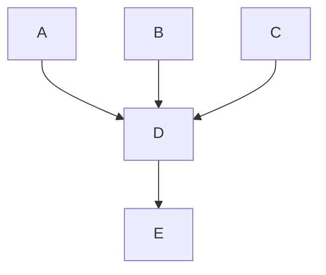

# Communications


This page covers the things every team member needs to know to effectively contribute at Fleet.


## Strategy
You can read about the company's positioning and product strategy in ["👑 Crown jewels" (private google doc)](https://docs.google.com/document/d/1E0VU4AcB6UTVRd4JKD45Saxh9Gz-mkO3LnGSTBDLEZo/edit#).

To see the evolution over time or catch up with the latest happenings, review [decks](https://drive.google.com/drive/folders/1cw_lL3_Xu9ZOXKGPghh8F4tc0ND9kQeY) and [recordings](https://us-65885.app.gong.io/conversations?workspace-id=9148397688380544352&callSearch=%7B%22search%22%3A%7B%22type%22%3A%22And%22%2C%22filters%22%3A%5B%7B%22type%22%3A%22CallTitle%22%2C%22phrase%22%3A%22all%20hands%22%7D%5D%7D%7D) from recent company-wide ["All hands" meetings](https://fleetdm.com/handbook/business-operations#all-hands).

## Email relays
There are [several special email addresses](https://docs.google.com/document/d/1tE-NpNfw1icmU2MjYuBRib0VWBPVAdmq4NiCrpuI0F0/edit#) that automatically relay messages to the appropriate people in Fleet. Each email address meets a minimum response time ("Min RT"), expressed in business hours/days, and has a dedicated, directly responsible individual (DRI) who is responsible for reading and replying to emails sent to that address.


## Zoom
We use [Zoom](https://zoom.us) for virtual meetings at Fleet, and it is important that every team member feels comfortable hosting, joining, and scheduling Zoom meetings.
By default, Zoom settings are the same for all Fleet team members, but you can change your personal settings on your [profile settings](https://zoom.us/profile/setting) page. 
Settings that have a lock icon next to them have been locked by an administrator and cannot be changed. Zoom administrators can change settings for all team members on the [account settings page](https://zoom.us/account/setting) or for individual accounts on the [user management page](https://zoom.us/account/user#/).

## Recording meetings
Capturing video from meetings with customers, prospects, and community members outside the company is an important part of building world-class sales and customer success teams and is a widespread practice across the industry. At Fleet, we use Gong to capture Zoom meetings and share them company-wide. If a team member with a Gong license attends certain meetings, generally those with at least one person from outside of Fleet in attendance.  
  - While some Fleeties may have a Gong seat that is necessary in their work, the typical use case at Fleet is for employees on the company's sales, customer success, or customer support teams. 
  - You should be notified anytime you join a recorded call with an audio message announcing "this meeting is being recorded" or "recording in progress."  To stop a recording, the host of the call can press "Stop." 
  - If the call has external participants and is recorded, this call is stored in Gong for future use. 
To access a recording saved in Gong, visit [app.gong.io](https://app.gong.io) and sign in with SSO. 
  - Everyone at Fleet has access, whether they have a Gong seat or not, and you can explore and search through any uploaded call transcripts unless someone marks them as private (though the best practice would be not to record any calls you don't want to be captured). 
If you ever make a mistake and need to delete something, you can delete the video in Gong or reach out to Nathan Holliday or Mike McNeil for help. They will delete it immediately without watching the video. 
  - Note that any recording stopped within 60 seconds of the start of the recording is not saved in Gong, and there will be no saved record of it. 

Most folks at Fleet should see no difference in their meetings if they aren't interfacing with external parties. 
Our goal in using Gong and recording calls is to capture insights from sales, customer, and community meetings and improve how we position and sell our product. We never intend to make anyone uncomfortable, and we hope you reach out to our DRI for Gong, Nathan Holliday, or Mike McNeil if you have questions or concerns.  

Here are some tips for troubleshooting Gong:
- In order to use Gong, the Zoom call must be hosted by someone with a Fleet email address.  
- You cannot use Gong to record calls hosted by external parties.
- Cloud recording in Zoom has to be turned on and unlocked company wide for Gong to function properly, because of this, there is a chance that some Gong recordings may still save in Zoom's cloud storage even if they aren't uploaded into Gong.
- To counter this, Nathan Holliday will periodically delete all recordings found in Zoom's storage without viewing them.
- If you need help using Gong, please check out [Gong Academy](https://academy.gong.io/).

### Excluding calls from being recorded
For those with a Gong seat or scheduling a call with someone in attendance that has a Gong seat who does not wish for their Zoom call with an external party to record, make sure your calendar event title contains `[no shadows]`.  You can also read the [complete list of exclusion rules](https://docs.google.com/document/d/1OOxLajvqf-on5I8viN7k6aCzqEWS2B24_mE47OefutE/edit?usp=sharing).


## Slack
At Fleet, we do not send internal emails to each other. Instead, we prefer to use [Slack](https://www.linkedin.com/pulse/remote-work-how-set-boundaries-when-office-your-house-lora-vaughn/) to communicate with other folks who work at Fleet.

### Key Slack channels
The following Slack channels are useful for every Fleetie:

| Slack channel               | Purpose |
|:----------------------------|:--------------------------------------------------------------------|
| `#general`                  | Read company-wide announcements.
| `#thanks`                   | Say thank you.
| `#random`                   | Be random.

### Slack channel prefixes
- We have specific channels for various topics, but we also have more general channels for the teams at Fleet.
We use these prefixes to organize the Fleet Slack:
 * ***g-***: for team/group channels *(Note: "g-" is short for "grupo" or "group")*.
 * ***oooh-***: used to discuss and share interesting information about a topic.
 * ***help-***: for asking for help on specific topics.
 * ***at*** or ***fleet-at***: for customer channels.
 * ***2023-***: for temporary channels _(Note: specify the relevant year in four digits, like "YYYY-`)_

### Slack communications and best practices
- We use threads in Slack as much as possible. Threads help limit noise for other people following the channel and reduce notification overload.
- We configure our [working hours in Slack](https://slack.com/help/articles/360025054173-Set-up-Slack-for-work-hours-) to make sure everyone knows when they can get in touch with others.
- In consideration of our team, Fleet avoids using global tags in channels (i.e. @here, @channel, etc.) (What about polls? Good question, Fleeties are asked to post their poll in the channel and @mention the teammates they would like to hear from.)


## Levels of confidentiality
Fleet uses these levels to standardize a commitment to minimal esotericism across the company.  
- **Public:**   _Share with anyone, anywhere in the world_
- **Confidential:**  _Share only with team members who've signed an NDA, consulting agreement, or employment agreement_
- **Classified:**  _Share only with founders of Fleet, business operations, and/or the people involved.  e.g., US social security numbers during hiring_


### Google doc titles
Fleet uses these levels to standardize a commitment to minimal esotericism across the company. 
- **"Public":** _(Available to public)_ 
- _(Confidential - for Fleet eyes only)_     
- **"¶":** _(E-group - Direct reports the the CEO)_
- **"¶¶":** _(Classified - Founders and BizOps)_
- **"¶¶¶":** _(Founders and board members)_


## Meetings
- **Plan to join meetings on time.** At Fleet, we start on time and do not wait for folks to join.  As most of our meetings are conducted over zoom, please join with a working microphone and with your camera on whenever possible.  Being even a few minutes late can make a big difference and slow your meeting counterparts down. When in doubt, show up a couple of minutes early. 
- **Turning on your camera** allows for more complete and intuitive verbal and non-verbal communication. Feel free to leave your camera on or turn it off when joining meetings with new participants you might not be familiar with yet. Turn your camera on when you lead or cohost a meeting, or when you present your work during a demo session.
- **If you would prefer not to be on YouTube** when presenting on a meeting, you can prep your demo ahead of the meeting and communicate to your manager who will present for you.  It's always ok to do this.
- **Be warm.**  It's okay to spend the first minute or two of a meeting being present and making small talk. Since we are all remote, it's easy to miss out on hallway chatter and human connections that happen in [meatspace](https://www.dictionary.com/browse/meatspace).  Use this time together during the first minute to say "Hi!"  Then you can jump into the topics to be discussed.

### External meeting scheduling
When scheduling external meetings, provide external participants with a
[Calendly](https://calendly.com) link to schedule with the relevant internal participants. If you
need a Calendly account, reach out to `mikermcneil` via Slack.

### Internal meeting scheduling
Fleet uses the Zoom add-on for Google Calendar to schedule meetings (exceptions are customers that are non-negotiably required to use a different tool) when we [create calendar events](https://support.google.com/calendar/answer/72143?hl=en&ref_topic=10510646&sjid=7187599067132459840-NA#zippy=%2Cclick-an-empty-time-in-your-calendar). 
Our Zoom meetings are configured to let participants join before the host arrives, to make sure meetings start on time even if the host isn't there.

To schedule a meeting within Fleet:
- To add a Zoom meeting to a calendar event, click the "Add video conferencing" dropdown and select "Zoom Meeting." Google Calendar will automatically add the Zoom meeting details and instructions to join the event.
- Enter the `@fleetdm.com` emails for each participant into the "Add guests" box in Google Calendar, and the calendar availability for each participant will appear in your view.
- Select a meeting time, the participants will automatically be invited and a video conference will be attached to the invite (this can save a lot of communication overhead when scheduling with multiple participants).

It is important to [set your workinghours](https://support.google.com/calendar/answer/7638168?hl=en&co=GENIE.Platform%3DDesktop) in Google Calendar and block out any personal time/events/PTO, so that team members do not inadvertently schedule a time when you are not available. 
- Many team members use the free tier of [reclaim.ai](https://reclaim.ai/) to synchronize personal event times (without event details) into their work calendars. 
It is also common practice to block out time for focused work.

<blockquote puropse="large-quote">In an all-remote company, "face time" matters. Remember: even if someone's calendar is open, they have other work to do. Limiting (or batching up) internal meetings can enable longer, uninterrupted stretches of deep work.</blockquote>


### Modifying an event organized by someone else
To edit an event where someone else at Fleet is the organizer, you can first subscribe to their calendar in Google Calendar and then edit the event on their calendar.  Your edits will automatically apply to all attendees.
This works because every Fleetie grants edit access to everyone else at Fleet as part of onboarding.

### All hands
Every month, Fleet holds a company-wide meeting called the "All hands".

All team members should attend the "All hands" every month.  Team members who cannot attend are expected to watch the [recording](https://us-65885.app.gong.io/conversations?workspace-id=9148397688380544352&callSearch=%7B%22search%22%3A%7B%22type%22%3A%22And%22%2C%22filters%22%3A%5B%7B%22type%22%3A%22CallTitle%22%2C%22phrase%22%3A%22all%20hands%22%7D%5D%7D%7D) within a few days.

"All hands" meetings are [recorded](https://us-65885.app.gong.io/conversations?workspace-id=9148397688380544352&callSearch=%7B%22search%22%3A%7B%22type%22%3A%22And%22%2C%22filters%22%3A%5B%7B%22type%22%3A%22CallTitle%22%2C%22phrase%22%3A%22all%20hands%22%7D%5D%7D%7D) and have [slides](https://drive.google.com/drive/folders/1cw_lL3_Xu9ZOXKGPghh8F4tc0ND9kQeY) available.


## Spending company money
As we continue to expand our company policies, we use [GitLab's open expense policy](https://about.gitlab.com/handbook/spending-company-money/) as a guide for company spending.
In brief, this means that as a Fleet team member, you may:
* Spend company money like it is your own money.
* Be responsible for what you need to purchase or expense to do your job effectively.
* Feel free to make purchases __in the company's interest__ without asking for permission beforehand (when in doubt, do __inform__ your manager prior to purchase or as soon as possible after the purchase).
For more developed thoughts about __spending guidelines and limits__, please read [GitLab's open expense policy](https://about.gitlab.com/handbook/spending-company-money/).

### Brex

#### Non-travel purchases that exceed a Brex cardholder's limit
For non-travel purchases that would require an increase in the Brex cardholder's limit, please [make a request](https://fleetdm.com/handbook/business-operations#intake) with following information:
- The nature of the purchase (i.e. SaaS subscription and what it's used for)
- The cost of the purchase and whether it is a fixed or variable (i.e. use-based) cost.
- Whether it is a one time purchase or a recurring purchase and at what frequency the purchase will re-occur (annually, monthly, etc.)
- If there are more ideal options to pay for the purchase (i.e. bill.com, the Fleet AP Brex card, etc.) that method will be used instead.  
- In general, recurring purchases such as subscription services that will continually stretch the spend limit on a cardholder's Brex card should be paid through other means. 
- For one time purchases where payment via credit card is the most convenient then the card limit will be temporarily increased to accomodate the purchase.  

#### Reimbursements
Fleet does not reimburse expenses. We provide all of our team members with Brex cards for making purchases for the company. For company expenses, **use your Brex card.**  If there was an extreme accident, [get help](https://fleetdm.com/handbook/business-operations#intake).

<!-- 
No longer supported.  -mike, CEO, 2023-04-26.

Fleet will reimburse team members who pay for work-related expenses with their personal funds.
Team members can request reimbursement through [Gusto]([https://app.gusto.com/expenses](https://support.gusto.com/article/209831449100000/Get-reimbursed-for-expenses-as-an-employee)) if they're in the US or [Pilot]([https://pilot.co/](https://help.pilot.co/en/articles/4658204-how-to-request-a-reimbursement#:~:text=If%20you%20made%20a%20purchase,and%20click%20'Add%20new%20expense.)) if they are an international team member. When submitting an expense report, team members need to provide the receipt and a description of the expense.
Operations will review the expense and reach out to the team member if they have any questions. The reimbursement will be added to the team member's next payroll when an expense is approved.
>Pilot handles reimbursements differently depending on if the international team member is classified as an employee or a contractor. If the reimbursement is for a contractor, Operations will need to add the expense reimbursement to an upcoming recurring payment or schedule the reimbursement as an off-cycle payment. If the reimbursement is for an employee, no other action is needed; Pilot will add the reimbursement to the team member's next payroll.  -->

### Individualized expenses
Recurring expenses related to a particular team member, such as coworking fees, are called _individualized expenses_.  These expenses are still considered [non-personnel expenses](https://docs.google.com/spreadsheets/d/1X-brkmUK7_Rgp7aq42drNcUg8ZipzEiS153uKZSabWc/edit#gid=2112277278), with a few extra considerations:

- Non-recurring (one-off) expenses such as an Uber ride from the airport are NOT considered "individualized".
- Seat licenses for tools like Salesforce or GitHub are NOT considered "individualized".
- Individualized expenses should include the team member's name explicitly in the name of the expense.
- If multiple team members use the same vendor for an individualized expense (for example, "WeWork"), use a separate row for each individualized expense.  (For example: "Coworking, Mungojerry (WeWork)" and "Coworking, Jennyanydots (WeWork)")
- Individualized expenses are always attributed to the  "🔦 Business operations" department.
- These expenses are still considered non-personnel expenses, in the same way seat licenses for tools like Salesforce or GitHub are considered non-personnel expenses.   

### Expense acquittal process
Fleeties are encourage to [spend company money like it's their own](#spending-company-money), however to ensure that spend is captured correctly, teammates need to take the following steps after spending money:
- If the spend is under $50, Fleeties can use the memo field in the Brex expense details to provide context on what the spend was for.
- If the spend is over $50, Fleeties must attach a receipt for the item and add a memo to provide context on what the spend was for.
- **In addition:** If the spend is for travel, include the event name and year as the prefix, e.g: "DEFCON 2023 - Uber from airport to hotel"

## Travel

### Flights
- Everyone at Fleet, including the CEO, uses the same [principles for booking flights](https://fleetdm.com/handbook/ceo#schedule-travel-for-the-ceo).
- For example, feel free to book a direct flight if there is one that is less than double the price of the cheapest non-direct flight.

### Lodging
- Choose a modest location with inexpensive lodging and [minimally-viable comfort](https://fleetdm.com/handbook/company/why-this-way#why-spend-less).
- For events, check the event's website for travel & hotel accommodations and book as soon as the event is approved. As a general rule, do not spend more on lodging than the average listed hotel accommodations.
- Avoid expensive neighborhoods and popular destination cities.
- Do not share bedrooms.  Shared bathrooms are OK, but make sure every hotel room or Airbnb has at least one bathroom per gender identity.   <!-- Make sure everyone is well-rested, efficiently primped, with sufficient privacy. -->
- Be creative.  If an AirBnb is the most efficient way to house the team, then do that.  If separate hotel rooms are more efficient, then do that.
- If the stay is longer than 4 nights and an Airbnb with a washing machine is not available, then dry cleaning can be purchased with your Brex card.
- If you need to meet with a large group that won't fit in your hotel room or Airbnb (e.g. more than 5 people), [contact Business Operations](https://fleetdm.com/handbook/business-operations#contact-us) for their help approving and booking additional event space.

### Spending company money while traveling
When attending a conference or traveling for Fleet, keep the following in mind:
- **No reimbursements:** Use your company Brex card.  Reimbursements are time consuming, so Fleet does not do reimbursements for spending on personal credit cards.
- **Food:** Be efficient and use your own credit card when it makes sense.  There is a $100 allowance per day for your own personal food and beverage on your company Brex card. _(There are many good reasons to make exceptions to this allowance, such as dinners with customers.  Before proceeding, please [request approval from the Head of Business Operations](https://fleetdm.com/handbook/business-operations#contact-us) to avoid complexities._
- **Tipping:** Tipping norms vary by culture.  How you tip when representing the company reflects on Fleet's brand.  When traveling in the United States and using your company Brex card, prepare to tip between 18-20% at restaurants.  For rideshare, takeout, delivery, and other situations where tipping comes up, tip between 10-20%.
- **Personal credit card:** Please use your personal credit card for hotel incidentals, personal consumables, movies, mini bars, and entertainment.  These expenses _will not_ be reimbursed.
- **Company credit card:** We recommend you order a physical Brex card if you do not have one before traveling.
- **Credit card limit increases:** The monthly limit on your Brex card may need to be increased temporarily as necessary to accommodate the increased spending associated with the conference, such as [booking your own travel](https://fleetdm.com/handbook/company/communications#flights).  You can [request that here](https://fleetdm.com/handbook/business-operations#contact-us) by providing the following information:
  - The start and end dates for your trip.
  - The [price of your flight](https://fleetdm.com/handbook/company/communications#flights)
  - The [price of your hotel or Airbnb](https://fletdm.com/handbook/comopany/communications#lodging) per night
  - The price of the admission fees (if attending a conference)

### Sales kickoffs
From time to time, Fleet holds a sales kickoff (SKO) meeting.  This is a type of [offsite](https://fleetdm.com/handbook/company/communications#offsites).

### Offsites
From time to time, Fleet organizes offsites to bring team members together in person.  This encourages trust and makes the company more productive.

Offsites are:
  - Attended by a particular [product group](https://fleetdm.com/handbook/company#product-groups), a [department](https://fleetdm.com/handbook/company#org-chart), or a team such as the E-group.
  - Sometimes also attended by founders or other team members on a case-by-case basis.
  - 1-3 full days long (2-4 nights stay)
  - A ritual of effective teams, not a reward or vacation.
  - Driven by a detailed, thoughtful agenda of how time will be spent.  An intentional investment of valuable personal and company time, at great opportunity cost.
  - An opportunity to spend time together, build relationships, and be human.  Shared meals and activities are important.

Before spending any money on an offsite, inviting people, booking travel, or otherwise committing the company:
  - **Make a plan:** Write a Google Doc with your proposed plan, listing:
    - all participants with their current work locations
    - tentative dates
    - a lean budget (including links and street address of lodging and event spaces, estimated airfare, and spending for other food or accomodations)
    - a detailed agenda of how time will be spent
  - **Bring to e-group:** Ask your manager to bring your plan for the offsite to the next weekly e-group meeting for feedback, edits, and CEO approval.
  - **Iteration:** The E-group will discuss live, make edits, and may ask you to provide additional information or changes and return the following week for another pass.

After the plan for the offsite is approved at the e-group meeting (including participants, detailed agenda, and final budget):
  - The Head of Business Operations will confirm dates with all approved participants, then book all [lodging](#lodging) and coordinate any additional event space.  (Participants [book their own flights](https://fleetdm.com/handbook/company/communications#flights).)
  - _**Note:** If the plan needs to change again, after it is approved, [ask the CEO for help](https://fleetdm.com/handbook/ceo#contact-us)._

### Attending conferences
When attending a conference for Fleet, treat it [like other travel for the company](https://fleetdm.com/handbook/company/communications#travel).


## Vendor questionnaires 
In responding to security questionnaires, Fleet endeavors to provide full transparency via our [security policies](https://fleetdm.com/handbook/security/security-policies#security-policies) and [application security](https://fleetdm.com/handbook/business-operations/application-security) documentation. In addition to this documentation, please refer to [the vendor questionnaires page](https://fleetdm.com/handbook/business-operations/vendor-questionnaires) 

## Getting a contract signed

If a contract is ready for signature and requires no review or revision, the requestor logins into DocuSign using hello@ from the 1Password vault and routes the agreement to the CEO for signature. 

When a contract is going to be routed for signature by someone outside of Fleet (i.e. the vendor or customer), the requestor is responsible for working with the other party to make sure the document gets routed to the CEO for signature.

The SLA for contract signature is **2 business days**. Please do not follow up on signature unless this time has elapsed.

_**Note:** Signature open time for the CEO is not currently measured, to avoid the overhead of creating separate signature issues to measure open and close time. This may change as signature volume increases._

> _**Note:** If a contract is ready for signature and requires no review or revision, the requestor logins into DocuSign using hello@ from the 1Password and routes the agreement to the CEO for signature._ 

Please use [Fleet's billing email address](https://fleetdm.com/handbook/company/communications#email-relays) for all contracts, and never use individual emails except for signature.  If the page to sign includes any individual emails in the docusign contract, please remove it before routing to the CEO for signature.

## Getting a contract reviewed

> If a document is ready for signature and does not need to be reviewed or negotiated, you can skip the review process and use the signature process documented above.

To get a contract reviewed, upload the agreement to [Google Drive](https://drive.google.com/drive/folders/1G1JTpFxhKZZzmn2L2RppohCX5Bv_CQ9c).

Complete the [contract review issue template in GitHub](https://fleetdm.com/handbook/business-operations#intake), being sure to include the link to the document you uploaded and using the Calendly link in the issue template to schedule time to discuss the agreement with Nathan Holliday (allowing for sufficient time for him to have reviewed the contract prior to the call).

Follow up comments should be made in the GitHub issue and in the document itself so it is all in the same place.

The SLA for contract review is **2 business days**.

Once the review is complete, the issue will be closed.

If an agreement requires an additional review during the negotiation process, the requestor will need to follow these steps again. Uploading the new draft and creating a new issue in GitHub. 

When no further review or action is required for an agreement and the document is ready to be signed, the requestor is then responsible for routing the document for signature.

> **Note:** Please submit other legal questions and requests to [Business Operations department](https://fleetdm.com/handbook/business-operations#intake).

## Trust
Fleet is successful because of our customers and community, and those relationships are built on trust.

### Security
Security policies are best when they're alive, in context of how an organization operates.  Fleeties carry Yubikeys, and change control of policies and access control is driven primarily through GitOps and SSO.

Here are a few different entry points for a tour of Fleet's security policies and best practices:
1. [Security policies](https://fleetdm.com/handbook/security/security-policies#security-policies)
2. [Human resources security policy](https://fleetdm.com/handbook/security/security-policies#human-resources-security-policy)
3. [Account recovery process](https://fleetdm.com/handbook/security#account-recovery-process)
4. [Personal mobile devices](https://fleetdm.com/handbook/security#personal-mobile-devices)
5. [Hardware security keys](https://fleetdm.com/handbook/security#hardware-security-keys)
6. More details about internal security processes at Fleet are located on [the Security page](https://fleetdm.com/handbook/business-operations/security).

## Benefits
In this section, you can find information about Fleet's benefit strategies and decisions.

### Paid time off
What matters most is your results, which are driven by your focus, your availability to collaborate, and the time and consideration you put into your work. Fleet offers all team members unlimited time off. Whether you're sick, you want to take a trip, you are eager for some time to relax, or you need to get some chores done around the house, any reason is a good reason.
For team members working in jurisdictions that require certain mandatory sick leave or PTO policies, Fleet complies to the extent required by law.

#### Holidays
At Fleet, we have team members with various employment classifications in many different countries worldwide. Fleet is a US company, but we think you should choose the days you want to work and what days you are on holiday, rather than being locked into any particular nation or culture's expectation about when to take time off.
When a team member joins Fleet, they pick one of the following holiday schedules:
 - **Traditional**: This is based on the country where you work. Non-US team members should let their managers know the dates of national holidays.
 **Or**
 - **Freestyle**: You have no set schedule and start with no holidays. Then you add the days that are holidays to you.

Either way, it's up to you to make sure that your responsibilities are covered, and that your team knows you're out of the office.

#### New parent leave
Fleet gives new parents six weeks of paid leave. After six weeks, if you don't feel ready to return yet, we'll set up a quick call to discuss and work together to come up with a plan to help you return to work gradually or when you're ready.

#### Taking time off
When you need to take time off, follow this process:
- Let your manager and team know the days when you will be out by posting a message in your department Slack channel mentioning your manager, with when and how long.
- Life happens and things come up.  But as soon as you know when you'll be out, let the company know.  (Extra notice helps!)
- Find someone to cover anything that needs covering while you're out and communicate what they need to take over the responsibilities as well as who to refer to for help (e.g., meetings, planned tasks, unfinished business, important Slack/email threads, anything where someone might be depending on you).
- Mark an all-day "Out of office" event in Google Calendar for the day(s) you're taking off or for the hours that you will be off if less than a day. Google Calendar recognizes the event title "OOO" and will give you the option to decline existing and new meetings or just new meetings. You are expected to attend any meetings that you have accepted, so be sure to decline meetings you are not going to attend.
- If you can’t complete these steps because you need to take the day off quickly due to an emergency, let your manager know and they will help you complete the handoff.
- If you ever want to take a day off, and the only thing stopping you is internal (Fleetie-only) meetings, don’t stress. Consider, “Is this a meeting that I can reschedule to another day, or is this a meeting that can go on without me and not interfere with the company’s plans?” Talk to your manager if you’re unsure, but it is perfectly OK to reschedule internal meetings that can wait so that you can take a day off.
- This process is the same for any days you take off, whether it's a holiday or you just need a break.


### Retirement contributions
- **US based team members:** Starting August 2023, Fleet offers the ability for US based team members to contribute to a 401(k) retirement plan directly from their salary. Team members will be auto-enrolled in our plan with Guideline at a default 1% contribution unless they opt out or change their contribution amount within 30 days of commencement. Fleet currently does not match any contributions made by team members to 401(k) plans.
- **Non-US team members**: Fleet meets the relevant country's retirement contribution requirements for team members outside the US.

### Coworking
Your Brex card may be used for up to $500 USD per month in coworking costs. Please get prior approval by making a [custom request to the business operations team](https://fleetdm.com/handbook/business-operations#intake).

## Performance feedback
At Fleet, performance feedback is a continuous process. We give feedback (particularly negative) as soon as possible. Most feedback will happen during 1:1 meetings, if not sooner.

## Compensation
Compensation at Fleet is determined by benchmarking using [Pave](https://pave.com). Annual raises are not guaranteed, instead we ensure teammates are compensated fairly based on the role, experience, location, and performance relative to benchmarks.

### Payroll dates
US based Fleeties get paid on the last business day of the month. International teammates pay dates follow the same structure as US pay, unless there are in-country requirement that dictate a more frequent cadence.

### Workiversaries
We're happy you've ventured a trip around the sun with Fleet- let's celebrate! The  team will post in Slack to highlight your dedication and contribution to Fleet, giving an opportunity for teammates to share their appreciation of your contribution!

Fleet also [evaluates and (if necessary) updates compensation decisions yearly](#compensation-changes), shortly after the anniversary of a team member's start date.

### Compensation changes
Fleet evaluates and (if necessary) updates compensation decisions yearly, shortly after the anniversary of a team member's start date. The process for that evaluation and update is:
- On the first Friday of the month, the Head of BizOps posts in the `#help-classified` channel with the list of teammates celebrating anniversaries over the next month.
- On the day of the fleetiversary, the Head of BizOps or executive team member will post in `#random` celebrating the tenure of the teammate.
- The Head of BizOps confers with manager or head of department and prepares compensation benchmarking data and schedules time with the CEO and CTO over an existing 1:1 to discuss if an adjustment needs to be made to compensation.
- During the 1:1 call, founders review benchmarking for role and geography, and decide if there will be an adjustment.
- Head of BizOps posts to slack in `#help-classified` with the decision on compensation changes and effective date, if any.
- If a change is to be made, the Head of BizOps communicates decision to the teammate's people manager, who then communicates to their teammate.
- Head of BizOps updates the respective payroll platform (Gusto or Plane) and [equity spreadsheet](https://docs.google.com/spreadsheets/d/1_GJlqnWWIQBiZFOoyl9YbTr72bg5qdSSp4O3kuKm1Jc/edit?usp=sharing) (internal doc).
- If an additional equity grant is part of this compensation change, the previous equity and new situation is noted in detail in the "Notes" column of the equity plan, and the "Grant started?" column is set back to "todo" to add it to the queue for the next time grants are processed (quarterly).

### Relocating
When Fleeties relocate, there are vendors that need to be notified of the change. 

Before relocating, please [let the company know in advance](https://fleetdm.com/handbook/business-operations#intake) by following the directions listed in the relevant issue template ("Moving").


## Team member onboarding

### Before the start date

Fleet is open source and anyone can contribute at any time.  Before a core team member's start date, they are welcome to contribute, but not expected to.

#### Recommendations for new teammates
Welcome to Fleet!

1. Understand the company
2. Take the time to get trained
3. Get comfortable with the tools
4. Immerse yourself in the world of device management and cybersecurity.

> Please see Fleet's ["🥽 Recommendations for new teammates"](https://docs.google.com/document/d/1xcnqKB9HHPd94POnZ_7LATiy_VjO2kJdbYx0SAgKVao/edit#).

### Training expectations
It's [important](https://fleetdm.com/handbook/company/why-this-way#why-the-emphasis-on-training) that every team member at Fleet takes the time to get fully trained and onboarded. 
When a new team member joins Fleet, we create an onboarding issue for them in the [fleetdm/confidential](https://github.com/fleetdm/confidential) repo using this [issue template](https://github.com/fleetdm/confidential/blob/main/.github/ISSUE_TEMPLATE/onboarding.md). 
We want to make sure that the new team member will be able to complete every task in their issue. To make sure the new team member is successful in their onboarding, we customize their issue by commenting on any tasks they won't need to complete.
We believe in taking onboarding and training seriously and that the onboarding template is an essential source of truth and good use of time for every single new hire. If managers see a step that they don't feel is necessary, they should make a pull request to the [onboarding template](https://github.com/fleetdm/confidential/blob/main/.github/ISSUE_TEMPLATE/onboarding.md).

Expectations during onboarding:
- Onboarding time (all checkboxes checked) is a KPI for the business operations team.  Our goal is 14 days or less.
- The first 3 weekdays (excluding days off) for **every new team member** at Fleet is reserved for completing onboarding tasks from the checkboxes in their onboarding issue.  New team members **should not work on anything else during this time**, whether or not other tasks are stacking up or assigned.  It is OK, expected, and appreciated for new team members to **remind their manager and colleagues** of this [important](https://fleetdm.com/handbook/company/why-this-way#why-the-emphasis-on-training) responsibility.
- Even after the first 3 days, during the rest of their first 2 weeks, completing onboarding tasks on time is a new team member's [highest priority](https://fleetdm.com/handbook/company/why-this-way#why-the-emphasis-on-training).

### Sightseeing tour
During their first day at Fleet, new team members join a sightseeing tour call with the acting Head of People (CEO). During this call, the new team member will participate in an interactive tour of the seven main attractions in our all-remote company, including the primary tools used company-wide, what the human experience is like, and when/why we use them at Fleet.

In this meeting, we'll take a look at:
- Handbook: values, purpose, key pages to pay special attention to
- GitHub issues: the living bloodstream of the company.
- Kanban boards: the bulletin board of quests you can get and how you update status and let folks know things are done.
- Google Calendar: the future.
- Gmail: like any mailbox, full of junk mail, plus some important things, so it is important to check carefully.
- Salesforce: the Rolodex.
- Google Docs: the archives.
- Slack:
  - The "office" (#g-, #general).
  - The walkie talkies (DMs).
  - The watering hole (#oooh-, #random, #news, #help-).

### Contributor experience training
During their first week at Fleet, every new team member schedules a contributor experience training call with the acting Head of People (CEO). During this call, the new team member will share their screen, and the acting Head of People will:
- make sure emails will get seen and responded to quickly.
- make sure Slack messages will get seen and responded to quickly.
- make sure you know where your issues are tracked, which kanban board you use, and what the columns mean.
- make sure you can succeed with submitting a PR with the GitHub web editor, modifying docs or handbook, and working with Markdown.
- talk about Google calendar.
- give you a quick tour of the Fleet Google drive folder.

<!-- 
TODO: Merge this commented-out stuff with the above

Agenda:
A 60-minute call with Mike where you will share your screen, and she will work with you to...
Make sure Slack messages are going to get seen and responded to quickly and disable email notifications in Slack
Make sure you know where your issues are tracked, which kanban board you use, what the columns mean
Make sure you can succeed with submitting a PR in github.com, modifying docs or handbook, working with Markdown
Make sure emails are going to get seen and responded to quickly (make sure inbox management is going to be productive, talk about filters, unsubscribe)
Make sure you know how to see and subscribe to other team members' calendars and that you can add yourself to an event on someone else's calendar.
A quick tour of the Google drive folder (access look correct? Ok. Give access to executed documents on the shared drive as needed) show how to use “Add to drive” or “favorite,” or just a browser bookmark, so the folder is easily accessible. This is where things go. It's the archive.)
Make sure you know how to share a google doc into the folder for all fleeties to see and access.
A high level overview of the Company values
-->

### Onboarding retrospective
At the end of their first two weeks of onboarding at Fleet, every new team member schedules a onboarding retro call with the acting Head of People (CEO).  Agenda: 
> Welcome once again to the team! Please tell me about your first few weeks at Fleet. How did your onboarding/training go? What didn't you manage to get to? Anything you weren't sure how to do? Any feedback on how we can make the experience better for Fleet's next hire?

Fleet prioritizes a [bias for action](https://fleetdm.com/handbook/company#ownership).  If possible, apply onboarding feedback to the handbook and issue templates in realtime, during this call.  This avoids backlogging tasks that may just get out of date before we get around to them anyway.


## Equipment

### Purchasing a company-issued device
Fleet provides laptops for core team members to use while working at Fleet. As soon as an offer is accepted, Business Operations will reach out to the new team member to start this process and will work with the new team member to get their laptop purchased and shipped to them on time.

Apple computers shipping to the United States and Canada are ordered using the Apple [eCommerce Portal](https://ecommerce2.apple.com/asb2bstorefront/asb2b/en/USD/?accountselected=true), or by contacting the business team at an Apple Store or contacting the online sales team at [800-854-3680](tel:18008543680). The business team can arrange for same-day pickup at a store local to the Fleetie if needed.

When ordering through the Apple eCommerce Portal, look for a banner with *Apple Store for FLEET DEVICE MANAGEMENT | Welcome [Your Name].* Hovering over *Welcome* should display *Your Profile.* If Fleet's account number is displayed, purchases will be automatically made available in Apple Business Manager (ABM).

Apple computers for Fleeties in other countries should be purchased through an authorized reseller to ensure the device is enrolled in ADE. In countries that Apple does not operate or that do not allow ADE, work with the authorized reseller to find the best solution, or consider shipping to a US based Fleetie and then shipping on to the teammate. 

#### Selecting a laptop
Most Fleeties use 16-inch MacBook Pros. Team members are free to choose any laptop or operating system that works for them, as long as the price [is within reason](#spending-company-money) and supported by our device management solution.  (Good news: Since Fleet uses Fleet for device management, every operating system is supported!)

When selecting a new laptop for a team member, optimize their configuration to:
1. Have a reasonably large storage (at least 512GB of storage, and if there's any concern go bigger)
2. Look for pre-configured models with the desired memory and storage requirements. These tend to be available for delivery or pickup as quickly as possible and before the start date.

> If delivery timelines are a concern with no devices in stock, play around with build until it ships as quickly as possible.  Sometimes small changes lead to much faster ship times.  More standard configurations (with fewer customizations) usually ship more quickly.  Sometimes MacBook Pros ship more quickly than MacBook Airs, and vice versa.  This varies.  Remember: Always play around with the build and optimize for something that will **ship quickly**!

For example, someone in sales, marketing, or business operations might like to use a 14-inch Macbook Air, whereas someone in an engineering, product, or design role might use a 16-inch MacBook Pro.  **Default to a 16-inch MacBook Pro.**

> A 3-year AppleCare+ Protection Plan (APP) should be considered default for Apple computers >$1500. Base MacBook Airs, Mac minis, etc. do not need APP unless configured beyond the $1500 price point. APP provides 24/7 support, and global repair coverage in case of accidental screen damage or liquid spill, and battery service.

Windows and Linux devices are available upon request for team members in product and engineering.  (See [Buying other new equipment](#buying-other-new-equipment).)

### Buying other new equipment
At Fleet, we [spend company money like it's our own money](https://fleetdm.com/handbook/business-operations#spending-company-money).  If you need equipment above and beyond those standard guidelines, you can request new equipment by creating a GitHub issue in fleetdm/fleet and attaching the `#g-business-operations`.  Please include a link to the requested equipment (including any specs), the reason for the request, and a timeline for when the device is needed. 

### Tracking equipment
When a device has been purchased, it's added to the [spreadsheet of company equipment](https://docs.google.com/spreadsheets/d/1hFlymLlRWIaWeVh14IRz03yE-ytBLfUaqVz0VVmmoGI/edit#gid=0) where we keep track of devices and equipment, purchased by Fleet.

When you receive your new computer, complete the entry by adding a description, model, and serial number to the spreadsheet.

### Returning equipment
Equipment should be returned once offboarded for reprovisioning. Coordinate offboarding and return with the Head of Business Operations. 

### Reprovisioning equipment
Apple computers with remaining AppleCare Protection Plans should be reprovisioned to other Fleeties who may have older or less-capable computers.

### Equipment retention and replacement
Older equipment results in lost productivity of Fleeties and should be considered for replacement. Replacement candidates are computers that are no longer under an AppleCare+ Protection Plan (or another warranty plan), are >3 years from the [discontinued date](https://everymac.com/systems/apple/macbook_pro/index-macbookpro.html#specs), or when the "Battery condition" status in Fleet is less than "Normal". The old equipment should be evaluated for return or retention as a test environment.

> If your Apple device is less than 3 years old, has normal battery condition, but is experiencing operating difficulties, you should first contact Apple support and troubleshoot performance issues before requesting a new device.


## Github

### Making a pull request
Our handbook and docs pages are written in Markdown and are editable from our website (via GitHub). Follow the instructions below to propose an edit to the handbook or docs.
1. Click the _"Edit page"_ button from the relevant handbook or docs page on [fleetdm.com](https://www.fleetdm.com) (this will take you to the GitHub browser).
2. Make your suggested edits in the GitHub.
3. Click _"Commit changes...."_
4. Give your proposed change a title or _["Commit message"](https://about.gitlab.com/topics/version-control/version-control-best-practices/#write-descriptive-commit-messages)_ and optional _"Extended description"_ (good commit messages help page maintainers quickly understand the proposed changes).
 - **Note:** _Keep commit messages short and clear. (e.g. "Add DRI automation")_ 
4. Click _"Propose changes"_
5. Request a review from the page maintainer, and finally, press “Create pull request.”
6. GitHub will run a series of automated checks and notify the reviewer. At this point, you are done and can safely close the browser page at any time.
8. Check the “Files changed” section on the Open a pull request page to double-check your proposed changes.

### Merging changes
When merging a PR to the master branch of the [Fleet repo](https://github.com/fleetdm/fleet), remember that whatever you merge gets deployed live immediately. Ensure that the appropriate quality checks have been completed before merging. [Learn about the website QA process](#quality).

When merging changes to the [docs](https://fleetdm.com/docs), [handbook](https://fleetdm.com/handbook), and articles, make sure that the PR’s changes do not contain inappropriate content (goes without saying) or confidential information, and that the content represents our [brand](#brand) accordingly. When in doubt reach out to the product manager of the [website group](https://fleetdm.com/handbook/company/product-groups#website-group) in the [#g-website](https://fleetdm.slack.com/archives/C058S8PFSK0) channel on Slack.

### Editing a merged pull requests 
We approach editing retrospectively for pull requests (PRs) to handbook pages. Remember our goal above about moving quickly and reducing time to value for our contributors? We avoid the editor becoming a bottleneck for merging quickly by editing for typos and grammatical errors after-the-fact. Here's how to do it:

1. Check that the previous day's edits are formatted correctly on the website (more on this in the note below.)
2. Use the [Handbook history](https://github.com/fleetdm/fleet/commits/main/handbook) feed in GitHub to see a list of changes made to the handbook.
3. From the list of recently merged PRs, look at the files changed for each and then:
  - Scan for typos and grammatical errors.
  - Check that the tone aligns with our [Communicating as Fleet](https://fleetdm.com/handbook/brand#communicating-as-fleet) guidelines and that Grammarly's tone detector is on-brand.
  - Check that Markdown is formatted correctly.
  - **Remember**, Do not make edits to this page. It's already merged.
4. Instead, navigate to the page in question on the website and submit a new PR to make edits - making sure to request a review from the maintainer of that page.
5. Comment on the original PR to keep track of your progress. Comments made will show up on the history feed. E.g., `"Edited, PR incoming"` or `"LGTM, no edits required."`
6. Watch [this short video](https://www.loom.com/share/95d4525a7aae482b9f9a9470d446ce9c) to see this process in action.

> **Note:** The Fleet website may render Markdown differently from GitHub's rich text preview. It's essential to check that PRs merged by the editor are displaying as expected on the site. It can take a few minutes for merged PRs to appear on the live site, and therefore easy to move on and forget. It's good to start the ritual by looking at the site to check that the previous day's edits are displaying as they should.


### Linking to a location on GitHub
When adding a link to any text in the docs, handbook, or website always be sure to use the canonical form of the URL (e.g. _"https//www.fleetdm.com/handbook/..."_).

Navigate to the file's location on GitHub, and press "y" to transform the URL into its canonical form.

#### Fixing a broken link
For instance when a broken link is discovered on fleetdm.com, always check if the link is a relative link to a location outside of `/docs`.

An example of a link that lives outside of `/docs` is:

```
../../tools/app/prometheus
```

If the link lives outside `/docs`, head to the file's location (in this case, [https://github.com/fleetdm/fleet/blob/main/tools/app/prometheus.yml)](https://github.com/fleetdm/fleet/blob/main/tools/app/prometheus.yml)), and copy the full URL  into its canonical form (a version of the link that will always point to the same location) ([https://github.com/fleetdm/fleet/blob/194ad5963b0d55bdf976aa93f3de6cabd590c97a/tools/app/prometheus.yml](https://github.com/fleetdm/fleet/blob/194ad5963b0d55bdf976aa93f3de6cabd590c97a/tools/app/prometheus.yml)). Replace the relative link with full URL.


### Meta tags

#### Page order
The order we display documentation pages on fleetdm.com is determined by `pageOrderInSection` meta tags. These pages are sorted in their respective sections in **ascending** order by the `pageOrderInSection` value. Every Markdown file (except readme and faq pages) in the `docs/` folder must have a meta tag with a positive 'pageOrderInSection' value.

We leave large gaps between values to make future changes easier. For example, the first page in the "Using Fleet" section of the docs has a `pageOrderInSection` value of 100, and the next page has a value of 200. The significant difference between values allows us to add, remove and reorder pages without changing the value of multiple pages at a time.

When adding or reordering a page, try to leave as much room between values as possible. If you were adding a new page that would go between the two pages from the example above, you would add `<meta name="pageOrderInSection" value="150">` to the page.

#### Page description
TODO: Document.

### Images
Try to keep images in the docs at a minimum. Images can be a quick way to help users understand a concept or direct them towards a specific user interface(UI) element. Still, too many can make the documentation feel cluttered and more difficult to maintain.

When adding images to the Fleet repo, follow these guidelines:

- UI screenshots should be a 4:3 aspect ratio (1280x960). This is an optimal size for the container width of the docs and ensures that content in screenshots is as clear as possible to view in the docs (and especially on mobile devices).
- You can set up a custom preset in the Google Chrome device toolbar (in Developer Tools) to quickly adjust your browser to the correct size for taking a screenshot.
- Keep the images as simple as possible to maintain. Screenshots can get out of date quickly as UIs change.
- Exclude unnecessary images. Images should be used to help emphasize information in the docs, not replace it.
- Minimize images per doc page. For doc maintainers and users, more than one or two per page can get overwhelming.
- The goal is for the docs to look good on every form factor, from 320px window width all the way up to infinity. Full window screenshots and images with too much padding on the sides will be less than the width of the user's screen. When adding a large image, make sure it is easily readable at all widths.

Images can be added to the docs using the Markdown image link format, e.g., ``
The images used in the docs live in `docs/images/`. Note that you must provide the URL of the image in the Fleet GitHub repo for it to display properly on both GitHub and the Fleet website.

> Note that the instructions above also apply to adding images in the Fleet handbook.


### GitHub labels
We use special characters to define different types of GitHub labels. By combining labels, we
organize and categorize GitHub issues. This reduces the total number of labels required while
maintaining an expressive labeling system. For example, instead of a label called
`platform-dev-backend`, we use `#platform :dev ~backend`.

| Special character | Label type  | Examples                            |
|:------------------|:------------|:------------------------------------|
| `#`               | Noun        | `#platform`, `#interface`, `#agent`
| `:`               | Verb        | `:dev`, `:research`, `:design`
| `~`               | Adjective   | `~blocked`, `~frontend`, `~backend`

## Writing
Learn how to communicate as Fleet with guidelines for tone of voice, our approach, grammar and mechanics, and more.

### Writing style
  - Infuse the core [values](https://fleetdm.com/handbook/company#values) into everything you write. 
  - Read and reread, then rewrite to make it shorter. Use links rather than explanations, short sentences. 
  - Get to where you feel like it’s really good, short, simple, and clear, hack away at any word that’s too confusing. 
  - Don’t sound formal, sound welcoming so that anyone can understand. Translate "[puffery](https://www.linkedin.com/pulse/puffery-adam-frankl%3FtrackingId=SBVWxzqXTBm9qlO7Rw3ddw%253D%253D/?trackingId=SBVWxzqXTBm9qlO7Rw3ddw%3D%3D)" into "ease of use" or "readability". 
  - Apply the advice about writing linked from the company values (the [Paul Graham](http://www.paulgraham.com/simply.html) essays). 
  - Create headings that make good permalinks, use links and add missing links. Indicate links by highlighting words that describe the content (Better SEO than lighting up “click here”). 
  - Don’t duplicate content, link to other places like the [values](https://fleetdm.com/handbook/company#values) or [“why this way”](https://fleetdm.com/handbook/company/why-this-way#why-this-way), but don’t make it awkward. 
  - A big goal is to be able to link directly to this stuff when something comes up as a gentle way to remind and train using the foundation we've already built. 
  - Avoid unnecessary changes, and don’t change headings lightly (it breaks handbook links people might have put in an external article or have in their email inbox somewhere). 
  - Read your PRs, check it carefully with each change and edit until the diff looks good.
  - Check preview mode in GitHub to make sure the format renders correctly. If you look at your diff and notice unintentional changes, remove them.


### What would Mister Rogers say?
[*Mister Rogers’ Neighborhood*](https://en.wikipedia.org/wiki/Mister_Rogers%27_Neighborhood) was one of the longest-running children’s TV series. That’s thanks to [Fred Rogers](https://en.wikipedia.org/wiki/Fred_Rogers)’ communication skills. He knew kids heard things differently than adults. So, he checked every line to avoid confusion and encourage positivity.

Our audience is a little older. But just like the show, Mister Rogers’ method is appropriate for all ages. Here are some steps you can take to communicate like Mister Rogers:

- State the idea you want to express as clearly as possible.
- Rephrase the idea in a positive manner.
- Rephrase the idea, directing your reader to authorities they trust.
- Rephrase the idea to eliminate anything that may not apply to your reader.
- Add a motivational idea that gives your reader a reason to follow your advice.
- Rephrase the new statement, repeating the first step.

Consider this example tweet.

<blockquote purpose= "large-quote">- Distributed workforces aren’t going anywhere anytime soon. It’s past time to start engaging meaningfully with your workforce and getting them to work with your security team instead of around them.</blockquote>

What would Mister Rogers say? The tweet could look something like this...

<blockquote purpose= "large-quote">- Distributed workforces are here to stay. So, it’s a great time to help employees work with your security experts (and not around them). Because stronger teams get to celebrate more victories.</blockquote>

By Mister Rogersing our writing, we can encourage our readers to succeed by emphasizing optimism. You might not be able to apply all of these steps every time. That’s fine. Think of these as guidelines to help you simplify complex topics.


### Grammarly
All of our writers and editors have access to Grammarly, which comes with a handy set of tools, including:
- **Style guide**, which helps us write consistently in the style of Fleet.
- **Brand tones** to keep the tone of our messaging consistent with just the right amount of confidence, optimism, and joy.
- **Snippets** to turn commonly used phrases, sentences, and paragraphs (such as calls to action, thank you messages, etc.) into consistent, reusable snippets to save time.


### Using sentence case and capitalization

#### Sentence case
Fleet uses sentence case capitalization for all headings, subheadings, button text in the Fleet product, fleetdm.com, the documentation, the handbook, marketing material, direct emails, in Slack, and in every other conceivable situation.

In sentence case, we write and capitalize words as if they were in sentences:

<blockquote purpose= "large-quote"> Ask questions about your servers, containers, and laptops running Linux, Windows, and macOS.</blockquote>

As we use sentence case, only the first word is capitalized. But, if a word would normally be capitalized in the sentence (e.g., a proper noun, an acronym, or a stylization) it should remain capitalized.

- Proper nouns _("Nudge", "Skimbleshanks", "Kleenex")_
  - "Yeah, we use Nudge"
  - "Introducing our friend Skimbleshanks"
  - "Please, can I have a Kleenex?"
- Acronyms _("MDM", "REST", "API", "JSON")_
  - "MDM commands in Fleet are available over a REST API that returns JSON"
- Stylizations _("macOS", "osquery", "MySQL")
  - "Although 'macOS' is a proper noun, macOS uses its own style guide from Apple, to which we adhere"
  - "Zach is the co-creator of osquery"
  - "Does it work with MySQL?"

- ***Struggling with this?*** It takes some adjustment, and you need repetitions of seeing things written this way and correcting yourself. Contributors have given feedback that this [opinionated solution](https://fleetdm.com/handbook/company/why-this-way#why-does-fleet-use-sentence-case) is a huge relief once you build the habit of sentence case capitalization. You don't have to think as hard, nor choose between flouting and diligently adhering to the style guide.

#### Capitalization and proper nouns
- **Fleet:** When talking about Fleet the company, we stylize our name as either "Fleet" or "Fleet Device Management."
- **Fleet the product:** We say either “Fleet” or “Fleet for osquery.”
- **Core team members:** Team members who've signed an NDA employment agreement, are “Fleeties.”
- **Group of devices or virtual servers:** Use "fleet" or "fleets" (lowercase).  
- **Osquery:** Osquery should always be written in lowercase unless used to start a sentence or heading.
- **Fleetd:** Fleetd should always be written in lowercase unless used to start a sentence or heading.


#### Device vs endpoint
- When talking about a users' computer, we prefer to use "device" over _endpoint._ Devices in this context can be a physical device or virtual instance that connect to and exchange information with a computer network. Examples of devices include mobile devices, desktop computers, laptop computers, virtual machines, and servers.


### Headings
Headings help readers quickly scan content to find what they need and guide readers through your writing. Organize page content using clear headings specific to the topic they describe. 

While our readers are more tech-savvy than most, we can’t expect them to recognize queries by SQL alone.  Avoid using code for headings. Instead, say what the code does and include code examples in the body of your document.

Keep headings brief, organized, and in a logical order:
- H1: Page title
- H2: Main headings
- H3: Subheadings
- H4: Sub-subheadings

Try to stay within three or four heading levels. Detailed documents may use more, but pages with a simpler structure are easier to read.

#### Punctuation in headings
Fleet headings do not use end punctuation unless the heading is a question:

<blockquote purpose= "large-quote">Learn how to use osquery, nanoMDM, and Nudge to manage and monitor laptops and servers running Linux, Windows, ChromeOS, and macOS</blockquote>

If the heading is a question, end the heading with a question mark.

### Grammar mechanics

#### Contractions 
They’re great! Don’t be afraid to use them. They’ll help your writing sound more approachable

#### Ampersands 
(&) Only use ampersands if they appear in a brand name, or if you’re quoting the title of an article from another source. Otherwise, write out “and”.

#### Commas 
When listing three or more things, use commas to separate the words. This is called a serial comma.

✅ **Do:** Fleet is for IT professionals, client platform engineers, and security practitioners.

❌ **Don’t:** Fleet is for IT professionals, client platform engineers and security practitioners.

Aside from the serial comma, use commas, as usual, to break up your sentences. If you’re unsure whether you need a comma, saying the sentence aloud can give you a clue. If you pause or take a breath, that’s when you probably need a comma.

#### Hyphens
✅ **Do** use a hyphen to indicate a range:
- Monday-Friday

✅ **Do** use a hyphen for compound modifiers. This is when 2 or more words function as one adjective. Compound modifiers precede the noun they modify:
- We release Fleet on a three-week cadence.
- Osquery is an open-source agent.

❌ **Don’t** use a hyphen when modifying words follow the noun:
- Fleet is released every three weeks.
- Osquery is open source.

#### Colons 
Colons introduce one or more elements that add detail to the idea before the colon. 

✅ **Do** use a colon to introduce a list:
- The Fleet product has 4 interfaces: Fleet UI, REST API, fleetctl CLI, and Fleet Desktop.

✅ **Do** use a colon to introduce a phrase (Only capitalize the first word following a colon if it’s a proper noun):
- Introducing Sandbox: the fastest way to play with Fleet.

#### Exclamation points 
They’re fun! But too many can undermine your credibility!!!1! Please use them sparingly. Take context into consideration. And only use one at a time.

#### Abbreviations and acronyms
If there’s a chance your reader won’t recognize an abbreviation or acronym, spell it out the first time you mention it and specify the abbreviation in parentheses. 

Then use the short version for all other references.
- A command-line interface (CLI) is a text-based user interface (UI) used to run programs, manage computer files, and interact with the computer.
- The Fleet CLI is called fleetctl.
If the abbreviation or acronym is well known, like API or HTML, use it instead (and don’t worry about spelling it out).

### Numbers and times

#### Numbers
Spell out a number when it begins a sentence. Otherwise, use the numeral. 

Sometimes numerals seem out of place. If an expression typically spells out the number, leave it as is:
- First impression
- Third-party integration
- All-in-one platform
Numbers over 3 digits get commas:
- 999
- 1,000
- 150,000

#### Times
Use numerals and am or pm without a space in between:
- 7am
- 7:30pm
Use a hyphen between times to indicate a time period:
- 7am–10:30pm

We have users and Fleeties all over the world.🌎 Specify time zones when scheduling events or meetings.

Abbreviate time zones within the continental United States as follows:
- Eastern time: ET
- Central time: CT
- Mountain time: MT
- Pacific time: PT

Spell out international time zones:
- Central European Time
- Japan Standard Time

### Emphasis
- **Bold:** Use bold text to emphasize words or phrases. Just don’t overdo it. Too much bold text may make it hard to see what’s really important.

- _Italics:_ Use italics when referencing UI elements (e.g., buttons and navigation labels):
  - On the settings page, go to *Organization Settings* and select *Fleet Desktop*.

### Lists
Lists help readers scan content for essential information. They should be as concise and symmetrical as possible.
If you find your list running long, or if each item contains several sentences, you may want to reconsider whether a list is the best approach.
Use a numbered list if it follows a specific order or includes a set number of items. Otherwise, use bullet points.

#### How to introduce a list 
✅ **Do** use a colon if you introduce a list with a complete sentence.

❌ **Don’t** use a colon if you start a list right after a heading.

#### How to use end punctuation with list items
End punctuation refers to punctuation marks that are used to end sentences, such as periods, question marks, and exclamation points.

✅ **Do** use end punctuation if your list items are complete sentences:
- Project confidence and be informative.
- Educate users about security threats positively.
- We never use fear as a marketing tactic.

❌ **Don’t** use end punctuation if your list items are sentence fragments, single words, or short phrases:
- Policies
- Enterprise support
- Self-hosted agent auto-updates

❌ **Don’t** mix complete sentences with sentence fragments, single words, or short phrases. Consistent formatting makes lists easier to read.

❌ **Don’t** use commas or semicolons to end bullet points.

#### How to capitalize list items
✅ **Do** use a capital letter at the beginning of every bullet point. The only exceptions are words that follow specific style guides (e.g., macOS).

### Web elements

#### SQL statements

When adding SQL statements, all SQL reserved words should be uppercase, and all identifiers (such as tables and columns) should be lowercase. Here’s an example:

`SELECT days, hours, total_seconds FROM uptime;`


## Writing in Fleet-flavored Markdown

Markdown is a simple formatting syntax used to write content on the web. In order to publish content like [docs](https://fleetdm.com/docs), [handbook entries](https://fleetdm.com/handbook), and [articles](https://fleetdm.com/articles), you must format your content in Markdown. 

### Headings
Try to stay within three or four heading levels. Complicated documents may use more, but pages with a simpler structure are easier to read.
| Markdown | Rendered heading |
|:--------------------|:-----------------------------|
| `# Heading 1` | <h1>Heading 1</h1> |
| `## Heading 2` | <h2>Heading 2</h2> |
| `### Heading 3` | <h3>Heading 3</h3> |
| `#### Heading 4` | <h4>Heading 4</h4> |

### Emphasis
| Markdown | Rendered text |
|:--------------------|:-----------------------------|
| `**Bold**` | <strong>Bold</strong> |
| `*Italic*` | <em>Italic</em> |
| `***Bold italic***` | <em><strong>Bold italic</strong></em> |
| `~~Strikethrough~~` | <s>Strikethrough</s> |

### Line breaks and new lines
Any time you need to add a line break in Markdown, you should add a new line. It is vital to make sure paragraphs are separated by new lines. Otherwise, they will render as the same HTML element.

For example, if you were adding this section:

```
line one
line two
```

The Markdown would render on the Fleet website as

line one
line two

To make sure formatting is consistent across GitHub and the Fleet website, you need to add a new line anywhere you want a line break. For example, if we separate the lines with a new line:

```
line one

line two
```

The Markdown will render correctly as

line one

line two

## Lists

### Ordered lists
| Markdown | Rendered list |
|:-------------|:-----------------------------|
| <pre>1. Line one<br>2. Line two  <br>3. Line three<br>4. Line four</pre> | 1. Line one<br>2. Line two<br> 3. Line three<br>4. Line four |
| <pre>1. Line one<br>1. Indent one<br>2. Line two<br>3. Line three<br>1. Indent one<br>2. Indent two<br>4. Line four</pre> | 1. Line one<br>&nbsp;1. Indent one<br>2. Line two<br>3. Line three<br>&nbsp;1. Indent one<br>&nbsp;2. Indent two<br>4. Line four |

Content nested within an ordered list needs to be indented. If the list is not formatted correctly, the number will reset on each list item, as shown in the example below.

**Markdown:**

```
1. Item one

Paragraph about item one

2. Item two
```

**Rendered output:**

1. Item one

Paragraph about item one

2. Item two

To make sure that ordered lists increment correctly, you can indent the content nested within the list. For example, the same ordered list with indentation:

**Markdown:**

```
1. Item one

   Paragraph about item one

2. Item two
```

**Rendered output:**

1. Item one

   Paragraph about item one

2. Item two

### Unordered lists
| Markdown | Rendered list |
|:-------------|:-----------------------------|
| <pre>- Line one<br>- Line two  <br>- Line three<br>- Line four</pre> | - Line one<br>- Line two<br>- Line three<br>- Line four |
| <pre>- Line one<br> - Indent one<br>- Line two<br>- Line three<br> - Indent one<br> - Indent two<br>- Line four</pre> | - Line one<br>&nbsp;- Indent one<br>- Line two<br>- Line three<br>&nbsp;- Indent one<br>&nbsp;- Indent two<br>- Line four |

### Links
The Fleet website currently supports the following Markdown link types.

#### Inline link
It's a classic.
- **Markdown:** `[This is an inline link](https://domain.com/example.md)`
- **Rendered output:** [This is an inline link](https://domain.com/example.md)

#### Link with a tooltip
Adding a tooltip to your link is a great way to provide additional information.
- **Markdown:** `[This is link with a tooltip](https://domain.com/example.md "You're awesome!")`
- **Rendered output:** [This is link with a tooltip](https://domain.com/example.md "You're awesome!")

### URLs
Add angle brackets "< >" around a URL to turn it into a link.
- **Markdown:** `<https://fleetdm.com>`
- **Rendered output:** <https://fleetdm.com>

### Emails
To create a mailto link... oh wait, I'm not going to tell you.
- ***Important: To avoid spam, we **NEVER** use mailto links.***

### Tables
To create a table, start with the header by separating rows with pipes (" | ").
Use dashes (at least 3) to separate the header, and add colons to align the text in the table columns.

- **Markdown:**
```
| Category one | Category two | Category three |
|:---|---:|:---:|
| Left alignment | Right alignment | Center Alignment |
```

- **Rendered output:**

| Category one | Category two | Category three |
|:---|---:|:---:|
| Left alignment | Right alignment | Center Alignment |

### Blockquotes
To add a tip blockquote, start a line with ">" and end the blockquote with a blank newline.

#### Tip blockquotes
Tip blockquotes are the default blockquote style in our Markdown content.

- **Markdown:**

```
> This is a tip blockquote.
This line is rendered inside of the tip blockquote.

This line is rendered outside of the tip blockquote.
```

- **Rendered output:**
  
> This is a tip blockquote.
This line is rendered inside of the tip blockquote.

This line is rendered outside of the tip blockquote.

#### Quote blockquotes
To add a quote blockquote, add a `<blockquote>` HTML element with `purpose="quote"`.

- **Markdown:**

```
<blockquote purpose="quote">
This is a quote blockquote.

Lines seperated by a blank newline will be rendered on a different line in the blockquote.
</blockquote>
```

- **Rendered output:**
  
<blockquote purpose="quote">
This is a quote blockquote.

Lines seperated by a blank newline will be rendered on a different line in the blockquote.
</blockquote>

#### Large quote blockquote

You can add a large quote blockquote by adding a `<blockquote>` HTML element with `purpose="large-quote"`.

- **Markdown:**
  
```
<blockquote purpose="large-quote"> 
This is a large blockquote.

You can use a large quote blockquote to reduce the font size and line height of the rendered text.
</blockquote>
```

- **Rendered output:**
  
<blockquote purpose="large-quote"> 
This is a large blockquote.

You can use a large quote blockquote to reduce the font size and line height of the rendered text.
</blockquote>

#### Mermaid diagrams

The Fleet Docs support diagrams that are written in mermaid.js syntax. Take a look at the [Mermaid docs](https://mermaid-js.github.io/mermaid/#/README) to learn about the syntax language and what types of diagrams you can display.

To add a mermaid diagram to the docs, you need to add a code block and specify that it is written in the mermaid language by adding `mermaid` to the opening backticks (i.e., ` ```mermaid`).

For example, the following code block is a mermaid diagram that has **not** been specified as a mermaid code block:

```
graph TD;
    A-->D
    B-->D
    C-->D
    D-->E
```

Once we specify the `mermaid` as the language in the code block, it will render as a mermaid diagram on fleetdm.com and GitHub.



If the mermaid syntax is incorrect, the diagram will be replaced with an image displaying an error, as shown in the following example where the code block was written with **intentional** syntax errors:

```mermaid
graph TD;
    A--D
```
## Website

This page details processes related to maintaining and updating the Fleet website ([fleetdm.com](https://fleetdm.com)).

Website-related topics that are NOT included on this page:
- [Publishing an article](https://fleetdm.com/handbook/marketing/how-to-submit-and-publish-an-article)

### Responsibilities

The [website group](https://fleetdm.com/handbook/company/product-groups#website-group) is responsible for production and maintenance of the Fleet website.

### Website Rituals
| Ritual                       | Frequency                | Description                                         | DRI               |
|:-----------------------------|:-------------------------|:----------------------------------------------------|-------------------|
| Generate latest schema | once every 3 weeks | After each sprint, generate the latest tables json file to incorporate any new schema documentation. | Eric Shaw |


### Website roadmap

View planned changes to the website on the website group's [sprint board](https://app.zenhub.com/workspaces/g-website-6451748b4eb15200131d4bab/board?sprints=none).

### Requesting changes

See Marketing [intake](https://fleetdm.com/handbook/marketing#intake) for more information on how the website team prioritizes new requests. Bugs are always prioritized first.

### Wireframes

Before committing anything to code, we create wireframes (referred to as ["drafting"](https://fleetdm.com/handbook/company/development-groups#making-changes)) to illustrate all changes that affect the layout and structure of the user interface, design, or APIs of fleetdm.com.

See [Why do we use a wireframe first approach](https://fleetdm.com/handbook/company/why-this-way#why-do-we-use-a-wireframe-first-approach) for more information. 

### Design reviews

We hold regular design review sessions to evaluate, revise, and approve wireframes before moving into production.

Design review sessions are hosted by [Mike Thomas](https://calendar.google.com/calendar/u/0?cid=bXRob21hc0BmbGVldGRtLmNvbQ) and typically take place daily, late afternoon (CST). Anyone is welcome to join.

### Estimation sessions

We use estimation sessions to estimate the effort required to complete a prioritized task. 

Through these sessions, we can:

- Confirm that wireframes are complete before moving to production.
- Consider all edge cases and requirements that may have been with during wireframing.
- Avoid having the engineer make choices for “unknowns” during production.
- More accurately plan and prioritize upcoming tasks.

#### Story points

Story points represent the effort required to complete a task. After accessing wireframes, we typically play planning poker, a gamified estimation technique, to determine the necessary story point value.

We use the following story points to estimate website tasks:

| Story point | Time |
|:---|:---|
| 1 | 1 to 2 hours |
| 2 | 2 to 4 hours |
| 3 | 1 day |
| 5 | 1 to 2 days |
| 8 | Up to a week |
| 13 | 1 to 2 weeks |

### Quality

Quality assurance (QA) checks must be completed before changes to the website can be merged. Read on to learn about the quality assurance process for the website.

> **Important:** A PR to the website should not be merged until the quality assurance process has been successfully completed.

#### Manual QA

The product manager of the website group is responsible for making sure that manual QA steps have been added to requests.

#### Writing QA steps

QA steps are step-by-step instructions used to confirm that changed to the website function as expected. They should be simple and clear enough for anybody to follow. Example steps are included in [the “Website request” issue template](https://github.com/fleetdm/fleet/issues/new?assignees=&labels=%23g-website&template=website-request.md&title=Request%3A+__________________________).

#### Actioning QA steps

[View the website locally](#test-changes-to-the-website) and follow the QA steps in the request ticket to test changes.

QA steps should be actioned when a request has been moved into the “Review/QA” column of the website product board. PRs to the website should not be merged until QA has been completed.

A successful QA check can be indicated by leaving a comment in the conversation thread of the PR. 

#### Additional QA

In addition to the steps above. All website changes must be thoroughly checked at all breakpoints and a [browser compatibility](#browser-compatibility) test should be carried out on [supported browsers](https://fleetdm.com/docs/using-fleet/supported-browsers) before website changes can go live.

### Testing changes

When making changes to the Fleet website, you can test your changes by running the website locally. To do this, you'll need the following:

- A local copy of the [Fleet repo](https://github.com/fleetdm/fleet).
- [Node.js](https://nodejs.org/en/download/)
- (Optional) [Sails.js](https://sailsjs.com/) installed globally on your machine (`npm install sails -g`)

Once you have the above follow these steps:

1. Open your terminal program, and navigate to the `website/` folder of your local copy of the Fleet repo.
    
    > Note: If this is your first time running this script, you will need to run `npm install` inside of the website/ folder to install the website's dependencies.


2. Run the `build-static-content` script to generate HTML pages from our Markdown and YAML content.
  - **With Node**, you will need to use `node ./node_modules/sails/bin/sails run build-static-content` to execute the script.
  - **With Sails.js installed globally** you can use `sails run build-static-content` to execute the script.
    
    > You can use the `--skipGithubRequests` flag to skip requests made to GitHub if you get rate-limited by GitHub’s API while running this script. 
    > 
    > e.g., `node ./node_modules/sails/bin/sails run build-static-content --skipGithubRequests`

3. Once the script is complete, start the website server. From the `website/` folder:
  - **With Node.js:** start the server by running `node ./node_modules/sails/bin/sails lift`
  - **With Sails.js installed globally:** start the server by running `sails lift`.
4. When the server has started, the Fleet website will be availible at [http://localhost:2024](http://localhost:2024)
    
  > **Note:** Some features, such as Fleet Sandbox, Self-service license dispenser, and account creation are not availible when running the website locally. If you need help testing features on a local copy, reach out to `@eashaw` in the [#g-website](https://fleetdm.slack.com/archives/C058S8PFSK0) channel on Slack..


#### The "Deploy Fleet Website" GitHub action failed
If the action fails, please complete the following steps:
1. Head to the fleetdm-website app in the [Heroku dashboard](https://heroku.com) and select the "Activity" tab.
2. Select "Roll back to here" on the second to most recent deploy.
3. Head to the fleetdm/fleet GitHub repository and re-run the Deploy Fleet Website action. 

### Browser compatibility

A browser compatibility check of [fleetdm.com](https://fleetdm.com/) should be carried out monthly to verify that the website looks and functions as expected across all [supported browsers](../../docs/Using-Fleet/Supported-browsers.md).

- We use [BrowserStack](https://www.browserstack.com/users/sign_in) (logins can be found in [1Password](https://start.1password.com/open/i?a=N3F7LHAKQ5G3JPFPX234EC4ZDQ&v=3ycqkai6naxhqsylmsos6vairu&i=nwnxrrbpcwkuzaazh3rywzoh6e&h=fleetdevicemanagement.1password.com)) for our cross-browser checks.
- Check for issues against the latest version of Google Chrome (macOS). We use this as our baseline for quality assurance.
- Document any issues in GitHub as a [bug report](https://github.com/fleetdm/fleet/issues/new?assignees=&labels=bug%2C%3Areproduce&template=bug-report.md&title=), and assign them for fixing.
- If in doubt about anything regarding design or layout, please reach out to the Design team.

### Error handling

#### Responding to a 5xx error on fleetdm.com

Production systems can fail for various reasons, and it can be frustrating to users when they do, and customer experience is significant to Fleet. In the event of system failure, Fleet will:
* investigate the problem to determine the root cause.
* identify affected users.
* escalate if necessary.
* understand and remediate the problem.
* notify impacted users of any steps they need to take (if any).  If a customer paid with a credit card and had a bad experience, default to refunding their money.
* Conduct an incident post-mortem to determine any additional steps we need (including monitoring) to take to prevent this class of problems from happening in the future.

#### Incident post-mortems

When conducting an incident post-mortem, answer the following three questions:

1. Impact: What impact did this error have? How many humans experienced this error, if any, and who were they?
2. Root Cause: Why did this error happen?
3. Side effects: did this error have any side effects? e.g., did it corrupt any data? Did code that was supposed to run afterward and “finish something up” not run, and did it leave anything in the database or other systems in a broken state requiring repair? This typically involves checking the line in the source code that threw the error. 

### Vulnerability monitoring

Every week, we run `npm audit --only=prod` to check for vulnerabilities on the production dependencies of fleetdm.com. Once we have a solution to configure GitHub's Dependabot to ignore devDependencies, this manual process can be replaced with Dependabot.

### Experimentation

In order for marketing to iterate rapidly we have created a process of experimentation. This will allow a small group of marketers to draft, review and publish a page or a flyer or an experiment without getting a series of approvals. Experiments should be short-lived, temporary things intended for a small audience. When an experiment succeeds it should immediately be turned into a part of Fleet'd rituals and then go through the proper wireframe-first approach. 

Website experiments and landing pages should live behind `/imagine` url. Which is hidden from the sitemap and intended to be linked to from ads and marketing campaigns. Design experiments (flyers, swag, etc.) should be limited to small audiences (less than 500 people) to avoid damaging the brand or confusing our customers. In general, experiments that are of a design nature should be targeted at prospects and random users, never targeted at our customers.

Some examples of experiments that would qualify to get a rapid approach:
- A flyer for a meetup "Free shirt to the person who can solve this riddle!"
- A landing page for a movie screening presented by Fleet
- A landing page for a private event
- A landing page for an ad campaign that is running for 4 weeks.
- An A/B test on product positioning
- A giveaway page for a conference
- Table-top signage for a conference booth or meetup

#### Landing pages

The Fleet website has a built-in landing page generator that can be used to quickly create a new page that lives under the /imagine/ url.

To generate a new page, you'll need: 

- A local copy of the [Fleet repo](https://github.com/fleetdm/fleet).
- [Node.js](https://nodejs.org/en/download/)
- (Optional) [Sails.js](https://sailsjs.com/) installed globally on your machine (`npm install sails -g`)

1. Open your terminal program, and navigate to the `website/` folder of your local copy of the Fleet repo.
    
    > Note: If this is your first time running the website locally, you will need to run `npm install` inside of the website/ folder to install the website's dependencies.

2. Call the `landing-page` generator by running `node ./node_modules/sails/bin/sails generate landing-page [page-name]`, replacing `[page-name]` with the kebab-cased name (words seperated by dashes `-`) of your page.

3. After the files have been generated, you'll need to manually update the website's routes. To do this, copy and paste the generated route for the new page to the "Imagine" section of `website/config/routes.js`.

4. Next you need to update the stylesheets so that the page can inherit the correct styles. To do this, copy and paste the generated import statement to the "Imagine" section of `website/assets/styles/importer.less`.

5. Start the website by running `node ./node_modules/sails/bin/sails lift` (or `sails lift` if you have Sails installed globally). The new landing page will be availible at `http://localhost:1337/imagine/{page-name}`.

6. Replace the lorum ipsum and placeholder images on the generated page with the page's real content, and add a meta description and title by changing the `pageTitleForMeta` and `pageDescriptionForMeta in the page's `locals` in `website/config/routes.js`.


### How to export images for the website
In Figma:
1. Select the layers you want to export.
2. Confirm export settings and naming convention:
  * Item name - color variant - (CSS)size - @2x.fileformat (e.g., `os-macos-black-16x16@2x.png`)
  * Note that the dimensions in the filename are in CSS pixels.  In this example, if you opened it in preview, the image would actually have dimensions of 32x32px but in the filename, and in HTML/CSS, we'll size it as if it were 16x16.  This is so that we support retina displays by default.
  * File extension might be .jpg or .png.
  * Avoid using SVGs or icon fonts.
3. Click the __Export__ button.

### Website services

#### Cloudflare

We use Cloudflare to manage the DNS records of fleetdm.com and our other domains. Cloudflare offers a free, user-friendly, and cloud-agnostic interface that allows authorized team members to manage all our domains easily.
If you need access to Fleet's Cloudflare account, please ask the [DRI](https://fleetdm.com/handbook/company/why-this-way#why-direct-responsibility) Zach Wasserman in Slack for an invitation.


To make DNS changes in Cloudflare:
1. Log into your Cloudflare account and select the "Fleet" account.
2. Select the domain you want to change and go to the DNS panel on that domain's dashboard.
3. To add a record, click the "Add record" button, select the record's type, fill in the required values, and click "Save". If you're making changes to an existing record, you only need to click on the record, update the record's values, and save your changes.

#### Heroku

TODO: Document.

#### Algolia

TODO: Document.

### Docs

This page details processes related to maintaining and updating the ([Fleet docs](https://fleetdm.com/docs)).

When someone asks a question in a public channel, it's safe to assume they aren't the only person looking for an answer. 

To make our docs as helpful as possible, the Community team gathers these questions and uses them to make a weekly documentation update.

Fleet's goal is to answer every question with a link to the docs and/or result in a documentation update.

#### Documentation DRIs

TODO: Document.

#### Tracking

When responding to a question or issue in the [#fleet](https://osquery.slack.com/join/shared_invite/zt-h29zm0gk-s2DBtGUTW4CFel0f0IjTEw#/) channel of the osquery Slack workspace, push the thread to Zapier using the `TODO: Update docs` Zap. This will add information about the thread to the [Slack Questions Spreadsheet](https://docs.google.com/spreadsheets/d/15AgmjlnV4oRW5m94N5q7DjeBBix8MANV9XLWRktMDGE/edit#gid=336721544). In the `Notes` field, you can include any information that you think will be helpful when making weekly doc updates. That may be something like

- proposed change to the documentation.
- documentation link that was sent as a response.
- link to associated thread in [#help-oncall](https://fleetdm.slack.com/archives/C024DGVCABZ).
- **Note:** When submitting any pull request that changes Markdown files in the docs, request an editor review from Kathy Satterlee, who will escalate to the [on-call engineer](https://fleetdm.com/handbook/engineering#oncall-rotation) as needed.


## Commonly used terms

This glossary provides definitions to commonly used terms within our space.

| Term | Meaning | 
|:------ |:-----------------|
| **antivirus** | A class of programs designed to detect, block, and clear away malware from devices, networks, and IT systems. |
| **API** | (Application Programming Interface) a software go-between that allows applications to communicate.  |
| **automation** | A system that operates without needing intervention from a human to do so. |
| **AWS** | (Amazon Web Services) An ever-evolving cloud computing platform designed to allow application providers, ISVs, and vendors to host applications. |
| **CI/CD** | (Continuous Integration and Continuous Delivery/Continuous Deployment) A software development practice where cumulative code changes are made regularly and accurately. |
| **CLI** | (Command Line Interface) A tool for managing Fleet from the command line. |
| **Client Platform Engineer (CPE)** | See: CPE. |
| **cloud** | Data storage, networking, servers, databases, software, intelligence, and analytics through the internet instead of a device's hard drive. |
| **command line** | A horizontal row on an interface for text to allow you to type in a variety of commands. Also, see "CLI." |
| **compliance** | The act of being in line with the established risk-based expectations to preserve the strength and confidentiality of data stored, used, and transmitted. |
| **CPE** | (Client Platform Engineer) A person who constructs, evaluates, and deploys solutions to administrate a fleet of "clients" or end-users and does so in a scaleable manner. |
| **CVE** | (Common Vulnerabilities and Exposures) A system that provides a technique for sharing information publicly. |
| **data leaks** | When crucial and confidential data is unwittingly exposed physically, on the Internet, or any other way. This includes misplaced hard drives or devices. |
| **device management** | The process of overseeing the execution, process, and upkeep of a device, be it physical or virtual. |
| **DevOps** | Practices that incorporate both software development (Dev) and IT operations (Ops). |
| **Docker** | An open source platform that allows one to manage containerized applications. |
| **DRI** | The person who is singularly responsible for a given aspect of the open source project, the product, or the company. |
| **EDR** | (Endpoint Detection and Response) Security software that continually audits end-user devices to identify and respond to threats such as malware and ransomware. Also, see EDTR. |
| **EDTR** | (Endpoint Detection and Threat Response) Security software that continually audits end-user devices to identify and respond to threats such as malware and ransomware. Also, see EDR. |
| **encryption** | The act of converting data into a cipher that requires a key to be deciphered. |
| **end-users** | Someone using a distributed device or service. This could be a computer or a mobile device. |
| **FileVault** | The macOS feature to encrypt entire drives. |
| **Firewall** | A device or software that is used to block unwanted network traffic. |
| **fleetctl** | A CLI tool for managing Fleet from the command line. It can be used to accomplish many tasks you would typically need to do through the UI (User Interface). Also, fleetctl enables a GitOps workflow with Fleet and osquery. |
| **GitHub** | Cloud-based service for software development and version control using Git. |
| **historical compliance** | The ability to view past behavior around established risk-based controls to safeguard the integrity, confidentiality, and access of data storage, processing, or transfers. |
| **IETF** | (Internet Engineering Task Force) An organization that defines standardizing operations of internet protocols |
| **Internet Engineering Task Force (IETF)** | See: IETF |
| **IR** | (Incident Response) The actions one takes in response to a security breach or cyberattack. |
| **Linux** | An open source operating system. |
| **Logica** | An IT and management consultancy company based in the United Kingdom. |
| **macOS** | The operating system used in all of Apple's Mac computers. |
| **Munki** | Open-source software deployment tool for macOS. |
| **open core** | Is the business model where a company has a core version of a product with some of the features as (FOSS) Free Open Source Software in addition to a paid commercial version that is proprietary software. |
| **open source** | Software with intentionally public code for the sake of transparency. |
| **OS** | (Operating System) Software that provides the groundwork and instructions for a device's basic functions, including application use and controlling peripherals. |
| **osquery**  | A tool that assembles low-level operating system analytics and monitoring. |
| **out-of-policy device** | A device that is fails any security or vulnerability policy created in Fleet. |
| **permissions** | Users have different abilities depending on the access level they have. |
| **platform** | Any software or hardware for hosting an application, data, or service. |
| **policies** | Yes or no questions you can ask using Fleet about your host devices. |
| **policy compliance** | The state of whether a device is passing or failing policies created in Fleet. |
| **queries** | Questions you can ask an end-user device's operating system via Fleet. |
| **SAML** | (Security Assertion Markup Language) A standard that allows identity providers (IdP) to authorize credentials for service providers; enabling SSO (Single Sign-On). |
| **security audits** | An assessment of an organization's security posture. |
| **security engineer** | Individual for managing and implementing security systems in an organization. |
| **SIEM** | (Security Information and Event Management) Technology that assembles data, security warnings, and events into one platform and provides almost real-time analyzed data to help you better monitor your organization's security. |
| **Site Reliability Engineers (SREs)** | Individuals who apply site reliability principles to improve reliability and scalability of systems in a systematic manner. |
| **SQL** | (Structured Query Language) A language used to manage databases and complete a variety of operations tasks within said databases. |
| **SRE** | See "Site Reliabilty Engineers." |
| **SSO authentication** | (Single Sign-On authentication) Allows identity providers (IdP) to authorize credentials for service providers once and use that as the authentication for multiple outside accounts. |
| **TLS** | (Transport Layer Security) An Internet Engineering Task Force (IETF) standardized protocol that authenticates and provides privacy and data protection over computer networks. |
| **token** | A physical Two-Factor Authentication (2FA) login security device to prove one's identity. |
| **Transport Layer Security (TLS)** | See: TLS |
| **UI** | (User Interface) An interactive space in a program that concentrates on style and intuitive use. |
| **URL** | Uniform resource locator. Specifies where a web resource is located (ex: https://fleetdm.com/articles/) |
| **vulnerabilities** | An exploitable weakness that can lead to unauthorized access or other negative consequences to a computer system. |
| **Windows** | Microsoft's graphical operating system. |
| **YAML** | A data serialized language that has features derived from Perl, C, HTML, and other languages and is often used to write configuration files. |


#### Stubs
The following stubs are included only to make links backward compatible.

##### Company travel
Please see 📖[handbook/company/communications#travel](https://fleetdm.com/handbook/company/communications#travel).

<meta name="maintainedBy" value="mikermcneil">
<meta name="title" value="🛰️ Communications">
