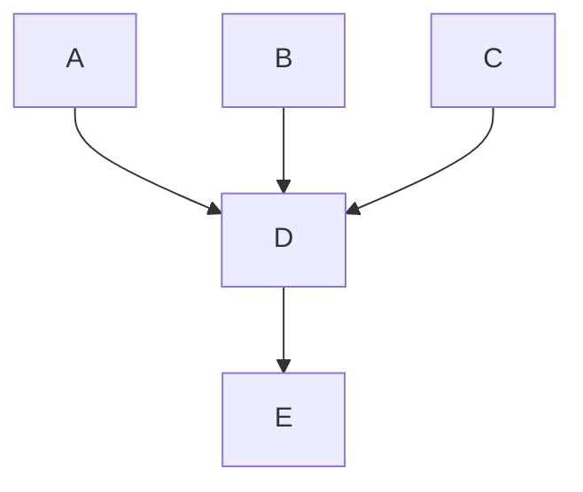

# Communications
This page covers the things every team member needs to know to effectively contribute at Fleet.


## All hands

Every month, Fleet holds a company-wide meeting called the "All hands". 

All team members should attend the "All hands" every month.  "All hands" meetings are recorded, To see the evolution over time or catch up with the latest happenings, review [decks](https://drive.google.com/drive/folders/1cw_lL3_Xu9ZOXKGPghh8F4tc0ND9kQeY) and [recordings](https://us-65885.app.gong.io/conversations?workspace-id=9148397688380544352&callSearch=%7B%22search%22%3A%7B%22type%22%3A%22And%22%2C%22filters%22%3A%5B%7B%22type%22%3A%22CallTitle%22%2C%22phrase%22%3A%22all%20hands%22%7D%5D%7D%7D) from recent company-wide "All hands" meetings. Team members who cannot attend are expected to watch the recording within a few days. 


## Strategy

You can read about the company's positioning and product strategy in ["🎐 Why Fleet?" (private google doc)](https://docs.google.com/document/d/1E0VU4AcB6UTVRd4JKD45Saxh9Gz-mkO3LnGSTBDLEZo/edit#).


### Competition

We track competitors' capabilities and adjacent (or commonly integrated) products in Google doc [Competition](https://docs.google.com/document/d/1Bqdui6oQthdv5XtD5l7EZVB-duNRcqVRg7NVA4lCXeI/edit) (private Google doc).


## Customer support service level agreements (SLAs)

**Fleet Free:**

| Impact level | Definition | Preferred contact | Response time |
|:---|:---|:---|:---|
| All inquiries | Any request regardless of impact level or severity | Osquery #fleet Slack channel | No guaranteed resolution |

> **Note:** If you're using Fleet Free, you can also access community support by [opening a bug](https://github.com/fleetdm/fleet/issues/new?assignees=&labels=bug%2C%3Areproduce&projects=&template=bug-report.md&title=) in the [Fleet GitHub](https://github.com/fleetdm/fleet/) repository.

**Fleet Premium:**

| Impact level | Definition | Preferred contact | Response time |
|:-----|:----|:----|:-----|
| Emergency (P0) | Your production instance of Fleet is unavailable or completely unusable. For example, if Fleet is showing 502 errors for all users. | Expedited phone/chat/email support during business hours. </br></br>Email the contact address provided in your Fleet contract or chat with us via your dedicated private Slack channel | **≤4 hours** |
| High (P1) | Fleet is highly degraded with significant business impact. | Expedited phone/chat/email support during business hours. </br></br>Email the contact address provided in your Fleet contract or chat with us via your dedicated private Slack channel | **≤4 business hours** |
| Medium (P2) | Something is preventing normal Fleet operation, and there may or may not be minor business impact. | Standard email/chat support | ≤1 business day | 
| Low (P3) | Questions or clarifications around features, documentation, deployments, or 'how to's'. | Standard email/chat support | 1-2 business days | 

> **Note:** Fleet business hours for support are Monday-Friday, 6AM-4PM Pacific Time, excluding current U.S. federal holidays during which responses may be delayed for Medium and Low impact issues. Refer to your welcome email for contact and support info. 

**Emergency (P0) request communications:**


## Directly responsible individuals (DRIs)

| Area of responsibility | [DRI](https://fleetdm.com/handbook/company/why-this-way#why-direct-responsibility) |
| -------------- | --- |
| Revenue                              | <sup><sub>_See [🐋 Chief Revenue Officer](https://fleetdm.com/handbook/sales#team)_</sup></sub>
| Pricing                              | <sup><sub>_See [🛠️ CEO responsibilities](https://fleetdm.com/handbook/company/leadership#ceo-responsibilities)_</sup></sub>
| Illustrations                        | <sup><sub>_See [🌐 Head of Design](https://fleetdm.com/handbook/digital-experience#team)_</sup></sub>
| Website                              | <sup><sub>_See [🌐 Digital Experience team](https://fleetdm.com/handbook/digital-experience#team)_
| Product marketing (PMM)              | <sup><sub>_See [🛠️ CEO responsibilities](https://fleetdm.com/handbook/company/leadership#ceo-responsibilities)_</sup></sub>
| Brand marketing                      | <sup><sub>_See [🛠️ CEO responsibilities](https://fleetdm.com/handbook/company/leadership#ceo-responsibilities)_</sup></sub>
| Public relations                     | <sup><sub>_See [🛠️ CEO responsibilities](https://fleetdm.com/handbook/company/leadership#ceo-responsibilities)_</sup></sub>
| Revenue pipeline                     | <sup><sub>_See [🫧 Demand team](https://fleetdm.com/handbook/demand#team)_</sup></sub>
| Ads                                  | <sup><sub>_See [🫧 Demand team](https://fleetdm.com/handbook/demand#team)_</sup></sub>
| Video                                | <sup><sub>_See [🫧 Digital Marketing Manager](https://fleetdm.com/handbook/demand#team)_</sup></sub>
| Social media                         | <sup><sub>_See [🫧 Digital Marketing Manager](https://fleetdm.com/handbook/demand#team)_</sup></sub>
| Guides                               | <sup><sub>_See [🌦️ Customer Success &amp; VP of Customer Success](https://fleetdm.com/handbook/customer-success#team)_</sup></sub>
| Release article                      | <sup><sub>_See [🦢 Head of Product Design](https://fleetdm.com/handbook/product-design#team)_</sup></sub>
| Information technology (IT)          | <sup><sub>_See [🚀 Client Platform Engineer &amp; Community Advocate](https://fleetdm.com/handbook/engineering#team)_</sup></sub>
| Payroll, bookkeeping, AR/AP          | <sup><sub>_See [💸 Finance Engineer](https://fleetdm.com/handbook/finance#team)_</sup></sub>
| Legal contracts                      | <sup><sub>_See [🌐 Digital Experience team](https://fleetdm.com/handbook/digital-experience#team)_</sup></sub>
| Customer renewals                    | <sup><sub>_See [🌦️ VP of Customer Success](https://fleetdm.com/handbook/customer-success#team)_</sup></sub>
| Customer deployments                 | <sup><sub>_See [🌦️ Infrastructure Engineer](https://fleetdm.com/handbook/customer-success#team)_ </sup></sub>
| Customer support                     | <sup><sub>_See [🌦️ Customer Success team](https://fleetdm.com/handbook/customer-success#team)_</sup></sub>
| Quality assurance (QA)               | <sup><sub>_See [🚀 Engineering team](https://fleetdm.com/handbook/engineering#team)_ </sup></sub>
| Features &amp; product adoption      | <sup><sub>_See [🦢 Head of Product Design](https://fleetdm.com/handbook/product-design#team)_</sup></sub>
| Feature prioritization               | <sup><sub>_See [🦢 Head of Product Design](https://fleetdm.com/handbook/product-design#team)_</sup></sub>
| Intentionality of Fleet's interfaces | <sup><sub>_See [🦢 Head of Product Design](https://fleetdm.com/handbook/product-design#team)_</sup></sub>
| Best practices for using Fleet       | <sup><sub>_See [🦢 Product Design team](https://fleetdm.com/handbook/product-design#team)_</sup></sub>
| [API design](https://fleetdm.com/docs/rest-api/rest-api) | <sup><sub>_See [🚀 Chief Technology Officer](https://fleetdm.com/handbook/engineering#team)_</sup></sub>
| Structure of the [docs](https://fleetdm.com/docs/get-started/why-fleet) | <sup><sub>_See [🌐 Head of Design](https://fleetdm.com/handbook/digital-experience#team)_</sup></sub>
| Product introduction docs            | <sup><sub>_See [🛠️ CEO responsibilities](https://fleetdm.com/handbook/company/leadership#ceo-responsibilities)_</sup></sub>
| Product deployment docs              | <sup><sub>_See [🚀 Chief Technology Officer](https://fleetdm.com/handbook/engineering#team)_</sup></sub>
| Product usage docs                   | <sup><sub>_See [🦢 Head of Product Design](https://fleetdm.com/handbook/product-design#team)_</sup></sub>
| Product reference docs               | <sup><sub>_See [🦢 Head of Product Design](https://fleetdm.com/handbook/product-design#team)_</sup></sub>
| What goes in a release               | <sup><sub>_See [🚀 Chief Technology Officer](https://fleetdm.com/handbook/engineering#team)_ </sup></sub> 
| Engineering output and architecture  | <sup><sub>_See [🚀 Chief Technology Officer](https://fleetdm.com/handbook/engineering#team)_ </sup></sub>
| Product development                  | <sup><sub>_See [🛩️ Product groups](https://fleetdm.com/handbook/company/product-groups#current-product-groups)_ </sup></sub>

## Tech stack admins

| Role | Google Workspace | Slack | GitHub | Gusto | Pilot | Plane | 1Password |
|:-----|-----------------:|------:|-------:|------:|------:|------:|----------:|
| CEO | ✅ Super admin | ✅ Primary workspace owner | ✅ Owner | ✅ Primary admin | ✅ Owner |✅ Owner | ✅ Owner |
| CTO | ✅ Super admin | ❌ | ✅ Owner | ❌ | ❌ | ✅ Admin | ❌ |
| Finance Engineer | ❌ | ❌ | ❌ | ✅ Admin | ✅ Admin |✅ Admin | ❌ |
| Head of Digital Experience | ✅ Super admin | ✅ Owner | ✅ Owner| ✅ Admin | ❌ | ✅ Admin | ✅ Admin |
| Apprentice | ✅ Super admin| ✅ Owner | ✅ Owner | ✅ Admin | ❌ | ✅ Admin | ✅ Admin |
| Digital Experience Engineer | ✅ Super admin | ✅ Admin | ❌ | ❌ | ❌ | ❌ | ✅ Admin |
| Head of Product Design | ❌ | ✅ Admin | ❌ | ❌ | ❌ | ❌ | ❌ |
| VP of CS | ❌ | ✅ Owner | ❌ | ❌ | ❌ | ❌ | ❌ |
| CS Support Engineer | ❌ | ✅ Admin | ❌ | ❌ | ❌ | ❌ | ❌ |
| Pilot bookkeeper | ❌ | ❌ | ❌ | ✅ Admin | ❌ | ✅ Admin | ❌ |

### Docs

This section details processes related to maintaining and updating the [Fleet documentation](https://fleetdm.com/docs).

When someone asks a question in a public channel, it's safe to assume they aren't the only person looking for an answer. 

To make our docs as helpful as possible, the Community team gathers these questions and uses them to make a weekly documentation update.

Fleet's goal is to answer every question with a link to the docs and/or result in a documentation update.

> Fleet's philosophy on how to write useful documentation is public and open-source: ["Why read documentation?"](https://fleetdm.com/handbook/company/why-this-way#why-read-documentation)

The docs are separated into four categories:

1. [Get started](https://fleetdm.com/docs/get-started/why-fleet)

2. [Deploy](https://fleetdm.com/docs/deploy/introduction)

3. [Using Fleet](https://fleetdm.com/docs/using-fleet/fleet-ui)

4. Reference
- [Configuration](https://fleetdm.com/docs/configuration/fleet-server-configuration)
- [REST API](https://fleetdm.com/docs/rest-api/rest-api)
- [Data tables](https://fleetdm.com/tables/account_policy_data)
- [Built-in queries](https://fleetdm.com/queries)


## Fleetdm.com

Any change to fleetdm.com follows the same process as [making changes](https://fleetdm.com/handbook/company/product-groups#making-changes) to the core product. To propose a change to Fleet's website [create a website request](https://github.com/fleetdm/fleet/issues/new?assignees=&labels=%23g-digital-experience&projects=&template=website-request.md&title=Website%20request%3A+__________________________) on the #g-digital-experience kanban board. 

Before committing anything to code, we create wireframes (referred to as ["drafting"](https://fleetdm.com/handbook/company/product-groups#making-changes)) to illustrate all changes that affect the layout and structure of the user interface, design, or APIs of fleetdm.com. See [Why do we use a wireframe first approach](https://fleetdm.com/handbook/company/why-this-way#why-do-we-use-a-wireframe-first-approach) for more information. 

The [Digital Experience team](https://fleetdm.com/handbook/digital-experience#team) holds regular design review sessions to evaluate, revise, and approve wireframes before moving into production. Design review sessions are hosted by the [Head of Design](https://calendar.google.com/calendar/u/0?cid=bXRob21hc0BmbGVldGRtLmNvbQ) and typically take place daily, late afternoon (CT). Anyone is welcome to join.


## Marketing programs

Fleet's community programs are rooted in several areas; created to nurture communication between all current and future Fleet users through events, community support, [social media](#social-media), conversation-starting, [ads](#ads), video, and articles.


### Social media

Fleet's largest asset is our user community, the people actually using Fleet. Public conversations on social media create valuable opportunities for contributors to answer technical questions and collect feedback.

Fleet [does not self-promote](https://www.audible.com/pd/The-Impact-Equation-Audiobook/B00AR1VFBU).  (Great brands are [magnanimous](https://en.wikipedia.org/wiki/Magnanimity).) In fact, conversations are already happening in our social spaces that open up opportunities for Fleet to [engage with the community](https://fleetdm.com/handbook/demand#engage-with-the-community).

Here are some topics for social media posts:
- Fleet the product
- Internal progress
- Highlighting community contributions
- Highlighting Fleet and osquery accomplishments
- Industry news about osquery
- Industry news about device management
- Upcoming events, interviews, and podcasts


#### Fleet on LinkedIn

Original posts on LinkedIn by Fleet employees [can be promoted using the Fleet company page](https://fleetdm.com/handbook/demand#promote-a-post-on-linkedin). If you think your post would make sense in front of a bigger audience, [create an issue on the demand board](https://fleetdm.com/handbook/demand#contact-us) linking the team to your personal LinkedIn post (only original posts please, reposts and quotes of other posts can not be promoted). Include any context in the issue and keep an eye on your inbox, The Demand team will request permission to use the post in a promoted post.


### Ads

Fleet uses advertising to spread awareness through a broader audience and foster greater engagement within user communities. The more people actively using Fleet, or contributing, the better Fleet will be.


### Events

It's important for Fleet to engage at [events](https://docs.google.com/spreadsheets/d/1YQXAX2Q_WnGkAwMYjMbQpV3nbCj7gOBbv7Y0u4twxzQ/edit#gid=1931288160). This provides an opportunity to directly engage with potential users and contributors, build relationships, gather feedback, and create a stronger sense of community and trust.


#### Event lead follow-up

Eventgoers expect a timely [follow-up from Fleet](https://fleetdm.com/handbook/demand#upload-contacts-to-salesforce-after-an-event) based on the conversations that they had at the event.

1. Once a list of badge scans is available, fleeties who attended the event are to add any follow-up notes, including primary buying situation, amount of endpoints, level of interest, and general talking points.
2. Within three business days of returning from the event, attendees will set up a debrief meeting with the demand team to discuss follow-up and provide the list of badge scans uploaded to the ["Events" folder in Google Drive](https://drive.google.com/drive/u/0/folders/1uXf95V6CHKHnqxRc9iQr0a0FnTZk3bXR).


### Podcast

Fleet has created the [ExpedITioners podcast](https://expeditioners.podbean.com/) to open discussions and help IT and security professionals get ahead of the curve and prepare themselves and their organizations for what lies ahead. 
<!-- TODO: Find a way to link to the meetings section below and make it make sense-->


### Video

Fleet uses YouTube to help keep the community up-to-date and informed. These videos facilitate community engagement, provide educational resources, and help share essential information about Fleet and the people using it. Meetings regularly uploaded to YouTube will have a "▶️" emoji prepended to the calendar event title (e.g. "▶️ ☁️🌈 Sprint demos!").  


## Meetings

- **Plan to join meetings on time.** At Fleet, we start on time and do not wait for folks to join.  As most of our meetings are conducted over zoom, please join with a working microphone and with your camera on whenever possible.  Being even a few minutes late can make a big difference and slow your meeting counterparts down. When in doubt, show up a couple of minutes early. 
- **Turn on your camera.** This allows for more complete and intuitive verbal and non-verbal communication. Feel free to leave your camera on or turn it off when joining meetings with new participants you might not be familiar with yet. Turn your camera on when you lead or cohost a meeting, or when you present your work during a demo session.
  - **If you would prefer not to be on YouTube** when presenting on a meeting, you can prep your demo ahead of the meeting and communicate to your manager who will present for you.  It's always ok to do this.
- **Be warm.**  It's okay to spend the first minute or two of a meeting being present and making small talk. Since we are all remote, it's easy to miss out on hallway chatter and human connections that happen in [meatspace](https://www.dictionary.com/browse/meatspace).  Use this time together during the first minute to say "Hi!"  Then you can jump into the topics to be discussed.
- **Confidentiality reminder.** Fleet meetings titled with "▶️"  are considered public by default unless [otherwise specified](https://fleetdm.com/handbook/company/communications#levels-of-confidentiality). All public meeting transcripts and video are screened for confidential information before being published. If confidential information (e.g. customer names, IP addresses, GitHub secrets, etc.) is revealed via screen share or audio during the recording of a public meeting, any team member on the call that notices sensitive information should verbally say, "Pineapple, pineapple, pineapple." 

> 🍍🍍🍍 Why three times? This helps ensure that at least one of the "Pineapple" call-outs will be transcribed correctly. 🍍🍍🍍   

Videos are transcribed, and this makes it easier to find required redactions during the editing process before [upload](https://fleetdm.com/handbook/demand#upload-to-youtube).
  - **When sharing your screen** during a public meeting, refrain from displaying sensitive information such as customer names, private messages, or other confidential information.
  - **[OpenBlur]([OpenBlur](https://chromewebstore.google.com/detail/openblur/dlnglldcaegkgmhmmhhdknblccppichf?pli=1))** is a web extension that automatically blurs elements containing specific keywords on any webpage. This allows you to hide secrets from online meetings or anyone viewing your screen. Created by Victor Lyuboslavsky ([@getvictor](https://github.com/getvictor).
- **Take notes.** Every meeting should have a [DRI](https://fleetdm.com/handbook/company/why-this-way#why-direct-responsibility) to ensure: 
  - The agenda creation and/or prep beforehand. 
  - There is a designated notetaker during the meeting. 
  - All action items are tracked and assigned to the correct individuals. 


### Meeting agendas

["**No agenda, no attenda**."](https://about.gitlab.com/company/culture/all-remote/live-doc-meetings/#gitlab-meeting-best-practices) Every work-related meeting should have an editable agenda (e.g. edit access shared with all attendees) attached to the calendar invite. 
- To create a meeting agenda please make a copy of [Fleet's meeting template](https://docs.google.com/document/d/1TaZ654gTwadWGDYhP3zuAzWe0eiY0s9NhaU9KLCokgw/copy).

>Please do not use Google Calendar's automatic agenda/notes creation function, as it does not adhere to Fleet's preferred agenda format. If the automatic agenda doc has been created in error, edit the calendar invite to delete it from the meeting to avoid confusion.


### External meeting scheduling

When scheduling external meetings, provide external participants with a
[Calendly](https://calendly.com) link to schedule with the relevant internal participants. If you
need a Calendly account, reach out to `#g-digital-experience` via Slack.


### Internal meeting scheduling

Fleet uses the Zoom add-on for Google Calendar to schedule meetings (exceptions are customers that are non-negotiably required to use a different tool) when we [create calendar events](https://support.google.com/calendar/answer/72143?hl=en&ref_topic=10510646&sjid=7187599067132459840-NA#zippy=%2Cclick-an-empty-time-in-your-calendar). 
Our Zoom meetings are configured to let participants join before the host arrives, to make sure meetings start on time even if the host isn't there.

To schedule a meeting within Fleet:
- To add a Zoom meeting to a calendar event, click the "Add video conferencing" dropdown and select "Zoom Meeting." Google Calendar will automatically add the Zoom meeting details and instructions to join the event.
- Enter the `@fleetdm.com` emails for each participant into the "Add guests" box in Google Calendar, and the calendar availability for each participant will appear in your view.
- Select a meeting time, the participants will automatically be invited and a video conference will be attached to the invite (this can save a lot of communication overhead when scheduling with multiple participants).

It is important to [set your working hours](https://support.google.com/calendar/answer/7638168?hl=en&co=GENIE.Platform%3DDesktop) in Google Calendar and block out any personal time/events/PTO, so that team members do not inadvertently schedule a time when you are not available. 
- Many team members use the free tier of [reclaim.ai](https://reclaim.ai/) to synchronize personal event times (without event details) into their work calendars. 
It is also common practice to block out time for focused work.

In an all-remote company, "face time" matters. Remember: even if someone's calendar is open, they have other work to do. Help each other by batching up internal meetings which enables longer, uninterrupted stretches of deep work.


#### Schedule time with the CEO

All invitations to meetings are welcomed, and quickly considering them is a top priority for the CEO.

> Please do not add events to the CEO's calendar. **Events added directly to the CEO's calendar will be declined and removed.** Even if the CEO asks you to set up a meeting or add him to a call, please get scheduling help from the [Apprentice](https://www.fleetdm.com/handbook/digital-experience#team)).

To request time with the CEO, [submit an issue](https://github.com/fleetdm/confidential/issues/new?assignees=sampfluger88&labels=%23g-digital-experience&projects=&template=custom-request.md&title=%7BMeeting%20request%3A%20) at-mentioning the [Head of Digital Experience](https://www.fleetdm.com/handbook/digital-experience#team). Internal meetings can sometimes be moved to make room. External meetings, blocked time, travel, and personal commitments can rarely be moved.

- **Why the extra step?** There are not enough hours in the day for the CEO to accept every request to meet, so [we have to prioritize](https://www.fleetdm.com/handbook/digital-experience#process-the-ceos-calendar).
- **Self-service scheduling:** Unlike other team members, who you can schedule with by simply dropping an event on their calendar unless requested directly from Mike, please do not directly schedule a meeting onto the CEO's calendar without using this process to confirm with the Apprentice first.
- **Rescheduling:** All items on Mike's calendar are subject to change by the CEO to better serve the company.  Send last-minute changes or cancellations to Mike [via direct message (DM)](https://www.fleetdm.com/handbook/company/why-this-way#why-not-mention-the-ceo-in-slack-threads).


### Modifying an event organized by someone else

To edit an event where someone else at Fleet is the organizer, you can first subscribe to their calendar in Google Calendar and then edit the event on their calendar.  Your edits will automatically apply to all attendees.
This works because every Fleetie grants edit access to everyone else at Fleet as part of onboarding.


### Shared calendars

Team calendars are the primary source for sprint rituals; they facilitate the execution of each sprint. 
Looking to add, change, or remove a shared calendar? [Create an issue for the CEO](https://fleetdm.com/handbook/digital-experience#contact-us) and the appropriate DRI will reply with feedback.


## Skip-level 1:1 meetings 

Fleet uses skip-level 1:1 meetings as a recurring pulse check to encourage [valuable personal and departmental feedback](https://fleetdm.com/handbook/company/communications#performance-feedback) across the org. This helps the leadership at Fleet run an effective company with a great team, good alignment, and quick decisions. To schedule a skip-Level 1:1:
1. Create a copy of the ["Skip-level 1:1 agenda template"](https://docs.google.com/document/d/191wiy-_a9XBMndLlM97iOwUF6a-0PtkbboQ2FCUIy6w/copy) and rename the document "🧑‍🚀 YOUR_GITHUB_USER_NAME : SUPERVISOR_GITHUB_USER_NAME".
2. [Schedule a meeting](https://fleetdm.com/handbook/company/communications#internal-meeting-scheduling) with your manager's supervisor and title the calendar event by copying your skip-level agenda title and appending "[no shadows]" to the end (this tells other team members that this is a private conversation).

> **If you're scheduling with the CEO** please [get help](https://fleetdm.com/handbook/company/communications#schedule-time-with-the-ceo) before adding events to the calendar.

3. Link the skip-level agenda in the calendar event description before saving.


## Zoom

We use [Zoom](https://zoom.us) for virtual meetings at Fleet, and it is important that every team member feels comfortable hosting, joining, and scheduling Zoom meetings.
By default, Zoom settings are the same for all Fleet team members, but you can change your personal settings on your [profile settings](https://zoom.us/profile/setting) page. 
Settings that have a lock icon next to them have been locked by an administrator and cannot be changed. Zoom administrators can change settings for all team members on the [account settings page](https://zoom.us/account/setting) or for individual accounts on the [user management page](https://zoom.us/account/user#/).


### Recording meetings

Capturing video from meetings with customers, prospects, and community members outside the company is an important part of building world-class sales and customer success teams and is a widespread practice across the industry. At Fleet, we use Gong to capture Zoom meetings and share them company-wide. If a team member with a Gong license attends certain meetings, generally those with at least one person from outside of Fleet in attendance.  
  - While some fleeties may have a Gong seat that is necessary in their work, the typical use case at Fleet is for employees on the company's sales, customer success, or customer support teams. 
  - You should be notified anytime you join a recorded call with an audio message announcing "this meeting is being recorded" or "recording in progress."  To stop a recording, the host of the call can press "Stop." 
  - If the call has external participants and is recorded, this call is stored in Gong for future use. 
To access a recording saved in Gong, visit [app.gong.io](https://app.gong.io) and sign in with SSO. 
  - Everyone at Fleet has access, whether they have a Gong seat or not, and you can explore and search through any uploaded call transcripts unless someone marks them as private (though the best practice would be not to record any calls you don't want to be captured). 
If you ever make a mistake and need to delete something, you can delete the video in Gong or reach out to Nathan Holliday or Mike McNeil for help. They will delete it immediately without watching the video. 
  - Note that any recording stopped within 60 seconds of the start of the recording is not saved in Gong, and there will be no saved record of it. 

Most folks at Fleet should see no difference in their meetings if they aren't interfacing with external parties. 
Our goal in using Gong and recording calls is to capture insights from sales, customer, and community meetings and improve how we position and sell our product. We never intend to make anyone uncomfortable, and we hope you reach out to our DRI for Gong, Nathan Holliday, or Mike McNeil if you have questions or concerns.  

Here are some tips for troubleshooting Gong:
- In order to use Gong, the Zoom call must be hosted by someone with a Fleet email address.  
- You cannot use Gong to record calls hosted by external parties.
- Cloud recording in Zoom has to be turned on and unlocked company wide for Gong to function properly, because of this, there is a chance that some Gong recordings may still save in Zoom's cloud storage even if they aren't uploaded into Gong.
- To counter this, Nathan Holliday will periodically delete all recordings found in Zoom's storage without viewing them.
- If you need help using Gong, please check out [Gong Academy](https://academy.gong.io/).


### Excluding calls from being recorded

For those with a Gong seat or scheduling a call with someone in attendance that has a Gong seat who does not wish for their Zoom call with an external party to record, make sure your calendar event title contains `[no shadows]`.  You can also read the [complete list of exclusion rules](https://docs.google.com/document/d/1OOxLajvqf-on5I8viN7k6aCzqEWS2B24_mE47OefutE/edit?usp=sharing).


### Sharing a local Zoom recording 

In some instances, you may need to record a call locally (i.e. save the recording on your computer and not in the cloud ☁️). You can use the following steps to upload the call recording:
1. Log into [Zoom](https://zoom.us/recording) using SSO (Single-Sign-On) and go to "Recordings". 
2. After the recording is finished processing (which sometimes can take a couple of hours), you will see the hotdog (or "overflow menu") menu appear. Select the call you want to share and use the hotdog menu to download all files.
3. Rename the mp4 file to match the meeting name and prefix it with the date of the recording (e.g. "YYYY-MM-DD *Name of the calendar event*").
4. Upload the mp4 recording to the [whiteboards folder](https://drive.google.com/drive/u/0/folders/1prO98fmB2WKzpubZ2-z0sju9dQ4ijpNE) in Google Drive.


## Levels of confidentiality

Fleet uses these levels to standardize a commitment to minimal esotericism across the company.  
- **Public:**   _Share with anyone, anywhere in the world_
- **Confidential:**  _Share only with team members who've signed an NDA, consulting agreement, or employment agreement_
- **Classified:**  _Share only with the CEO, Head of Digital Experience, and/or the people involved.  e.g., US social security numbers during hiring_


### Document titles

Fleet uses these levels to standardize a commitment to minimal esotericism across the company. 
- **"Public":** _(Available to public)_ 
- _(Confidential - for Fleet eyes only)_     
- **"¶":** _(E-group - Direct reports the the CEO)_
- **"¶¶":** _(Classified - CEO, Head of Digital Experience, and Apprentice)_


## Google Drive

Fleet uses Google Drive to keep files correctly bucketed and accessible for team members. When adding a file, you can: 
- Check for existing files to avoid duplication.
- Avoid breaking Google Drive links. In some cases, you can update files by using the "Manage versions" option (in the right-click menu) so that links continue to work.


## Email relays

There are [several special email addresses](https://docs.google.com/document/d/1tE-NpNfw1icmU2MjYuBRib0VWBPVAdmq4NiCrpuI0F0/edit#) that automatically relay messages to the appropriate people in Fleet. Each email address meets a minimum response time ("Min RT"), expressed in business hours/days, and has a dedicated, directly responsible individual (DRI) who is responsible for reading and replying to emails sent to that address.


## Slack

At Fleet, we do not send internal emails to each other. Instead, we prefer to use [Slack](https://www.linkedin.com/pulse/remote-work-how-set-boundaries-when-office-your-house-lora-vaughn/) to communicate with other folks who work at Fleet.


### Key Slack channels

The following Slack channels are useful for every Fleetie:

| Slack channel               | Purpose |
|:----------------------------|:--------------------------------------------------------------------|
| `#general`                  | Read company-wide announcements.
| `#thanks`                   | Say thank you.
| `#random`                   | Be random.


### Slack channel prefixes

- We have specific channels for various topics, but we also have more general channels for the teams at Fleet.
We use these prefixes to organize the Fleet Slack:
 * ***g-***: for team/group channels *(Note: "g-" is short for "grupo" or "group")*.
 * ***oooh-***: used to discuss and share interesting information about a topic.
 * ***help-***: for asking for help on specific topics.
 * ***at*** or ***fleet-at***: for customer channels.
 * ***2023-***: for temporary channels _(Note: specify the relevant year in four digits, like "YYYY-`)_


### Slack communications and best practices

- We use [channels over DMs](https://fleetdm.com/handbook/company/why-this-way#why-group-slack-channels).
- We use threads in Slack as much as possible. Threads help limit noise for other people following the channel and reduce notification overload.
- We configure our [working hours in Slack](https://slack.com/help/articles/360025054173-Set-up-Slack-for-work-hours-) to make sure everyone knows when they can get in touch with others.
- In consideration of our team, Fleet avoids using global tags in channels (i.e. @here, @channel, etc.) (What about polls? Good question, fleeties are asked to post their poll in the channel and @mention the teammates they would like to hear from.)


### Create a GitHub issue from a Slack thread

If you need to track content from a Slack channel (ie. #g-sales), you can automatically generate a github issue by selecting the `create-github-issue` emoji on the thread. This will automatically create an issue tagged with the GitHub label that corisponds with the Slack channel. If you need the issue logged against a specific board, ensure that you have updated the label during issue creation.


## GitHub

Fleet uses GitHub as the [source of truth](https://fleetdm.com/handbook/company/why-this-way#why-do-we-use-one-repo) for the product and documentation. GitHub allows community members to interact with Fleet, [contribute and provide feedback](https://github.com/fleetdm/fleet/blob/main/docs/Contributing/Committing-Changes.md#committing-changes).


### GitHub labels

Fleet prefixes all GitHub labels with special characters or words to organize and categorize GitHub issues.

| Prefix            | Label type  | Examples                            |
|:------------------|:------------|:------------------------------------|
| `:`               | Verb        | `:dev`, `:research`, `:design`
| `~`               | Adjective   | `~blocked`, `~frontend`, `~backend`
| `customer-`       | [Customer request](TODO link to handbook section) | `customer-leo`, `customer-sagittarius`
| `#g-`             | Group isssue | _An issue requesting something from a group at Fleet, such that it will be seen and procesed on their kanban board within 1 business day._

Opinionated conventions help people work faster and spend less time figuring out what to name things, or misunderstanding why they're named what they are.  This also reduces the total number of labels required while maintaining an expressive labeling system.

Labels with a `#g-` prefix refer to a kanban board. Since it is best practice to have an issue on a single board, make an effort to have only one label with the `#g-` prefix per issue.

> _**Note:** There are only a few "special" labels that are exceptions to this rule:
> - `bug` A defect in the product.
> - `bug-` Defect category. For example, `bug-enrollment`, `bug-profiles-sync`, `bug-policies`. This allows us to track the areas of the product producing the most bugs.
> - `story` A user story.
> -  `prospect-` A customer prospect.
> - `P-` A [priority level](https://fleetdm.com/handbook/company/communications#high-priority-user-stories-and-bugs).
> - `Epic` Do not use. _(TODO: ZenHub automatically recreates this label when we group sub-tasks inside of a user story. Find a way to remove this. It is an artifact from Zenhub and not something we actually want to exist or use, as it is confusing.)_


### Process new requests

Team members [process their department's kanban boards](https://fleetdm.com/handbook/company/why-this-way#why-lean-software-development) daily, prioritizing all new requests including issues and PRs within one business day.

To process intake team members will:
- Inspect each item in the "📨 New requests" column and understand the next steps needed to complete the task.
- Indicate to the requestor when they can expect the task to be completed by placing each item in the appropriate column (e.g. Not yet, Planned, In progress) and estimate if necessary.
- If the goal/user story is unclear, assign the issue to the requestor and at-mention them in an issue comment asking to clarify the intended action. 
- If the task is to be backlogged (i.e. "Not yet"), place the issue in the "Not yet" column and at-mention the requestor in an issue comment. Explain why the task is unable to be prioritized and provide a tentative ETA on when the task will be completed. 


## High priority user stories and bugs

All issues are treated as standard priority by default. Some issues are assigned a priority label to indicate the level of urgency.

- Emergency: `P0`
  - Examples: Customer outage, confirmed security vulnerability ([critical bug](https://fleetdm.com/handbook/company/product-groups#release-testing)), a new feature is needed to address an immediate Fleet emergency.
  - Response: Immediately stop other work to swarm the issue. Work 24/7 in shifts until resolved.
  - Impact: Significant impact. May void current sprint.

- Critical: `P1`
  - Examples: A supported workflow is broken ([critical bug](https://fleetdm.com/handbook/company/product-groups#release-testing)), a potential security vulnerability, a new feature is required to address an immediate critical Fleet need.
  - Response: Issue brought to next standup for estimation and immediately brought into the sprint. Necessary team members are assigned as their top priority.
  - Impact: High impact. Does not void sprint, but reduces overall velocity and requires deprioritizing other work.

- Urgent: `P2`
  - Examples: A supported workflow is not functioning as intended, a newly drafted feature has an associated urgent Fleet need.
  - Response: Issue is prioritized at the top of the next sprint. If opporunity cost of waiting for the next sprint is too high, it may be considered for current sprint.
  - Impact: Low to medium impact. If prioritized into current sprint, may reduce overall velocity and require deprioritizing other work.

Any Fleetie can follow the process below to add a priority label to an issue.

1. Add as much context as possible to the issue description and assign labels to help the team
   understand the problem and what is driving the urgency. 
2. Add the `P0`, `P1`, or `P2` label based on the urgency of the issue. 
3. Comment on the GitHub issue explaining why the issue is a priority, and assign the issue to the
   [DRI for what goes in a
   release](https://fleetdm.com/handbook/company/communications#directly-responsible-individuals-dris).
   For immediate action, follow up via Slack DM or by phone.
4. The DRI for what goes in a release will review the issue to determine if it meets the criteria
   for the assigned priority label. If so, they will assign the issue to the appropriate EM and PM. If not,
   they will comment on the issue explaining why. 


### Estimation points

Estimation points represent the effort required to complete a task. After accessing wireframes, we typically play planning poker, a gamified estimation technique, to determine the necessary story point value.

We use the following story points to estimate tasks:

| Story point | Time |
|:---|:--------------|
| 1  | 1 to 2 hours  |
| 2  | 2 to 4 hours  |
| 3  | 1 day         |
| 5  | 2 to 3 days   |
| 8  | Up to a week  |
| 13 | 1 to 2 weeks  |

> Larger projects are estimated in a way that can sometimes look disproportionate to account for edge cases that weren't caught during planning. This helps us develop [iteratively](https://fleetdm.com/handbook/company#results) and deliver bite-sized functionality on more predictable time scales.


### Making a pull request

Our handbook and docs pages are written in Markdown and are editable from our website (via GitHub). Follow the instructions below to propose an edit to the handbook or docs.
1. Click the _"Edit page"_ button (top right of the page) from the relevant handbook or docs page on [fleetdm.com](https://www.fleetdm.com) (this will take you to the GitHub browser).
2. Make your suggested edits in the GitHub.
3. Click _"Commit changes...."_
4. Give your proposed change a title or _["Commit message"](https://about.gitlab.com/topics/version-control/version-control-best-practices/#write-descriptive-commit-messages)_ and optional _"Extended description"_ (good commit messages help page maintainers quickly understand the proposed changes).
 - **Note:** _Keep commit messages short and clear. (e.g. "Add DRI automation")_ 
4. Click _"Propose changes"_
5. Request a review from the page maintainer, and finally, press “Create pull request.”
6. GitHub will run a series of automated checks and notify the reviewer. At this point, you are done and can safely close the browser page at any time.
8. Check the “Files changed” section on the Open a pull request page to double-check your proposed changes.

> Note: Pages in the `./docs/Contributing/` folder and folders with a underscore prefix (e.g., `./docs/Deploy/_kubernetes/`) are not included in the documentation on the Fleet website.


### Merging changes

When merging a PR to the master branch of the [Fleet repo](https://github.com/fleetdm/fleet), remember that whatever you merge gets deployed live immediately. Ensure that the appropriate quality checks have been completed before merging. [Learn about the website QA process](#quality).

When merging changes to the [docs](https://fleetdm.com/docs), [handbook](https://fleetdm.com/handbook), and articles, make sure that the PR’s changes do not contain inappropriate content (goes without saying) or confidential information, and that the content represents our [brand](#brand) accordingly. When in doubt reach out to the product manager of the [website group](https://fleetdm.com/handbook/digital-experience) in the [#g-digital-experience](https://fleetdm.slack.com/archives/C058S8PFSK0) channel on Slack.


### Editing a merged pull requests 

We approach editing retrospectively for pull requests (PRs) to handbook pages. Remember our goal above about moving quickly and reducing time to value for our contributors? We avoid the editor becoming a bottleneck for merging quickly by editing for typos and grammatical errors after-the-fact. Here's how to do it:

1. Check that the previous day's edits are formatted correctly on the website (more on this in the note below.)
2. Use the [Handbook history](https://github.com/fleetdm/fleet/commits/main/handbook) feed in GitHub to see a list of changes made to the handbook.
3. From the list of recently merged PRs, look at the files changed for each and then:
  - Scan for typos and grammatical errors.
  - Check that the tone aligns with our [Communicating as Fleet](https://fleetdm.com/handbook/brand#communicating-as-fleet) guidelines and that Grammarly's tone detector is on-brand.
  - Check that Markdown is formatted correctly.
  - **Remember**, Do not make edits to this page. It's already merged.
4. Instead, navigate to the page in question on the website and submit a new PR to make edits - making sure to request a review from the maintainer of that page.
5. Comment on the original PR to keep track of your progress. Comments made will show up on the history feed. E.g., `"Edited, PR incoming"` or `"LGTM, no edits required."`
6. Watch [this short video](https://www.loom.com/share/95d4525a7aae482b9f9a9470d446ce9c) to see this process in action.

> **Note:** The Fleet website may render Markdown differently from GitHub's rich text preview. It's essential to check that PRs merged by the editor are displaying as expected on the site. It can take a few minutes for merged PRs to appear on the live site, and therefore easy to move on and forget. It's good to start the ritual by looking at the site to check that the previous day's edits are displaying as they should.


### Linking to a location on GitHub

When adding a link to any text in the docs, handbook, or website always be sure to use the canonical form of the URL (e.g. _"https//www.fleetdm.com/
handbook/..."_).
Navigate to the file's location on GitHub, and press "y" to transform the URL into its canonical form.


#### Fixing a broken link

For instance when a broken link is discovered on fleetdm.com, always check if the link is a relative link to a location outside of `/docs`.

An example of a link that lives outside of `/docs` is:

```
../../tools/app/prometheus
```

If the link lives outside `/docs`, head to the file's location (in this case, [https://github.com/fleetdm/fleet/blob/main/tools/app/prometheus.yml)](https://github.com/fleetdm/fleet/blob/main/tools/app/prometheus.yml)), and copy the full URL  into its canonical form (a version of the link that will always point to the same location) ([https://github.com/fleetdm/fleet/blob/194ad5963b0d55bdf976aa93f3de6cabd590c97a/tools/app/prometheus.yml](https://github.com/fleetdm/fleet/blob/194ad5963b0d55bdf976aa93f3de6cabd590c97a/tools/app/prometheus.yml)). Replace the relative link with full URL.


### Documentation meta tags

- **Page order:** The order we display documentation pages on fleetdm.com is determined by `pageOrderInSection` meta tags. These pages are sorted in their respective sections in **ascending** order by the `pageOrderInSection` value. Every Markdown file (except readme and faq pages) in the `docs/` folder must have a meta tag with a positive 'pageOrderInSection' value.

We leave large gaps between values to make future changes easier. For example, the first page in the "Using Fleet" section of the docs has a `pageOrderInSection` value of 100, and the next page has a value of 200. The significant difference between values allows us to add, remove and reorder pages without changing the value of multiple pages at a time.

When adding or reordering a page, try to leave as much room between values as possible. If you were adding a new page that would go between the two pages from the example above, you would add `<meta name="pageOrderInSection" value="150">` to the page.

- 

### Article meta tags:

We use `<meta>` tags in Markdown articles to set metadata information about the article on the Fleet website. The values of these tags determine where the article will live, and how the article will be displayed on the website.

- Required `<meta>` tags - If any of these tags are missing, the website's build script will fail with an error.
    - `articleTitle`: The title of the article.
    - `authorFullName`:  The full name of the author of the article.
    - `authorGithubUsername`: The Github username of the author.
    - `category`: The category of the article. determines the article category page the article will be shown on. 
      > Note: All markdown articles can be found at fleetdm.com/articles
        - Supported values: 
            - `releases` - For Fleet release notes. Articles in this category are available at fleetdm.com/releases
            - `security` - For security-related articles. Articles in this category are available at fleetdm.com/securing
            - `engineering` - For engineering-related articles. Articles in this category are available at fleetdm.com/engineering
            - `success stories` - Articles about how/why Fleet is being used by our customers. Articles in this category are available at fleetdm.com/success-stories
            - `announcements` - News and announcements about new features and changes to Fleet. Articles in this category are available at fleeetdm.com/announcements
            - `guides` - Non-reference documentation and how-to guides. Articles in this category are available at fleetdm.com/guides
            - `podcasts` - Episodes of Fleet's podcast. Articles in this category are available at fleetdm.com/podcasts
    - `publishedOn`:  An ISO 8601 formatted date (YYYY-MM-DD) of the articles publish date. If the article is a guide, this value should be updated whenever a change to the guide is made.
- Optional meta tags:
    - `articleImageUrl`: A relative link to a cover image for the article. If provided, the image needs to live in the /website/assets/images/articles folder. The image will be added to the card for this article on it's category page, as well as a cover image on the article page. If this value is not provided, the card for the article will display the Fleet logo and the article will have no cover image.
    - `description`: A description of the article that will be visible in search results and social share previews. If provided, this value will override the generated meta description for this article. otherwise, the description will default to `[articleTitle] by [authorFullName]`.

**Example meta tag section:**

```html
<meta name="articleTitle" value="Building an effective dashboard with Fleet's REST API, Flask, and Plotly: A step-by-step guide">
<meta name="authorFullName" value="Dave Herder">
<meta name="authorGitHubUsername" value="dherder">
<meta name="category" value="guides">
<meta name="publishedOn" value="2023-05-22">
<meta name="articleImageUrl" value="../website/assets/images/articles/building-an-effective-dashboard-with-fleet-rest-api-flask-and-plotly@2x.jpg">
<meta name="description" value="Step-by-step guide on building a dynamic dashboard with Fleet's REST API, Flask, and Plotly. Master data visualization with open-source tools!">
```

### Images

Try to keep images in the docs at a minimum. Images can be a quick way to help users understand a concept or direct them towards a specific user interface(UI) element. Still, too many can make the documentation feel cluttered and more difficult to maintain.

When adding images to the Fleet repo, follow these guidelines:

- UI screenshots should be a 4:3 aspect ratio (1280x960). This is an optimal size for the container width of the docs and ensures that content in screenshots is as clear as possible to view in the docs (and especially on mobile devices).
- You can set up a custom preset in the Google Chrome device toolbar (in Developer Tools) to quickly adjust your browser to the correct size for taking a screenshot.
- Keep the images as simple as possible to maintain. Screenshots can get out of date quickly as UIs change.
- Exclude unnecessary images. Images should be used to help emphasize information in the docs, not replace it.
- Minimize images per doc page. For doc maintainers and users, more than one or two per page can get overwhelming.
- The goal is for the docs to look good on every form factor, from 320px window width all the way up to infinity. Full window screenshots and images with too much padding on the sides will be less than the width of the user's screen. When adding a large image, make sure it is easily readable at all widths.

Images can be added to the docs using the Markdown image link format, e.g., ``
The images used in the docs live in `docs/images/`. Note that you must provide the URL of the image in the Fleet GitHub repo for it to display properly on both GitHub and the Fleet website.

> Note that the instructions above also apply to adding images in the Fleet handbook.


### Audit logs

The [Audit logs doc page](https://fleetdm.com/docs/Using-Fleet/Audit-logs) has a page generator that is used to speed up doc writing when Fleet adds new activity types.

- If you're making a copy change to an exiting activity type, edit the `activities.go` file [here](https://github.com/fleetdm/fleet/blob/main/server/fleet/activities.go).
- If you're making a change to the top section or meta tags, edit the `gen_activity_doc.go` file [here](https://github.com/fleetdm/fleet/blob/main/server/fleet/gen_activity_doc.go).
- If you're adding a new activity type, add the activity to the `ActivityDetailsList` list in the `activities.go` file.

After making your changes, save them and run `make generate-doc`. This will generate a new `Audit-logs.md` file. Make sure you run the command in the top level folder of your cloned, Fleet repo.


## Figma

We use Figma for virtually all our design work. This includes the Fleet product, our website, and our marketing collateral. 

- **Fleet product:** All product design work is done in the [Fleet product](https://www.figma.com/files/project/17318630/%F0%9F%94%9C%F0%9F%93%A6-Fleet-EE%C2%AE-(product)?fuid=1234929285759903870) Figma project.  
See [📖Product#Working with Figma](https://fleetdm.com/handbook/product#working-with-figma) for more details.
- **Fleet website:** All website design work is done in the [fleetdm.com (current, dev-ready)](https://www.figma.com/file/yLP0vJ8Ms4GbCoofLwptwS/%E2%9C%85-fleetdm.com-(current%2C-dev-ready)?node-id=794%3A373) Figma file.
- **Design system:** Shared logos, typography styles, and UI components can be found in [Design system](https://www.figma.com/files/project/15701210).
- **NOTE:** The Figma docs in Design System contain the master components that are referenced throughout all other Figma files. Use caution when modifying these components, as changes will be reflected in the master Fleet EE (scratchpad) and fleetdm.com (current, dev-ready) Figma docs.

**Marketing assets:** Product screenshots and artwork for social media, articles, and other marketing assets can be found in [Collateral](https://www.figma.com/files/project/20798819).


## Spending company money

As we continue to expand our company policies, we use [GitLab's open expense policy](https://about.gitlab.com/handbook/spending-company-money/) as a guide for company spending.
In brief, this means that as a Fleet team member, you may:
* Spend company money like it is your own money.
* [Spend less](https://fleetdm.com/handbook/company/why-this-way#why-spend-less).  Purchase what you need to do your job effectively.
* Feel free to make purchases __in the company's interest__ without asking for permission beforehand (when in doubt, do __inform__ your manager prior to purchase or as soon as possible after the purchase).
For more developed thoughts about __spending guidelines and limits__, please read [GitLab's open expense policy](https://about.gitlab.com/handbook/spending-company-money/).


### Brex


#### Non-travel purchases that exceed a Brex cardholder's limit

For non-travel purchases that would require an increase in the Brex cardholder's limit ($2,000 by default), please [make a request](https://fleetdm.com/handbook/digital-experience#contact-us) with following information:
- The nature of the purchase (i.e. SaaS subscription and what it's used for)
- The cost of the purchase and whether it is a fixed or variable (i.e. use-based) cost.
- Whether it is a one time purchase or a recurring purchase and at what frequency the purchase will re-occur (annually, monthly, etc.)
- If there are more ideal options to pay for the purchase (i.e. bill.com, the Fleet AP Brex card, etc.) that method will be used instead.  
- In general, recurring purchases such as subscription services that will continually stretch the spend limit on a cardholder's Brex card should be paid through other means. 
- For one time purchases where payment via credit card is the most convenient then the card limit will be temporarily increased to accomodate the purchase.


### SaaS tool purchases

When procuring SaaS tools and services, analyze the purchase of these subscription services look for these way to help the company:
- Get product demos whenever possible.  Does the product do what it's supposed to do in the way that it is supposed to do it?
- Avoid extra features you don't need, and if they're there anyway, avoid using them.
- Data portability: is it possible for Fleet to export it's data if we stop using it? Is it easy to pull that data in an understandable format?
- Programability: Does it have a publicly documented legible REST API that requires at most a single API token?
- Intentionality: The product fits into other tools and processes that Fleet uses today. Avoid [unintended consequences](https://en.wikipedia.org/wiki/Midas). The tool will change to fit the company, or we won't use it. 


#### Reimbursements

Fleet does not reimburse expenses. We provide all of our team members with Brex cards for making purchases for the company. For company expenses, **use your Brex card.**  If there was an extreme accident, [get help](https://fleetdm.com/handbook/digital-experience#contact-us).

<!-- 
No longer supported.  -mike, CEO, 2023-04-26.

Fleet will reimburse team members who pay for work-related expenses with their personal funds.
Team members can request reimbursement through [Gusto]([https://app.gusto.com/expenses](https://support.gusto.com/article/209831449100000/Get-reimbursed-for-expenses-as-an-employee)) if they're in the US or [Pilot]([https://pilot.co/](https://help.pilot.co/en/articles/4658204-how-to-request-a-reimbursement#:~:text=If%20you%20made%20a%20purchase,and%20click%20'Add%20new%20expense.)) if they are an international team member. When submitting an expense report, team members need to provide the receipt and a description of the expense.
Operations will review the expense and reach out to the team member if they have any questions. The reimbursement will be added to the team member's next payroll when an expense is approved.
>Pilot handles reimbursements differently depending on if the international team member is classified as an employee or a contractor. If the reimbursement is for a contractor, Operations will need to add the expense reimbursement to an upcoming recurring payment or schedule the reimbursement as an off-cycle payment. If the reimbursement is for an employee, no other action is needed; Pilot will add the reimbursement to the team member's next payroll.  -->


### Individualized expenses

Recurring expenses related to a particular team member, such as coworking fees, are called _individualized expenses_.  These expenses are still considered [non-personnel expenses](https://docs.google.com/spreadsheets/d/1X-brkmUK7_Rgp7aq42drNcUg8ZipzEiS153uKZSabWc/edit#gid=2112277278), with a few extra considerations:

- Non-recurring (one-off) expenses such as an Uber ride from the airport are NOT considered "individualized".
- Seat licenses for tools like Salesforce or GitHub are NOT considered "individualized".
- Individualized expenses should include the team member's name explicitly in the name of the expense.
- If multiple team members use the same vendor for an individualized expense (for example, "WeWork"), use a separate row for each individualized expense.  (For example: "Coworking, Mungojerry (WeWork)" and "Coworking, Jennyanydots (WeWork)")
- Individualized expenses are always attributed to the  "💸 Finance" department.
- These expenses are still considered non-personnel expenses, in the same way seat licenses for tools like Salesforce or GitHub are considered non-personnel expenses.

For all new individualized expenses, [create an issue](https://github.com/fleetdm/confidential/issues/new?assignees=&labels=%23g-finance&projects=&template=custom-request.md) to notify the Finance department.  


### Accounts payable cards

For recurring business expenses paid by credit card, there are four accounts payable (AP) cards that can be used based on the purpose:

| Card title  | Purpose | Card owner |
| ---------- |----------- | --------- |
| Business spend | Business tax, insurance, IT, SaaS, other | CEO |
| Individualized spend | Flowers, swag, and other internal gifting for fleeties, coaching/training, coworking, and other large [individualized expenses](https://fleetdm.com/handbook/company/communications#individualized-expenses) | Finance Engineer |
| Infrastructure spend | AWS and other production/cloud infrastructure related to hosting Fleet for customers or load testing customer scale | CTO |
| Marketing program spend | Ads, events, sponsorship, etc. | Head of Marketing | 


## Travel


### Flights

- Everyone at Fleet, including the CEO, uses the same [principles for booking flights](https://fleetdm.com/handbook/digital-experience#schedule-travel-for-the-ceo).
- For example, feel free to book a direct flight if there is one that is less than double the price of the cheapest non-direct flight.


### Lodging

- Choose a modest location with inexpensive lodging and [minimally-viable comfort](https://fleetdm.com/handbook/company/why-this-way#why-spend-less).
- For events, check the event's website for travel & hotel accommodations and book as soon as the event is approved. As a general rule, do not spend more on lodging than the average listed hotel accommodations.
- Avoid expensive neighborhoods and popular destination cities.
- Please do not share bedrooms.  Shared bathrooms are OK, but make sure every hotel room or Airbnb has at least one bathroom per gender identity.   <!-- Make sure everyone is well-rested, efficiently primped, with sufficient privacy. -->
- Be creative.  If an AirBnb is the most efficient way to house the team, then do that.  If separate hotel rooms are more efficient, then do that.
- If the stay is longer than 4 nights and an Airbnb with a washing machine is not available, then dry cleaning can be purchased with your Brex card.
- If you need to meet with a large group that won't fit in your hotel room or Airbnb (e.g. more than 5 people), [contact Digital Experience](https://fleetdm.com/handbook/digital-experience#contact-us) for their help approving and booking additional event space.


### Spending company money while traveling

When attending a conference or traveling for Fleet, keep the following in mind:
- **No reimbursements:** Use your company Brex card.  Reimbursements are time consuming, so Fleet does not do reimbursements for spending on personal credit cards.
- **Food:** Be efficient and use your own credit card when it makes sense.  There is a $100 allowance per day for your own personal food and beverage on your company Brex card. _(There are many good reasons to make exceptions to this allowance, such as dinners with customers.
- **Tipping:** Tipping norms vary by culture.  How you tip when representing the company reflects on Fleet's brand.  When traveling in the United States and using your company Brex card, prepare to tip between 18-20% at restaurants.  For rideshare, takeout, delivery, and other situations where tipping comes up, tip between 10-20%.
- **Personal credit card:** Please use your personal credit card for hotel incidentals, personal consumables, movies, mini bars, and entertainment.  These expenses _will not_ be reimbursed.
- **Company credit card:** We recommend you order a physical Brex card if you do not have one before traveling.
- **Credit card limit increases:** The monthly limit on your Brex card may need to be increased temporarily as necessary to accommodate the increased spending associated with the conference, such as [booking your own travel](https://fleetdm.com/handbook/company/communications#flights).  You can [request that here](https://fleetdm.com/handbook/digital-experience#contact-us) by providing the following information:
  - The start and end dates for your trip.
  - The [price of your flight](https://fleetdm.com/handbook/company/communications#flights)
  - The [price of your hotel or Airbnb](https://fletdm.com/handbook/comopany/communications#lodging) per night
  - The price of the admission fees (if attending a conference)


### Sales kickoffs

From time to time, Fleet holds a sales kickoff (SKO) meeting.  This is a type of [offsite](https://fleetdm.com/handbook/company/communications#offsites).


### Offsites

From time to time, Fleet organizes offsites to bring team members together in person.  This encourages trust and makes the company more productive.

Offsites are:
  - Attended by a particular [product group](https://fleetdm.com/handbook/company#product-groups), a [department](https://fleetdm.com/handbook/company#org-chart), or a team such as the E-group.
  - Sometimes also attended by founders or other team members on a case-by-case basis.
  - 1-3 full days long (2-4 nights stay)
  - A ritual of effective teams, not a reward or vacation.
  - Driven by a detailed, thoughtful agenda of how time will be spent.  An intentional investment of valuable personal and company time, at great opportunity cost.
  - An opportunity to spend time together, build relationships, and be human.  Shared meals and activities are important.

Before spending any money on an offsite, inviting people, booking travel, or otherwise committing the company:
  - **Make a plan:** Write a Google Doc with your proposed plan, listing:
    - all participants with their current work locations
    - tentative dates
    - a lean budget (including links and street address of lodging and event spaces, estimated airfare, and spending for other food or accomodations)
    - a detailed agenda of how time will be spent
  - **Bring to e-group:** Ask your manager to bring your plan for the offsite to the next weekly e-group meeting for feedback, edits, and CEO approval.
  - **Iteration:** The E-group will discuss live, make edits, and establish a DRI for the offsite.

After the plan for the offsite is approved at the e-group meeting (including recommended participants, goals, and budget):
  - The DRI will confirm dates with all approved participants, then book all [lodging](#lodging) and coordinate any additional event space.  (Participants [book their own flights](https://fleetdm.com/handbook/company/communications#flights).)
  - _**Note:** If the plan needs to change again, after it is approved, [ask Apprentice to the CEO for help](https://fleetdm.com/handbook/digital-experience#contact-us)._


### Attending conferences

When attending a conference for Fleet, treat it [like other travel for the company](https://fleetdm.com/handbook/company/communications#travel).


## SOC 2

You can find a copy of Fleet's SOC 2 report in [Google Drive](https://drive.google.com/file/d/1mUwmCUdggONULr6OjDO--QtKfDWLcrI4/view?usp=sharing).  In its current form, this SOC 2 report is intended to be shared only with parties who have signed a non-disclosure agreement with Fleet.

You can learn more about how Fleet approaches security in the [security handbook](https://fleetdm.com/handbook/security) or in [Fleet's trust report](https://fleetdm.com/trust).


## Vendor questionnaires 

In responding to security questionnaires, Fleet endeavors to provide full transparency via our [security policies](https://fleetdm.com/handbook/digital-experience/security#security-policies), [trust](https://trust.fleetdm.com/), and [application security](https://fleetdm.com/handbook/digital-experience/security#application-security) documentation. In addition to this documentation, please refer to [the vendor questionnaires page](https://fleetdm.com/handbook/digital-experience//security#vendor-questionnaires). [Contact the Sales department](https://fleetdm.com/handbook/sales#contact-us) to address any pending questionnaires.


## Getting a contract reviewed

The [Digital Experience team](https://fleetdm.com/handbook/digital-experience#team) will review all contracts within **2 business days**. 

> If a document is ready for signature and does not need to be reviewed or negotiated, you can skip the review process and [get the contract signed](https://fleetdm.com/handbook/company/communications#getting-a-contract-signed). Please submit other legal questions and requests to [Digital Experience](https://fleetdm.com/handbook/digital-experience#contact-us).

To get a contract reviewed, complete the [contract review issue template in GitHub](https://github.com/fleetdm/confidential/issues/new?assignees=hollidayn&labels=%23g-digital-experience&projects=&template=contract-review.md&title=Review%3A++%F0%9F%96%8B%EF%B8%8F+__________________________). Upload the docx version whenever possible and be sure to include the link to the document in the issue. Follow-up comments should be made in the GitHub issue and in the document itself to avoid losing context.

If an agreement requires additional review during the negotiation process, the requestor will need to upload the new draft agreement and repeat the process. When no further review or action is required, the requestor is responsible for [routing the document](https://fleetdm.com/handbook/company/communications#getting-a-contract-signed) for signature.


## Getting a contract signed

The SLA for contract signature is **2 business days**. Please do not follow up on signatures unless this time has elapsed. If a contract is ready for signature and **DOES NOT** require [review or revision](https://fleetdm.com/handbook/company/communications#getting-a-contract-reviewed) (i.e. no contract review issue necessary), follow the steps below:

First, log into DocuSign (credentials in 1Password) and route the agreement to the CEO for signature. When a contract is going to be routed for signature by someone outside of Fleet (i.e. the vendor or customer), the requestor is responsible for working with the other party to make sure the document gets routed to the CEO for signature.

Then, at-mention the [Head of Digital Experience](https://fleetdm.com/handbook/digital-experience#team) in the appropriate internal Slack channel (e.g. op channel, #g-digital-experience) with the following template:

```
@Sam Pfluger - :writing_hand Signature request
The following contract is ready to sign and has been routed to the CEO for signature: CONTRACT_DOC_URL_FROM_GOOGLE_DRIVE
```

Please use [Fleet's billing email address](https://fleetdm.com/handbook/company/communications#email-relays) for all contracts and never include individual emails in any company agreement. If the agreement includes any individual emails, please remove them before routing the agreement to the CEO for signature.


## Trust

Fleet is successful because of our customers and community, and those relationships are built on trust.


### Security

Security policies are best when they're alive, in context of how an organization operates.  Fleeties carry Yubikeys, and change control of policies and access control is driven primarily through GitOps and SSO.

Here are a few different entry points for a tour of Fleet's security policies and best practices:
1. [Security policies](https://fleetdm.com/handbook/security/security-policies#security-policies)
2. [Human resources security policy](https://fleetdm.com/handbook/security/security-policies#human-resources-security-policy)
3. [Account recovery process](https://fleetdm.com/handbook/security#account-recovery-process)
4. [Personal mobile devices](https://fleetdm.com/handbook/security#personal-mobile-devices)
5. [Hardware security keys](https://fleetdm.com/handbook/security#hardware-security-keys)
6. More details about internal security processes at Fleet are located on [the Security page](https://fleetdm.com/handbook/digital-experience/security).


## Benefits

In this section, you can find information about Fleet's benefit strategies and decisions.


### Paid time off

What matters most is your results, which are driven by your focus, your availability to collaborate, and the time and consideration you put into your work. Fleet offers all team members unlimited time off. Whether you're sick, you want to take a trip, you are eager for some time to relax, or you need to get some chores done around the house, any reason is a good reason.
For team members working in jurisdictions that require certain mandatory sick leave or PTO policies, Fleet complies to the extent required by law.


#### Holidays

At Fleet, we have team members with various employment classifications in many different countries worldwide. Fleet is a US company, but we think you should choose the days you want to work and what days you are on holiday, rather than being locked into any particular nation or culture's expectation about when to take time off.
When a team member joins Fleet, they pick one of the following holiday schedules:
 - **Traditional**: This is based on the country where you work. Non-US team members should let their managers know the dates of national holidays.
 **Or**
 - **Freestyle**: You have no set schedule and start with no holidays. Then you add the days that are holidays to you.

Either way, it's up to you to make sure that your responsibilities are covered, and that your team knows you're out of the office.


#### New parent leave

Fleet gives new parents six weeks of paid leave. After six weeks, if you don't feel ready to return yet, we'll set up a quick call to discuss and work together to come up with a plan to help you return to work gradually or when you're ready.


#### Taking time off

When you need to take time off, follow this process:
- Let your manager and team know the days when you will be out by posting a message in your department Slack channel mentioning your manager, with when and how long.
- Life happens and things come up.  But as soon as you know when you'll be out, let the company know.  (Extra notice helps!)
- Find someone to cover anything that needs covering while you're out and communicate what they need to take over the responsibilities as well as who to refer to for help (e.g., meetings, planned tasks, unfinished business, important Slack/email threads, [CODEOWNERS](https://github.com/fleetdm/fleet/blob/main/CODEOWNERS) coverage, anything where someone might be depending on you).
- Mark an all-day "Out of office" event in Google Calendar for the day(s) you're taking off or for the hours that you will be off if less than a day. Google Calendar recognizes the event title "OOO" and will give you the option to decline existing and new meetings or just new meetings. You are expected to attend any meetings that you have accepted, so be sure to decline meetings you are not going to attend.
- If you can’t complete these steps because you need to take the day off quickly due to an emergency, let your manager know and they will help you complete the handoff.
- If you ever want to take a day off, and the only thing stopping you is internal (Fleetie-only) meetings, don’t stress. Consider, “Is this a meeting that I can reschedule to another day, or is this a meeting that can go on without me and not interfere with the company’s plans?” Talk to your manager if you’re unsure, but it is perfectly OK to reschedule internal meetings that can wait so that you can take a day off.
- This process is the same for any days you take off, whether it's a holiday or you just need a break.


### Retirement contributions

- **US based team members:** Starting August 2023, Fleet offers the ability for US based team members to contribute to a 401(k) retirement plan directly from their salary. Team members will be auto-enrolled in our plan with Guideline at a default 1% contribution unless they opt out or change their contribution amount within 30 days of commencement. Fleet currently does not match any contributions made by team members to 401(k) plans.
- **Non-US team members**: Fleet meets the relevant country's retirement contribution requirements for team members outside the US.


### Coworking

Your Brex card may be used for up to $500 USD per month in coworking costs. Please get prior approval from the [Digital Experience team](https://fleetdm.com/handbook/digital-experience#contact-us).


## Compensation

Compensation at Fleet is determined by benchmarking using [Pave](https://pave.com). Annual raises are not guaranteed, instead we ensure teammates are compensated fairly based on the role, experience, location, and performance relative to benchmarks.


### Payroll dates

US based fleeties get paid on the last business day of the month. International teammates pay dates follow the same structure as US pay, unless there are in-country requirement that dictate a more frequent cadence.

Variable compensation (i.e. commission) is reviewed and submitted for processing by RevOps by the 7th of each month for the previous month or quarter's contributions. US based fleeties that receive variable compensation will be paid by the 10th. International fleeties will be paid no later than the last day of the month for the previous month's or quarter’s contributions. 


### Workiversaries

We're happy you've ventured a trip around the sun with Fleet- let's celebrate! The team will celebrate your tenure at the monthly "All Hands" meeting to highlight your dedication and contribution to Fleet, giving an opportunity for teammates to share their appreciation of your contribution!


### Compensation changes

Fleet benchmarks all team members based on the United States Dollar (USD) and if applicable, conversion rates at the time of offer for international fleeties.  Conversion rates and compensation decisions are re-benchmarked yearly, shortly after the anniversary of a team member's start date. The Head of Digital Experience is responsible for the process to [update compensation](https://fleetdm.com/handbook/digital-experience#update-a-team-members-compensation). 


### Relocating

When fleeties relocate, there are vendors that need to be notified of the change. Before relocating, please [let the company know in advance](https://fleetdm.com/handbook/digital-experience#contact-us) by following the directions listed in the relevant issue template ("Moving").


## Team member onboarding


### Before the start date

Fleet is open source and anyone can contribute at any time.  Before a core team member's start date, they are welcome to contribute, but not expected to.


#### Recommendations for new teammates

Welcome to Fleet!

1. Understand the company
2. Take the time to get trained
3. Get comfortable with the tools
4. Immerse yourself in the world of device management and cybersecurity.

> Please see Fleet's ["🥽 Recommendations for new teammates"](https://docs.google.com/document/d/1xcnqKB9HHPd94POnZ_7LATiy_VjO2kJdbYx0SAgKVao/edit#).


### Training expectations

It's [important](https://fleetdm.com/handbook/company/why-this-way#why-the-emphasis-on-training) that every team member at Fleet takes the time to get fully trained and onboarded. 
When a new team member joins Fleet, we create an onboarding issue for them in the [fleetdm/confidential](https://github.com/fleetdm/confidential) repo using this [issue template](https://github.com/fleetdm/confidential/blob/main/.github/ISSUE_TEMPLATE/onboarding.md). 
We want to make sure that the new team member will be able to complete every task in their issue. To make sure the new team member is successful in their onboarding, we customize their issue by commenting on any tasks they won't need to complete.
We believe in taking onboarding and training seriously and that the onboarding template is an essential source of truth and good use of time for every single new hire. If managers see a step that they don't feel is necessary, they should make a pull request to the [onboarding template](https://github.com/fleetdm/confidential/blob/main/.github/ISSUE_TEMPLATE/onboarding.md).

Expectations during onboarding:
- Onboarding time (all checkboxes checked) is a KPI for the Digital Experience team.  Our goal is 14 days or less.
- The first 3 weekdays (excluding days off) for **every new team member** at Fleet is reserved for completing onboarding tasks from the checkboxes in their onboarding issue.  New team members **should not work on anything else during this time**, whether or not other tasks are stacking up or assigned.  It is OK, expected, and appreciated for new team members to **remind their manager and colleagues** of this [important](https://fleetdm.com/handbook/company/why-this-way#why-the-emphasis-on-training) responsibility.
- Even after the first 3 days, during the rest of their first 2 weeks, completing onboarding tasks on time is a new team member's [highest priority](https://fleetdm.com/handbook/company/why-this-way#why-the-emphasis-on-training).


### Sightseeing tour

During their first day at Fleet, new team members join a sightseeing tour call. During this call, the new team member will participate in an interactive tour of the main attractions in our all-remote company, including the primary tools used company-wide, what the human experience is like, and when/why we use them at Fleet.

In this meeting, we'll [use this agenda](https://docs.google.com/document/d/1_gAy_ndrRQ-RwHAm4xhZ8rbY8XJZl9QqZBMS7YU2aMY/edit?tab=t.0#heading=h.7en766pueek4) to walk through the following:
- Handbook: values, purpose, key pages to pay special attention to
- GitHub issues: the living bloodstream of the company.
- Kanban boards: the bulletin board of quests you can get and how you update status and let folks know things are done.
- Google Calendar: the future.
- Gmail: like any mailbox, full of junk mail, plus some important things, so it is important to check carefully.
- Salesforce: the Rolodex.
- Google Docs: the archives.
- Slack:
  - The "office" (#g-, #general).
  - The walkie talkies (DMs).
  - The watering hole (#oooh-, #random, #news, #help-).


### Contributor experience training

During their first week at Fleet, every new team member schedules a contributor experience training call. During this call, the new team member will share their screen, and their counterpart will:
- make sure emails will get seen and responded to quickly.
- make sure Slack messages will get seen and responded to quickly.
- make sure you know where your issues are tracked, which kanban board you use, and what the columns mean.
- make sure you can succeed with submitting a PR with the GitHub web editor, modifying docs or handbook, and working with Markdown.
- talk about Google calendar.
- give you a quick tour of the Fleet Google Drive folder.
- make sure new team members understand the expectations of, and [how to prepare](https://fleetdm.com/handbook/company/leadership#prepare-for-the-program) for, the [CEO shadow program](https://fleetdm.com/handbook/company/leadership#ceo-shadow-program).


<!-- 
TODO: Merge this commented-out stuff with the above

Agenda:
A 60-minute call with Mike where you will share your screen, and she will work with you to...
Make sure Slack messages are going to get seen and responded to quickly and disable email notifications in Slack
Make sure you know where your issues are tracked, which kanban board you use, what the columns mean
Make sure you can succeed with submitting a PR in github.com, modifying docs or handbook, working with Markdown
Make sure emails are going to get seen and responded to quickly (make sure inbox management is going to be productive, talk about filters, unsubscribe)
Make sure you know how to see and subscribe to other team members' calendars and that you can add yourself to an event on someone else's calendar.
A quick tour of the Google drive folder (access look correct? Ok. Give access to executed documents on the shared drive as needed) show how to use “Add to drive” or “favorite,” or just a browser bookmark, so the folder is easily accessible. This is where things go. It's the archive.)
Make sure you know how to share a google doc into the folder for all fleeties to see and access.
A high level overview of the Company values
-->


### Onboarding retrospective

At the end of their first two weeks of onboarding at Fleet, every new team member schedules an onboarding retro call.  Agenda: 
> Welcome once again to the team! Please tell me about your first few weeks at Fleet. How did your onboarding/training go? What didn't you manage to get to? Anything you weren't sure how to do? Any feedback on how we can make the experience better for Fleet's next hire?

Fleet prioritizes a [bias for action](https://fleetdm.com/handbook/company#ownership).  If possible, apply onboarding feedback to the handbook and issue templates in realtime, during this call.  This avoids backlogging tasks that may just get out of date before we get around to them anyway.


## Feedback

At Fleet, performance feedback is a continuous process. We give feedback (particularly negative) as soon as possible. Managers at Fleet will provide performance feedback [during scheduled 1:1 meetings](https://fleetdm.com/handbook/company/leadership#performance-feedback), if not sooner. When sharing feedback publicly, it's important to remember what feedback _is_: 
- Feedback is something to share with the DRI, who has the context and mission to hear your feedback and decide what to do.
- Feedback is better shared in a way that doesn't ping the customer. Reading it doesn't help them. 
- Feedback is ready to share. If it's just an opinion without a solution or an opinion about a customer's contribution without specifically saying why the contribution would make the product worse, it's not feedback that's ready to share.
- Feedback is how we improve. We encourage all fleeties to share candid and helpful feedback with each other. We use the "4A" feedback pattern:

When _giving_ feedback:

1. **Aim to assist**: Feedback must be given with positive intent. Feedback must be framed around how it can help the individual or the company.
2. **Actionable**: Feedback must be actionable and focus on what the recipient can do differently.

When _receiving_ feedback:

3. **Appreciate**: It is natural to feel defensive when hearing criticism. Rather than immediately reacting, listen carefully and be open-minded without becoming defensive or angry.
4. **Accept or discard**: Listen and consider all feedback, then decide to accept or discard. The decision to react to the feedback is entirely up to the recipient.

> When delivering feedback, you can also use the [other person's personality type](https://docs.google.com/spreadsheets/d/1OSLn-ZCbGSjPusHPiR5dwQhheH1K8-xqyZdsOe9y7qc/edit#gid=0&range=AA1) as [a guide](https://drive.google.com/file/d/1iWHYJzc6WKdR95GBFAvjumouh0ej2DQM/view).  For example, when delivering feedback to a ["type 1" personality](https://www.enneagraminstitute.com/type-1/), it helps to focus on minimizing the extent to which the person spirals into self-blame.  In contrast, when delivering feedback to a ["type 7" personality](https://www.enneagraminstitute.com/type-7/), it is better to focus on being sensitive to the person's tendency to avoid negative emotions and reframe things positively.


## Equipment

Fleet provides laptops, YubiKey security keys, and software licenses for core team members to use while working at Fleet. 


### Requesting new equipment

As soon as an offer is accepted, Digital Experience will reach out to the new team member to start this process and will work with the new team member to get their equipment requested and shipped to them on time. From time to time, team members need to purchase additional equipment in the interest of the company.

If you are in need of additional equipment for any reason, [open a support request](https://github.com/fleetdm/confidential/issues/new?assignees=&labels=%23g-digital-experience&projects=&template=custom-request.md&title=) with Digital Experience. When possible, Fleet will pull from its warehouse of existing assets before spending [more money on new equipment](https://fleetdm.com/handbook/company/why-this-way#why-spend-less).

- **Tracking equipment:** When a device has been purchased, it's added to the [spreadsheet of company equipment](https://docs.google.com/spreadsheets/d/1hFlymLlRWIaWeVh14IRz03yE-ytBLfUaqVz0VVmmoGI/edit#gid=0) where we keep track of devices and equipment, purchased by Fleet. When you receive your new computer, complete the entry by adding a description, model, and serial number to the spreadsheet.

- **Returning equipment:** Apple computers with remaining AppleCare Protection Plans should be reprovisioned to other fleeties who may have older or less-capable computers. Equipment should be returned once offboarded for reprovisioning. Coordinate offboarding and return with the Head of Digital Experience. Please return all equipment to the Fleet IT warehouse using Fleet's FedEx account (address and account # in 1Password).

- **Equipment retention and replacement:** Older equipment results in lost productivity of fleeties and should be considered for replacement. Replacement candidates are computers that are no longer under an AppleCare+ Protection Plan (or another warranty plan), are >3 years from the [discontinued date](https://everymac.com/systems/apple/macbook_pro/index-macbookpro.html#specs), or when the "Battery condition" status in Fleet is less than "Normal". The old equipment should be evaluated for return or retention as a test environment.

> If your Apple device is less than 3 years old, has normal battery condition, but is experiencing operating difficulties, you should first contact Apple support and troubleshoot performance issues before requesting a new device.


### Requesting IT support

If you are in need of IT support to assist with a software or hardware issue, [open a support request](https://github.com/fleetdm/confidential/issues/new?assignees=&labels=%23g-digital-experience&projects=&template=custom-request.md&title=) with Digital Experience. A Fleet IT team member will attempt to correct your issue remotely using Fleet, and will notify you if any action is needed on your part.


## Writing

Learn how to communicate as Fleet with guidelines for tone of voice, our approach, grammar and mechanics, and more.


### Writing style

  - Infuse the core [values](https://fleetdm.com/handbook/company#values) into everything you write. 
  - Read and reread, then rewrite to make it shorter. Use links rather than explanations, and favor short sentences. 
  - Get to where you feel like it’s really good, short, simple, and clear, hack away at any word that’s too confusing. 
  - Don’t sound formal, sound welcoming so that anyone can understand. Translate "[puffery](https://www.linkedin.com/pulse/puffery-adam-frankl%3FtrackingId=SBVWxzqXTBm9qlO7Rw3ddw%253D%253D/?trackingId=SBVWxzqXTBm9qlO7Rw3ddw%3D%3D)" into "ease of use" or "readability".
    - Disarm puffery for engineers by replacing puffery with real data.
    - Disarm puffery for the business by replacing puffery with ROI/RTO  (how much time and/or money is it going save the business?  Forget the details.  When will it pay itself back?)
  - Apply the advice about writing linked from the company values (the [Paul Graham](http://www.paulgraham.com/simply.html) essays). 
  - Create headings that make good permalinks, use links and add missing links. Indicate links by highlighting words that describe the content (Better SEO than lighting up “click here”). 
  - Don’t duplicate content, link to other places like the [values](https://fleetdm.com/handbook/company#values) or [“why this way”](https://fleetdm.com/handbook/company/why-this-way#why-this-way), but don’t make it awkward. 
  - A big goal is to be able to link directly to this stuff when something comes up as a gentle way to remind and train using the foundation we've already built. 
  - Avoid unnecessary changes, and don’t change headings lightly (it breaks handbook links people might have put in an external article or have in their email inbox somewhere). 
  - Read your PRs, check it carefully with each change and edit until the diff looks good.
  - Check preview mode in GitHub to make sure the format renders correctly. If you look at your diff and notice unintentional changes, remove them.


### What would Mister Rogers say?

[*Mister Rogers’ Neighborhood*](https://en.wikipedia.org/wiki/Mister_Rogers%27_Neighborhood) was one of the longest-running children’s T.V. series. That’s thanks to [Fred Rogers](https://en.wikipedia.org/wiki/Fred_Rogers)’ communication skills. He knew kids heard things differently than adults. So, he checked every line to avoid confusion and encourage positivity.

Our audience is a little older. But just like the show, Mister Rogers’ method is appropriate for all ages. Here are some steps you can take to communicate like Mister Rogers:

- State the idea you want to express as clearly as possible.
- Rephrase the idea in a positive manner.
- Rephrase the idea, directing your reader to authorities they trust.
- Rephrase the idea to eliminate anything that may not apply to your reader.
- Add a motivational idea that gives your reader a reason to follow your advice.
- Rephrase the new statement, repeating the first step.

Consider this example tweet.

<blockquote purpose= "large-quote">- Distributed workforces aren’t going anywhere anytime soon. It’s past time to start engaging meaningfully with your workforce and getting them to work with your security team instead of around them.</blockquote>

What would Mister Rogers say? The tweet could look something like this...

<blockquote purpose= "large-quote">- Distributed workforces are here to stay. So, it’s a great time to help employees work with your security experts (and not around them). Because stronger teams get to celebrate more victories.</blockquote>

By Mister Rogersing our writing, we can encourage our readers to succeed by emphasizing optimism. You might not be able to apply all of these steps every time. That’s fine. Think of these as guidelines to help you simplify complex topics.


### Grammarly

All of our writers and editors have access to Grammarly, which comes with a handy set of tools, including:
- **Style guide**, which helps us write consistently in the style of Fleet.
- **Brand tones** to keep the tone of our messaging consistent with just the right amount of confidence, optimism, and joy.
- **Snippets** to turn commonly used phrases, sentences, and paragraphs (such as calls to action, thank you messages, etc.) into consistent, reusable snippets to save time.


### Using sentence case and capitalization


#### Sentence case

Fleet uses sentence case capitalization for all headings, subheadings, button text in the Fleet product, fleetdm.com, the documentation, the handbook, marketing material, direct emails, in Slack, and in every other conceivable situation.

In sentence case, we write and capitalize words as if they were in sentences:

<blockquote purpose= "large-quote"> Ask questions about your servers, containers, and laptops running Linux, Windows, and macOS.</blockquote>

As we use sentence case, only the first word is capitalized. But, if a word would normally be capitalized in the sentence (e.g., a proper noun, an acronym, or a stylization) it should remain capitalized.

- Proper nouns _("Nudge", "Skimbleshanks", "Kleenex")_
  - "Yeah, we use Nudge"
  - "Introducing our friend Skimbleshanks"
  - "Please, can I have a Kleenex?"
- Acronyms _("MDM", "REST", "API", "JSON")_
  - "MDM commands in Fleet are available over a REST API that returns JSON"
- Stylizations _("macOS", "osquery", "MySQL", "APNs")
  - "Although 'macOS' is a proper noun, macOS uses its own style guide from Apple, to which we adhere"
  - "Zach is the co-creator of osquery"
  - "Does it work with MySQL?"
  - "Does it use APNs (the Apple Push Notification service)?"

- ***Struggling with this?*** It takes some adjustment, and you need repetitions of seeing things written this way and correcting yourself. Contributors have given feedback that this [opinionated solution](https://fleetdm.com/handbook/company/why-this-way#why-does-fleet-use-sentence-case) is a huge relief once you build the habit of sentence case capitalization. You don't have to think as hard, nor choose between flouting and diligently adhering to the style guide.


#### Capitalization and proper nouns

- **Fleet:** When talking about Fleet the company, we stylize our name as either "Fleet" or "Fleet Device Management".
- **Fleet the product:** We always say “Fleet” or “Fleet for osquery".  We _NEVER_ say "fleetDM" or "FleetDM" or "fleetdm".
- **Team members:** [Core team members](https://fleetdm.com/handbook/company/leadership#who-isnt-a-consultant) are “fleeties".
- **Group of devices or virtual servers:** Use "fleet" or "fleets" (lowercase).
- **Osquery:** Osquery should always be written in lowercase unless used to start a sentence or heading.
- **Fleetd:** Fleetd should always be written in lowercase unless used to start a sentence or heading.
- **Fleetctl:** Fleetctl should always be written in lowercase unless used to start a sentence or heading. Fleetctl should always be in plain text and not inside codeblocks text unless used in a command (ex. `fleetctl -help`).


#### Device vs endpoint

- When talking about a users' computer, we prefer to use "device" over _endpoint._ Devices in this context can be a physical device or virtual instance that connect to and exchange information with a computer network. Examples of devices include mobile devices, desktop computers, laptop computers, virtual machines, and servers.


### Headings and titles

Headings and titles should give an accurate idea of a topic's content and help guide readers through your writing so they can quickly find what they need.

#### Static headings

Use static headings (a `noun` or `noun phrase`) e.g., “Log destinations,” for concept or reference topics. Be as short and specific as possible.

#### Task-based headings

Use task-based headings (`verb` + `topic`) e.g., _“Configure a log destination”_ for guides and tutorials where the heading should reveal the task that the reader is trying to achieve. 

#### Avoid _-ing_ verb forms in headings

Avoid starting a heading with _-ing_ verb form, if possible.

_-ing_ verb forms are more difficult for non-native English readers to understand, translate inconsistently, and increase character counts in limit spaces, such as in docs navigation.

| ✅ Recommended | ❌ Not recommended | 
| ---------------- | -------------------- |
| “Configure a log destination” | “Configuring a log destination” |

#### Avoid vague verbs in headings

Were possible, avoid starting a heading with a vague verb, like “understand,” “learn,” or “Use.” Headings that start with a vague verb can mislead readers by making a topic appear to be task-oriented (a guide) when it is actually reference or conceptual information. 

| ✅ Recommended | ❌ Not recommended | 
| ---------------- | -------------------- |
| “Log destinations” | “Understand log destinations.” |


#### Avoid code in headings

While our readers are more tech-savvy than most, we can’t expect them to recognize queries by SQL alone.  Avoid using code for headings. Instead, say what the code does and include code examples in the body of your document. That aside, it doesn't render well on the website.

#### Heading hierarchy 

Use heading tags to structure your content hierarchically. Try to stay within three or four heading levels. Detailed documents may use more, but pages with a simpler structure are easier to read.

- H1: Page title
- H2: Main headings
- H3: Subheadings
- H4: Sub-subheadings

#### Punctuation in headings

Fleet headings do not use end punctuation unless the heading is a question:

<blockquote purpose= "large-quote">Learn how to use osquery, nanoMDM, and Nudge to manage and monitor laptops and servers running Linux, Windows, ChromeOS, and macOS</blockquote>

If the heading is a question, end the heading with a question mark.


### Grammar mechanics


#### Contractions 

They’re great! Don’t be afraid to use them. They’ll help your writing sound more approachable


#### Ampersands 

(&) Only use ampersands if they appear in a brand name, or if you’re quoting the title of an article from another source. Otherwise, write out “and”.


#### Commas 

When listing three or more things, use commas to separate the words. This is called a serial comma.

✅ **Do:** Fleet is for IT professionals, client platform engineers, and security practitioners.

❌ **Don’t:** Fleet is for IT professionals, client platform engineers and security practitioners.

Aside from the serial comma, use commas, as usual, to break up your sentences. If you’re unsure whether you need a comma, saying the sentence aloud can give you a clue. If you pause or take a breath, that’s when you probably need a comma.


#### Hyphens

✅ **Do** use a hyphen to indicate a range:
- Monday-Friday

✅ **Do** use a hyphen for compound modifiers. This is when 2 or more words function as one adjective. Compound modifiers precede the noun they modify:
- We release Fleet on a three-week cadence.
- Osquery is an open-source agent.

❌ **Don’t** use a hyphen when modifying words follow the noun:
- Fleet is released every three weeks.
- Osquery is open source.


#### Colons 

Colons introduce one or more elements that add detail to the idea before the colon. 

✅ **Do** use a colon to introduce a list:
- The Fleet product has 4 interfaces: Fleet UI, REST API, fleetctl CLI, and Fleet Desktop.

✅ **Do** use a colon to introduce a phrase (Only capitalize the first word following a colon if it’s a proper noun):
- Introducing Sandbox: the fastest way to play with Fleet.


#### Exclamation points 

They’re fun! But too many can undermine your credibility!!!1! Please use them sparingly. Take context into consideration. And only use one at a time.


#### Abbreviations and acronyms

If there’s a chance your reader won’t recognize an abbreviation or acronym, spell it out the first time you mention it and specify the abbreviation in parentheses. 

Then use the short version for all other references.
- A command-line interface (CLI) is a text-based user interface (UI) used to run programs, manage computer files, and interact with the computer.
- The Fleet CLI is called fleetctl.
If the abbreviation or acronym is well known, like API or HTML, use it instead (and don’t worry about spelling it out).


### Numbers and times


#### Numbers

Spell out a number when it begins a sentence. Otherwise, use the numeral. 

Sometimes numerals seem out of place. If an expression typically spells out the number, leave it as is:
- First impression
- Third-party integration
- All-in-one platform

Numbers over 3 digits get commas:
- 999
- 1,000
- 150,000


#### Times

Use numerals and am or pm without a space in between:
- 7am
- 7:30pm

Use a hyphen between times to indicate a time period:
- 7am–10:30pm

We have users and fleeties all over the world.🌎 Specify time zones when scheduling events or meetings.

Abbreviate time zones within the continental United States as follows:
- Eastern time: ET
- Central time: CT
- Mountain time: MT
- Pacific time: PT

Spell out international time zones:
- Central European Time
- Japan Standard Time


### Emphasis

- **Bold:** Use bold text to emphasize words or phrases. Just don’t overdo it. Too much bold text may make it hard to see what’s really important.

- _Italics:_ Use italics when referencing UI elements (e.g., buttons and navigation labels):
  - On the settings page, go to *Organization Settings* and select *Fleet Desktop*.


### Lists

Lists help readers scan content for essential information. They should be as concise and symmetrical as possible.
If you find your list running long, or if each item contains several sentences, you may want to reconsider whether a list is the best approach.
Use a numbered list if it follows a specific order or includes a set number of items. Otherwise, use bullet points.


#### How to introduce a list 

✅ **Do** use a colon if you introduce a list with a complete sentence.

❌ **Don’t** use a colon if you start a list right after a heading.


#### How to use end punctuation with list items

End punctuation refers to punctuation marks that are used to end sentences, such as periods, question marks, and exclamation points.

✅ **Do** use end punctuation if your list items are complete sentences:
- Project confidence and be informative.
- Educate users about security threats positively.
- We never use fear as a marketing tactic.

❌ **Don’t** use end punctuation if your list items are sentence fragments, single words, or short phrases:
- Policies
- Enterprise support
- Self-hosted agent auto-updates

❌ **Don’t** mix complete sentences with sentence fragments, single words, or short phrases. Consistent formatting makes lists easier to read.

❌ **Don’t** use commas or semicolons to end bullet points.


#### How to capitalize list items

✅ **Do** use a capital letter at the beginning of every bullet point. The only exceptions are words that follow specific style guides (e.g., macOS).


### Web elements


#### SQL statements

When adding SQL statements, all SQL reserved words should be uppercase, and all identifiers (such as tables and columns) should be lowercase. Here’s an example:

`SELECT days, hours, total_seconds FROM uptime;`


## Writing in Fleet-flavored Markdown

Markdown is a simple formatting syntax used to write content on the web. In order to publish content like [docs](https://fleetdm.com/docs), [handbook entries](https://fleetdm.com/handbook), and [articles](https://fleetdm.com/articles), you must format your content in Markdown. 


### Headings

Each heading needs two lines of empty space separating it from the previous section and one line of empty space between the heading and related content. This helps break up blocks of text and is especially important on larger, more detailed pages. Here's an example:

```
...previous content.
<!-- Empty space -->
<!-- Empty space -->
### New heading
<!-- Empty space -->
Related content... 
```


#### Nested headings

Wherever possible, avoid creating nested headings. For example:

```

### Things

#### Thing 1

Hi my name is Thing 1

```


#### Heading levels

Try to stay within three or four heading levels. Complicated documents may use more, but pages with a simpler structure are easier to read.
| Markdown | Rendered heading |
|:--------------------|:-----------------------------|
| `# Heading 1` | <h1>Heading 1</h1> |
| `## Heading 2` | <h2>Heading 2</h2> |
| `### Heading 3` | <h3>Heading 3</h3> |
| `#### Heading 4` | <h4>Heading 4</h4> |


### Emphasis

| Markdown | Rendered text |
|:--------------------|:-----------------------------|
| `**Bold**` | <strong>Bold</strong> |
| `*Italic*` | <em>Italic</em> |
| `***Bold italic***` | <em><strong>Bold italic</strong></em> |
| `~~Strikethrough~~` | <s>Strikethrough</s> |


### Line breaks and new lines

Any time you need to add a line break in Markdown, add an extra line break.

For example, if you were adding this section:

```
line one
line two
```

The Markdown would render on the Fleet website as

line one
line two

To make sure formatting is consistent across GitHub and the Fleet website, you need to add a new line anywhere you want a line break. For example, if we separate the lines with a new line:

```
line one

line two
```

The Markdown will render correctly as

line one

line two


### Lists


#### Ordered lists

| Markdown | Rendered list |
|:-------------|:-----------------------------|
| <pre>1. Line one<br>2. Line two  <br>3. Line three<br>4. Line four</pre> | 1. Line one<br>2. Line two<br> 3. Line three<br>4. Line four |
| <pre>1. Line one<br>1. Indent one<br>2. Line two<br>3. Line three<br>1. Indent one<br>2. Indent two<br>4. Line four</pre> | 1. Line one<br>&nbsp;1. Indent one<br>2. Line two<br>3. Line three<br>&nbsp;1. Indent one<br>&nbsp;2. Indent two<br>4. Line four |

**Markdown:**

```
1. Item one

Paragraph about item one

2. Item two
```

**Rendered output:**

1. Item one

Paragraph about item one

2. Item two


#### Unordered lists

| Markdown | Rendered list |
|:-------------|:-----------------------------|
| <pre>- Line one<br>- Line two  <br>- Line three<br>- Line four</pre> | - Line one<br>- Line two<br>- Line three<br>- Line four |
| <pre>- Line one<br> - Indent one<br>- Line two<br>- Line three<br> - Indent one<br> - Indent two<br>- Line four</pre> | - Line one<br>&nbsp;- Indent one<br>- Line two<br>- Line three<br>&nbsp;- Indent one<br>&nbsp;- Indent two<br>- Line four |


### Links

The Fleet website currently supports the following Markdown link types.


#### Inline link

It's a classic.
- **Markdown:** `[This is an inline link](https://domain.com/example.md)`
- **Rendered output:** [This is an inline link](https://domain.com/example.md)


#### Link with a tooltip

Adding a tooltip to your link is a great way to provide additional information.
- **Markdown:** `[This is link with a tooltip](https://domain.com/example.md "You're awesome!")`
- **Rendered output:** [This is link with a tooltip](https://domain.com/example.md "You're awesome!")


### URLs

Add angle brackets "< >" around a URL to turn it into a link.
- **Markdown:** `<https://fleetdm.com>`
- **Rendered output:** <https://fleetdm.com>


### Emails

To create a mailto link... oh wait, I'm not going to tell you.
- ***Important: To avoid spam, we **NEVER** use mailto links.***


### Tables

To create a table, start with the header by separating rows with pipes (" | ").
Use dashes (at least 3) to separate the header, and add colons to align the text in the table columns.

- **Markdown:**
```
| Category one | Category two | Category three |
|:---|---:|:---:|
| Left alignment | Right alignment | Center Alignment |
```

- **Rendered output:**

| Category one | Category two | Category three |
|:---|---:|:---:|
| Left alignment | Right alignment | Center Alignment |

> When using tables to document API endpoint parameters, we use the following conventions:
> + Document nested objects in their own separate tables. See the [**Modify configuration**](https://fleetdm.com/docs/rest-api/rest-api#modify-configuration) documentation for example formatting.
> + In the **Type** column, use the terms "boolean" (not "bool"), and "array" (not "list").
> + In the **Description** column for required parameters, begin the description with "**Required.**"


### Blockquotes

To add a tip blockquote, start a line with ">" and end the blockquote with a blank newline.


#### Tip blockquotes

Tip blockquotes are the default blockquote style in our Markdown content.

- **Markdown:**

```
> This is a tip blockquote.
This line is rendered inside of the tip blockquote.

This line is rendered outside of the tip blockquote.
```

- **Rendered output:**
  
> This is a tip blockquote.
This line is rendered inside of the tip blockquote.

This line is rendered outside of the tip blockquote.


#### Quote blockquotes

To add a quote blockquote, add a `<blockquote>` HTML element with `purpose="quote"`.

- **Markdown:**

```
<blockquote purpose="quote">
This is a quote blockquote.

Lines seperated by a blank newline will be rendered on a different line in the blockquote.
</blockquote>
```

- **Rendered output:**
  
<blockquote purpose="quote">
This is a quote blockquote.

Lines seperated by a blank newline will be rendered on a different line in the blockquote.
</blockquote>


#### Large quote blockquote

You can add a large quote blockquote by adding a `<blockquote>` HTML element with `purpose="large-quote"`.

- **Markdown:**
  
```
<blockquote purpose="large-quote"> 
This is a large blockquote.

You can use a large quote blockquote to reduce the font size and line height of the rendered text.
</blockquote>
```

- **Rendered output:**
  
<blockquote purpose="large-quote"> 
This is a large blockquote.

You can use a large quote blockquote to reduce the font size and line height of the rendered text.
</blockquote>


#### Mermaid diagrams

The Fleet Docs support diagrams that are written in mermaid.js syntax. Take a look at the [Mermaid docs](https://mermaid-js.github.io/mermaid/#/README) to learn about the syntax language and what types of diagrams you can display.

To add a mermaid diagram to the docs, you need to add a code block and specify that it is written in the mermaid language by adding `mermaid` to the opening backticks (i.e., ` ```mermaid`).

For example, the following code block is a mermaid diagram that has **not** been specified as a mermaid code block:

```
graph TD;
    A-->D
    B-->D
    C-->D
    D-->E
```

Once we specify the `mermaid` as the language in the code block, it will render as a mermaid diagram on fleetdm.com and GitHub.



If the mermaid syntax is incorrect, the diagram will be replaced with an image displaying an error, as shown in the following example where the code block was written with **intentional** syntax errors:

```mermaid
graph TD;
    A--D
```


## Commonly used terms

This glossary provides definitions to commonly used terms within our space.

| Term | Meaning | 
|:------ |:-----------------|
| **antivirus** | A class of programs designed to detect, block, and clear away malware from devices, networks, and IT systems. |
| **API** | (Application Programming Interface) a software go-between that allows applications to communicate.  |
| **automation** | A system that operates without needing intervention from a human to do so. |
| **AWS** | (Amazon Web Services) An ever-evolving cloud computing platform designed to allow application providers, ISVs, and vendors to host applications. |
| **CI/CD** | (Continuous Integration and Continuous Delivery/Continuous Deployment) A software development practice where cumulative code changes are made regularly and accurately. |
| **CLI** | (Command Line Interface) A tool for managing Fleet from the command line. |
| **Client Platform Engineer (CPE)** | See: CPE. |
| **cloud** | Data storage, networking, servers, databases, software, intelligence, and analytics through the internet instead of a device's hard drive. |
| **command line** | A horizontal row on an interface for text to allow you to type in a variety of commands. Also, see "CLI." |
| **compliance** | The act of being in line with the established risk-based expectations to preserve the strength and confidentiality of data stored, used, and transmitted. |
| **CPE** | (Client Platform Engineer) A person who constructs, evaluates, and deploys solutions to administrate a fleet of "clients" or end-users and does so in a scaleable manner. |
| **CVE** | (Common Vulnerabilities and Exposures) A system that provides a technique for sharing information publicly. |
| **data leaks** | When crucial and confidential data is unwittingly exposed physically, on the Internet, or any other way. This includes misplaced hard drives or devices. |
| **device management** | The process of overseeing the execution, process, and upkeep of a device, be it physical or virtual. |
| **DevOps** | Practices that incorporate both software development (Dev) and IT operations (Ops). |
| **Docker** | An open source platform that allows one to manage containerized applications. |
| **DRI** | The person who is singularly responsible for a given aspect of the open source project, the product, or the company. |
| **EDR** | (Endpoint Detection and Response) Security software that continually audits end-user devices to identify and respond to threats such as malware and ransomware. Also, see EDTR. |
| **EDTR** | (Endpoint Detection and Threat Response) Security software that continually audits end-user devices to identify and respond to threats such as malware and ransomware. Also, see EDR. |
| **encryption** | The act of converting data into a cipher that requires a key to be deciphered. |
| **end-users** | Someone using a distributed device or service. This could be a computer or a mobile device. |
| **FileVault** | The macOS feature to encrypt entire drives. |
| **Firewall** | A device or software that is used to block unwanted network traffic. |
| **fleetctl** | A CLI tool for managing Fleet from the command line. It can be used to accomplish many tasks you would typically need to do through the UI (User Interface). Also, fleetctl enables a GitOps workflow with Fleet and osquery. |
| **GitHub** | Cloud-based service for software development and version control using Git. |
| **historical compliance** | The ability to view past behavior around established risk-based controls to safeguard the integrity, confidentiality, and access of data storage, processing, or transfers. |
| **IETF** | (Internet Engineering Task Force) An organization that defines standardizing operations of internet protocols |
| **Internet Engineering Task Force (IETF)** | See: IETF |
| **IR** | (Incident Response) The actions one takes in response to a security breach or cyberattack. |
| **Linux** | An open source operating system. |
| **macOS** | The operating system used in all of Apple's Mac computers. |
| **Munki** | Open-source software deployment tool for macOS. |
| **open core** | Is the business model where a company has a core version of a product with some of the features as (FOSS) Free Open Source Software in addition to a paid commercial version that is proprietary software. |
| **open source** | Software with intentionally public code for the sake of transparency. |
| **OS** | (Operating System) Software that provides the groundwork and instructions for a device's basic functions, including application use and controlling peripherals. |
| **osquery**  | A tool that assembles low-level operating system analytics and monitoring. |
| **out-of-policy device** | A device that fails any security or vulnerability policy created in Fleet. |
| **permissions** | Users have different abilities depending on the access level they have. |
| **platform** | Any software or hardware for hosting an application, data, or service. |
| **policies** | Yes or no questions you can ask using Fleet about your host devices. |
| **policy compliance** | The state of whether a device is passing or failing policies created in Fleet. |
| **queries** | Questions you can ask an end-user device's operating system via Fleet. |
| **SAML** | (Security Assertion Markup Language) A standard that allows identity providers (IdP) to authorize credentials for service providers; enabling SSO (Single Sign-On). |
| **security audits** | An assessment of an organization's security posture. |
| **security engineer** | Individual for managing and implementing security systems in an organization. |
| **SIEM** | (Security Information and Event Management) Technology that assembles data, security warnings, and events into one platform and provides almost real-time analyzed data to help you better monitor your organization's security. |
| **Site Reliability Engineers (SREs)** | Individuals who apply site reliability principles to improve reliability and scalability of systems in a systematic manner. |
| **SQL** | (Structured Query Language) A language used to manage databases and complete a variety of operations tasks within said databases. |
| **SRE** | See "Site Reliabilty Engineers." |
| **SSO authentication** | (Single Sign-On authentication) Allows identity providers (IdP) to authorize credentials for service providers once and use that as the authentication for multiple outside accounts. |
| **TLS** | (Transport Layer Security) An Internet Engineering Task Force (IETF) standardized protocol that authenticates and provides privacy and data protection over computer networks. |
| **token** | A physical Two-Factor Authentication (2FA) login security device to prove one's identity. |
| **Transport Layer Security (TLS)** | See: TLS |
| **UI** | (User Interface) An interactive space in a program that concentrates on style and intuitive use. |
| **URL** | Uniform resource locator. Specifies where a web resource is located (ex: https://fleetdm.com/articles/) |
| **vulnerabilities** | An exploitable weakness that can lead to unauthorized access or other negative consequences to a computer system. |
| **Windows** | Microsoft's graphical operating system. |
| **YAML** | A data serialized language that has features derived from Perl, C, HTML, and other languages and is often used to write configuration files. |


#### Stubs

The following stubs are included only to make links backward compatible.

##### Performance feedback
Please see 📖[handbook/company/communications#feedback](https://fleetdm.com/handbook/company/communications#feedback).

##### Website
Please see 📖[handbook/company/communications#fleetdm-com](https://fleetdm.com/handbook/company/communications#fleetdm-com).

##### Responsibilities
Please see 📖[handbook/digital-experience#responsibilities](https://fleetdm.com/handbook/digital-experience#responsibilities).

##### Website Rituals
Please see 📖[handbook/digital-experience#rituals](https://fleetdm.com/handbook/digital-experience#rituals).

##### Website roadmap
Please see 📖[handbook/digital-experience#contact-us](https://fleetdm.com/handbook/digital-experience#contact-us).

##### Requesting changes
Please see 📖[handbook/digital-experience#contact-us](https://fleetdm.com/handbook/digital-experience#contact-us).

Please see 📖[handbook/digital-experience#qa-a-change-to-fleetdm-com](https://fleetdm.com/handbook/digital-experience#qa-a-change-to-fleetdm-com) for below.
##### Quality
##### Manual QA
##### Writing QA steps
##### Actioning QA steps
##### Additional QA
##### Error handling
Please see 📖[handbook/digital-experience#qa-a-change-to-fleetdm-com](https://fleetdm.com/handbook/digital-experience#qa-a-change-to-fleetdm-com) for above.

##### Responding to a 5xx error on fleetdm.com
Please see 📖[handbook/digital-experience#respond-to-a-5xx-error-on-fleetdm-com](https://fleetdm.com/handbook/digital-experience#respond-to-a-5xx-error-on-fleetdm-com).

##### The "Deploy Fleet Website" GitHub action failed
Please see 📖[handbook/digital-experience#re-run-the-deploy-fleet-website-action](https://fleetdm.com/handbook/digital-experience#re-run-the-deploy-fleet-website-action).

##### Vulnerability monitoring
Please see 📖[handbook/digital-experience#check-production-dependencies-of-fleetdm.com](https://fleetdm.com/handbook/digital-experience#check-production-dependencies-of-fleetdm.com).

##### Landing pages and website experiments
Please see 📖[handbook/digital-experience#generate-a-new-landing-page](https://fleetdm.com/handbook/digital-experience#generate-a-new-landing-page).


##### How to export images for the website
Please see 📖[handbook/digital-experience#export-an-image-for-fleetdm-com](https://fleetdm.com/handbook/digital-experience#export-an-image-for-fleetdm-com).

##### Incident post-mortems
Please see 📖[handbook/digital-experience#export-an-image-for-fleetdm-com](https://fleetdm.com/handbook/digital-experience#export-an-image-for-fleetdm-com).

Please see 📖[handbook/company/communications#purchase-company-issued-equipment](https://fleetdm.com/handbook/company/communications#equipment) for below.
##### Equipment retention and replacement
##### Returning equipment
##### Tracking equipment
##### Reprovisioning equipment
##### Buying other new equipment
Please see 📖[handbook/company/communications#purchase-company-issued-equipment](https://fleetdm.com/handbook/company/communications#equipment) for above.

##### Company travel
Please see 📖[handbook/company/communications#travel](https://fleetdm.com/handbook/company/communications#travel).

##### Estimation sessions
Please see 📖[handbook/company/product-groups#user-story-discovery](https://fleetdm.com/handbook/company/product-groups#user-story-discovery).

##### Website services
Please see 📖[handbook/digital-experience](https://fleetdm.com/handbook/digital-experience).

##### Testing changes
Please see 📖[handbook/digital-experience#test-fleetdm-com-locally](https://fleetdm.com/handbook/digital-experience#test-fleetdm-com-locally).

##### Cloudflare
Please see 📖[handbook/digital-experience#edit-a-dns-record](https://fleetdm.com/handbook/digital-experience#edit-a-dns-record).

##### Incident post-mortems
Please see 📖[handbook/engineering#perform-an-incident-postmortem](https://fleetdm.com/handbook/product-groups#perform-an-incident-postmortem).

<meta name="maintainedBy" value="mikermcneil">
<meta name="title" value="🛰️ Communications">
