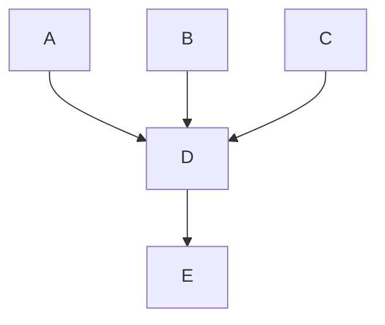

# Engineering

## Meetings

### In this section

- [Goals](#goals)
- [Principles](#principles])
- [Eng Together](#eng-together)
- [Release Retro](#release-retro)
- [Group Weeklies](#group-weeklies)
- [Standup](#standup)
- [Product and Eng Weekly](#product-and-eng-weekly)

### Goals

- Stay in alignment across the whole organization.
- Build teams, not groups of people.
- Provide substantial time for engineers to work on "focused work."

### Principles

- Support the [Maker Schedule](http://www.paulgraham.com/makersschedule.html) by keeping meetings to a minimum.
- Each individual must have a weekly sync 1:1 meeting with their manager. This is key to making sure each individual has a voice within the organization.
- Each team should have a fixed weekly sync check-in. This helps reinforce team bonds and alignment.
- Favor async communication when possible. This is very important to make sure every stakeholder on a project can have a clear understanding of what’s happening or what was decided, without needing to attend every meeting (i.e., if a person is sick or on vacation or just life happened.)
- If an async conversation is not proving to be effective, never hesitate to hop on or schedule a call. Always document the decisions made in a ticket, document, or whatever makes sense for the conversation.

The following is the subset of proposed engineering meetings. Each group is free to treat these as a subset of the expected meetings and add any other meetings as they see fit.

### Eng Together

This is to promote cohesion across groups within the engineering team. Disseminate engineering-wide announcements. Held weekly for one hour.

#### Participants

This includes all of engineering.

#### Sample agenda

- Announcements
- “Show and tell”
  - Each engineer gets two minutes to explain (showing, if desired) what they are working on and why it’s important to the business and/or engineering team.
- Deeper dive
  - One or a few engineers go deeper on a topic relevant to all of engineering.
- Social
  - Structured and/or unstructured social activities

### Release Retro

Gather feedback from all participants in each release. Used to improve communication and processes. Held each release for 30 minutes.

This meeting will likely need to be split in the future as the number of attendees increases.

#### Participants

This would include members of each group (+ quality).

#### Sample agenda

For each attendee:

- What went well this release cycle?
- What could have gone better this release cycle?
- What should we remember next time?

### Group Weeklies

A chance for deeper, synchronous discussion on topics relevant to that group. Held weekly for 30 minutes - one hour.

e.g., “Interface Weekly” - “Platform Weekly” - “Agent Weekly”

In some groups, this may be split into smaller discussions related to the different focuses of members within the group.

#### Participants

This would include members of each group.

#### Sample agenda (Platform)

- Announcements
- Anything at risk for the release?
- Bug assignment
- Retries in the datastore
- Platform scale GOTCHAS doc
- MarshalJSON to hide passwords and API tokens. Thoughts?

#### Sample Agenda (Interface)

- What’s good?
- Anything at risk for the release?
- Bug assignment
- Confirm response payload matches spec
- Discuss completion of Redux removal

### Standup

(Optional, varies by group) This is to provide status reports, discover blockers, and keep the group in sync.

If desired, each group can implement daily (or some other cadence) standups. Ultimately, it’s up to the Engineering Manager to make sure that the team is communicating appropriately to deliver results.

#### Participants

This would include any members of the group.

### Engineering Leadership Weekly (Weekly ~ one hour)

Engineering leaders discuss topics of importance that week.

#### Participants

This would include the CTO + Engineering managers.

#### Sample agenda

- Fullstack engineer hiring
- Engineering process discussion
- Review Q2 OKRs

## Release process

This section outlines the release process at Fleet.

The current release cadence is once every three weeks and is concentrated around Wednesdays.

### Release freeze period

In order to make sure quality releases, Fleet has a freeze period for testing prior to each release. Effective at the start of the freeze period, new feature work will not be merged.

Release blocking bugs are exempt from the freeze period and are defined by the same rules as patch releases, which include:

1. Regressions
2. Security concerns
3. Issues with features targeted for current release

Non-release blocking bugs may include known issues that were not targeted for the current release, or newly documented behaviors that reproduce in older stable versions. These may be addressed during a release period by mutual agreement between the [Product](https://fleetdm.com/handbook/product) and Engineering teams.

### Release day

Documentation on completing the release process can be found
[here](https://fleetdm.com/docs/contributing/releasing-fleet).

## Deploying to dogfood

After each Fleet release, the new release is deployed to Fleet's dogfood (internal) instance.

How to deploy a new release to dogfood:

1. Head to the **Tags** page on the fleetdm/fleet Docker Hub: https://hub.docker.com/r/fleetdm/fleet/tags
2. In the **Filter tags** search bar, type in the latest release (ex. v4.19.0).
3. Locate the tag for the new release and copy the image name. An example image name is "fleetdm/fleet:v4.19.0".
4. Head to the "Deploy Dogfood Environment" action on GitHub: https://github.com/fleetdm/fleet/actions/workflows/dogfood-deploy.yml
5. Select **Run workflow** and paste the image name in the **The image tag wished to be deployed.** field.
6. Select **Run workflow**. **dogfood_mdm** should be selected under the **Use workflow from** field.

> Note that this action will not handle down migrations. Always deploy a newer version than is currently deployed.
> 
> Note that "fleetdm/fleet:main" is not a image name, instead use the commit hash in place of "main".

## Oncall rotation

### In this section

- [The rotation](#the-rotation)
- [Responsibilities](#responsibilities)
- [Clearing the plate](#clearing-the-plate)
- [How to reach the oncall engineer](#how-to-reach-the-oncall-engineer)
- [Handoff](#handoff)

### The rotation

See [the internal Google Doc](https://docs.google.com/document/d/1FNQdu23wc1S9Yo6x5k04uxT2RwT77CIMzLLeEI2U7JA/edit#) for the engineers in the rotation.

Fleet team members can can also subscribe to the [shared calendar](https://calendar.google.com/calendar/u/0?cid=Y181MzVkYThiNzMxMGQwN2QzOWEwMzU0MWRkYzc5ZmVhYjk4MmU0NzQ1ZTFjNzkzNmIwMTAxOTllOWRmOTUxZWJhQGdyb3VwLmNhbGVuZGFyLmdvb2dsZS5jb20) for calendar events.

### Responsibilities

#### 1. Second-line response

The oncall engineer is a second-line responder to questions raised by customers and community members.

The community contact (Kathy) is responsible for the first response to GitHub issues, pull requests, and Slack messages in the [#fleet channel](https://osquery.slack.com/archives/C01DXJL16D8) of osquery Slack, and other public Slacks. Kathy is also responsible for the first response to messages in private customer Slack channels.

We respond within 1-hour (during business hours) for interactions and ask the oncall engineer to address any questions sent their way promptly. When Kathy is unavailable, the oncall engineer may sometimes be asked to take over the first response duties.

#### 2. PR reviews

Pull requests may be routed through the oncall engineer for review.

For PRs from the community, the community contact ([Kathy](https://github.com/ksatter)) will request review from the oncall. For all PRs to the Fleet documentation, the content editor ([Chris McGillicuddy](https://github.com/chris-mcgillicuddy)) will either merge (for typo fixes, when only documentation files are changed) or request a review from the current oncall (for changes to code samples, or to the meaning of the text).

In either case, if the oncall engineer has the knowledge and confidence to review, they should go ahead and do so. Otherwise, they should request a review from an engineer with the appropriate domain knowledge. It is the oncall engineer's responsibility to confirm that these PRs are moved forward (either by review with feedback or merge).

#### 3. Customer success meetings

The oncall engineer is asked to attend all the customer success meetings during the week.

The engineer will receive calendar invitations for the appropriate meetings. This has a dual purpose of providing more context for how our customers use Fleet. Also, the engineer should actively participate and provide input where appropriate (if not sure, please ask your manager or organizer of the call).

#### 4. Improve documentation

The oncall engineer is asked to read, understand, test, correct, and improve at least one doc page per week. Our goal is to 1, ensure accuracy and verify that our deployment guides and tutorials are up to date and work as expected. And 2, improve the readability, consistency, and simplicity of our documentation – with empathy towards first-time users. See [Writing documentation](https://fleetdm.com/handbook/marketing#writing-documentation) for writing guidelines, and don't hesitate to reach out to [#g-digital-experience](https://fleetdm.slack.com/archives/C01GQUZ91TN) on Slack for writing support. A backlog of documentation improvement needs is kept [here](https://github.com/orgs/fleetdm/projects/40/views/10).

### Clearing the plate

Engineering managers are asked to be aware of the [oncall rotation](https://docs.google.com/document/d/1FNQdu23wc1S9Yo6x5k04uxT2RwT77CIMzLLeEI2U7JA/edit#) and schedule a light workload for engineers while they are oncall. While it varies week to week considerably, the oncall responsibilities can sometimes take up a substantial portion of the engineer's time.

The remaining time after fulfilling the responsibilities of oncall is free for the engineer to choose their own path. Please choose something relevant to your work or Fleet's goals to focus on. If unsure, feel free to speak with your manager.

Some ideas:

* Do training/learning relevant to your work.
* Improve the Fleet developer experience.
* Hack on a product idea. Note: Experiments are encouraged, but not all experiments will ship! Check in with the product team before shipping user-visible changes.
* Create a blog post (or other content) for fleetdm.com.
* Try out an experimental refactor.

At the end of your oncall shift, you will be asked to share about how you spent your time.

### How to reach the oncall engineer

Oncall engineers do not need to actively monitor Slack channels, except when called in by the Community or Customer teams. Members of those teams are instructed to `@oncall` in `#help-engineering` to get the attention of the oncall engineer to continue discussing any issues that come up. In some cases, the Community or Customer representative will continue to communicate with the requestor. In others, the oncall engineer will communicate directly (team members should use their judgment and discuss on a case-by-case basis how to best communicate with community members and customers).

### Handoff

The oncall engineer changes each week on Wednesday.

A Slack reminder should notify the oncall of the handoff. Please do the following:

1. The new oncall engineer should change the `@oncall` alias in Slack to point to them. In the
   search box, type "people" and select "People & user groups." Switch to the "User groups" tab.
   Click `@oncall`. In the right sidebar, click "Edit Members." Remove the former oncall, and add
   yourself.

2. Hand off newer conversations (Slack threads, issues, PRs, etc.). For more recent threads, the former oncall can unsubscribe from the
   thread, and the new oncall should subscribe. The former oncall should explicitly share each of
   these threads and the new oncall can select "Get notified about new replies" in the "..." menu.
   The former oncall can select "Turn off notifications for replies" in that same menu. It can be
   helpful for the former oncall to remain available for any conversations they were deeply involved
   in, so use your judgment on which threads to hand off. Anything not clearly handed off remains the responsibility of the former oncall engineer.

At the weekly "Eng Together" meeting, the oncall is asked to make a report of how they spent their time. Please answer the following:

1. What were the most common support requests over the week? This can potentially give the new oncall an idea of which documentation to focus their efforts on.

2. Which documentation page did you focus on? What changes were necessary?

3. How did you spend the rest of your oncall week? This is a chance to demo or share what you learned.

## Incident postmortems

At Fleet, we take customer incidents very seriously. After working with customers to resolve issues, we will conduct an internal postmortem to determine any documentation or coding changes to prevent similar incidents from happening in the future. Why? We strive to make Fleet the best osquery management platform globally, and we sincerely believe that starts with sharing lessons learned with the community to become stronger together.

At Fleet, we do postmortem meetings for every production incident, whether it's a customer's environment or on fleetdm.com.

## Outages

At Fleet, we consider an outage to be a situation where new features or previously stable features are broken or unusable.

- Occurences of outages are tracked in the [Outages](https://docs.google.com/spreadsheets/d/1a8rUk0pGlCPpPHAV60kCEUBLvavHHXbk_L3BI0ybME4/edit#gid=0) spreadsheet.
- Fleet encourages embracing the inevitability of mistakes and discourages blame games.
- Fleet stresses the critical importance of avoiding outages because they make customers' lives worse instead of better.

## Project boards

[🚀 Release](https://github.com/orgs/fleetdm/projects/40) - The current release (daily go-to board) for engineers.

[⚗️ Roadmap](https://github.com/orgs/fleetdm/projects/41) - Planning for the next release (shared with the Product team).

## Scaling GOTCHAS

### Overall

Nowadays, Fleet, as a Go server, scales horizontally very well. It’s not very CPU or memory intensive. In terms of load in infrastructure, from highest to lowest are: MySQL, Redis, and Fleet.

In general, we should burn a bit of CPU or memory on the Fleet side if it allows us to reduce the load on MySQL or Redis.

In many, caching helps, but given that we are not doing load balancing based on host id (i.e., make sure that the same host ends up in the same Fleet server). This goes only so far. Caching host-specific data is not done because round-robin LB means all Fleet instances end up circling the total list of hosts.

### How to prevent most of this

The best way we’ve got so far to prevent any scaling issues is to load test things. **Every new feature must have its corresponding osquery-perf implementation as part of the PR, and it should be tested at a reasonable scale for the feature**.

Besides that, you should consider the answer(s) to the following question: how can I know that the feature I’m working on is working and performing well enough? Add any logs, metrics, or anything that will help us debug and understand what’s happening when things unavoidably go wrong or take longer than anticipated.

**HOWEVER** (and forgive this Captain Obvious comment): do NOT optimize before you KNOW you have to. Don’t hesitate to take an extra day on your feature/bug work to load test things properly.

## What have we learned so far?

This is a document that evolves and will likely always be incomplete. If you feel like something is missing, either add it or bring it up in any way you consider.

## Connecting to Dogfood MySQL & Redis

### Prerequisites

1. Setup [VPN](https://github.com/fleetdm/confidential/blob/main/vpn/README.md)
2. Configure [SSO](https://github.com/fleetdm/fleet-infra/tree/master/sso#how-to-use-sso)

### Connecting

#### MySQL

Get the database host:
```shell
DB_HOST=$(aws rds describe-db-clusters --filter Name=db-cluster-id,Values=fleetdm-mysql-iam --query "DBClusters[0].Endpoint" --output=text)
```

Get the database user:
```shell
DB_USER=$(aws rds describe-db-clusters --filter Name=db-cluster-id,Values=fleetdm-mysql-iam --query "DBClusters[0].MasterUsername" --output=text)
```

Get the database password:
```shell
DB_PASSWORD=$(aws secretsmanager get-secret-value --secret-id /fleet/database/password/master --query "SecretString" --output=text)
```

Connect:
```shell
mysql -h"${DB_HOST}" -u"${DB_USER}" -p"${DB_PASSWORD}"
```

#### Redis

Get the Redis Host:
```shell
REDIS_HOST=$(aws elasticache describe-replication-groups --replication-group-id fleetdm-redis --query "ReplicationGroups[0].NodeGroups[0].PrimaryEndpoint.Address" --output=text)
```

Connect:
```shell
redis-cli -h "${REDIS_HOST}"
```


## Foreign keys and locking

Among the first things you learn in database data modeling is: that if one table references a row in another, that reference should be a foreign key. This provides a lot of assurances and makes coding basic things much simpler.

However, this database feature doesn’t come without a cost. The one to focus on here is locking, and here’s a great summary of the issue: https://www.percona.com/blog/2006/12/12/innodb-locking-and-foreign-keys/

The TLDR is: understand very well how a table will be used. If we do bulk inserts/updates, InnoDB might lock more than you anticipate and cause issues. This is not an argument to not do bulk inserts/updates, but to be very careful when you add a foreign key.

In particular, host_id is a foreign key we’ve been skipping in all the new additional host data tables, which is not something that comes for free, as with that, [we have to keep the data consistent by hand with cleanups](https://github.com/fleetdm/fleet/blob/main/server/datastore/mysql/hosts.go#L309-L309).

### In this section

- [Insert on duplicate update](#insert-on-duplicate-update)
- [Host extra data and JOINs](#host-extra-data-and-joi-ns)
- [What DB tables matter more when thinking about performance?](#what-db-tables-matter-more-when-thinking-about-performance)
- [Expose more host data in the host listing](#expose-more-host-data-in-the-host-listing)
- [Understand main use-cases for queries](#understand-main-use-cases-for-queries)
- [On constantly changing data](#on-constantly-changing-data)
- [Counts and aggregated data](#counts-and-aggregated-data)
- [Caching data such as app config](#caching-data-such-as-app-config)
- [Redis SCAN](#redis-scan)

### Insert on duplicate update

It’s very important to understand how a table will be used. If rows are inserted once and then updated many times, an easy reflex is to do an `INSERT … ON DUPLICATE KEY UPDATE`. While technically correct, it will be more performant to try to do an update, and if it fails because there are no rows, then do an insert for the row. This means that it’ll fail once, and then it’ll update without issues, while on the `INSERT … ON DUPLICATE KEY UPDATE`, it will try to insert, and 99% of the time, it will go into the `ON DUPLICATE KEY UPDATE`.

This approach has a caveat. It introduces a race condition between the `UPDATE` and the `INSERT` where another `INSERT` might happen in between the two, making the second `INSERT` fail. With the right constraints (and depending on the details of the problem), this is not a big problem. Alternatively, the `INSERT` could be one with an `ON DUPLICATE KEY UPDATE` at the end to recover from this scenario.

This is subtle, but an insert will update indexes, check constraints, etc. At the same time, an update might sometimes not do any of that, depending on what is being updated.

While not a performance GOTCHA, if you do use `INSERT … ON DUPLICATE KEY UPDATE`, beware that LastInsertId will return non-zero only if the INSERT portion happens. [If an update happens, the LastInsertId will be 0](https://github.com/fleetdm/fleet/blob/1aff4a4231ccff4d80889b46b57ed12c5ba1ae14/server/datastore/mysql/mysql.go#L925-L953).

### Host extra data and JOINs

Indexes are great. But like most good things, the trick is in the dosage. Too many indexes can be a performance killer on inserts/updates. Not enough, and it kills the performance of selects.

Data calculated on the fly cannot be indexed unless it’s precalculated (see counts section below for more information).

Host data is among the data that changes and grows the most in terms of what we store. It used to be that we used to add more columns in the host table for the extra data in some cases.

Nowadays, we don’t update the host table structure unless we really, really, REALLY need to. Instead, we create adjacent tables that reference a host by id (without an FK). These tables can then be JOINed with the host table whenever needed.

This approach works well for most cases, and for now, it should be the default when gathering more data from hosts in Fleet. However, it’s not a perfect approach as it has its limits.

JOINing too many tables, sorting based on the JOINed table, etc., can have a big performance impact on selects.

Sometimes one strategy that works is selecting and filtering the adjacent table with the right indexes; then, JOIN the host table to that. This works when only filtering/sorting by one adjacent table and pagination can be tricky.

Solutions can become a curse too. Be mindful of when we might cross that threshold between good and bad performance.

### What DB tables matter more when thinking about performance?

While we need to be careful about handling everything in the database, not every table is the same. The host and host\_\* tables are the main cases where we have to be careful when using them in any way.

However, beware of tables that go through async aggregation processes (such as scheduled_query and scheduled_query_stats) or those that are read often as part of the osquery distributed/read and config endpoints.

### Expose more host data in the host listing

Particularly with extra host data (think MDM, Munki, Chrome profiles, etc.), another GOTCHA is that some users have built scripts that go through all hosts by using our list host endpoint. This means that any extra data we add might cause this process to be too slow or timeout (this has happened in the past).

Beware of this, and consider gating the extra data behind a query parameter to allow for a performant backward compatible API that can expose all the data needed in other use cases.

Calculated data is also tricky in the host listing API at scale, as those calculations have to happen for each host row. This can be extra problematic if the sort happens on the calculated data, as all data has to be calculated across all hosts before being able to sort and limit the results (more on this below).

### Understand main use-cases for queries

Be aware of the use cases for an API. For example, take the software listing endpoint. This endpoint lists software alongside the number of hosts with that item installed. It was designed to be performant in a limited use case: list the first eight software items, then count hosts for those software ids.

The problem came later when we learned that we missed an important detail: the UI wanted to sort by amount of host count so that the most popular software appeared on top of this.

This resulted in basically a full host_software table scan per each software row to calculate the count per software. Then, sort and limit. The API worked in the simple case, but it timed out for most customers in the real world.

### On constantly changing data

It can be difficult to show real-time presence data. For Fleet, that is the host `seen_time` -- the time a host last connected to the server -- which is used to determine whether a host is online.

Host seen_time is updated with basically every check-in from any kind of host. Hosts check in every 10 seconds by default. Given that it’s a timestamp reflecting the last time a host contacted Fleet for anything, it’s always different.

While we are doing a few things to make this better, this is still a big performance pain point we have. In particular, we are updating it in bulk. It used to be a column of the hosts' table, which caused a lot of locking. Now it’s an adjacent table without FK.

Luckily, we don’t have anything else (at least up to the moment of this writing) that changes as often as seen_time. However, other features such as software last used can cause similar issues.

### Counts and aggregated data

UX is key for any software. APIs that take longer than 500ms to respond can cause UX issues. Counting things in the database is a tricky thing to do.

In the ideal case, the count query will be covered by an index and be extremely fast. In the worst case, the query will be counting filtering on calculated data, which results in a full (multi) table scan on big tables.

An approach we've taken to addressing this is pre-calculating aggregations and counts that take a long time to generate. By generating these results beforehand and storing them, we can return results by reading a single row from a table when the information is needed.

This approach has a handful of issues:

- The accuracy of the data is worse. We will never get truly accurate counts (the “real-time” count the API returns could change 1ms after we get the value).
- Depending on how many ways we want to count things, we will have to calculate and store them.
- Communicating to the user the interval at which things update can sometimes be tricky.

All of this said, Fleet and osquery work in an “update at an interval” fashion, so we have exactly one pattern to communicate to the user, and then they can understand how most things work in the system.

### Caching data such as app config

Caching is a usual strategy to solve some performance issues in the case of Fleet level data, such as app config (of which we will only have one), is easy, and we cache at the Fleet server instance level, refreshing the value every one second. App config gets queried with virtually every request, and with this, we reduce drastically how many times the database is hit with that query. The side effect is that a configuration would take one second to be updated in each Fleet instance, which is a price we are willing to pay.

Caching host-level data is a different matter, though. Given that Fleet is usually deployed in infrastructure where the load balancer distributes the load in a round-robin-like fashion (or maybe other algorithms, but nothing aware of anything within Fleet itself). Then virtually all hosts end up being seen by all Fleet instances, so caching host-level data (in the worst case) results in having a copy of all the hosts in each Fleet instance and refreshing that at an interval.

Caching at the Fleet instance level is a great strategy if it can reasonably handle big deployments, as Fleet utilizes minimal RAM.

Another place to cache things would be Redis. The improvement here is that all instances will see the same cache. However, Redis can also be a performance bottleneck depending on how it’s used.

### Redis SCAN

Redis has solved many scaling problems in general, but it’s not devoid of scaling problems of its own. In particular, we learned that the SCAN command scans the whole key space before it does the filtering. This can be very slow, depending on the state of the system. If Redis is slow, a lot suffers from it.

## Fleet docs

Fleet documentation explains how to use, deploy, and contribute to Fleet as simply as possible. This goes a long way in driving adoption while building our community of fans.

### In this section

- [How to request a review for Markdown changes to the docs](#how-to-request-a-review-for-markdown-changes-to-the-docs)
- [Markdown](#markdown)
- [Adding links](#adding-links)
- [Linking to a location on GitHub](#linking-to-a-location-on-github)
- [How to fix a broken link](#how-to-fix-a-broken-link)
- [Page order](#page-order)
- [Adding an image](#adding-an-image)
- [Adding a mermaid diagram](#adding-a-mermaid-diagram)

### How to request a review for Markdown changes to the docs

When creating a pull request for Markdown changes in the docs, request a review from Chris McGillicuddy, who will do an editor pass, and then hand over the review to the [oncall engineer](https://fleetdm.com/handbook/engineering#oncall-rotation) if necessary.

### Markdown

Fleet's documentation and handbook are written in [Markdown](https://about.gitlab.com/handbook/markdown-guide/). Using Markdown lets us keep our documentation consistently formatted and viewable directly from the Fleet GitHub repo. The Markdown files in the `/docs` and `/handbook` folders are converted to HTML for the Fleet website.

When making changes to the Fleet docs or handbook, there are a few differences in how the Markdown will render on GitHub and the Fleet website.

#### Linebreaks and newlines

Any time you need to add a line break in Markdown, you should add a new line. It is vital to make sure paragraphs are separated by new lines. Otherwise, they will render as the same HTML element.

For example, if you were adding this section to the docs:

```
line one
line two
```

The Markdown would render on the Fleet website as

line one
line two

To make sure formatting is consistent across GitHub and the Fleet website, you need to add a new line anywhere you want a line break. For example, if we separate the lines with a new line:

```
line one

line two
```

The Markdown will render correctly as

line one

line two

#### Ordered lists

Content nested within an ordered list needs to be indented. If the list is not formatted correctly, the number will reset on each list item.

For example, this list:

```
1. Item one

Paragraph about item one

2. Item two
```

On the Fleet website, this ordered list would be rendered as

1. Item one

Paragraph about item one

2. Item two

To make sure that ordered lists increment on the Fleet website, you can indent the content nested within the list. For example, the same ordered list with indentation:

```
1. Item one

   Paragraph about item one

2. Item two
```

This ordered list will render correctly as

1. Item one

   Paragraph about item one

2. Item two

### Adding links

You can link documentation pages to each other using relative paths. For example, in `docs/Using-Fleet/Fleet-UI.md`, you can link to `docs/Using-Fleet/Permissions.md` by writing `[permissions](./Permissions.md)`. This will automatically be transformed into the appropriate URL for `fleetdm.com/docs`.

However, the `fleetdm.com/docs` compilation process does not account for relative links to directories **outside** of `/docs`.
This is why it’s essential to follow the file path exactly when adding a link to Fleet docs.
When directly linking to a specific section, always format the spaces within a section name to use a hyphen instead of an underscore. For example, when linking to the `osquery_result_log_plugin` section of the configuration reference docs, use a relative link like the following: `./Configuration.md#osquery-result-log-plugin`.

### Linking to a location on GitHub

When adding a link to a location on GitHub outside of `/docs`, be sure to use the canonical form of the URL.

Navigate to the file's location on GitHub, and press "y" to transform the URL into its canonical form.

### How to fix a broken link

For instances when a broken link is discovered on fleetdm.com, always check if the link is a relative link to a directory outside of `/docs`.

An example of a link that lives outside of `/docs` is:

```
../../tools/app/prometheus
```

If the link lives outside `/docs`, head to the file's location on GitHub (in this case, [https://github.com/fleetdm/fleet/blob/main/tools/app/prometheus.yml)](https://github.com/fleetdm/fleet/blob/main/tools/app/prometheus.yml)), and press "y" to transform the URL into its canonical form (a version of the link that will always point to the same version of the file) ([https://github.com/fleetdm/fleet/blob/194ad5963b0d55bdf976aa93f3de6cabd590c97a/tools/app/prometheus.yml](https://github.com/fleetdm/fleet/blob/194ad5963b0d55bdf976aa93f3de6cabd590c97a/tools/app/prometheus.yml)). Replace the relative link with this link in the Markdown file.

> Note that the instructions above also apply to adding links in the Fleet handbook.

### Page order

The order we display documentation pages on fleetdm.com is determined by `pageOrderInSection` meta tags. These pages are sorted in their respective sections in **ascending** order by the `pageOrderInSection` value. Every Markdown file (except readme and faq pages) in the `docs/` folder must have a meta tag with a positive 'pageOrderInSection' value.

We leave large gaps between values to make future changes easier. For example, the first page in the "Using Fleet" section of the docs has a `pageOrderInSection` value of 100, and the next page has a value of 200. The significant difference between values allows us to add, remove and reorder pages without changing the value of multiple pages at a time.

When adding or reordering a page, try to leave as much room between values as possible. If you were adding a new page that would go between the two pages from the example above, you would add `<meta name="pageOrderInSection" value="150">` to the page.

### Adding an image

Try to keep images in the docs at a minimum. Images can be a quick way to help users understand a concept or direct them towards a specific user interface(UI) element. Still, too many can make the documentation feel cluttered and more difficult to maintain.

When adding images to the Fleet documentation, follow these guidelines:

- UI screenshots should be a 4:3 aspect ratio (1280x960). This is an optimal size for the container width of the docs and ensures that content in screenshots is as clear as possible to view in the docs (and especially on mobile devices).
- You can set up a custom preset in the Google Chrome device toolbar (in Developer Tools) to quickly adjust your browser to the correct size for taking a screenshot.
- Keep the images as simple as possible to maintain. Screenshots can get out of date quickly as UIs change.
- Exclude unnecessary images. Images should be used to help emphasize information in the docs, not replace it.
- Minimize images per doc page. For doc maintainers and users, more than one or two per page can get overwhelming.
- The goal is for the docs to look good on every form factor, from 320px window width all the way up to infinity. Full window screenshots and images with too much padding on the sides will be less than the width of the user's screen. When adding a large image, make sure it is easily readable at all widths.

Images can be added to the docs using the Markdown image link format, e.g., ``
The images used in the docs live in `docs/images/`. Note that you must provide the URL of the image in the Fleet GitHub repo for it to display properly on both GitHub and the Fleet website.

> Note that the instructions above also apply to adding images in the Fleet handbook.

### Adding a mermaid diagram

The Fleet Docs support diagrams that are written in mermaid.js syntax. Take a look at the [Mermaid docs](https://mermaid-js.github.io/mermaid/#/README) to learn about the syntax language and what types of diagrams you can display.

To add a mermaid diagram to the docs, you need to add a code block and specify that it is written in the mermaid language by adding `mermaid` to the opening backticks (i.e., ` ```mermaid`).

For example, the following code block is a mermaid diagram that has **not** been specified as a mermaid code block:

```
graph TD;
    A-->D
    B-->D
    C-->D
    D-->E
```

Once we specify the `mermaid` as the language in the code block, it will render as a mermaid diagram on fleetdm.com and GitHub.



If the mermaid syntax is incorrect, the diagram will be replaced with an image displaying an error, as shown in the following example where the code block was written with **intentional** syntax errors:

```mermaid
graph TD;
    A--D
```

## Quality

### Human-oriented QA

Fleet uses a human-oriented quality assurance (QA) process to make sure the product meets the standards of users and organizations.

Automated tests are important, but they can't catch everything. Many issues are hard to notice until a human looks empathetically at the user experience, whether in the user interface, the REST API, or the command line.

The goal of quality assurance is to identify corrections and improvements before release:
- Bugs
- Edge cases
- Error message UX
- Developer experience using the API/CLI
- Operator experience looking at logs
- API response time latency
- UI comprehensibility
- Simplicity
- Data accuracy
- Perceived data freshness

### Finding bugs

To try Fleet locally for QA purposes, run `fleetctl preview`, which defaults to running the latest stable release.

To target a different version of Fleet, use the `--tag` flag to target any tag in [Docker Hub](https://hub.docker.com/r/fleetdm/fleet/tags?page=1&ordering=last_updated), including any git commit hash or branch name. For example, to QA the latest code on the `main` branch of fleetdm/fleet, you can run: `fleetctl preview --tag=main`.

To start a preview without starting the simulated hosts, use the `--no-hosts` flag (e.g., `fleetctl preview --no-hosts`).

For each bug found, please use the [bug report template](https://github.com/fleetdm/fleet/issues/new?assignees=&labels=bug%2C%3Areproduce&template=bug-report.md&title=) to create a new bug.

### Bug process

#### Bug States
The lifecycle stages of a bug at Fleet are: 
1. Inbox 
2. Acknowledged 
3. Reproduced 
4. In engineering process
5. Awaiting QA

The above are all the possible states for a bug as envisioned in this process. These states each correspond to a set of GitHub labels, assignees, and board memberships. 

See [Bug states and filters](#bug-states-and-filters) at the end of this document for descriptions of these states and links to each GitHub filter.

#### Inbox
When a new bug is created using the [bug report form](https://github.com/fleetdm/fleet/issues/new?assignees=&labels=bug%2C%3Areproduce&template=bug-report.md&title=), it is in the "inbox" state. 
At this state, the [bug review DRI](#rituals) (QA) is responsible for going through the inbox and asking for more reproduction details from the reporter, asking the product team for more guidance, or acknowledging the bugs.

> Some bugs may also be the domain of the digital-experience team. If QA believes this is the case, then QA should put the bug onto the g-digital-experience board and assign it to the g-digital-experience DRI. The digital experience team has their own bug process, which is not governed by this process.

#### Weekly bug review
QA has weekly check-in with product to go over the inbox items. QA is responsible for proposing “not a bug”, closing due to lack of response (with a nice message), or raising other relevant questions. All requires product agreement

Requesters have six weeks to provide follow-up information for each request. We'll ping them again as a reminder at three weeks. After six weeks, we'll close the bug to remove it from our visibility, but requesters are welcome to re-open and provide context.

QA may also propose that a reported bug is not actually a bug. A bug is defined as “behavior that is not according to spec or implied by spec.” If agreed that it is not a bug, then it's assigned to the relevant product manager to determine its priority.

#### Acknowledging bugs
If the inbox item is a bug, QA should apply the acknowledged state to the bug. QA has one week to reproduce the bug.

Once reproduced, QA should document the reproduction steps and move it to the reproduced state.

#### Reproduced
When reproduced, the assigned engineering manager (EM) is responsible for investigating the root cause of the bug and proposing solutions to their product counterpart if it requires discussion. Otherwise, the EM includes it in this release (if there's space) or the next release.

#### After reproduced
After it's in a release formally, the bug should be treated like any other piece of work per the standard engineering process.

#### Fast track for Fleeties
Fleeties do not have to wait for QA to reproduce the bug. If you're confident it's reproducible, it's a bug, and the reproduction steps are well-documented, it can be moved directly to the reproduced state.

#### Release testing
When a release is in testing, QA should use the the Slack channel #help-release-bugs to keep everyone aware of issues found. All bugs found should be reported in the channel after creating the bug first.

In the #help-release-bugs channel, product may decide whether the bug is a release blocker. When a release-blocking bug is found, product is responsible for communicating the delay to company stakeholders. 

Release blockers include:
1. Critical bugs (defined below)
2. New functionality that impacts previous stable functionality
3. Incomplete features as defined or implied in the specs

Release blockers must be fixed before a release can be cut. Non-release-blocking bugs may be addressed during a subsequent release per the standard bug process (defined above).

#### Critical bugs
A critical bug is defined as behavior that: 
* Blocks the normal use a workflow
* Prevents upgrades to Fleet
* Causes irreversible damage, such as data loss
* Introduces a security vulnerability

We need to inform customers and the community about critical bugs immediately so they don’t trigger it themselves. When a bug meeting the definition of critical is found, the bug finder is responsible for raising an alarm.
Raising an alarm means pinging @here in the #help-product channel with the filed bug.

If the bug finder is not a Fleetie (e.g., a member of the community), then whoever sees the critical bug should raise the alarm. (We would expect this to be customer experience in the community Slack or QA in the bug inbox, though it could be anyone.)
Note that the bug finder here is NOT necessarily the **first** person who sees the bug. If you come across a bug you think is critical, but it has not been escalated, raise the alarm!

Once raised, product confirms whether or not it's critical and defines expected behavior.
When outside of working hours for the product team or if no one from product responds within 1 hour, then fall back to the #help-p1.

Once the critical bug is confirmed, customer experience needs to ping both customers and the community to warn them. If CX is not available, the oncall engineer is responsible for doing this.
If a quick fix workaround exists, that should be communicated as well for those who are already upgraded.

When a critical bug is identified, we will then follow the patch release process in [our documentation](https://fleetdm.com/docs/contributing/releasing-fleet#patch-releases).

#### Measurement
We will track the success of this process by observing the throughput of issues through the system and identifying where buildups (and therefore bottlenecks) are occurring. 
The metrics are: 
* Number of bugs opened this week
* total # bugs open 
* bugs in each state (inbox, acknowledged, reproduced) 
* Number of bugs closed this week

Each week these are tracked and shared in the weekly update by Charlie Chance.

#### Orphans
Occasionally, bugs may get lost if, for example, a label is misapplied. Miscategorized issues may slip through the filters and languish in a grey zone. The “orphan” and “reproduced orphan” states exist to catch these issues. 
Every week, the head of product is responsible for reviewing these two states to identify any that are not properly categorized in the process.

### Bug states and filters

#### Inbox
The bug has just come in. 

If using the standard bug report, the bug is labeled “bug” and “reproduce." It is not assigned to anyone and is not on a board. [See on GitHub](https://github.com/fleetdm/fleet/issues?q=archived%3Afalse+org%3Afleetdm+is%3Aissue+is%3Aopen+label%3Abug+label%3A%3Areproduce+-project%3Afleetdm%2F37+-project%3Afleetdm%2F40+sort%3Aupdated-asc).

#### Acknowledged 
QA has gone through the inbox and has accepted it as a bug to be reproduced. 

QA assigns themselves and adds it to the Release board under “awaiting QA.” [See on GitHub](https://github.com/fleetdm/fleet/issues?q=archived%3Afalse+org%3Afleetdm+is%3Aissue+is%3Aopen+label%3Abug+label%3A%3Areproduce+-project%3Afleetdm%2F37+sort%3Aupdated-asc).

#### Reproduced
QA has reproduced the issue successfully. It should now be transferred to engineering. 

Remove the “reproduce” label, add the label of the relevant team (#agent, #platform, #interface), and assign it to the relevant engineering manager. (Make your best guess as to which team. The EM will re-assign if they think it belongs to another team.) Move it to “Ready” in the Release board. [See on GitHub](https://github.com/fleetdm/fleet/issues?q=archived%3Afalse+org%3Afleetdm+is%3Aissue+is%3Aopen+label%3Abug+-label%3A%3Areproduce+-project%3Afleetdm%2F37+project%3Afleetdm%2F40+-assignee%3Axpkoala+sort%3Aupdated-asc).

#### Orphans 
These are bugs that do not have the reproduce label and do not exist on the release board. This filter serves as a sanity check. There should be no bugs in this state because they are likely to be forgotten by our process. [See on GitHub](https://github.com/fleetdm/fleet/issues?q=archived%3Afalse+org%3Afleetdm+is%3Aissue+is%3Aopen+sort%3Aupdated-asc+label%3Abug+-label%3A%3Areproduce+-project%3Afleetdm%2F37+-project%3Afleetdm%2F40+).

#### Reproduced orphans 
These are bugs that do not have the reproduce label and do exist on the release board, but do not have one of the three teams tagged. There should be no bugs in this state. This will risk being forgotten by the process because it does not appear in any of the standard team-based filters, which means it risks never being seen by engineering. [See on GitHub](https://github.com/fleetdm/fleet/issues?q=archived%3Afalse+org%3Afleetdm+is%3Aissue+is%3Aopen+sort%3Aupdated-asc+label%3Abug+-label%3A%3Areproduce+-project%3Afleetdm%2F37+project%3Afleetdm%2F40+-assignee%3Axpkoala+-label%3A%23interface+-label%3A%23platform+-label%3A%23agent+).

#### All bugs
[See on GitHub](https://github.com/fleetdm/fleet/issues?q=is%3Aissue+is%3Aopen+label%3Abug).

#### Bugs opened this week
This filter returns all "bug" issues opened after the specified date. Simply replace the date with a YYYY-MM-DD equal to one week ago. [See on GitHub](https://github.com/fleetdm/fleet/issues?q=is%3Aissue+archived%3Afalse+label%3Abug+created%3A%3E%3DREPLACE_ME_YYYY-MM-DD).

#### Bugs closed this week
This filter returns all "bug" issues closed after the specified date. Simply replace the date with a YYYY-MM-DD equal to one week ago. [See on Github](https://github.com/fleetdm/fleet/issues?q=is%3Aissue+archived%3Afalse+is%3Aclosed+label%3Abug+closed%3A%3E%3DREPLACE_ME_YYYY-MM-DD).

### Definitions

In the above process, any reference to "product" refers to: Mo Zhu, Head of Product.
In the above process, any reference to "QA" refers to: Reed Haynes, QA Engineer.

## Rituals

The following rituals are engaged in by the directly responsible individual (DRI) and at the frequency specified for the ritual.

| Ritual                        | Frequency           | Description                                                                                                                            | DRI            |
| :---------------------------- | :------------------ | :------------------------------------------------------------------------------------------------------------------------------------- | -------------- |
| Pull request review           | Daily               | Engineers go through pull requests for which their review has been requested.                                                          | Zach Wasserman |
| Engineering group discussions | Weekly              | See "Group Weeklies".                                                                                                                  | Zach Wasserman |
| Oncall handoff               | Weekly              | Hand off the oncall engineering responsibilities to the next oncall engineer.                                                        | Zach Wasserman |
| Release ritual                | Every three weeks   | Go through the process of releasing the next iteration of Fleet.                                                                       | Zach Wasserman |
| Create patch release branch   | Every patch release | Go through the process of creating a patch release branch, cherry picking commits, and pushing the branch to github.com/fleetdm/fleet. | Luke Heath     |
| Bug review   | Weekly | Review bugs that are in QA's inbox. | Reed Haynes     |

## Fleet Sandbox Oncall

Oncall for Sandbox will happen in shifts of 1 week. The people involved in them will be:

First responders:

- Zachary Winnerman
- Robert Fairburn

Escalations (in order):

- Tomas Touceda
- Zach Wasserman

The first responder oncall will take ownership of the @sandbox-oncall alias in Slack for ease first thing Monday morning.

Expected response times: during business hours, 1 hour. Outside of business hours 4 hours.

If the issue is non user facing (provisioner/deprovisioner/temporary errors in osquery/etc), we'll proceed to address the issue. If the issue is user facing (as in, the user noticed this error first hand through the Fleet UI), then we'll proceed to identify the user and ping Mike McNeil in #help-p1 with information about the error (see below) so that he can contact them letting them know that we are aware of this issue and working on it.

We should collect both the email for the customer and information for the error. If the error happens in work hours, we should make a best effort to understand where in the app the error might have occurred. For this, the oncall engineer will post in `#help-engineering` the data they know of the issue and see if anybody in the frontend team can help identify what might be causing it. It’s more helpful to say “we saw that you saw an error while trying to create a query” than to say “your POST /api/blah failed”, but sometimes it’s not exactly clear where the API might be used exactly.

Escalation of issues will be done by hand for the moment.

All infrastructure alarms will go to #g-infrastructure.

The information needed to evaluate and potentially fix any issues is documented in the [runbook](https://github.com/fleetdm/fleet/blob/main/infrastructure/sandbox/readme.md).

There will not be updates on the Fleet version running in sandbox on Fridays unless there's a critical issue being fixed.

## Slack channels

The following [Slack channels are maintained](https://fleetdm.com/handbook/company#group-slack-channels) by this group:

| Slack channel        | [DRI](https://fleetdm.com/handbook/company#why-group-slack-channels) |
| :------------------- | :------------------------------------------------------------------- |
| `#help-engineering`  | Zach Wasserman                                                       |
| `#g-platform`        | Tomás Touceda                                                        |
| `#g-interface`       | Luke Heath                                                           |
| `#g-agent`           | Zach Wasserman                                                       |
| `#_pov-environments` | Ben Edwards                                                          |
| `#help-qa`           | Reed Haynes                                                          |
| `#help-release-bugs` | Reed Haynes                                                          |

<meta name="maintainedBy" value="zwass">
<meta name="title" value="🚀 Engineering">
