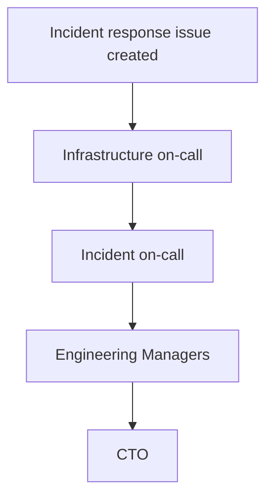

# Engineering

This handbook page details processes specific to working [with](#contact-us) and [within](#responsibilities) this department.

## Team

| Role                            | Contributor(s)           |
|:--------------------------------|:-----------------------------------------------------------------------------------------------------------|
| Chief Technology Officer (CTO)  | [Luke Heath](https://www.linkedin.com/in/lukeheath/) _([@lukeheath](https://github.com/lukeheath))_
| Engineering Manager (EM)        |  _See [🛩️ Product groups](https://fleetdm.com/handbook/company/product-groups#current-product-groups)_ 
| Tech Lead (TL)                  |  _See [🛩️ Product groups](https://fleetdm.com/handbook/company/product-groups#current-product-groups)_ 
| Quality Assurance Engineer (QA) |  _See [🛩️ Product groups](https://fleetdm.com/handbook/company/product-groups#current-product-groups)_ 
| Software Engineer (SWE)         |  _See [🛩️ Product groups](https://fleetdm.com/handbook/company/product-groups#current-product-groups)_ 

## Contact us

- To **make a request** of this department, [create an issue](https://fleetdm.com/handbook/company/product-groups#current-product-groups) and a team member will get back to you within one business day. (If urgent, mention a [team member](#team) in the [#help-engineering](https://fleetdm.slack.com/archives/C019WG4GH0A) Slack channel.)
  - Any Fleet team member can [view the kanban boards](https://fleetdm.com/handbook/company/product-groups#current-product-groups) for this department, including pending tasks and the status of new requests.
  - Please **use issue comments and GitHub mentions** to communicate follow-ups or answer questions related to your request.

## Responsibilities

The 🚀 Engineering department at Fleet is directly responsible for writing and maintaining the [code](https://github.com/fleetdm/fleet) for Fleet's core product and infrastructure.

### Write a feature guide 

We write [guides](https://fleetdm.com/guides) for all new features. Feature guides are published before the feature is released so that our users understand how the feature is intended to work. A guide is a type of article, so the process for writing a guide and article is the same.

1. Review and follow the [Fleet writing style guide](https://fleetdm.com/handbook/company/communications#writing).
2. Make a copy of a guide in the [/articles](https://github.com/fleetdm/fleet/tree/main/articles) directory and replace the content with your article. Make sure to maintain the same heading sizes and update the metadata tags at the bottom.
3. Open a new pull request containing your article into `main` and add the pull request to the milestone this feature will be shipped in. The pull request will automatically be assigned to the appropriate reviewer.

### Stories and bugs

#### Create an engineering-initiated story

Engineering-initiated stories are types of user stories created by engineers to make technical changes to Fleet. Technical changes should improve the user experience or contributor experience. For example, optimizing SQL that improves the response time of an API endpoint improves user experience by reducing latency. A script that generates common boilerplate, or automated tests to cover important business logic, improves the quality of life for contributors, making them happier and more productive, resulting in faster delivery of features to our customers.

It's important to frame engineering-initiated user stories the same way we frame all user stories. Stay focused on how this technical change will drive value for our users.

Engineering-initiated stories are for work that no customer or stakeholder has directly asked for but that makes Fleet better. If any of the following apply, the issue should go through normal product prioritization instead of being labeled `~engineering-initiated`:

- The work was motivated by a **customer report or request** (has a `customer-*` label).
- The issue is a **bug or defect** (has a `~released bug` or `bug` label).
- The issue is a **postmortem action item** (has a `~postmortem-action-item` label).

These categories compete for priority in the normal product pipeline so that product and customer stakeholders have full visibility into the work being done on their behalf.

**To file the story:**

1. Create a new engineering-initiated story using the [new story template](https://github.com/fleetdm/fleet/issues/new?assignees=lukeheath&labels=story,~engineering-initiated&projects=&template=story.md&title=). Make sure the `~engineering-initiated` label is added, the `:product` label is removed, and the engineering output and architecture DRI (@lukeheath) is assigned.

2. Remove the "Product" section and checklist from the issue description.

3. Create the issue. The new user story will be automatically placed in the "New Requests" column of the [engineering GitHub board](https://github.com/orgs/fleetdm/projects/73). If you feel the issue is urgent, tag your EM or the engineering output and architecture DRI (@lukeheath) in a comment.

**To draft the story:**

The engineering output and architecture DRI reviews and triages engineering-initiated stories weekly on the [Engineering board](https://github.com/orgs/fleetdm/projects/73) and selects stories to prioritize for drafting by adding the `:product` label, placing it in the "Ready" column, and assigning an engineer.

1. The assigned engineer is responsible for completing the user story drafting process by completing the specs and [defining done](https://fleetdm.com/handbook/company/product-groups#defining-done). Move the issue into "In progress" on the drafting board and populate all TODOs in the issue description, define implementation details, and draft the first version of the test plan.

2. When all sections have been populated, move it to the "User story review" column on the drafting board and assign to your EM. The EM will bring the story to [weekly user story review](https://fleetdm.com/handbook/company/product-groups#user-story-reviews), and then to estimation before prioritizing into an upcoming sprint.

> We prefer the term engineering-initiated stories over technical debt because the user story format helps keep us focused on our users and contributors.

#### Fix a bug

All bug fix pull requests should reference the issue they resolve with the issue number in the description. Please do not use any [automated words](https://docs.github.com/en/issues/tracking-your-work-with-issues/linking-a-pull-request-to-an-issue#linking-a-pull-request-to-an-issue-using-a-keyword) since we don't want the issues to auto-close when the PR is merged.

#### Notify stakeholders when a user story is pushed to the next release

[User stories](https://fleetdm.com/handbook/company/product-groups#scrum-items) are intended to be completed in a single sprint. When the Tech Lead knows a user story will be pushed, it is the product group Tech Lead's responsibility to notify stakeholders:

1. Add the `~pushed` label to the user story.
2. Update the user story's milestone to the next minor version milestone.
3. Comment on the GitHub issue and at-mention the Head of Product Design, the product group's Engineering Manager, and anyone listed in the requester field.
4. If `customer-` labels are applied to the user story, at-mention the [VP of Customer Success](https://fleetdm.com/handbook/customer-success#team) in the #g-mdm, #g-software, #g-orchestration, or #g-security-compliance Slack channel.

> Instead of waiting until the end of the sprint, notify stakeholders as soon as you know the story is being pushed.

### Community contributions

#### Review a community pull request

If you're assigned a community pull request (PR) for review, it is important to keep things moving for the contributor. The goal is to not go more than one business day without following up with the contributor. This applies to PRs from Fleeties, open source contributors, member of the Customer Success team, etc.

If the PR is a quick fix (i.e. typo) or obvious technical improvement that doesn't change the product, it can be merged.

Make sure to create a Github issue and link it to the PR so that we can track the changes in our release process. Make sure to assign the correct milestone to the issue (by having an issue, QA will make sure the fix is not causing regressions).

**For PRs that change the product:**

- Assign the PR to the appropriate Product Designer (PD).
- Notify the relevant PD in the #g-mdm, #g-software, #g-orchestration, or #g-security-compliance Slack channel.

The PD will be the contact point for the contributor and will ensure the PR is reviewed by the appropriate team member when ready. The PD should:

- Set the PR to draft.
- Immediately decide whether to prioritize a [user story or quick win](https://fleetdm.com/handbook/company/product-groups#scrum-items) and bring it through drafting or put the change to the side (not prioritize).
- Thank the contributor for their hard work, notify them on whether their change was prioritized or put to the side. If the change was put to the side, ask the contributor to file a [feature request](https://github.com/fleetdm/fleet/issues/new?assignees=&labels=%3Aproduct&projects=&template=feature-request.md&title=) that describes the change, let them know that it only means the change has been rejected _at that time_, and close the PR.

#### Merge a community pull request

When merging a pull request from a community contributor:

- Ensure that the checklist for the submitter is complete.
- Verify that all necessary reviews have been approved.
- Merge the PR.
- Thank and congratulate the contributor.
- Share the merged PR with the team in the [#help-marketing channel](https://fleetdm.slack.com/archives/C01ALP02RB5) of Fleet Slack to be publicized on social media. Those who contribute to Fleet and are recognized for their contributions often become great champions for the project.

#### Close a stale community issue

If a community member opens an issue that we can't reproduce leave a comment asking the author for more context. After one week with no reply, close the issue with a comment letting them know they are welcome to re-open it with any updates.

#### Close a stale community PR

If a community PR hasn't had any updates or response from the author after one week, convert the PR to draft and add a comment tagging the author to let them know they are welcome to push any updates and convert it back to non-draft. After one year, our bot will auto-close it with a comment if it doesn't get updated.

### AI tooling

#### AI code review

Fleet uses AI code review tools to supplement human review on pull requests. Three options are available:

1. **GitHub Copilot**: Automatically reviews every PR for contributors with a Copilot seat. No action needed.
2. **CodeRabbit**: Available for free as an open source project. To request a review, add a comment on the PR: `@coderabbitai full review`.
3. **Claude**: A more thorough review that takes about 30 minutes and costs $20–$25 per review. Claude often finds issues the other AI reviews miss. Use this option judiciously given the cost.

> **Tip:** When requesting a Claude review, use `@claude review once` instead of `@claude review`. There is currently no way to stop a Claude review once started, and each run takes ~45 minutes. Using `@claude review` causes it to re-run on every new commit—including minor or stale changes—leading to unnecessary long-running review cycles and added cost.

#### AI coding tools

Fleet uses AI coding tools like [Kilo Code](https://kilocode.ai) and [Claude Code](https://docs.anthropic.com/en/docs/claude-code) to help contributors make changes to the codebase.

Engineers are expected to use Claude Code as part of their daily workflow, whether in the terminal, their IDE, or via Claude Cowork.

The right tool depends on the type of change:

- **GitOps YAML changes**: Kilo Code works great for making changes to Fleet's GitOps configuration files. IT uses this regularly.
- **Typo fixes and color values**: Kilo Code is fine for small, single-line changes like fixing typos in the product or updating specific color values.
- **Multiline code changes to the product**: Use Claude Code locally instead of Kilo Code. Run the code locally, confirm the change works, and open a PR from your GitHub account. This ensures:
  1. The same expectation applies to everyone: if you submit a PR to the product's code, you've run it locally and confirmed it works.
  2. The commit is attributed to your GitHub user account, not a bot.

> [Ownership](https://fleetdm.com/handbook/company#ownership) is one of Fleet's key values. When a bot opens a PR on your behalf, it's easier to feel detached from the change. Everyone should take ownership of code they contribute, especially when it's AI-generated.

#### Claude remote control

Claude Code's `/remote-control` command (currently in preview) lets engineers trigger a Claude Code session on their local machine from a remote surface, such as a Slack message or webhook. The session runs in the working directory where remote control was enabled, using the engineer's local git credentials and file access.

Use it for short, well-scoped tasks worth kicking off when you're away from your terminal: drafting a PR description from a pushed branch, running a script and reporting the output, or starting an investigation you'll review later.

Because remote-triggered sessions run as you, on your machine, take the following precautions:

- **Only enable trusted surfaces.** Anyone who can send the trigger can run commands as you.
- **Don't enable auto-approval for remote sessions.** You won't be at the keyboard to catch a bad tool call. Keep destructive actions gated on a prompt.
- **Stop the listener when you're done.** Treat it like any other long-running local server — don't leave it open overnight or while traveling.
- **You still own the PR.** As with [AI coding tools](#ai-coding-tools), review any diff before merging. The remote trigger is a convenience, not a delegation of ownership.

### On-call

#### On-call engineer

Engineering Managers are asked to be aware of the [on-call engineer rotations](https://fleetdm.com/handbook/company/product-groups#on-call-engineer) and reduce estimated capacity for each sprint accordingly. While it varies week to week considerably, the on-call responsibilities can sometimes take up a substantial portion of the engineer's time.

On-call engineers are available during the business hours of 9am - 5pm Central. The [on-call support SLA](https://fleetdm.com/handbook/company/product-groups#on-call-responsibilities) requires a 1-hour response time during business hours to any `@oncall` mention.

The on-call engineer is responsible for:

- Knowing [the on-call rotation](https://fleetdm.com/handbook/company/product-groups#on-call-engineer).
- Performing the [on-call responsibilities](https://fleetdm.com/handbook/company/product-groups#on-call-responsibilities).
- [Escalating community questions and issues](https://fleetdm.com/handbook/company/product-groups#escalations).
- Successfully [transferring the on-call persona to the next engineer](https://fleetdm.com/handbook/company/product-groups#changing-of-the-guard).

To provide full-time focus to the role, the on-call engineer is not expected to work on sprint issues during their on-call assignment.

#### Incident on-call engineer

Engineering Managers are asked to be aware of the [incident on-call engineer rotations](https://fleetdm.com/handbook/company/product-groups#incident-on-call-engineer) and plan estimated capacity for each sprint accordingly. While there are no incidents most weeks, when they occur the incident on-call responsibilities can sometimes take up a substantial portion of the engineer's time. A full sprint's capacity should be planned for the engineer, but one week of capacity should be non-urgent issues that can be delayed to the next sprint if necessary.

Incident on-call engineers are available 24/7 during their one-week shift. They respond only to P0 issues that have an [incident response issue](https://github.com/fleetdm/confidential/issues/new?template=incident-response.md) filed. Notifications are sent via incident.io, triggered by creating an incident response issue.

> If an incident occurs after hours, the engineer's manager should arrange coverage during business hours to allow adequate time for recovery.

Incident on-call engineer rotation, alias assignment, and incident notification are managed through incident.io and reported in the #help-incidents channel.

The incident on-call engineer is responsible for:

- Knowing [the incident on-call rotation](https://fleetdm.com/handbook/company/product-groups#incident-on-call-engineer).
- Completing the [incident.io on-call engineer onboarding steps](https://help.incident.io/articles/3472064049-get-started-as-an-on-call-responder) sent via email when invited to incident.io.
- Confirming incident pages push through Do Not Disturb.
- Assuming the incident lead in incident.io.
- Performing the [incident on-call responsibilities](https://fleetdm.com/handbook/company/product-groups#incident-on-call-responsibilities).

#### Incident response process

All emergency issues designated `P0` require a new [incident response issue](https://github.com/fleetdm/confidential/issues/new?template=incident-response.md). As soon as the issue is created, it will initiate our on-call incident notification process via incident.io.

Populate the title, then create the issue to immediately initiate the incident notification process. Edit the issue to add any additional context while awaiting response.

##### Incident notification path

```mermaid
flowchart TD
    A[Incident response issue created] --> B[Infrastructure on-call]
    B --> C[Incident on-call]
    C --> D[Engineering Managers]
    D --> E[CTO]
```

Incident notifications are sent 24/7/365 via incident.io, triggered by creating an incident response issue. If a notification is unacknowledged after five minutes, it will automatically escalate in the notification path. The process will repeat up to ten times until the incident is acknowledged.

Mitigating the outage may require writing and merging code. The current infrastructure on-call engineer is first line for all reviews and QA required to deploy a hot-fix. If additional code review or engineering support is needed, the responding engineer should escalate to their manager.

> If outside of business hours, the incident on-call engineer is responsible for stabilizing the issue well enough to pick it back up in the morning, and should file P1 issues for any immediate follow-up items. During business hours, the incident on-call engineer triages the incident and coordinates a response across engineering, QA, CS, and infrastructure until the incident has been resolved. See [incident on-call responsibilities](https://fleetdm.com/handbook/company/product-groups#incident-on-call-responsibilities) for details.

#### Perform an incident postmortem

Conduct a postmortem for every service or feature outage and every critical bug, whether in a customer's environment or on fleetdm.com.

1. Copy this [postmortem template](https://docs.google.com/document/d/1Ajp2LfIclWfr4Bm77lnUggkYNQyfjePiWSnBv1b1nwM/edit?usp=sharing) document and pre-populate where possible to make the best use of time.
2. Invite stakeholders. Typically the EM, PM, QA, and engineers involved. If a customer incident, include the CSM.
3. Follow and populate the document topic by topic. Determine the root cause (why it happened), as well as why our controls did not catch it before release.
4. Assign each action item an owner who is responsible for creating an [engineering-initiated story](#create-an-engineering-initiated-story) promptly, labeled `~postmortem-action-item`, and working with their EM to prioritize
5. Share the completed postmortem with [Customer Success](https://fleetdm.com/handbook/customer-success) so they can share it with the affected customer if requested. All postmortems should be written in a state that they can be shared directly with affected customers.

[Example finished document](https://docs.google.com/document/d/1J35KUdhEaayE8Xoytxf6aVVoCXHwk2IPGk2rXHJgRNk/edit?usp=sharing)

> It is the EM of the affected product group's responsibility to conduct the postmortem and make sure action items are prioritized promptly.

### Engineering practices

#### Maintain TUF repo for secure agent updates

Instructions for creating and maintaining a TUF repo are available on our [TUF handbook page](https://fleetdm.com/handbook/engineering/tuf). 

#### Fix flaky Go tests

Sometimes automated tests fail intermittently, causing PRs to become blocked and engineers to become sad and vengeful. Debugging a "flaky" or "rando" test failure typically involves:

- Adding extra logs to the test and/or related code to get more information about the failure.
- Running the test multiple times to reproduce the failure.
- Implementing an attempted fix to the test (or the related code, if there's an actual bug).
- Running the test multiple times to try and verify that the test no longer fails.

To aid in this process, we have the Stress Test Go Test action (aka the RandoKiller™).  This is a Github Actions workflow that can be used to run one or more Go tests repeatedly until they fail (or until they pass a certain number of times).  To use the RandoKiller:

- Create a branch whose name ends with `-randokiller` (for example `sgress454/enqueue-mdm-command-randokiller`).
- Modify the [.github/workflows/config/randokiller.json](https://github.com/fleetdm/fleet/blob/main/.github/workflows/config/randokiller.json) file to your specifications (choosing the packages and tests to run, the mysql matrix, and the number of runs to do).
- Push up the branch with whatever logs/changes you need to help diagnose or fix the flaky test.
- Monitor the [Stress Test Go Test](https://github.com/fleetdm/fleet/actions/workflows/randokiller-go.yml) workflow for your branch.
- Repeat until the stress test passes!  Every push to your branch will trigger a new run of the workflow.

#### Create and use Architectural Decision Records (ADRs)

Architectural Decision Records (ADRs) document important architectural decisions made along with their context and consequences. They help teams understand why certain technical decisions were made, provide historical context, and ensure knowledge is preserved as the team evolves.

**When to create an ADR:**

Create an ADR when making a significant architectural decision that:

- Has a substantial impact on the system architecture
- Affects multiple components or product groups
- Introduces new technologies or frameworks
- Changes established patterns or approaches
- Requires trade-offs that should be documented
- Would benefit future contributors by explaining the reasoning

Examples include choosing a new technology, changing authentication mechanisms, changing a dependency, or establishing a new pattern for handling specific types of data or workflows.

**How to create an ADR:**

1. Navigate to the `docs/Contributing/adr/` directory in the Fleet repository
2. Copy the `template.md` file to a new file named `NNNN-descriptive-title.md` where:
   - `NNNN` is the next number in sequence (e.g., `0001`, `0002`)
   - `descriptive-title` is a brief, hyphenated description of the decision
3. Fill in the template with your decision details:
   - **Title**: A descriptive title that summarizes the decision
   - **Status**: Start with "Proposed" and update as appropriate (Accepted, Rejected, Deprecated, or Superseded)
   - **Context**: Explain the problem and background that led to this decision
   - **Decision**: Clearly state the decision that was made
   - **Consequences**: Describe the resulting context after applying the decision, including both positive and negative consequences
   - **References**: Include links to related documents or resources
4. Submit a pull request with your new ADR
5. Update the ADR's status after review and discussion

**Updating existing ADRs:**

If a decision is superseded by a new decision:

1. Create a new ADR that references the old one
2. Update the status of the old ADR to "Superseded by [link to new ADR]"

**ADR review process:**

ADRs should be reviewed by:

- The engineering team members most affected by the decision
- At least one engineering manager
- The CTO for significant architectural changes

The goal of the review is to ensure the decision is well-documented, the context is clear, and the consequences are thoroughly considered.

#### Request product group transfer

Product groups are organized by core use case to allow each product group to develop subject matter expertise. Transferring between product groups offers engineers the opportunity to gain experience contributing to other areas of Fleet. To request a product group transfer, notify the Engineering Manager of your [product group](https://fleetdm.com/handbook/company/product-groups#current-product-groups) or the [CTO](#team) to be considered for transfer the next time the requested product group has an available position.

#### Record engineering KPIs

We track the effectiveness of our processes by observing issue throughput and identifying where buildups (and therefore bottlenecks) are occurring.

At the end of each week, the Engineering KPIs are recorded by the engineering output DRI using the [get bug and PR report script](https://github.com/fleetdm/fleet/blob/main/website/scripts/get-bug-and-pr-report.js).

### Infrastructure

#### Edit a DNS record

All Fleet DNS records are managed via Terraform. Submit a PR to the appropriate Terraform file in the [Cloudflare infrastructure directory](https://github.com/fleetdm/confidential/tree/main/infrastructure/cloudflare).

#### Accept new Apple developer account terms

Engineering is responsible for managing third-party accounts required to support engineering infrastructure. We use the official Fleet Apple developer account to notarize installers we generate for Apple devices. Whenever Apple releases new terms of service, we are unable to notarize new packages until the new terms are accepted.

When this occurs, we will begin receiving the following error message when attempting to notarize packages: "You must first sign the relevant contracts online." To resolve this error, follow the steps below.

1. Visit the [Apple developer account login page](https://appleid.apple.com/account?appId=632&returnUrl=https%3A%2F%2Fdeveloper.apple.com%2Fcontact%2F).

2. Log in using the credentials stored in 1Password under "Apple developer account".

3. Contact the GTM Systems Architect to determine which phone number to use for 2FA.

4. Complete the 2FA process to log in.

5. Accept the new terms of service.

#### Renew MDM certificate signing request (CSR) 

The certificate signing request (CSR) certificate expires every year. It needs to be renewed prior to expiring. This is notified to the team by the MDM calendar event [IMPORTANT: Renew MDM CSR certificate](https://calendar.google.com/calendar/u/0/r/eventedit/MmdqNTY4dG9nbWZycnNxbDBzYjQ5dGplM2FfMjAyNDA5MDlUMTczMDAwWiBjXzMyMjM3NjgyZGRlOThlMzI4MjVhNTY1ZDEyZjk0MDEyNmNjMWI0ZDljYjZjNjgyYzQ2MjcxZGY0N2UzNjM5NDZAZw)

Steps to renew the certificate:

1. Visit the [Apple developer account login page](https://developer.apple.com/account).
2. Log in using the credentials stored in 1Password under **Apple developer account**.
3. Verify you are using the **Enterprise** subaccount for Fleet Device Management Inc.
4. Generate a new certificate following the instructions in [MicroMDM](https://github.com/micromdm/micromdm/blob/c7e70b94d0cfc7710e5c92be20d4534d9d5a0640/docs/user-guide/quickstart.md?plain=1#L103-L118).
5. Note: `mdmctl` (a micromdm command for MDM vendors) will generate a `VendorPrivateKey.key` and `VendorCertificateRequest.csr` using an appropriate shared email relay and a passphrase (suggested generation method with pwgen available in brew / apt / yum `pwgen -s 32 -1vcy`)
6. Uploading `VendorCertificateRequest.csr` to Apple you will download a corresponding `mdm.cer` file
7. Convert the downloaded cert to PEM with `openssl x509 -inform DER -outform PEM -in mdm.cer -out server.crt.pem`
8. Update the **Config vars** in [Heroku](https://dashboard.heroku.com/apps/production-fleetdm-website/settings):
* Update `sails_custom__mdmVendorCertPem` with the results from step 7 `server.crt.pem`
* Update `sails_custom__mdmVendorKeyPassphrase` with the passphrase used in step 4
* Update `sails_custom__mdmVendorKeyPem` with `VendorPrivateKey.key` from step 4
9. Store updated values in [Confidential 1Password Vault](https://start.1password.com/open/i?a=N3F7LHAKQ5G3JPFPX234EC4ZDQ&v=lcvkjobeheaqdgnz33ontpuhxq&i=byyfn2knejwh42a2cbc5war5sa&h=fleetdevicemanagement.1password.com)
10. Verify by logging into a normal apple account (not billing@...) and Generate a new Push Certificate following our [setup MDM](https://fleetdm.com/docs/using-fleet/mdm-setup) steps and verify the Expiration date is 1 year from today.
11. Adjust calendar event to be between 2-4 weeks before the next expiration.

### Hiring

#### Interview a developer candidate

Ensure the interview process follows these steps in order. This process must follow [creating a new position](https://fleetdm.com/handbook/company/leadership#creating-a-new-position) through [receiving job applications](https://fleetdm.com/handbook/company/leadership#receiving-job-applications). Once the position is approved manage this process per candidate in a [hiring pipeline](https://drive.google.com/drive/folders/1dLZaor9dQmAxcxyU6prm-MWNd-C-U8_1?usp=drive_link)

1. **Reach out**: Send an email or LinkedIn message introducing yourself. Include the URL for the position, your Calendly URL, and invite the candidate to schedule a 30-minute introduction call.
2. **Conduct screening call**: Discuss the requirements of the position with the candidate, and answer any questions they have about Fleet. Look for alignment with [Fleet's values](https://fleetdm.com/handbook/company#values) and technical expertise necessary to meet the requirements of the role. Check for any existing non-competes that could impact a candidate’s ability to join Fleet.
3. **Deliver technical assessment**: Download the zip of the [code challenge](https://github.com/fleetdm/wordgame) and ask them to complete and send their project back within 5 business days.
4. **Test technical assessment**: Verify the code runs and completes the challenge correctly. Check the code for best practices, good style, and tests that meet our standards.
5. **Start the interview process**: Follow the process documented in [hiring a new team member](https://fleetdm.com/handbook/company/leadership#hiring-a-new-team-member) to create a "Why hire" document that will be used to consolidate interview feedback.
6. **Schedule technical interview**: Send the candidate a calendly link for 1hr to talk to a Software Engineer on your team where the goal is to understand the technical capabilities of the candidate. An additional Software Engineer can optionally join if available. Share the candidate's project with the Software Engineers and ask them to review in advance so they are prepared with questions about the candidate's code.
7. **Schedule HOP interview**: Send the candidate a calendly link for 30m talk with the Head of People @ireedy.
8. **Schedule HOPD interview**: Send the candidate a calendly link for 30m talk with the Head of Product Design @noahtalerman.
9. **Schedule CTO interview**: Send the candidate a calendly link for 30m talk with our CTO @lukeheath.

If the candidate passes all of these steps, then continue with scheduling a CEO interview following the process documented in [hiring a new team member](https://fleetdm.com/handbook/company/leadership#hiring-a-new-team-member).

### Releases

The release process — QA Day, release candidates, agent releases, post-release tasks, and related rituals — lives on its own page. See the [Releases handbook page](https://fleetdm.com/handbook/engineering/releases).

### fleetdm.com

Processes for maintaining and releasing changes to fleetdm.com — local testing, dependency triage, browser compatibility checks, and related runbooks — live on their own page. See the [fleetdm.com handbook page](https://fleetdm.com/handbook/engineering/website).

## Runbooks

Step-by-step guides for handling specific situations engineers encounter. Add new runbooks to the [`runbooks/`](./runbooks) subdirectory and link them here.

- [AI coding tool outage](./runbooks/ai-coding-tool-outage.md) — fall back to GitHub Copilot when Claude Code is unavailable.

## Rituals

<rituals :rituals="rituals['handbook/engineering/engineering.rituals.yml']"></rituals>

#### Stubs

The following stubs are included only to make links backward compatible.

##### Provide same-day support for major version macOS releases

Please see [Fleet supports Apple’s latest operating systems: macOS Tahoe 26, iOS 26, and iPadOS 26](https://fleetdm.com/announcements/fleet-supports-macos-26-tahoe-ios-26-and-ipados-26)

##### Draft an engineering-initiated story

Please see [Create an engineering-initiated story](https://fleetdm.com/handbook/engineering#create-an-engineering-initiated-story).

##### Schedule on-call engineer workload

Please see [On-call engineer](https://fleetdm.com/handbook/engineering#on-call-engineer).

##### Assume on-call engineer alias

Please see [On-call engineer](https://fleetdm.com/handbook/engineering#on-call-engineer).

##### Schedule incident on-call engineer workload

Please see [Incident on-call engineer](https://fleetdm.com/handbook/engineering#incident-on-call-engineer).

##### Assume incident on-call engineer alias

Please see [Incident on-call engineer](https://fleetdm.com/handbook/engineering#incident-on-call-engineer).

##### Participate in QA Day

Please see [Participate in QA Day](https://fleetdm.com/handbook/engineering/releases#participate-in-qa-day).

##### Create a release candidate

Please see [Create a release candidate](https://fleetdm.com/handbook/engineering/releases#create-a-release-candidate).

##### Merge unreleased bug fixes into the release candidate

Please see [Merge unreleased bug fixes into the release candidate](https://fleetdm.com/handbook/engineering/releases#merge-unreleased-bug-fixes-into-the-release-candidate).

##### Request release candidate feature merge exception

Please see [Request release candidate feature merge exception](https://fleetdm.com/handbook/engineering/releases#request-release-candidate-feature-merge-exception).

##### Confirm latest versions of dependencies

Please see [Confirm latest versions of dependencies](https://fleetdm.com/handbook/engineering/releases#confirm-latest-versions-of-dependencies).

##### Indicate your product group is release-ready

Please see [Indicate your product group is release-ready](https://fleetdm.com/handbook/engineering/releases#indicate-your-product-group-is-release-ready).

##### Submit test coverage requests to QA Wolf

Please see [Submit test coverage requests to QA Wolf](https://fleetdm.com/handbook/engineering/releases#submit-test-coverage-requests-to-qa-wolf).

##### Prepare Fleet release

Please see [Prepare Fleet release](https://fleetdm.com/handbook/engineering/releases#prepare-fleet-release).

##### Prepare fleetd agent release

Please see [Prepare fleetd agent release](https://fleetdm.com/handbook/engineering/releases#prepare-fleetd-agent-release).

##### Deploy a new release to dogfood

Please see [Deploy a new release to dogfood](https://fleetdm.com/handbook/engineering/releases#deploy-a-new-release-to-dogfood).

##### Conclude current milestone

Please see [Conclude current milestone](https://fleetdm.com/handbook/engineering/releases#conclude-current-milestone).

##### Update the Fleet releases calendar

Please see [Update the Fleet releases calendar](https://fleetdm.com/handbook/engineering/releases#update-the-fleet-releases-calendar).

##### Discuss release dates

Please see [Discuss release dates](https://fleetdm.com/handbook/engineering/releases#discuss-release-dates).

##### Handle process exceptions for non-released code

Please see [Handle process exceptions for non-released code](https://fleetdm.com/handbook/engineering/releases#handle-process-exceptions-for-non-released-code).

##### Run Fleet locally for QA purposes

Please see [Run Fleet locally for QA purposes](https://fleetdm.com/handbook/engineering/releases#run-fleet-locally-for-qa-purposes).

##### QA a change to fleetdm.com

Please see [QA a change to fleetdm.com](https://fleetdm.com/handbook/engineering/website#qa-a-change-to-fleetdm-com).

##### Test fleetdm.com locally

Please see [Test fleetdm.com locally](https://fleetdm.com/handbook/engineering/website#test-fleetdm-com-locally).

##### Check production dependencies of fleetdm.com

Please see [Check production dependencies of fleetdm.com](https://fleetdm.com/handbook/engineering/website#check-production-dependencies-of-fleetdm-com).

##### Triage and address vulnerabilities in the `website/` code base

Please see [Triage and address vulnerabilities in the `website/` code base](https://fleetdm.com/handbook/engineering/website#triage-and-address-vulnerabilities-in-the-website-code-base).

##### Respond to a 5xx error on fleetdm.com

Please see [Respond to a 5xx error on fleetdm.com](https://fleetdm.com/handbook/engineering/website#respond-to-a-5xx-error-on-fleetdm-com).

##### Check browser compatibility for fleetdm.com

Please see [Check browser compatibility for fleetdm.com](https://fleetdm.com/handbook/engineering/website#check-browser-compatibility-for-fleetdm-com).

##### Check for new versions of osquery schema

Please see [Check for new versions of osquery schema](https://fleetdm.com/handbook/engineering/website#check-for-new-versions-of-osquery-schema).

##### Restart Algolia manually

Please see [Restart Algolia manually](https://fleetdm.com/handbook/engineering/website#restart-algolia-manually).

##### Change the "Integrations admin" Salesforce account password

Please see [Change the "Integrations admin" Salesforce account password](https://fleetdm.com/handbook/engineering/website#change-the-integrations-admin-salesforce-account-password).

##### Re-run the "Deploy Fleet Website" action

Please see [Re-run the "Deploy Fleet Website" action](https://fleetdm.com/handbook/engineering/website#re-run-the-deploy-fleet-website-action).

##### Enable merge commits to allow large features branches with multiple contributors to retain git history

Please see [Enable merge commits for large feature branches](https://fleetdm.com/docs/contributing/committing-changes#enable-merge-commits-for-large-feature-branches).

<meta name="maintainedBy" value="lukeheath">
<meta name="title" value="🚀 Engineering">
