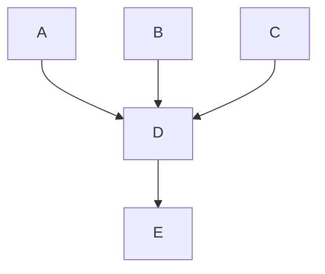

# Docs handbook

This page details processes related to maintaining and updating the ([Fleet docs](https://fleetdm.com/docs)).

## Responsibilities

The [website group](https://fleetdm.com/handbook/company/product-groups#website-group) is responsible for maintaining the Fleet documentation.

## Documentation DRIs

TODO: Document.

## Intake

When someone asks a question in a public channel, it's pretty safe to assume that they aren't the only person looking for an answer to the same question. To make our docs as helpful as possible, the Community team gathers these questions and uses them to make a weekly documentation update.

Our goal is to answer every question with a link to the docs and/or result in a documentation update.

> **Remember**, when submitting any pull request that changes Markdown files in the docs, request an editor review from Kathy Satterlee, who will escalate to the [on-call engineer](https://fleetdm.com/handbook/engineering#oncall-rotation) as needed.

## Tracking

When responding to a question or issue in the [#fleet](https://osquery.slack.com/join/shared_invite/zt-h29zm0gk-s2DBtGUTW4CFel0f0IjTEw#/) channel of the osquery Slack workspace, push the thread to Zapier using the `TODO: Update docs` Zap. This will add information about the thread to the [Slack Questions Spreadsheet](https://docs.google.com/spreadsheets/d/15AgmjlnV4oRW5m94N5q7DjeBBix8MANV9XLWRktMDGE/edit#gid=336721544). In the `Notes` field, you can include any information that you think will be helpful when making weekly doc updates. That may be something like

- proposed change to the documentation.
- documentation link that was sent as a response.
- link to associated thread in [#help-oncall](https://fleetdm.slack.com/archives/C024DGVCABZ).

## Content reviews

When creating a pull request for Markdown changes in the docs, request a review from Kathy Satterlee, who will do an editor pass, and then hand over the review to the [oncall engineer](https://fleetdm.com/handbook/engineering#oncall-rotation) if necessary.

## Markdown

The Fleet docs are written in Markdown. Using Markdown lets us keep our documentation consistently formatted and viewable directly from the Fleet GitHub repo.

See the [Markdown guide](./markdown-guide) for help formatting Fleet-flavored Markdown.

## Links

You can link documentation pages to each other using relative paths. For example, in `docs/Using-Fleet/Fleet-UI.md`, you can link to `docs/Using-Fleet/Permissions.md` by writing `[permissions](./Permissions.md)`. This will automatically be transformed into the appropriate URL for `fleetdm.com/docs`.

However, the `fleetdm.com/docs` compilation process does not account for relative links to directories **outside** of `/docs`.
This is why it’s essential to follow the file path exactly when adding a link to Fleet docs.
When directly linking to a specific section, always format the spaces within a section name to use a hyphen instead of an underscore. For example, when linking to the `osquery_result_log_plugin` section of the configuration reference docs, use a relative link like the following: `./Configuration.md#osquery-result-log-plugin`.

### Linking to a location on GitHub

When adding a link to a location on GitHub outside of `/docs`, be sure to use the canonical form of the URL.

Navigate to the file's location on GitHub, and press "y" to transform the URL into its canonical form.

### Fixing a broken link

For instances when a broken link is discovered on fleetdm.com, always check if the link is a relative link to a directory outside of `/docs`.

An example of a link that lives outside of `/docs` is:

```
../../tools/app/prometheus
```

If the link lives outside `/docs`, head to the file's location on GitHub (in this case, [https://github.com/fleetdm/fleet/blob/main/tools/app/prometheus.yml)](https://github.com/fleetdm/fleet/blob/main/tools/app/prometheus.yml)), and press "y" to transform the URL into its canonical form (a version of the link that will always point to the same version of the file) ([https://github.com/fleetdm/fleet/blob/194ad5963b0d55bdf976aa93f3de6cabd590c97a/tools/app/prometheus.yml](https://github.com/fleetdm/fleet/blob/194ad5963b0d55bdf976aa93f3de6cabd590c97a/tools/app/prometheus.yml)). Replace the relative link with this link in the Markdown file.

> Note that the instructions above also apply to adding links in the Fleet handbook.

## Meta tags

### Page order

The order we display documentation pages on fleetdm.com is determined by `pageOrderInSection` meta tags. These pages are sorted in their respective sections in **ascending** order by the `pageOrderInSection` value. Every Markdown file (except readme and faq pages) in the `docs/` folder must have a meta tag with a positive 'pageOrderInSection' value.

We leave large gaps between values to make future changes easier. For example, the first page in the "Using Fleet" section of the docs has a `pageOrderInSection` value of 100, and the next page has a value of 200. The significant difference between values allows us to add, remove and reorder pages without changing the value of multiple pages at a time.

When adding or reordering a page, try to leave as much room between values as possible. If you were adding a new page that would go between the two pages from the example above, you would add `<meta name="pageOrderInSection" value="150">` to the page.

### Page description

TODO: Document.

## Images

Try to keep images in the docs at a minimum. Images can be a quick way to help users understand a concept or direct them towards a specific user interface(UI) element. Still, too many can make the documentation feel cluttered and more difficult to maintain.

When adding images to the Fleet documentation, follow these guidelines:

- UI screenshots should be a 4:3 aspect ratio (1280x960). This is an optimal size for the container width of the docs and ensures that content in screenshots is as clear as possible to view in the docs (and especially on mobile devices).
- You can set up a custom preset in the Google Chrome device toolbar (in Developer Tools) to quickly adjust your browser to the correct size for taking a screenshot.
- Keep the images as simple as possible to maintain. Screenshots can get out of date quickly as UIs change.
- Exclude unnecessary images. Images should be used to help emphasize information in the docs, not replace it.
- Minimize images per doc page. For doc maintainers and users, more than one or two per page can get overwhelming.
- The goal is for the docs to look good on every form factor, from 320px window width all the way up to infinity. Full window screenshots and images with too much padding on the sides will be less than the width of the user's screen. When adding a large image, make sure it is easily readable at all widths.

Images can be added to the docs using the Markdown image link format, e.g., ``
The images used in the docs live in `docs/images/`. Note that you must provide the URL of the image in the Fleet GitHub repo for it to display properly on both GitHub and the Fleet website.

> Note that the instructions above also apply to adding images in the Fleet handbook.

## Mermaid diagrams

The Fleet Docs support diagrams that are written in mermaid.js syntax. Take a look at the [Mermaid docs](https://mermaid-js.github.io/mermaid/#/README) to learn about the syntax language and what types of diagrams you can display.

To add a mermaid diagram to the docs, you need to add a code block and specify that it is written in the mermaid language by adding `mermaid` to the opening backticks (i.e., ` ```mermaid`).

For example, the following code block is a mermaid diagram that has **not** been specified as a mermaid code block:

```
graph TD;
    A-->D
    B-->D
    C-->D
    D-->E
```

Once we specify the `mermaid` as the language in the code block, it will render as a mermaid diagram on fleetdm.com and GitHub.



If the mermaid syntax is incorrect, the diagram will be replaced with an image displaying an error, as shown in the following example where the code block was written with **intentional** syntax errors:

```mermaid
graph TD;
    A--D
```

<meta name="maintainedBy" value="mike-j-thomas">
<meta name="title" value="Docs handbook">
