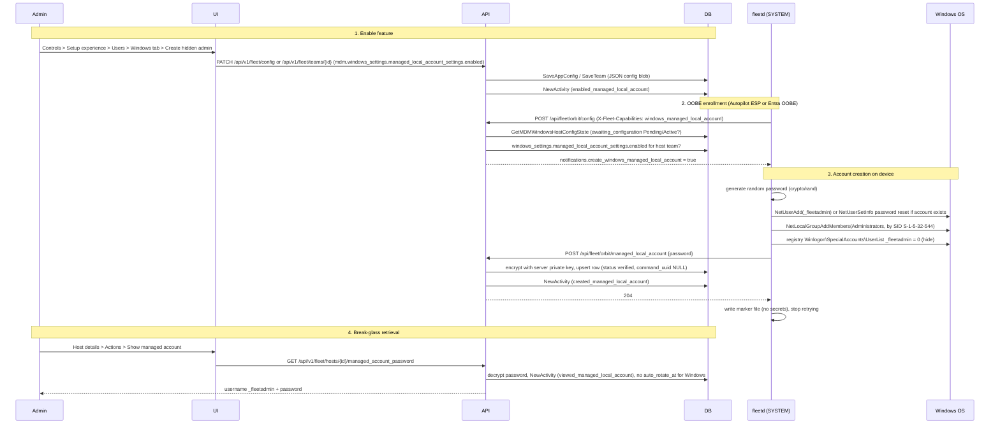

# Spec: Windows: Create a local admin account (#43488)

Parent story: https://github.com/fleetdm/fleet/issues/43488 (milestone 4.90.0, assigned @getvictor)

## Story

> As an IT admin, I want Fleet to create a local, break-glass, admin account for my Windows hosts so that my IT team can use this account to troubleshoot.

Fleet already creates a hidden `_fleetadmin` admin account on macOS hosts during ADE enrollment (#37141). The server generates a password, escrows it encrypted in `host_managed_local_account_passwords`, and sends the Apple MDM `AccountConfiguration` command with a salted hash. Admins retrieve the password from **Host details > Actions > Show managed account**.

This story brings the same break-glass account to Windows hosts that enroll through the out-of-box experience (Autopilot ESP or Entra join during OOBE). Windows MDM cannot deliver the feature the way Apple MDM does: the Accounts CSP only sets a password at account creation and offers no rotation path back to Fleet, and no CSP hides an account from the sign-in screen. Instead, fleetd, which runs as SYSTEM during the Enrollment Status Page, creates the account with the Windows account APIs, hides it with a registry value, and escrows a locally generated password to Fleet over the authenticated orbit API.

The story also restructures the configuration surface for both platforms. A new `managed_local_account_settings` object lands under `apple_settings` and `windows_settings`, and the existing `setup_experience.enable_managed_local_account` and `setup_experience.end_user_local_account_type` fields become deprecated aliases of the Apple values.

**Rotation is out of scope.** Password rotation for Windows is story #43489 (milestone 4.91.0, still in product drafting). The macOS create/rotate split (#37141/#37142) is the precedent. Consequences: viewing a Windows password never arms the `auto_rotate_at` timer, the rotate endpoint keeps its macOS guard, and the rotation cron never picks up Windows rows. The escrow protocol is designed so rotation bolts on in 4.91 without rework.

**fleetd creates the account, not MDM.** The Accounts CSP cannot rotate passwords or hide accounts. fleetd as SYSTEM during the ESP can do both, and its notification plumbing already exists for this exact enrollment phase.

**The password is generated on the device.** fleetd generates the password and escrows it up, following the LUKS passphrase escrow pattern. Plaintext never rides down in an orbit config response.

**All OOBE enrollments qualify.** The gate is `awaiting_configuration` Pending or Active in `mdm_windows_enrollments`, which both Autopilot ESP and Entra-join-during-OOBE set. Manually enrolled hosts and hosts enrolled before the feature is turned on never get the account, matching the macOS ADE-only constraint.

**Fleet Premium only.** Same as macOS: enterprise implementations live in `ee/server/service/`, and the core service returns `ErrMissingLicense`.

**No end-user account type for Windows.** The Figma dev note says "Remove account type options for Windows." `end_user_local_account_type` stays under `apple_settings` only.

**No new activity types.** The existing created/viewed/enabled/disabled managed local account activities are reused.

## Feature design



## Figma dev notes, tooltip text, and message text

Source: [Figma "Ready" page](https://www.figma.com/design/erfntW52sKZC5JMbzX4Iy4/-43488-Windows--Create-a-local-admin-account?node-id=2-130). Copy below was read from the rendered frames; re-verify strings against Figma text layers during implementation.

### Controls > Setup experience > Users (shared area, above the platform sub nav)

| Element | Text |
|---|---|
| Page description | Customize local user accounts. For advanced account configuration, like creating local accounts with IdP credentials via Platform Single Sign-On (PSSO), use a custom setup. Learn how |
| Link (top right) | Preview end user experience |
| Section title | End user authentication |
| Checkbox label | Require IdP authentication (platform icons: Apple, Windows, Linux, Android) |
| Checkbox help text | End users are required to authenticate with your identity provider (IdP) when setting up new hosts. |
| Checkbox label | Lock end user info (platform icon: Apple) |
| Checkbox help text | Prevents macOS users from editing Account Name and Full name in Setup Assistant. These fields will be locked to IdP values. |
| Sub nav tabs | macOS, Windows |

### macOS tab (Local account section)

| Element | Text |
|---|---|
| Section title | Local account |
| Sub-heading | End user |
| Help text | End users get the default role for the host's platform. Learn more |
| Radio | Admin. End user can add and manage other users, install apps, and change settings. |
| Radio | Standard. End user can install apps and change their own settings, but can't add other users or change other users' settings. |
| Radio | Skip (no account). No user account will be created during Setup Assistant and authentication must be handled by an IdP or other workflow. |
| Sub-heading | Managed |
| Checkbox label | Create hidden admin |
| Checkbox help text | Fleet creates a user (_fleetadmin) and unique password for each host, accessible in Host details > Show managed account. |
| Tooltip | Creates a hidden managed local account for remote troubleshooting on macOS and Windows hosts. |
| Button | Save |

### Windows tab (Local account section)

| Element | Text |
|---|---|
| Section title | Local account |
| Sub-heading | End user |
| Help text | End users get the default role for the host's platform. Learn more |
| Sub-heading | Managed |
| Checkbox label | Create hidden admin |
| Checkbox help text | Fleet creates a user (_fleetadmin) and unique password for each host, accessible in Host details > Show managed account. |
| Button | Save |

### Dev notes (verbatim)

- "Move 'End user authentication' above new sub nav section. Add icons for supported platforms for: Require IdP authentication, Lock end user info. Adjust copy for 'Require IdP authentication' helper text."
- "New sub nav by platform"
- "Update helper text" (End user section)
- "Update helper text and tooltip." (Create hidden admin checkbox)
- "Remove account type options for Windows."
- "Update description copy" (page description)

## Expert review notes

SME consultation deferred: the assignee (@getvictor) is the top author of the server-side managed local account code, and the load-bearing Windows and API decisions were already validated in Slack. Those Slack decisions are preserved here as the expert record.

1. **`_fleetadmin` name reuse is safe on Windows, hide via registry.** (Adam Baali, #g-power-to-pc) "Short answer: yes, safe to reuse _fleetadmin on Windows no naming problem. Underscore's a legal character and it's well under the 20-char limit. One thing to know: on Windows the leading _ is purely cosmetic. On mac it signals a hidden system account; Windows has no equivalent convention, so it won't hide anything by itself. To keep it off the sign-in screen (and out of Settings/Control Panel) we set a registry DWORD = 0 under ...\Winlogon\SpecialAccounts\UserList."
2. **API restructure.** (Mel Pike + Victor Lyuboslavsky, #g-power-to-pc, 2026-06-26) "Introduce a new object: `managed_local_account_settings` with platform objects with `enabled`, and in the future there's room to add on `username` and `password`." Victor: "would enable_managed_local_account be the same as macos.enabled?" Mel: "Yes, that's what I was thinking." The deprecated field aliases the Apple value only.
3. **Known macOS tamper gaps carry over.** (Christopher Noel, #g-apple-at-work) On macOS, an end-user admin can see and delete `_fleetadmin`'s home directory and can change its password locally. The same class exists on Windows: any local admin can reset `_fleetadmin`'s password and silently diverge from the escrowed value. Accepted risk, same posture as macOS. Rotation (#43489) is the mitigation.

## Engineering section answers

These answers get written back to the parent story's Engineering section when sub-issues are filed.

- **Test plan finalized:** Yes, after adding the edge cases listed in the parent story test plan update (see sub-issue 5): host enrolled before enabling, manually enrolled host, old fleetd without the capability, escrow retry after network failure, Fleet Free tier, GitOps mode UI.
- **Contributor API changes:** New orbit endpoint `POST /api/fleet/orbit/managed_local_account`, documented in `docs/Contributing/reference/api-for-contributors.md` (sub-issue 5).
- **Feature guide changes:** Covered by open PR #47925 (`articles/setup-experience.md`, `articles/windows-linux-setup-experience.md`).
- **Database schema migrations:** One migration: make `host_managed_local_account_passwords.command_uuid` nullable (Windows rows have no MDM command).
- **Load testing:** Not needed. The orbit notification is computed inside the existing per-config-request Windows ESP query (`GetMDMWindowsHostConfigState`), and the escrow endpoint is called once per host enrollment.
- **Pre-QA load test:** Not needed, no change to the load profile.
- **Load testing/osquery-perf improvements:** None.
- **This is a premium only feature:** Yes. Frontend hides the controls on Free, backend returns `ErrMissingLicense` from the core service, and the orbit escrow endpoint validates the license and the team setting.

Risk assessment:

- **Requires testing in a hosted environment:** Yes, QA needs a real Autopilot/Entra tenant (dogfood) for OOBE enrollment.
- **Requires load testing:** No.
- **Risk level:** Low. All new behavior is gated behind a default-off premium setting, and the config restructure keeps the legacy fields working as aliases.

## API design note

| PR | Surface | What changes |
|---|---|---|
| #47915 (merged, docs-v4.90.0) | REST API | Adds `managed_local_account_settings` object under `mdm.apple_settings` and `mdm.windows_settings` on GET/PATCH config and teams; adds `end_user_local_account_type` under `apple_settings`; keeps `setup_experience.enable_managed_local_account` + `end_user_local_account_type` in responses; updates `PATCH /setup_experience` and `POST /managed_local_account` wording to "eligible hosts" |
| #48110 (merged, docs-v4.90.0) | GitOps YAML | Adds `managed_local_account_settings` under `controls.apple_settings` and `controls.windows_settings`; keeps deprecated `setup_experience` fields |
| #47925 (open) | Guides | Managed local account sections for Windows in `articles/windows-linux-setup-experience.md` and platform split in `articles/setup-experience.md` |

Conflicts and resolutions:

1. **List vs object in #48110.** The YAML example shows `managed_local_account_settings:` as a list (`- enabled: true`) while the REST API and the Slack agreement define an object. Resolution: it is an object. Docs follow-up in sub-issue 5.
2. **Scope of the deprecated field in #48110.** The YAML doc says `enable_managed_local_account` applies to "macOS and Windows hosts". The Slack agreement and the parent issue say the deprecated field aliases the Apple value only, and Windows is enabled solely through `windows_settings.managed_local_account_settings.enabled`. Resolution: alias to Apple only. Docs follow-up in sub-issue 5.
3. **Existing GitOps rename.** `enable_managed_local_account` already carries `renameto:"enable_create_local_admin_account"` (`server/fleet/app.go:599`) with the mapping at `pkg/spec/gitops_deprecations.go:50`. Both old spellings remain accepted YAML input; `generate-gitops` emits only the new nested form.
4. **UI save path.** The Users form today saves through `PATCH /api/v1/fleet/setup_experience` (`mdmAPI.updateSetupExperienceSettings`, `frontend/services/entities/mdm.ts:276-289`), which has no Windows field in the documented contract. The Windows tab saves through `PATCH /api/v1/fleet/config` or `PATCH /api/v1/fleet/teams/{id}` with `mdm.windows_settings.managed_local_account_settings`, which #47915 documents. The macOS tab keeps its existing save path.
5. **Documented endpoint that does not exist in code.** The REST reference documents `POST /api/v1/fleet/managed_local_account` ("Edit managed local account enforcement settings"), and #47915 rewords it, but no such route is registered anywhere in `server/` or `ee/` (`handler.go` has only the two `managed_account_password` host routes at lines 597-598). PR #48273 ("enable managed account fleets endpoint") wired enabling through the update-fleet path (`server/service/appconfig.go`, `ee/server/service/teams.go`), not a new route. Resolution: treat the fleets/config PATCH paths as the real API, and either remove the phantom endpoint from the docs or implement it in a follow-up. Flagged as an open question for Mel; docs follow-up tracked in sub-issue 5.

## How the account is created on the device

### Why fleetd and not the Accounts CSP

The Accounts CSP (`./Device/Vendor/MSFT/Accounts/Users`) can create a local user and add it to the Administrators group, but it was rejected for three reasons:

1. The CSP sets a password only at account creation. There is no supported CSP path to change it later, so rotation (#43489) would be impossible over MDM. Windows LAPS rotates local admin passwords, but escrows them to Entra ID or AD, not to Fleet.
2. Hiding an account from the sign-in screen is the registry value `HKLM\SOFTWARE\Microsoft\Windows NT\CurrentVersion\Winlogon\SpecialAccounts\UserList` (DWORD, account name, value 0). No CSP exposes it.
3. Sending a plaintext password inside an OMA-DM SyncML body leaves it in MDM command logs. The orbit escrow path keeps the plaintext inside one TLS request authenticated by the orbit node key, the same trust model as LUKS passphrase escrow.

### Creation sequence in fleetd

fleetd runs as LocalSystem during the ESP, so it can call the netapi32 account management APIs directly:

1. Generate a random password with `crypto/rand`: 32 characters from a mixed-class charset so it always satisfies default Windows complexity policy.
2. If the account does not exist (`NetUserGetInfo` returns NERR_UserNotFound): `NetUserAdd` at level 1 with `usri1_flags = UF_SCRIPT | UF_NORMAL_ACCOUNT | UF_DONT_EXPIRE_PASSWD`.
3. If the account already exists (crash retry, or wipe-less re-run): reset the password with `NetUserSetInfo` level 1003. This makes the whole flow idempotent.
4. Add to the local Administrators group. Resolve the group name from the well-known SID `S-1-5-32-544` with `LookupAccountSid` so the code works on non-English Windows, then `NetLocalGroupAddMembers` (level 3, by account name). Ignore ERROR_MEMBER_IN_ALIAS on retry.
5. Hide from the sign-in screen: create the `SpecialAccounts\UserList` key if needed and set DWORD `_fleetadmin = 0` via `golang.org/x/sys/windows/registry`.
6. Escrow: `POST /api/fleet/orbit/managed_local_account` with the plaintext password over the node-key-authenticated orbit client.
7. Only after a successful escrow response, write a marker file under the orbit root dir (timestamp only, never the password). The marker stops re-processing on later config fetches.

Crash safety: if fleetd dies anywhere before the marker is written, the next config fetch during OOBE still carries the notification, and the receiver resets the password (step 3) and re-escrows. The account may briefly hold a password nobody knows; that window closes on the next config fetch (every 30 seconds during ESP). The server never gates the notification on an existing escrow row for the same reason: a wiped and re-enrolled host must get a fresh account even though its old row exists.

## Sub-issues summary

| # | GitHub issue title | Layer | Depends on |
|---|---|---|---|
| 1 | Windows local admin account: managed_local_account_settings config surface and GitOps | backend | none |
| 2 | Windows local admin account: orbit notification, password escrow, and host endpoints | backend | 1 |
| 3 | Windows local admin account: Users page platform tabs and Show managed account for Windows | frontend | 1, 2 (contracts) |
| 4 | Windows local admin account: fleetd creates and hides the account on Windows | backend (agent) | 2 (contract) |
| 5 | Windows local admin account: documentation and engineering QA | docs/QA | 1, 2, 3, 4 |

## Sub-issue 1: Windows local admin account: managed_local_account_settings config surface and GitOps

**Related user story:** #43488
**Depends on:** none
**Parallel with:** none (foundation)

Adds the new `managed_local_account_settings` object under `apple_settings` (`macos_settings` struct) and `windows_settings` for both global config and teams, keeps the existing `setup_experience` fields working as deprecated aliases of the Apple values, and wires GitOps input plus `generate-gitops` output. This establishes the API contract that the frontend and the orbit work build on.

### Task

#### New types and struct fields

Add to `server/fleet/app.go`:

```go
// ManagedLocalAccountSettings configures the hidden managed local admin account for one platform.
// Future fields (username, password policy) land here, per the API design in #43488.
type ManagedLocalAccountSettings struct {
	Enabled optjson.Bool `json:"enabled"`
}
```

- `MacOSSettings` (`server/fleet/app.go:487`): add `ManagedLocalAccountSettings ManagedLocalAccountSettings `json:"managed_local_account_settings"`` and `EndUserLocalAccountType optjson.String `json:"end_user_local_account_type"``. `MacOSSettings` already carries `renameto:"apple_settings"` at every embed site (`app.go:252`, `teams.go:332`, `teams.go:418`), so the new fields appear under `apple_settings` in GitOps output automatically. Update `MacOSSettings.ToMap`/`FromMap` (the struct note at `app.go:495` requires it, and the team-spec path at `teams.go:418` uses the map form).
- `WindowsSettings` (`server/fleet/app.go:2099`): add `ManagedLocalAccountSettings ManagedLocalAccountSettings `json:"managed_local_account_settings"``.
- Update the `AppConfig.Clone` implementation for both structs (the warning block in the `MDM` struct demands it; `CustomSettings` cloning at `app.go:955-960` is the pattern).

#### Aliasing: setup_experience fields stay canonical for macOS

The stored source of truth for macOS stays `MacOSSetup.EnableManagedLocalAccount` and `MacOSSetup.EndUserLocalAccountType` (`server/fleet/app.go:599-600`). The worker reads them at `server/worker/apple_mdm.go:248-262`, the EE PATCH path writes them at `ee/server/service/mdm.go:280-304`, and the team-spec apply writes them at `ee/server/service/teams.go:355-372`. Moving storage would touch every one of those paths for zero user-visible benefit.

**Why aliases and not a data move:** the deprecated JSON fields must keep working for existing API clients and GitOps repos, and the Slack-agreed contract is that `setup_experience.enable_managed_local_account` means exactly `apple_settings.managed_local_account_settings.enabled`. Two views of one stored value is strictly simpler than two stored values plus a sync.

Implementation:

- On config/team JSON output, populate `MacOSSettings.ManagedLocalAccountSettings.Enabled` and `MacOSSettings.EndUserLocalAccountType` from the `MacOSSetup` values. Follow the `DeprecatedEnableDiskEncryption` precedent (`MacOSSettings.DeprecatedEnableDiskEncryption`, `app.go:493`, mirrored with `MDM.EnableDiskEncryption`).
- On `PATCH /config` (`server/service/appconfig.go`, merge block at lines 756-771) and team apply (`ee/server/service/teams.go:355-372`): accept writes on either surface. If both the deprecated field and the new field are present in one payload with different values, return a 422 (`NewInvalidArgumentError`), the same posture as the GitOps `migrateLeafKey` conflict error (`pkg/spec/gitops_deprecations.go:186`).
- Cover ALL write paths for the aliased value, not just the two above. `EnableManagedLocalAccount` is also written by `editTeamFromSpec` (the GitOps team-apply path, `ee/server/service/teams.go:1651`, writes at 1778, 1803, and 2079-2081) and by `updateTeamMDMAppleSetup` (the team-level `PATCH /setup_experience`, `ee/server/service/teams.go:2277`, writes at 2355-2379). Each of these must produce a consistent view on the new surface.
- Windows has no legacy alias: `WindowsSettings.ManagedLocalAccountSettings` is itself the stored value, read directly by sub-issue 2. Watch the team GitOps path: `editTeamFromSpec` copies `WindowsSettings` selectively, only `CustomSettings` today (`ee/server/service/teams.go:1882-1883`). Without an explicit copy of `ManagedLocalAccountSettings` there, the Windows toggle silently fails to persist for teams through `fleetctl gitops`. Global config is unaffected (full-blob `SaveAppConfig`).

#### Validation and premium gating

- Reuse `IsValidPrimaryAccountType` and `RequiresLocalAdminAccount` (`server/fleet/apple_mdm.go:1409-1433`) for `apple_settings.end_user_local_account_type`, matching `MacOSSetup.Validate` (`app.go:614-619`).
- Windows accepts only `managed_local_account_settings.enabled`; there is no Windows account type.
- Premium: there is NO existing license check to copy on the config PATCH path. The macOS premium gate lives entirely in the CE/EE service split of `PATCH /setup_experience` (the CE stub `UpdateMDMAppleSetup` returns `fleet.ErrMissingLicense` at `server/service/apple_mdm.go:3485`); `ModifyAppConfig` and `ModifyTeam` have only an MDM-enabled precondition for this field (`server/service/appconfig.go:1772`). Since the new fields are written through config/teams PATCH, add an explicit `!license.IsPremium(ctx)` check returning `ErrMissingLicense` (or a 422 naming the premium requirement, matching how other premium-only config fields are rejected in `validateMDM`) when a payload changes either platform's `managed_local_account_settings` or the Apple account type.

#### Activities

The enable/disable activities must fire when the Windows toggle changes, from both the config PATCH and team apply paths. Extend the change detection at `server/service/appconfig.go:1389-1398` and `ee/server/service/teams.go:359-372`, reusing `ActivityTypeEnabledManagedLocalAccount` / `ActivityTypeDisabledManagedLocalAccount` via the existing helper `updateMacOSSetupEnableManagedLocalAccount` (`ee/server/service/mdm.go:329-341`) or a platform-agnostic sibling.

#### GitOps input and output

- Input: both `controls.setup_experience.enable_managed_local_account` (already mapped to `enable_create_local_admin_account` at `pkg/spec/gitops_deprecations.go:50`) and the new `controls.apple_settings.managed_local_account_settings.enabled` / `controls.windows_settings.managed_local_account_settings.enabled` parse and apply. The new fields need no deprecation mapping; they flow through the `MacOSSettings`/`WindowsSettings` structs.
- Output: `fleetctl generate-gitops` today emits no real YAML for any of setup experience. One shared TODO placeholder covers the whole `setup_experience` section, and the managed-local-account fields are two of several conditions that trigger it (`cmd/fleetctl/fleetctl/generate_gitops.go:1461-1471`, inside `generateControls`, def line 1314). The new fields belong in the separately generated `apple_settings`/`windows_settings` output, not in that placeholder: emit `managed_local_account_settings: {enabled: true}` under each platform section when enabled, and `end_user_local_account_type` under `apple_settings` when it differs from `"admin"`. Then drop the managed-local-account conditions from the shared placeholder trigger so a config where only this feature is set generates cleanly without a TODO. The `renameto` alias rules (`buildAliasRules`, `generate_gitops.go:132`) handle the `macos_settings` to `apple_settings` key rename.

#### Follow-up commands

Run `make generate-mock` if any datastore interface changes sneak in (none expected here), and `go test ./server/service/` afterward per repo guidance.

### Condition of Satisfaction

- **Struct and clone:**
  - [ ] `MacOSSettings` and `WindowsSettings` gain `managed_local_account_settings`; `AppConfig.Clone` covers the new fields (clone unit test passes with new fields set)
  - [ ] `go test ./server/fleet/...` passes, including new `Validate` cases: `end_user_local_account_type: "standard"` with `enabled: false` rejected; invalid type string rejected; Windows payload with an account type rejected
- **API surface:**
  - [ ] `GET /api/v1/fleet/config` and `GET /api/v1/fleet/teams/{id}` return `managed_local_account_settings` under both `apple_settings` (alias of `macos_settings`) and `windows_settings`, plus the deprecated `setup_experience` fields, with consistent values
  - [ ] `PATCH /config` with `mdm.windows_settings.managed_local_account_settings.enabled: true` persists, fires `enabled_managed_local_account` activity, and requires premium (`ErrMissingLicense` on Free)
  - [ ] Writing the deprecated field and the new Apple field with conflicting values in one payload returns 422
  - [ ] Legacy clients that only write `setup_experience.enable_managed_local_account` see unchanged behavior (macOS worker path unaffected: `server/worker/apple_mdm.go:248-262` reads the same stored value)
- **GitOps:**
  - [ ] `fleetctl gitops` applies YAML using the new nested keys for both platforms, and still accepts the deprecated `setup_experience` spellings
  - [ ] Team-scoped `fleetctl gitops` persists `windows_settings.managed_local_account_settings.enabled` (regression test for the selective `WindowsSettings` copy in `editTeamFromSpec` at `ee/server/service/teams.go:1882-1883`)
  - [ ] `fleetctl generate-gitops` emits the new nested form when enabled, and no TODO placeholder; round-trip (generate then apply) is lossless
  - [ ] `MYSQL_TEST=1 REDIS_TEST=1 go test ./server/service/...` and `go test ./cmd/fleetctl/...` pass

## Sub-issue 2: Windows local admin account: orbit notification, password escrow, and host endpoints

**Related user story:** #43488
**Depends on:** 1
**Parallel with:** 3 (frontend consumes contracts), 4 (fleetd consumes contracts)

Adds the server half of the device flow: the orbit notification that tells fleetd to create the account, the orbit escrow endpoint that stores the password, and the host-facing endpoint changes that let admins retrieve a Windows password. Includes the one schema migration.

### Task

#### Migration

`host_managed_local_account_passwords.command_uuid` is `varchar(127) NOT NULL` (`server/datastore/mysql/schema.sql`, table at lines 849-866). Windows rows have no MDM command. Create the migration with `make migration name=RelaxManagedLocalAccountCommandUUID`:

```sql
ALTER TABLE host_managed_local_account_passwords
  MODIFY command_uuid varchar(127) CHARACTER SET utf8mb4 COLLATE utf8mb4_unicode_ci NULL;
```

Run `make dump-test-schema` after. No other column changes: `auto_rotate_at`, `account_uuid`, and the pending columns are already nullable and stay NULL for Windows rows.

**Why reuse this table and not create a new one:** it is already keyed by `host_uuid`, the encryption and read paths (`GetHostManagedLocalAccountPassword`, `GetHostManagedLocalAccountStatus` in `server/datastore/mysql/managed_local_account.go`) are platform-agnostic, and the 4.91 rotation story reuses the same pending columns.

#### Capability

Add to `server/fleet/capabilities.go` (const block lines 69-105, next to `CapabilityWindowsMDMSync` at line 104):

```go
// CapabilityWindowsManagedLocalAccount is set when fleetd can create and hide the Windows
// managed local admin account and escrow its password.
CapabilityWindowsManagedLocalAccount Capability = "windows_managed_local_account"
```

Add it to `GetOrbitClientCapabilities()` (`capabilities.go:128-142`) under the same `runtime.GOOS == "windows"` guard that gates `CapabilityWindowsMDMSync`; advertising it from macOS or Linux fleetd would be a lie. The server gates the notification on it so old fleetd is never asked to do work it does not understand.

#### Orbit notification

Add to `OrbitConfigNotifications` (`server/fleet/orbit.go`, next to `RunSetupExperience` at line 56):

```go
// CreateWindowsManagedLocalAccount tells fleetd on Windows to create the hidden managed
// local admin account and escrow its password. Only set during the OOBE setup phase for
// hosts whose fleetd advertises CapabilityWindowsManagedLocalAccount.
CreateWindowsManagedLocalAccount bool `json:"create_windows_managed_local_account,omitempty"`
```

Set it in `ReadOrbitConfig` inside the existing Windows ESP block (`server/service/orbit.go:586-625`), in the `AwaitingConfigurationPending || AwaitingConfigurationActive` case that already sets `notifs.RunSetupExperience`. Conditions, all required:

- `state.AwaitingConfiguration` is Pending or Active (this is the "all OOBE enrollments" gate; both Autopilot ESP and Entra-join-during-OOBE set `mdm_windows_enrollments.awaiting_configuration`, written by `SetMDMWindowsAwaitingConfiguration` at `server/datastore/mysql/microsoft_mdm.go:1348`)
- the host's team (or No team) has `windows_settings.managed_local_account_settings.enabled` (team config load: follow how the same function resolves team-scoped settings elsewhere; appConfig is already in scope)
- fleetd advertises `CapabilityWindowsManagedLocalAccount` (pattern: the `syncCapable` check a few lines below at `orbit.go:600-608`)
- premium license (`license.IsPremium(ctx)`)

**Why the notification is not gated on an existing escrow row:** a wiped and re-enrolled host still has its old row, but the account is gone from disk. The device-side receiver is idempotent (reset password and re-escrow), so re-sending during any OOBE phase is always safe and always converges.

#### Orbit escrow endpoint

Route (next to `luks_data` at `server/service/handler.go:1047`):

```go
oe.POST("/api/fleet/orbit/managed_local_account", postOrbitManagedLocalAccountEndpoint, fleet.OrbitPostManagedLocalAccountRequest{})
```

Request/response in `server/fleet/api_orbit.go` (pattern: `OrbitPostLUKSRequest` at lines 227-248):

```go
type OrbitPostManagedLocalAccountRequest struct {
	OrbitNodeKey string `json:"orbit_node_key"`
	Password     string `json:"password"`
	ClientError  string `json:"client_error"`
}
```

Service method `EscrowWindowsManagedLocalAccountPassword` (pattern: `EscrowLUKSData`, `server/service/orbit.go:1401-1430`, iface `server/fleet/service.go:478`):

- `svc.authz.SkipAuthorization(ctx)` with the host-from-context pattern (`orbit.go:1403`)
- reject only non-Windows hosts and invalid passwords. Do NOT reject when the team setting is off or the license state changed mid-flow: by the time the escrow arrives, fleetd has already created a real local admin on the device, and rejecting the escrow orphans an account whose password is unrecoverable. Accept and store, logging a warning when the setting is off (the retrieval endpoint stays premium-gated, so nothing leaks on Free)
- Windows check caveat: `host.Platform` can be empty during early OOBE, before osquery ingests system details. Verify eligibility from the host's Windows MDM enrollment (`mdm_windows_enrollments` row for the host UUID) rather than relying solely on `host.Platform`, and add an empty-platform host to the test matrix
- reject an empty password, and cap length at 256 characters as input hygiene. This is a new validation: `SaveHostManagedLocalAccount` (`server/datastore/mysql/managed_local_account.go:15-36`) does no length checking, so there is nothing existing to match
- if `ClientError` is set, log it and record nothing (mirror `ReportEscrowError` handling at `orbit.go:1411`)
- encrypt and save via a new datastore method, then log `ActivityTypeCreatedManagedLocalAccount` exactly as the macOS ack handler does (`server/service/apple_mdm.go:4456-4488`)

Datastore method in `server/datastore/mysql/managed_local_account.go` (pattern: `SaveHostManagedLocalAccount`):

```go
// SaveHostManagedLocalAccountFromEscrow stores a device-generated password for hosts where
// fleetd creates the account (Windows). command_uuid stays NULL and status is set directly
// to verified: there is no MDM command to acknowledge.
SaveHostManagedLocalAccountFromEscrow(ctx context.Context, hostUUID, password string) error
```

Upsert semantics: replace `encrypted_password`, set `status = 'verified'`, NULL out `command_uuid`, `pending_*`, and `auto_rotate_at`. Run `make generate-mock` after the interface change, then `go test ./server/service/` (uninitialized mocks crash other tests).

#### Host endpoints

- `GetHostManagedAccountPassword` (`ee/server/service/hosts.go:747`, platform guard at 760-764, a `fleet.IsMacOSPlatform` call; the helper is at `server/fleet/hosts.go:1244`): allow `windows` in addition to macOS. For Windows, skip the `MarkManagedLocalAccountPasswordViewed` call at line 808 (that call arms the 65-minute auto-rotate timer; rotation is #43489). Keep the viewed activity. `AutoRotateAt` and `PendingRotation` stay empty for Windows.
- `RotateManagedLocalAccountPassword` (`ee/server/service/hosts.go:828`, `fleet.IsMacOSPlatform` guard at 841-843): keep the macOS-only guard. Change the message to name the real constraint, for example "Password rotation is not available for Windows hosts."
- Host detail response: the darwin population of `host.MDM.OSSettings.ManagedLocalAccount` (`server/service/hosts.go:1842-1848`) sits inside `case "darwin", "ios", "ipados":` of a platform switch that is itself gated on Apple MDM being enabled (`ac.MDM.EnabledAndConfigured`, line 1821). Windows needs its own `case "windows":` gated on `ac.MDM.WindowsEnabledAndConfigured`, calling `GetHostManagedLocalAccountStatus` and setting `host.MDM.OSSettings.ManagedLocalAccount`. Guard against `host.MDM.OSSettings` being nil (the Apple path relies on upstream initialization; the Linux branch at line 1893 shows it can be nil). Do not move the recovery-lock population that shares the darwin block.

**Why the rotation cron needs no change:** `GetManagedLocalAccountsForAutoRotation` (`server/datastore/mysql/managed_local_account.go:405-429`) requires `auto_rotate_at <= NOW(6)` and `account_uuid IS NOT NULL`. Windows rows never get either value in this story, so they are structurally excluded. Add a datastore test that proves a Windows-shaped row (NULL `command_uuid`, NULL `account_uuid`, `verified`) is never returned.

### Condition of Satisfaction

- **Migration:**
  - [ ] `MYSQL_TEST=1 go test ./server/datastore/mysql/...` passes; migration test covers NULL `command_uuid` insert; `schema.sql` regenerated
- **Notification:**
  - [ ] Orbit config response carries `create_windows_managed_local_account: true` only when all four gates hold (ESP phase, setting on, capability advertised, premium); table-driven service test flips each gate off individually
  - [ ] macOS hosts and Windows hosts outside OOBE never receive the notification; orbit config for a host with old fleetd (no capability header) never receives it
- **Escrow endpoint:**
  - [ ] `POST /api/fleet/orbit/managed_local_account` stores an encrypted password readable back through `GetHostManagedLocalAccountPassword`; row has `status = 'verified'`, NULL `command_uuid`; `created_managed_local_account` activity logged once
  - [ ] Second escrow for the same host replaces the password (re-enrollment case); non-Windows host rejected; escrow from a Windows host whose team setting was turned off after the notification is accepted and stored with a warning (no orphaned account); host with empty `host.Platform` but a Windows MDM enrollment is accepted
- **Host endpoints:**
  - [ ] `GET /hosts/{id}/managed_account_password` returns the password for a Windows host, logs the viewed activity, and leaves `auto_rotate_at` NULL in the row and absent from the response
  - [ ] `POST /hosts/{id}/managed_account_password/rotate` still fails for Windows hosts with the documented message
  - [ ] Host detail response for a Windows host includes `mdm.os_settings.managed_local_account` with `status` and `password_available`
  - [ ] Rotation cron datastore test: Windows-shaped rows never selected
- **End-to-end integration test:** simulated Windows OOBE enrollment, orbit config notification observed, escrow POST, then `GET managed_account_password` returns the same password (`MYSQL_TEST=1 REDIS_TEST=1 go test ./server/service/...`)

## Sub-issue 3: Windows local admin account: Users page platform tabs and Show managed account for Windows

**Related user story:** #43488
**Depends on:** 1, 2 (API contracts; can start once sub-issue 1's PR is open)
**Parallel with:** 2, 4

Rebuilds Controls > Setup experience > Users around a macOS/Windows sub nav per the Figma, adds the Windows "Create hidden admin" toggle, and enables the existing Show managed account host action and modal for Windows hosts.

### Task

#### Users page restructure

Files: `frontend/pages/ManageControlsPage/SetupExperience/cards/Users/` (`Users.tsx`, `components/UsersForm/UsersForm.tsx`, `components/UsersForm/components/{LocalAccountSection,EndUserAuthSection}/`).

- Move `EndUserAuthSection` above a new platform sub nav. Add platform icons to "Require IdP authentication" (Apple, Windows, Linux, Android) and "Lock end user info" (Apple), and apply the copy updates from the Figma tables above.
- Add the platform sub nav below it. Follow `PlatformTabs.tsx` (`.../OSUpdates/components/PlatformTabs/PlatformTabs.tsx`), the extracted `TabNav` + `react-tabs` component with conditional tabs (`isWindowsMdmEnabled` gating at lines 58-64, 88-103, `platformByIndex` mapping). `InstallSoftware.tsx:239-272` is the inline variant if a lighter touch fits better.
- macOS tab: current `LocalAccountSection` content unchanged (three account-type radios plus Create hidden admin checkbox, helper `effectiveEnableManagedLocalAccount` at `LocalAccountSection.tsx:21-23`).
- Windows tab: "Local account" section with only the "End user" helper text and the "Managed" > "Create hidden admin" checkbox. No account-type radios (Figma dev note).
- Form data (`IUsersFormData`, `UsersForm.tsx:18-23`) gains `enableManagedLocalAccountWindows`. Save paths: macOS fields keep `mdmAPI.updateSetupExperienceSettings` (`UsersForm.tsx:97-128`, `frontend/services/entities/mdm.ts:276-289`); the Windows toggle saves via the config/teams PATCH with `mdm.windows_settings.managed_local_account_settings` (see API design note item 4). `Users.tsx` already loads both `configAPI.loadAll()` (line 106) and `teamsAPI.load` (line 115), so reading the Windows value is symmetrical.
- Tier and GitOps gating: premium-only controls (page is already premium-gated; keep the pattern), and respect `gitopsEnabled` read-only mode the same way `LocalAccountSection` does today.

#### Host details: Show managed account for Windows

- `canShowManagedAccount` (`frontend/pages/hosts/details/HostDetailsPage/HostActionsDropdown/helpers.tsx:387-407`): replace the `hostPlatform !== "darwin"` check (line 400) with darwin-or-windows. For Windows, skip the `isAutomaticDeviceEnrollment` check (line 402, an Apple ADE concept) and rely on the existing `managedAccountStatus` fallback (lines 403-405): a non-null status means a row exists for this host.
- Disabled-state tooltips (`helpers.tsx:786-818`): reuse pending/failed wording; for Windows the pending state means fleetd has not escrowed yet.
- `ManagedAccountModal` (`.../modals/ManagedAccountModal/ManagedAccountModal.tsx`): pass `canRotatePassword={false}` for Windows hosts so the rotate button and the auto-rotate banner never render (rotation is #43489). Username line (line 96) already renders `_fleetadmin`.
- Types are already platform-agnostic: `host.mdm.os_settings.managed_local_account` (`frontend/interfaces/host.ts:132-137`) and `hostAPI.getManagedAccountPassword` (`frontend/services/entities/hosts.ts:685-688`) need no changes.

### Condition of Satisfaction

- **Users page:**
  - [ ] End user authentication section renders above the sub nav with platform icons; macOS and Windows tabs render per Figma; Windows tab has no account-type radios
  - [ ] Toggling Create hidden admin on the Windows tab persists `windows_settings.managed_local_account_settings.enabled` for the selected fleet and shows the success flash; macOS tab behavior unchanged
  - [ ] Windows tab hidden or disabled when Windows MDM is not enabled and configured; whole section read-only in GitOps mode; controls absent on Free tier
- **Host details:**
  - [ ] Show managed account appears for a Windows host with a managed account row, for admins and maintainers only; hidden for observers
  - [ ] Modal shows username and password for Windows with no rotate button and no auto-rotate banner; pending state shows the disabled tooltip
- **Tests:** `yarn test` passes with new/updated tests for `canShowManagedAccount` (windows cases) and the Users form save paths; `yarn lint`

## Sub-issue 4: Windows local admin account: fleetd creates and hides the account on Windows

**Related user story:** #43488
**Depends on:** 2 (notification and endpoint contract; can start from this spec once sub-issue 2's shapes are agreed)
**Parallel with:** 3

Adds the fleetd (orbit) side: a Windows-only config receiver that reacts to the new notification by creating the hidden `_fleetadmin` admin account and escrowing its password. Ships on the fleetd release train, so this merges as early as the contract allows.

### Task

#### New package and wiring

Create `orbit/pkg/managedaccount/` with a `_windows.go` implementation and a stub for other platforms (layout pattern: `orbit/pkg/luks/{luks.go,luks_linux.go,luks_stub.go}`). Register the receiver in the `case "windows":` block of `orbit/cmd/orbit/orbit.go` (existing Windows receivers at lines 1294-1303):

```go
orbitClient.RegisterConfigReceiver(managedaccount.NewReceiver(orbitClient, c.String("root-dir")))
```

Receiver skeleton:

```go
func (r *Receiver) Run(cfg *fleet.OrbitConfig) error {
	if !cfg.Notifications.CreateWindowsManagedLocalAccount {
		return nil
	}
	if r.markerExists() {
		return nil
	}
	// single-flight guard, then run the create-and-escrow flow in a goroutine so a slow
	// netapi32 or HTTP call never blocks the config receiver loop
	// (pattern: windowsMDMSyncConfigReceiver.attemptSync, orbit/pkg/update/notifications.go:301-343)
}
```

#### Create-and-escrow flow (all steps idempotent)

1. Generate a 32-character password from `crypto/rand` with guaranteed upper/lower/digit/symbol classes (satisfies default complexity policy).
2. `NetUserGetInfo("_fleetadmin")`: if missing, `NetUserAdd` level 1 with `UF_SCRIPT | UF_NORMAL_ACCOUNT | UF_DONT_EXPIRE_PASSWD`; if present, `NetUserSetInfo` level 1003 to reset the password. Username comes from a shared constant; today `fleet.ManagedLocalAccountUsername` lives in `server/fleet/apple_mdm.go:1407`, move or re-export it from a platform-neutral spot rather than duplicating the string.
3. Resolve the Administrators group name from SID `S-1-5-32-544` via `LookupAccountSid` (locale independence), then `NetLocalGroupAddMembers`; treat ERROR_MEMBER_IN_ALIAS as success.
4. Hide from sign-in screen: `golang.org/x/sys/windows/registry`, create key `HKLM\SOFTWARE\Microsoft\Windows NT\CurrentVersion\Winlogon\SpecialAccounts\UserList`, set DWORD `_fleetadmin = 0`.
5. Escrow: new client method on `OrbitClient` (pattern: `SendLinuxKeyEscrowResponse`, `client/orbit_client.go:891-899`):

```go
func (oc *OrbitClient) SendManagedLocalAccountPassword(password string) error {
	verb, path := "POST", "/api/fleet/orbit/managed_local_account"
	...
}
```

6. Only after a 2xx from the escrow POST, write the marker file under the orbit root dir (timestamp only; never write the password to disk). On any earlier failure, return the error and let the next config fetch retry the whole flow; step 2's reset branch makes retries safe.
7. On unrecoverable client-side errors (for example NetUserAdd permission failure), send `client_error` in the escrow request so the server logs it (mirror the LUKS `ClientError` field usage).

**Why marker-file-then-stop instead of asking the server:** the notification keeps arriving on every config fetch during OOBE. Without a local terminal state the receiver would reset the password every 30 seconds. The marker is safe because it is written only after the server confirmed the escrow, and a wiped disk also wipes the marker, which is exactly when re-creation is wanted.

#### Capability

Advertise `CapabilityWindowsManagedLocalAccount` from the orbit client capability set (`server/fleet/capabilities.go:128-142`, `GetOrbitClientCapabilities`), added in sub-issue 2, under the existing `runtime.GOOS == "windows"` guard alongside `CapabilityWindowsMDMSync`. fleetd and server changes land in the same repo, so build order is not a concern, but old fleetd against new server (no capability, no notification) and new fleetd against old server (no notification field, receiver no-ops) must both degrade cleanly.

#### Changelog and release checklist

Add an entry under `orbit/changes/`, and run the fleetd release checklist (`/verify-fleetd`) before merge per orbit conventions.

### Condition of Satisfaction

- **Unit (pure Go, run anywhere):**
  - [ ] Password generator always emits all four character classes at length 32; receiver no-ops without the notification or with the marker present; marker write only after successful escrow (mock client); `go test ./orbit/...`
- **On a real Windows VM (documented manual steps in the PR):**
  - [ ] Fresh run creates `_fleetadmin`, local Administrators member, hidden from sign-in screen and Settings; `net user _fleetadmin` shows password never expires
  - [ ] Second run with marker present changes nothing; run after deleting the marker resets the password and re-escrows; escrowed password from Fleet UI logs in via "Other user"
  - [ ] Kill fleetd between account creation and escrow, restart: flow converges (password reset plus successful escrow)
- **Cross-version:** new fleetd against a server without the feature runs clean (no receiver activity); old fleetd against a new server with the feature on never receives the notification

## Sub-issue 5: Windows local admin account: documentation and engineering QA

**Related user story:** #43488
**Depends on:** 1, 2, 3, 4
**Parallel with:** none (final gate)

Closes the documentation gaps found during spec review and runs the full story QA on real OOBE enrollments once all implementation PRs merge.

### Task

#### Documentation

- Contributor API reference (`docs/Contributing/reference/api-for-contributors.md`): document `POST /api/fleet/orbit/managed_local_account` (request, response, auth, when fleetd calls it).
- Docs follow-ups from the API design note, as PRs to the docs release branch: fix the `managed_local_account_settings` list-vs-object example in the YAML page (from #48110), correct the deprecated `enable_managed_local_account` description to macOS-only aliasing (both `docs/Configuration/yaml-files.md` and `docs/REST API/rest-api.md`), and resolve the phantom `POST /api/v1/fleet/managed_local_account` endpoint (documented at `docs/REST API/rest-api.md:7961` but registered nowhere in code; remove from docs or implement, per Mel's call).
- Confirm open guide PR #47925 matches the shipped behavior (hidden from sign-in screen, Other user login, `.\_fleetadmin` fallback) and get it merged.
- No audit-log reference changes (no new activity types) and no usage statistics changes, per the parent story.

#### Engineering QA (real devices, hosted environment)

Follow the parent story test plan, plus the edge cases below. Needs an Autopilot/Entra tenant (dogfood) and a Fleet Premium instance with Windows MDM on.

1. Enable Create hidden admin on the Windows tab for a fleet; enroll a fresh Windows host via Autopilot. Confirm `_fleetadmin` exists, is a local admin, is hidden from the sign-in screen, and its password is retrievable in Host details.
2. Repeat via Entra-join-during-OOBE (no Autopilot profile). Same result.
3. Manually enrolled Windows host (no OOBE): no account created.
4. Host enrolled before the feature was enabled: no account until wiped and re-enrolled.
5. `fleetctl gitops` with `windows_settings.managed_local_account_settings.enabled: true`: same behavior as UI; `fleetctl generate-gitops` round-trips.
6. Old fleetd (previous stable, no capability): no account, no errors in orbit logs.
7. Permissions: password visible to global/team admins and maintainers; hidden from observers; rotate action absent for Windows.
8. Fleet Free: controls hidden in UI, API returns `ErrMissingLicense`.
9. Log in as `_fleetadmin` via "Other user" with the escrowed password.
10. Update the parent story test plan checkboxes and add an engineer confirmation comment.

### Condition of Satisfaction

- [ ] All documentation items merged to the docs release branch; #47925 merged
- [ ] All ten QA scenarios pass and are recorded on the parent story
- [ ] Parent story Engineering section checkboxes completed

## Dependency graph

```
[1] Backend: config surface ──► [2] Backend: notification + escrow + endpoints ──► [5] Docs & QA
             │                               │
             │                               ├──► [4] fleetd: create/hide/escrow ──► [5]
             │                               │       (starts from 2's contract)
             └───────────────────────────────┴──► [3] Frontend: Users page + host details ──► [5]
                                                     (starts from 1's + 2's contracts)
```

Critical path: 1 → 2 → 4 → 5. fleetd needs the escrow endpoint live to test end to end, and QA needs fleetd from edge/stable. Sub-issues 3 and 4 begin from the agreed contracts while 2 is still in review.

## PR strategy

| PR | Sub-issues | Can start after | Parallel with |
|---|---|---|---|
| Config surface + GitOps | 1 | now | none |
| Server orchestration + escrow | 2 | 1 merged (or stacked on 1's branch) | 3, 4 |
| fleetd receiver | 4 | 2's contract agreed (merge after 2) | 2, 3 |
| Frontend Users page + host details | 3 | 1's contract agreed | 2, 4 |
| Docs + QA fixes | 5 | 1-4 merged | none |

## Multi-engineer scenarios

With 2 engineers (1 Go, 1 frontend):

```
Eng A (Go):  [1 config]──[2 orchestration]──[4 fleetd]──────[5 QA]
Eng B (FE):       ......[3 Users page + host details].......[5 QA assist]
```

With 3 engineers (2 Go, 1 frontend):

```
Eng A (Go):  [1 config]──[2 orchestration]────────[5 QA]
Eng B (Go):       ......[4 fleetd from contract]..[5 QA assist]
Eng C (FE):       ......[3 Users page]............[5 QA assist]
```

## Within-sub-issue parallelization

Sub-issue 2 splits cleanly between two people on a shared branch:

| Piece | Files | Can start |
|---|---|---|
| Migration + datastore method + tests | `server/datastore/mysql/migrations/tables/`, `server/datastore/mysql/managed_local_account.go`, `server/fleet/datastore.go` | immediately |
| Notification + escrow endpoint + host endpoints | `server/service/orbit.go`, `server/service/handler.go`, `server/fleet/{orbit,api_orbit,capabilities}.go`, `ee/server/service/hosts.go`, `server/service/hosts.go` | after the datastore method signature is agreed |

## Open questions

1. **T-shirt size.** The parent story has no `~size:*` label. For Mel/product to set; does not block implementation.
2. **Windows tab visibility when Windows MDM is off.** The Figma shows both tabs; recommend matching `PlatformTabs` behavior (hide the Windows tab when Windows MDM is not enabled and configured) and confirming with Mel during frontend review.
3. **Phantom `POST /api/v1/fleet/managed_local_account` endpoint.** Documented in the REST reference and reworded by #47915, but no such route exists in code. For Mel: remove it from the docs, or file a follow-up to implement it. The spec assumes the config/teams PATCH paths are the real API (sub-issue 5 carries the docs fix).

## Resolved questions

1. **Is rotation part of #43488?** No. #43489 (4.91.0) owns rotation; the parent's "rotating" mention in the fleetd bullet is a forward reference. Decided by Victor during spec review, consistent with the macOS #37141/#37142 split. Forward compatibility: the escrow endpoint and reused table columns (`pending_encrypted_password`, `pending_command_uuid`, `auto_rotate_at`) are exactly what 4.91 needs, so rotation requires no schema or protocol rework.
2. **Where is the password generated?** On the device, by fleetd, escrowed up over the orbit API. Decided by Victor. Rationale: plaintext never travels in a config response, and the LUKS escrow precedent covers retries, error reporting, and encryption at rest.
3. **Which enrollments qualify?** All OOBE enrollments: Autopilot ESP and Entra-join-during-OOBE, gated on `mdm_windows_enrollments.awaiting_configuration` Pending or Active. Decided by Victor.
4. **New table or reuse?** Reuse `host_managed_local_account_passwords` with one migration (`command_uuid` nullable). Decided by Victor.
5. **Does the deprecated `enable_managed_local_account` toggle Windows too?** No. It aliases `apple_settings.managed_local_account_settings.enabled` only, per the Mel/Victor Slack agreement. The #48110 wording that says otherwise gets fixed in sub-issue 5.

## Testing tips

```bash
# Enable for a team via API
fleetctl api -X PATCH /api/v1/fleet/teams/3 -d '{"mdm":{"windows_settings":{"managed_local_account_settings":{"enabled":true}}}}'

# Watch the orbit notification during OOBE (on the server)
curl -s -X POST https://<fleet>/api/fleet/orbit/config -d '{"orbit_node_key":"<key>"}' | jq .notifications

# On the Windows host (elevated PowerShell)
net user _fleetadmin                             # exists, password never expires
net localgroup Administrators                    # membership
reg query "HKLM\SOFTWARE\Microsoft\Windows NT\CurrentVersion\Winlogon\SpecialAccounts\UserList"  # hidden

# Retrieve the password
fleetctl api /api/v1/fleet/hosts/<id>/managed_account_password

# Sign in: pick "Other user" on the sign-in screen, or type .\_fleetadmin if it is not shown
```
