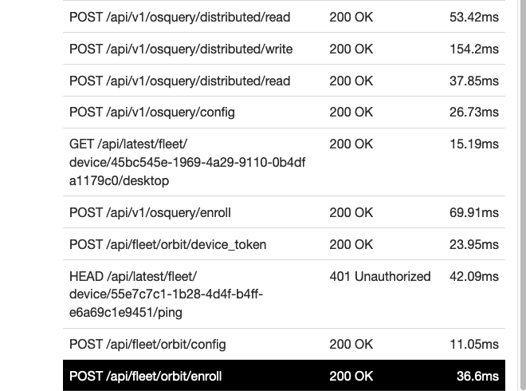

# Enrollment and check-in flows

## Enrollment

1. Orbit starts up on host
2. Create files on host
3. Send request to `/fleet/orbit/enroll`. Replies with `{"orbit_node_key": "somelongstringhere"}`.
4. Send request to `/fleet/orbit/config`. This returns notifications, if there are any TODO(JVE): is
   there anything else sent to host here?
5. Send the contents of `$ORBIT_ROOT_DIR/identifier` to `POST /fleet/orbit/device_token`. This
   identifier is the device auth token, which is written into the `host_device_auth` table and is
   used to authenticate this host on further calls.

## Check-in flows
- Distributed read
- Distributed write
- config (notifications)