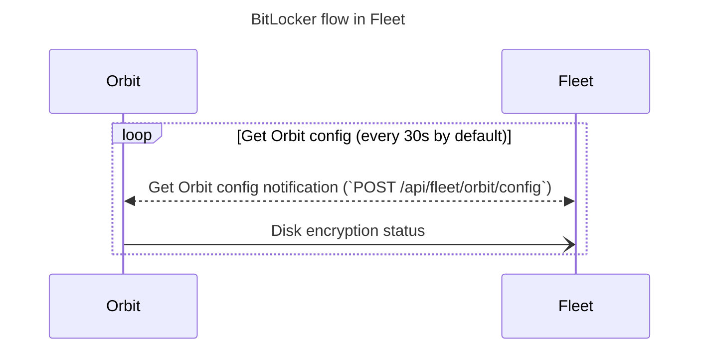

# BitLocker (Disk encryption on Windows)

BitLocker is Windows' disk encryption feature. See
https://learn.microsoft.com/en-us/windows/security/operating-system-security/data-protection/bitlocker/
for more background information

When you enable disk encryption in Fleet, BitLocker is used to accomplish the encryption.

