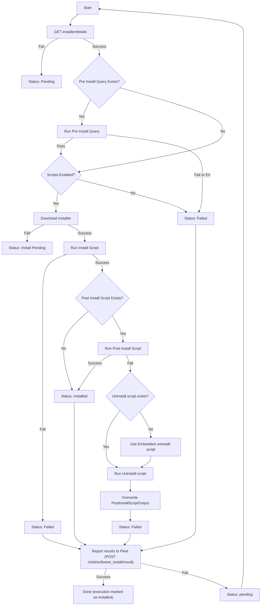

# Software Install Flow Diagram

```mermaid
graph TD
    Start --> ID[GET installer/details]
    %% TODO: what is retry behavior during pending status?
    ID -->|Fail| StatusPending[Status: Pending]
    ID -->|Success| PIE{Pre Install Query Exists?} 
    PIE -->|Yes| RPIE[Run Pre Install Query]
    RPIE -->|Pass| SE
    RPIE -->|Fail or Err| StatusFailed[Status: Failed]
    PIE -->|No| SE{Scripts Enabled?}
    SE -->|Yes| DI[Download Installer]
    SE -->|No| StatusFailed
    DI -->|Fail| RE[Status: Install Pending]
    DI -->|Success| IS[Run Install Script]
    IS -->|Fail| StatusFailed2[Status: Failed]
    IS -->|Success| PoIE{Post Install Script Exists?}
    PoIE -->|No| StatusInstalled
    PoIE -->|Yes| RPoIE[Run Post Install Script]
    RPoIE -->|Success| StatusInstalled[Status: Installed]
    RPoIE -->|Fail| USE{Uninstall script exists?}
    USE -->|Yes| RUS[Run Uninstall script]
    USE -->|No| RUS2[Use Embedded uninstall script]
    RUS --> OW[Overwrite PostInstallScriptOutput]
    RUS2 --> RUS
    OW --> Failed[Status: Failed]
    RR["Report results to Fleet (POST /orbit/software_install/result)"]
    StatusFailed --> RR
    StatusInstalled --> RR
    StatusFailed2 --> RR
    Failed --> RR
    RR --> |Success| D["Done (execution marked as installed)"]
    RR --> |Fail| SP[Status: pending]
    SP --> Start
```
