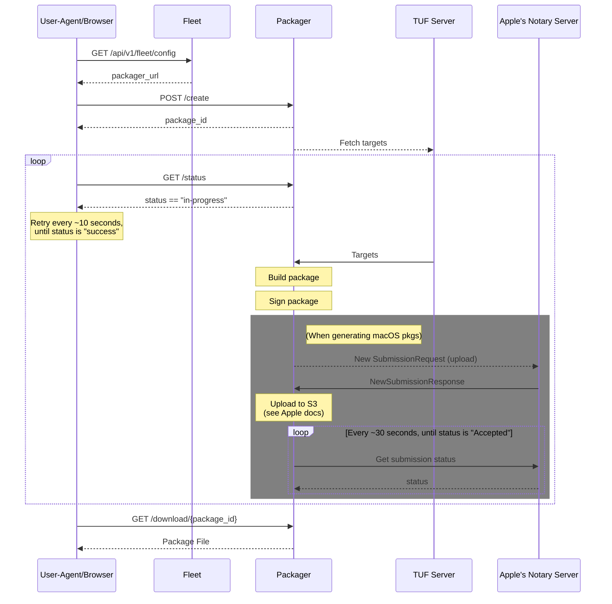

# Fleet Installers

## Goal

[#5757](https://github.com/fleetdm/fleet/issues/5757)

```
As a user, I want to be able to download a Fleet-osquery installer (aka Orbit) in the Fleet UI
so that I can add hosts to Fleet without having to know how to successfully generate an
installer with the `fleetctl package` command.

Figma wireframes: https://www.figma.com/file/hdALBDsrti77QuDNSzLdkx/?node-id=6740%3A267448
```

## Command `fleetctl package`

Currently users use the `fleetctl package` command to generate Fleet-osquery packages.

The `fleetctl package` command has the following *required* configuration that is specific to a "Fleet Deployment":
- `--fleet-url`: The URL that the hosts will use to connect to the Fleet server.
- `--enroll-secret`: Global or team enroll secret to use when enrolling the host to Fleet.

As the goal states, we would like to provide functionality in Fleet to automatically generate and download such packages from the UI.

## How

We can implement such functionality in two ways:

- Option A. Fleet Server to generate such packages itself.
- Option B. Separate "Packager" service.

There's a lot of platform specific logic and tooling involved in packaging, and one of Fleet's primary goals is to keep deployment/infrastructure simple for On-Prem deployments.
To that end, we believe the best option is Option B, implementing the functionality as a separate service.

## Packager Service

The "Fleet Packager" service will implement all the package generation logic. Think of it like offering the `fleetctl package` command functionality but as a REST service.

```mermaid
graph LR;
    A[User-Agent/<br>Browser]-- Fleet API -->B[Fleet<br>UI/Server]
    A-- Packager<br>API -->C
    subgraph FleetDM Hosted Infrastructure
        direction LR
        subgraph <br>pkg.fleetctl.com
            direction TB;
            C[Packager<br>Service]
            packages[(Generated<br>packages)]
        end
        direction TB;
        D[tuf.fleetctl.com]    
        C-- Fetch<br>Targets -->D;
    end
    E[Apple's <br> Notary <br> Server]
    C-- Notary<br>API ---->E
```

Configurations:
- The `Fleet UI/Server` will allow configuring the "Fleet Packager" URL (default value being FleetDM Hosted Packager service, something like `pkg.fleetctl.com`).
- The `Packager Service` will allow configuring an alternative TUF server URL and TUF roots via an environmental variable (default value being FleetDM Hosted TUF, `tuf.fleetctl.com`). 

Both of these configurations will allow users to deploy their own `Packager Service`.

### Storage

The generated packages should be stored on encrypted disk and will expire (will be deleted) after a configurable amount of time (default 30m).
There are two reasons we want to expire generated packages soon:
1. To not store user credentials for too long (URL and enroll secret).
2. To free up space.

We can use "Storage Optimized" instances (see https://aws.amazon.com/ec2/instance-types/).

#### Notes

- As a possible future optimization, we could use "Memory Optimized" instances and store packages in RAM instead of using hard disk.
- S3 could also be used to store such packages, but disk storage is needed to generate the packages in the first place. 
So hard-disk will be a dependency anyways (and ideally we would like these packages with sensitive credentials to be stored in one location).
- From Roberto: "sounds like the main bottleneck here will be transferring the data over the network to the user doing the request.".
In other words, we should apply all optimizations on the network (like caching, reducing package size, etc.), that will be our main bottleneck
(not CPU or hard-disk access).

#### Back of the Envelope

- `.pkg`s use ~70MB of storage.
- `.msi`s use ~20MB of storage.
- `.deb`s and `.rpm`s use ~75MB of storage.

Assuming the worst case of ~75 MB for each package:
If we have a ~30TB hard disk, it would allow storing ~400_000 packages simultaneously.

### Network & Credentials

The service will require network access to (URLs provided via config):

- TUF server.
- Apple's Notary Server (for generating `.pkg`).

The packaging service will need the following credentials (provided via config):

- Apple credentials:
  - Codesign identity.
  - Username and Password for notarization.
- TUF server update roots (default will be the hardcoded one for FleetDM's hosted TUF server, tuf.fleetctl.com).

### Packager REST API

For the MVF (Minimum Viable Feature) we'll need three APIs: one for creation/submission, one for checking status and another one for the actual download of the package. 
All the APIs must be rate-limited to prevent abuse of the system.

#### 1. Package creation

`POST /create`

This endpoint will perform the following operations:
1. Check if a `package_id` already exists (and hasn't been expired) with the exact same arguments, if so, return HTTP 200 with the `package_id`.
2. Generate a [random](https://en.wikipedia.org/wiki/Universally_unique_identifier#Version_4_(random)) `package_id`.
3. Dispatch the creation of a package with ID set to `package_id` and the given request parameters.
4. Return HTTP 200 with the `package_id`.

This endpoint, which is the entrypoint, should be rate-limited by IP.

##### Request Fields

| Name              | Type    | In   | Description                                                                            |
| ----------------- | ------- | ---- | -------------------------------------------------------------------------------------- |
| type              | string  | body | **Required.** One of the following values "pkg", "msi", "deb", "rpm"                   |
| fleet_url         | string  | body | **Required.** The URL that the hosts will use to connect to the Fleet server           |
| enroll_secret     | string  | body | **Required.** Global or team enroll secret to use when enrolling the host to Fleet     |
| retry             | boolean | body | Retry a failed package generation (default: false)                                     |
| fleet-certificate | string  | body | Server certificate chain                                                               |
| insecure          | boolean | body | Disable TLS certificate verification (default: false)                                  |
| osqueryd-channel  | string  | body | Update channel of osqueryd to use (default: "stable")                                  |
| desktop-channel   | string  | body | Update channel of desktop to use (default: "stable")                                   |
| orbit-channel     | string  | body | Update channel of Orbit to use (default: "stable")                                     |
| disable-updates   | boolean | body | Disable auto updates on the generated package (default: false)                         |
| debug             | boolean | body | Enable debug logging in orbit (default: false)                                         |
| fleet-desktop     | boolean | body | Include the Fleet Desktop Application in the package (default: false)                  |
| update-interval   | string  | body | Interval that Orbit will use to check for new updates (10s, 1h, etc.) (default: 15m0s) |
| osquery-flagfile  | string  | body | Flagfile to package and provide to osquery (default: empty)                            |
| service           | boolean | body | Install with a persistence service (launchd, systemd, etc.) (default: true)            |

##### Error in Package Generation

When the set of arguments correspond to a `package_id` that failed to generate, then:
- If `retry` is `false` (default) it will return such `package_id`.
- If `retry` is set to `true`, the service will dispatch a new package build and return a new `package_id`.

##### Response Fields

| Name              | Type    | In   | Description                      |
| ----------------- | ------- | ---- | -------------------------------- |
| package_id        | string  | body | ID of the package being created. |

#### 2. Package Status Check

`GET /status`

This endpoint allows checking the status of a package being created.
Clients can poll for the status of a package using this API.

This endpoint should be rate-limited by `package_id`.

##### Request Fields

| Name              | Type    | In    | Description                                                              |
| ----------------- | ------- | ----- | ------------------------------------------------------------------------ |
| package_id        | string  | query | **Required.** ID of the package created with `POST /create` |

##### Response Fields

| Name              | Type    | In   | Description                                                                  |
| ----------------- | ------- | ---- | ---------------------------------------------------------------------------- |
| status            | string  | body | One of the following values "success", "fail", "in-progress", "expired"      |
| download_url      | string  | body | Set to the download URL if status field is "success"                         |
| stage             | string  | body | Set to a "stage" string if status field is "in-progress" (e.g. "notarizing") |
| logs              | string  | body | Contains logs if status is "failed"                                          |

#### 3. Package Download

`GET /download/{package_id}`

This is the API to download the generated package.

This endpoint should be rate-limited by `package_id`.

## Sequence Diagram

Following is the sequence diagram for the happy-path.



## Package Generation Time

Some back of the envelope calculations for the time the user clicks Download to the time the installer is downloaded fully.

### macOS

Test running `time fleetctl package --type=pkg --fleet-url=... --enroll-secret=... --fleet-desktop` (from Argentina).

1. Download packages from TUF and generate raw `.pkg` (16 seconds).
2. Signing (assuming this is negligible).
3. Notarization (~3 minutes, from Zach's tests mentioned below).
4. Download from Packager service (~15 seconds to download a 100 MB file).

Total: ~4 minutes

### Windows

Test running `time fleetctl package --type=msi --fleet-url=... --enroll-secret=... --fleet-desktop` (from Argentina).

1. Download packages from TUF and generate raw `.msi` (~18 seconds).
2. Download from Packager service (~15 seconds to download a 100 MB file).

Total: ~30 seconds.

### Linux

Test running `time fleetctl package --type={deb|rpm} --fleet-url=... --enroll-secret=... --fleet-desktop` (from Argentina).

1. Download packages from TUF and generate raw `.{deb|rpm}` (~30 seconds).
2. Download from Packager service (~30 seconds to download a 200 MB file).

Total: ~1 minute.

### Possible Download Time Optimization

- The Packager service could cache the TUF targets for a couple of minutes (given that they usually change ~ every three weeks).
This would reduce 15s-30s the time it takes to generate the packages.

## Platform Specifics

### macOS

There are two operations **required** to have a proper macOS installer package (`.pkg`):

1. Code signing: Used by Gatekeeper to verify the author of the package (identified by Developer ID)
2. Notarization: "Gives users more confidence that the Developer ID-signed software you distribute has been checked by Apple for malicious components."

The packages are composed by three TUF targets: osquery, Orbit and Fleet Desktop.

All the TUF targets served by FleetDM's TUF server are signed and notarized:

- osquery: signed and notarized .app (by Osquery)
- Orbit: signed and notarized executable (by Fleet DM)
- fleet-desktop: signed and notarized .app (by Fleet DM)

Even if all targets are signed and notarized we must still sign and notarize the `.pkg` installer as a whole, see [#122045](https://developer.apple.com/forums/thread/122045).

#### Notarization

The Notarization process can be summarized to the following steps:

1. Submit/Upload the **signed** package to the Notary Server.
2. Notary server performs automated security checks.
3. Notary generates a ticket, publishes ticket online (so that Gatekeeper can find it) and returns the ticket.
4. Ticket can be stapled to your software to let Gatekeeper know it has been notarized.

##### Notarization Limitations

- Notarization completes for most software within 5 minutes, and for 98 percent of software within 15 minutes. Thus our workflow must support users leaving the "Add hosts" page and returning later.
- To help avoid long response times they suggest: to "limit notarizations to 75 per day." So it doesn't look like a hard limit, just something that would help reduce upload response times.
Source: https://developer.apple.com/documentation/security/notarizing_macos_software_before_distribution/customizing_the_notarization_workflow
Though Zach has ran the following test with no issues:
> I was able to Notarize ~200 packages in under 12 hours yesterday with no apparent limiting. 
> Note this was using the older Notarization API (slower, about 3 mins per notarization).

#### Future Optimizations for Notarization

This is the current structure of a `.pkg` generated with `fleetctl package` (unsigned and unnotarized):
```sh
pkg_expanded
├── Distribution
└── base
    ├── Bom
    ├── Library
    │   └── LaunchDaemons
    │       └── com.fleetdm.orbit.plist
    ├── PackageInfo
    ├── Payload
    ├── Scripts
    │   └── postinstall
    └── opt
        └── orbit
            ├── bin
            │   ├── desktop
            │   │   └── macos
            │   │       └── stable
            │   │           ├── Fleet Desktop.app
            │   │           │   └── Contents
            │   │           │       ├── CodeResources
            │   │           │       ├── Info.plist
            │   │           │       ├── MacOS
            │   │           │       │   └── fleet-desktop
            │   │           │       └── _CodeSignature
            │   │           │           └── CodeResources
            │   │           └── desktop.app.tar.gz
            │   ├── orbit
            │   │   └── macos
            │   │       └── stable
            │   │           └── orbit
            │   └── osqueryd
            │       └── macos-app
            │           └── stable
            │               ├── osquery.app
            │               │   └── Contents
            │               │       ├── Info.plist
            │               │       ├── MacOS
            │               │       │   └── osqueryd
            │               │       ├── PkgInfo
            │               │       ├── Resources
            │               │       │   └── osqueryctl
            │               │       ├── _CodeSignature
            │               │       │   └── CodeResources
            │               │       └── embedded.provisionprofile
            │               └── osqueryd.app.tar.gz
            ├── certs.pem
            ├── osquery.flags
            ├── secret.txt
            ├── staging
            └── tuf-metadata.json
```

##### Remove Unnecessary Files

The `osqueryd.app.tar.gz` and `desktop.app.tar.gz`  files are used by Orbit to compare with remote targets when checking for updates.
A future optimization could replace those `.app.tar.gz` files with a txt file with the hash of such file
(would reduce ~30MB of uncompressed size reduction for the `.pkg`).

##### Notarized Package without Configs

The only files that really change when users generate a pkg are:
- Library/LaunchDaemons/com.fleetdm.orbit.plist (contains the configuration, like URLs, update channels, etc.)
- opt/orbit/secret.txt (enroll secret)

Another idea to consider could be packaging and notarizing code and scripts, but leave specific configs out of the `.pkg`.
Problem: We would need to solve how to apply the additional configuration (the two files above) to installed packages.

From [#122512](https://developer.apple.com/forums/thread/122512):

> I thought there might be some apple approved way of adding extra information to a package.

>> No. The notarisation ticket covers the code signature of the package, and the code signature of the package covers the
>> effective contents of that package. This is pretty much required. For example, one of your goals is to tweak the install scripts,
>> but such scripts execute with enormous privileges and thus must be covered by the code signature, and thus covered by the notarisation ticket.

---

> Is there a Apple recommended method to provide custom packages for different customers?
> Some way to add additional parameters to a package without breaking the notarizartion/signing of it?

>> Option 2) Change your distribution strategy to distribute a static executable.
>> Download any customer-specific resources and store them in /Library/Application Support.

### Windows

Currently we don't support signing of the MSI installers in `fleetctl package`. But this functionality could be added both to the command and the service.
From Zach:
> When we decide to support this (which we should do soon), we can use https://github.com/mtrojnar/osslsigncode.

We should also research https://github.com/sassoftware/relic (it mentions Windows signature support)

## Service Implementation

It looks like we will be able to implement the first iteration of the Packager Service as a Go service running on a Linux server.
The only limitation will be macOS stapling (see below).

### Scale

MVP of the service will support running one instance of the service. Probably ok as the majority of the load will be IO, network and disk.

Nothing prevent us from horizontal scaling by sharding requests by `package_id` (or a `client_id`) in the future.

### State storing

For the first iteration, we should pick one of the following simple options:
1. Store state in-memory. Simplest, but not resilient to crashes/restarts.
2. Store state in an embedded disk database, such as:
   - https://github.com/dgraph-io/badger (Pure Go)
   - https://github.com/etcd-io/bbolt (Pure Go)
   - Sqlite3 (Cgo 🙈), see https://www.youtube.com/watch?v=XcAYkriuQ1o

- We already need disk storage for storing the packages, so option (2) is feasible to do from the get-go.

### macOS requirements 

- Code Signing: Looks like https://github.com/sassoftware/relic would allow us to sign a `.pkg` in pure Go.
- Notarization: We can implement a Go package that uses the new [Notary API](https://developer.apple.com/documentation/notaryapi).
Limitation: Such API does not offer a way to "staple" the package, thus we would depend on the `stapler` tool for this last step (such tool is only available on macOS).
So if we run the Packager service on a Linux server, we won't be able to support stapling. However, it seems stapling is recommended but not a must, see [#116812](https://developer.apple.com/forums/thread/116812).
> If Gatekeeper can’t find a notarisation ticket stapled to the item, it attempts to get that ticket from the Apple notarisation servers.
> Assuming the Mac is online, this typically works and thus the Gatekeeper check succeeds.

### Windows requirements

We need Docker to generate the MSI for Windows (the `fleetctl package` command uses the `fleetdm/wix:latest` docker image to generate them).
We will need to pre-fetch such Docker Image during initialization (to not delay the first request indefinitely).

PS: We could alternatively try a PoC that uses Wine+WiX on Linux without Docker?

### Lambda?

Depending on dependencies we could implement the service as a Lambda Function. Though we could make this a full service to not be tied to a specific provider.

## Security / Threat model

What could go wrong?

### Fleet Credentials

The MVP of the service will have access to:
- Fleet's Developer Signing Key (for `.pkg` signing).
- Fleet's Apple Connect Username and Password (for `.pkg` notarization).

From Guillaume:
> If someone manages to compromise this service, they could potentially sign AND notarize malware under Fleet's identity.

Remediation: Fleet credentials should be stored on a secrets manager, e.g. [AWS Secrets Manager](https://docs.aws.amazon.com/secretsmanager/latest/userguide/intro.html).

### User Credentials

The Fleet-URL and enroll secret are stored within the generated packages.
If the unexpired installers are leaked, users' Fleet URLs and enroll secrets would be compromised.
Attackers could enroll their devices to users' Fleet deployment.

An attacker with access to an enroll secret can perform the following attacks:
- Feed a Fleet server with fake data (possibly DoS the service).
- Leak the queries configured in Fleet.

Remediation: All generated packages should be securely deleted when they expire.

## Sandbox/Demo & Cloud

The design supports the following deployments:

- Fleet On-Prem running with FleetDM's Packager and TUF.
- Fleet On-Prem running with On-Prem Packager with FleetDM's TUF server.
- Fleet On-Prem running with On-Prem Packager with On-Prem TUF server.
- Fleet Sandbox/Demo & Cloud (basically all hosted by FleetDM).

## New Fleetctl Command

We could add new flags (e.g. `--remote`) to `fleetctl package` to generate the packages using a Packager Service instead of building locally.