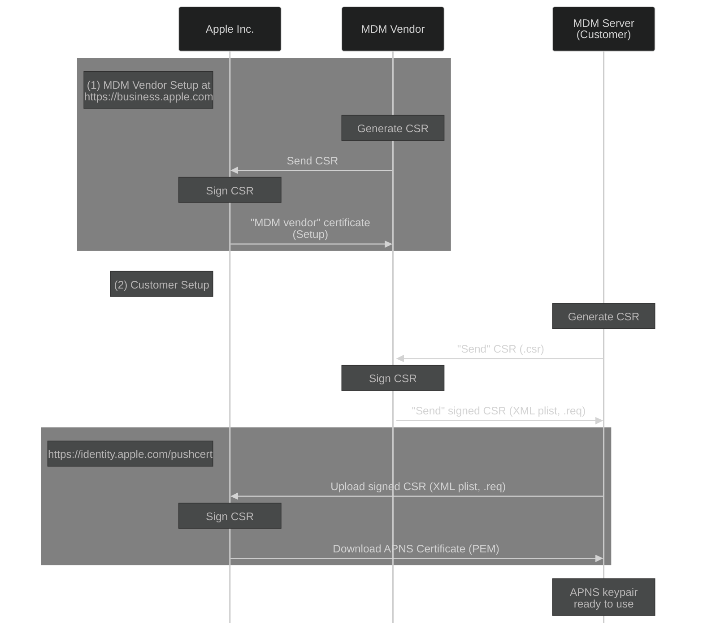

# Apple MDM

This proposal aims to document the plan to make Fleet an MDM server for Apple devices (see [MDM-Protocol-Reference][0]).

## MVP Requirements

- *On-premise*, meaning customers can run Fleet with MDM functionality on their infrastructure.
- Solution must be *100% Open Source*.
- *Ease of deployment* (as few new dependencies as possible).
- MVP will be headless:
    - MDM functionality will be available via `fleetctl` commands.
    - However, all new APIs must be designed+implemented to be consumed by UI at a later iteration.
- Apple credentials will not be stored in MySQL in any form. Fleet will receive the credentials via environment variables. (The customer will be in charge of storing them securely on a KMS.)
    - We will document what configuration needs secure storage/management.

## Architecture

### MDM Functionality and Services

We will make use of the most widely-used Open Source MDM project: [MicroMDM][1].

To implement an MDM server we will embed the following three "nanoMDM" modules into Fleet:
1. SCEP service: https://github.com/micromdm/scep
2. MDM core: https://github.com/micromdm/nanomdm
3. DEP functionality: https://github.com/micromdm/nanodep

Such modules contain all the functionality and APIs/endpoints needed to implement an MDM server.

For more information around "micro" vs "nano" MDM, see [Introducting NanoMDM][2].

## Server Setup

### Apple APNS Certificate and Private Key

Apple's MDM protocol uses the Apple Push Notification Service (APNS) to deliver "wake up" messages to managed devices.
An "MDM server" needs access to a APNS certificate specifically issued for MDM management; such APNS certificate must be issued by an "MDM vendor".

Here's a sequence diagram with the three actors: Apple Inc., an MDM Vendor, a Customer (MDM Server).

- The "MDM Vendor Setup" flow (1) is executed once by the "MDM Vendor".
- The "Customer Setup" flow (2) is executed by customers when they are setting up their MDM server.

The goal is for the "Fleet DM" organization to become an "MDM vendor" that issues CSRs to customers, which allows them to generate "APNS certificates" for their MDM deployments.

For the purposes of designing a PoC, we used the [MDMCert Download][4] service as an "MDM vendor".
See [MDMCert.Download Analysis](mdmcert.download-analysis.md) for more details on the process.

#### MVP

The MDM APNS certificate provisioning will be manual on MVP:
- Customers will use `fleetctl` commands that will mimick `mdmctl mdmcert.download` commands (see [MDMCert.Download Analysis](mdmcert.download-analysis.md)).
- Fleet DM operators will perform the steps shown in the diagram above manually by running a new command line tool (under `tools/`).

Github Epic issue: TODO(lucas).

## References

[0]: https://developer.apple.com/business/documentation/MDM-Protocol-Reference.pdf
[1]: https://github.com/micromdm
[2]: https://micromdm.io/blog/introducing-nanomdm/
[3]: https://developer.apple.com/documentation/usernotifications/setting_up_a_remote_notification_server/sending_notification_requests_to_apns/
[4]: https://mdmcert.download/