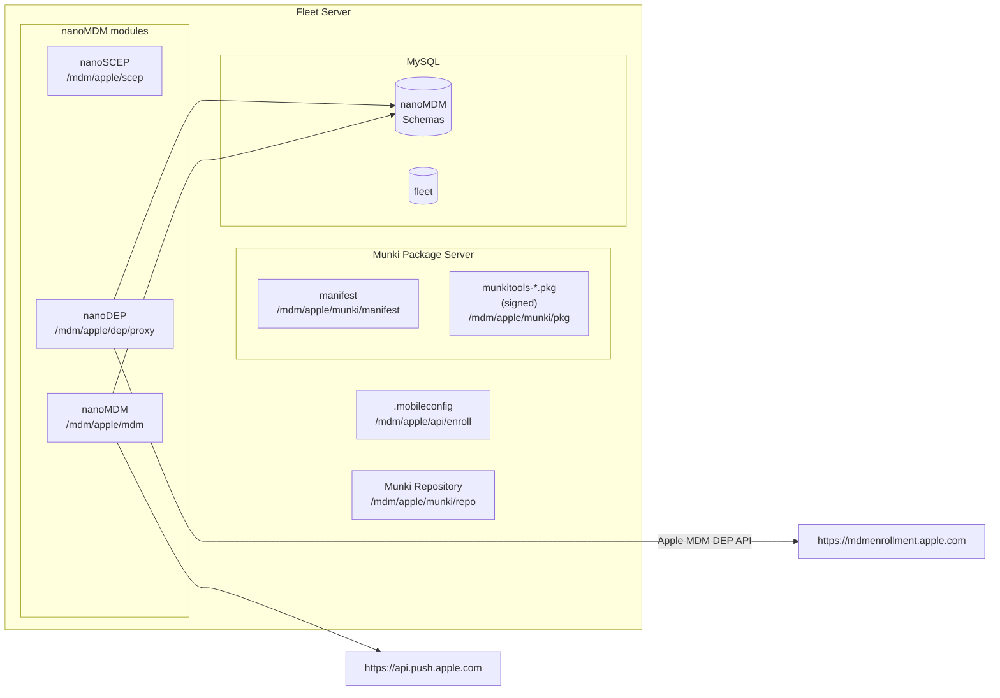

# Fleet MDM Plan

This proposal aims to document the plan to make Fleet an MDM server for Apple devices (see [MDM Protocol Reference](https://developer.apple.com/business/documentation/MDM-Protocol-Reference.pdf)).

## MVP Requirements

- *On-premise*, meaning customers can run Fleet with MDM functionality on their infrastructure.
- Solution must be *100% Open Source*.
- *Ease of deployment*, meaning as few new dependencies as possible.
- MVP will be headless:
    - All MDM functionality will be available via `fleetctl` commands only.
    - However, all new APIs must be designed+implemented to be consumed by UI at a later iteration.
    - Initially there won't be `edit` commands for entities, the admin will have to use `list`, `delete` and `create`...
- Apple credentials should not be stored in MySQL or they should be stored encrypted. Fleet should receive key material via environment variables. (The customer will be in charge of storing them securely on a KMS.)
    - We will document what configuration needs secure storage/management.

## Deliverable

🐶 Dogfood-MVP: Fleet with MDM functionality to be used by Fleet's dogfood instance.
Agreed upon simplifications:
- We will not make use of the "Teams" feature for MDM. In other words, all MDM settings and entities will be applied globally.
- All MDM interface will be through `fleetctl` commands: `fleetctl apple-mdm <commands>`.

This document describes the plan for the "Dogfood-MVP" deliverable. 

The PoC can be found in: https://github.com/fleetdm/fleet/tree/apple-mdm

## High-level Architecture

### MDM Functionality and Services

We will make use of the most widely-used Open Source MDM project: [MicroMDM](https://github.com/micromdm).

To implement an MDM server we will embed the following three "nanoMDM" modules into Fleet:
1. SCEP service: https://github.com/micromdm/scep
2. MDM core: https://github.com/micromdm/nanomdm
3. DEP functionality: https://github.com/micromdm/nanodep

Such modules contain all the functionality and APIs/endpoints needed to implement an MDM server.

For more information around "micro" vs "nano" MDM, see [Introducting NanoMDM](https://micromdm.io/blog/introducing-nanomdm/).

Architecture of the current PoC:

## Plan for Dogfood-MVP

### Setup

See [Fleet MDM Setup](./Fleet-MDM-Setup.md).

### Authority

Only global admins will be allowed to use MDM functionality.

### MDM Features

#### Enrollments

"Enrollments" hold some settings for devices that will be enrolled to MDM.
The MDM "enrollments" will allow Fleet to automatically enroll devices to specific teams (which then allows for applying specific MDM settings depending on the team).

For Dogfood-MVP Fleet will allow creating global enrollments only (team support will be added at a subsequent iteration).
Users will be able to create the two following types of enrollments:
- Global manual enrollment.
- Global DEP enrollment.

We'll have a new `apple_manual_enrollments` table with the following fields:
- ID (we can deduce a "Enroll URL" from this.)
- Name
- Configuration (JSON?)
- Team (or global)
- Authentication configuration (initially NULL, meaning not authenticated)

We'll have a new `apple_dep_enrollments` table with the following fields:
- ID
- Name
- Configuration (JSON?)
- Team (or global)
- Authentication configuration (initially NULL, meaning not authenticated)
- Reference to `dep_names` table (will be NULL at first).

fleetctl commands (and APIs):
- create enrollments:
	`fleetctl apple-mdm enrollments create --configuration=<TBD> --name=Foo`

- list enrollments: would list the "global" manual enroll and the DEP enroll.
	`fleetctl apple-mdm enrollments list`

##### DEP Enrollment Setup

These commands use the <ENROLLMENT_ID>, which is the `enrollments.ID` (can be obtained via `fleetctl apple-mdm enrollments list`).
The token downloaded from https://business.apple.com basically links a "DEP enrollment" in Fleet (entry in `apple_dep_enrollments`) to what Apple calls an "MDM Server" in https://business.apple.com.

###### 1. `fleetctl apple-mdm enrollments dep set-token setup --enrollment=<ENROLLMENT_ID>`

0. Checks the `ENROLLMENT_ID` is a DEP enrollment.
1. Generates `fleet-mdm-apple-dep.pem` and `fleet-mdm-apple-dep.key`
	- Stores `fleet-mdm-apple-dep.pem` as a file
	- Keeps `fleet-mdm-apple-dep.key` in `~/.fleet/config` under <ENROLLMENT_ID>

###### 2. Upload PEM to Apple

User uploads `fleet-mdm-apple-dep.pem` to https://business.apple.com, and downloads a `*.p7m` file, let's call it `fleet-mdm-apple-dep-auth-token-encrypted.p7m`.

##### 3. Finalize DEP setup

3. `fleetctl apple-mdm enrollments dep set-token finalize --enrollment=<ENROLLMENT_ID> --encrypted-auth-token=fleet-mdm-apple-dep-auth-token-encrypted.p7m`
	
0. Checks the `ENROLLMENT_ID` is a DEP enrollment.
1. Decrypts the provided `fleet-mdm-apple-dep-auth-token-encrypted.p7m` with the `fleet-mdm-apple-dep.key` that corresponds to `<ENROLLMENT_ID>` from `~/.fleet/config`.
2. Calls new Fleet API that:
	1. Apply DEP configuration using token (loaded from apple_dep_enrollmentsID==<ENROLLMENT_ID>) and get a "depProfileUUID".
	1. Creates `dep_names` entry with such token + depProfileUUID (as assigner_profile_uuid) (encryption of the token in MySQL will be a TODO.).
	2. Link such `dep_names` entry to the given `<ENROLLMENT_ID>`.
4. If all looks good, then it removes `fleet-mdm-apple-dep.key` from `~/.fleet/config`.

#### Custom Commands for DEP Enrollments

- list dep devices: would list DEP devices of that enrollment and their status. (would use the DEP proxy API).
	`fleetctl apple-mdm enrollments dep list <ENROLLMENT_ID>`
- sync dep profiles: would make sure to set the enroll profile for new devices a DEP enrollment (Fleet would sync all DEP enrollments automatically every 5m).
	`fleetctl apple-mdm enrollments dep sync-profiles <ENROLLMENT_ID>`

#### DEP Syncer

Fleet must start a "DEP syncer" routine for each entry in `apple_dep_enrollments` that has a non-NULL `dep_names` (period of 5m).

### HOSTS

Initially we want to account for Hosts that are MDM enrolled but not in osquery.
TODO(lucas): We'll need to test whether our system and UI supports a `hosts` entry w/ an empty `osquery_host_id`...

### MDM COMMANDS

These are one-off commands like "DeviceLock", "RestartDevice", etc.

fleetctl commands:
- send command:
	`fleetctl apple-mdm commands send --target-hosts=1,2,3 --command=foo.plist`
(fleetctl would be agnostic to contents of "foo.plist")
- list commands (with their status)
	`fleetctl apple-mdm commands list`

### MDM PROFILES

A profile is defined as:
- ID
- UUID
- Name
- Payload (raw XML plist)
- Team (NULL for global)

For MVP-dogfood we will only have global profiles, and as such, they are applied to all MDM enrolled hosts.

TODO(lucas): Stuff to solve around this feature:
So, we have a list of all the profiles to apply to devices, how does Fleet knows which profiles are
already deployed on a device and which aren't? (any APIs to poll that works at scale?, etc.)

fleetctl commands (and APIs) to:
- create global profiles
	`fleetctl apple-mdm profiles create --name="Chrome_Enrollment" --payload=foo.xml`
- list profile/s (displays their ID/UUID)
	`fleetctl apple-mdm profiles list`
- delete profiles
	`fleetctl apple-mdm profiles delete`
  TODO(lucas): It will delete the profile from all hosts.

### Application Deployment

#### Default applications to deploy

In the current PoC, after MDM enrollment of a device, Fleet will auto-push the following commands:
- "InstallApplication" to install Vanilla Munki.
- "InstallProfile" to configure Munki to connect to Fleet for software.

TODO(lucas): Should Fleet check if the device has Munki installed and is configured correctly and then send commands if it needs to?

##### Osquery

TODO(lucas): There's the goal of pushing orbit/osquery pkg to the instance right after MDM enroll (via Munki? or as a command).

### Admin Defined Applications

TODO(lucas): Munki...