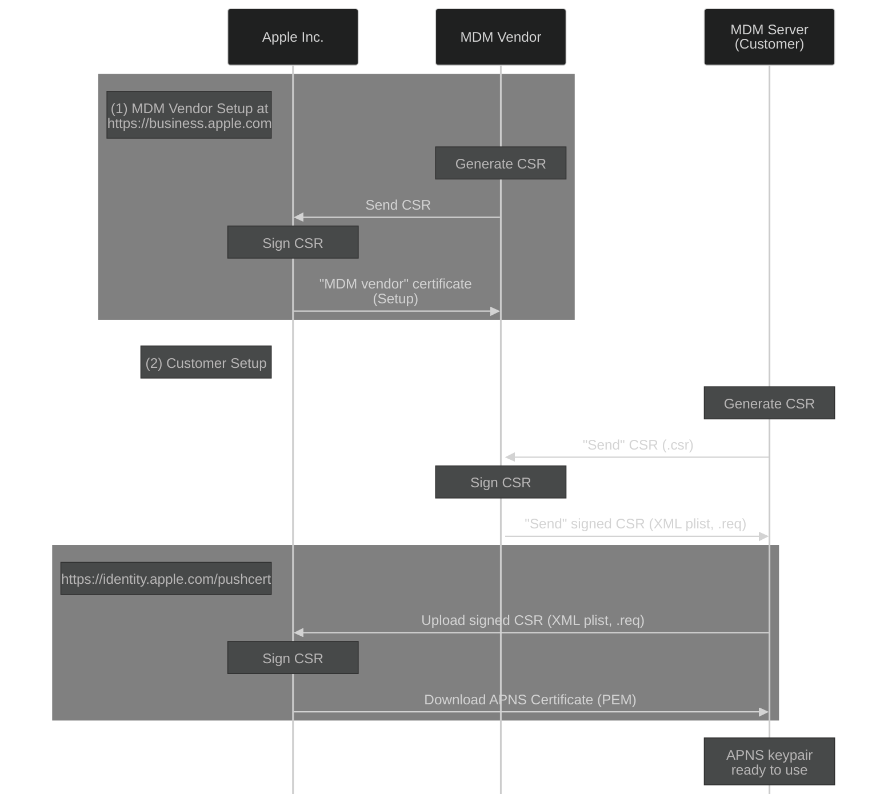

# Setup

The setup consists of configuring:
- The APNS certificate used by the MDM protocol.
- The SCEP certificate for enrollment.

We will define `fleetctl apple-mdm setup ...` commands to create/define all Apple/MDM credentials, that are then fed to the Fleet server.

## APNS

### Apple MDM APNS Setup

Apple's MDM protocol uses the Apple Push Notification Service (APNS) to deliver "wake up" messages to managed devices.
An "MDM server" needs access to a APNS certificate specifically issued for MDM management; such APNS certificate must be issued by an "MDM vendor".

Here's a sequence diagram with the three actors: Apple Inc., an MDM Vendor, a Customer (MDM Server).



- The "MDM Vendor Setup" flow (1) is executed once by the "MDM Vendor".
- The "Customer Setup" flow (2) is executed by customers when they are setting up their MDM server.

The goal is for the "Fleet DM" organization to become an "MDM vendor" that issues CSRs to customers, which allows them to generate "APNS certificates" for their MDM deployments.

For the purposes of designing a PoC, we used the https://mdmcert.download/ service as an "MDM vendor".
See [MDMCert.Download Analysis](./mdmcert.download-analysis.md) for more details on the process.

### APNS Setup with Fleet

The MDM APNS certificate provisioning will be manual on MVP:
- Customers will use `fleetctl` commands that will mimick `mdmctl mdmcert.download` commands (see [MDMCert.Download Analysis](mdmcert.download-analysis.md)).
- Fleet DM operators will perform the steps shown in the diagram above manually by running a new command line tool (under `tools/mdm-apple/mdm-apple-customer-setup`).

#### 1. Init APNS (Customer step)

`fleetctl apple-mdm setup apns init` 

The command will basically mimick [mdmctl mdmcert.download -new](https://github.com/micromdm/micromdm/blob/main/cmd/mdmctl/mdmcert.download.go).
Steps:
1. Generate a RSA Private key and certificate for signing and encryption. 
(Store them in `~/.fleet/config`, as there's no need to store these as files.). 
Let's call these "PKI" key and cert.
2. Generate RSA Push Private key and CSR. Store private key as file: `fleet-mdm-apple-apns-push.key`. 
TODO(lucas): Store private key encrypted with passphrase?
3. Also output:
- File fleet-mdm-apple-apns-setup.zip with:
	- fleet-mdm-apple-apns-push.csr
	- fleet-mdm-apple-apns-pki.crt
- Text to stdout that explains next step, something like:
	"Send zip to Fleet DM via preferred medium (e-mail, Slack)."

#### 2. New tool `tools/mdm-apple/mdm-apple-customer-setup` (Fleet DM representative step)

Usage: 
```
mdm-apple-customer-setup --zip fleet-mdm-apple-apns-setup.zip
```

Output:
- fleet-mdm-apple-apns-push-req-encrypted.p7
- Text to stdout that explains next step, something like:
	"Send generated file "fleet-mdm-apple-apns-push-req-encrypted.p7" back to customer via preferred medium (e-mail, Slack)."

#### 3. Finalize APNS (Customer step)

`fleetctl apple-mdm setup apns finalize --encrypted-req=fleet-mdm-apple-apns-push-req-encrypted.p7`

Output:
	- `fleet-mdm-apple-apns-push.req` file

If successful, it clears PKI key and cert from `~/.fleet/config`.

#### 4. Upload .req to Apple (Customer step)

Customer uploads `fleet-mdm-apple-apns-push.req` to https://identity.apple.com.

#### 5. Download .pem from Apple (Customer step)

Downloads the final APNS certificate, a `*.pem` file (let's call it `fleet-mdm-apple-apns-push.pem`).

The contents of `fleet-mdm-apple-apns-push.pem` and `fleet-mdm-apple-apns-push.key` are passed to Fleet as environment variables.

## SCEP

Apple's MDM protocol uses Client Certificates for client authentication. To generate Client Certificates, Apple's MDM protocol uses the [SCEP](https://en.wikipedia.org/wiki/Simple_Certificate_Enrollment_Protocol) protocol.

The setup for SCEP consists of generating the "SCEP CA" for Fleet.

### 1. Setup SCEP CA (Customer)

`fleetctl apple-mdm setup scep`

Generates SCEP CA and key:
- `fleet-mdm-apple-scep.key`
- `fleet-mdm-apple-scep.pem`

The contents of `fleet-mdm-apple-scep.pem` and `fleet-mdm-apple-scep.key` are passed to Fleet as environment variables.