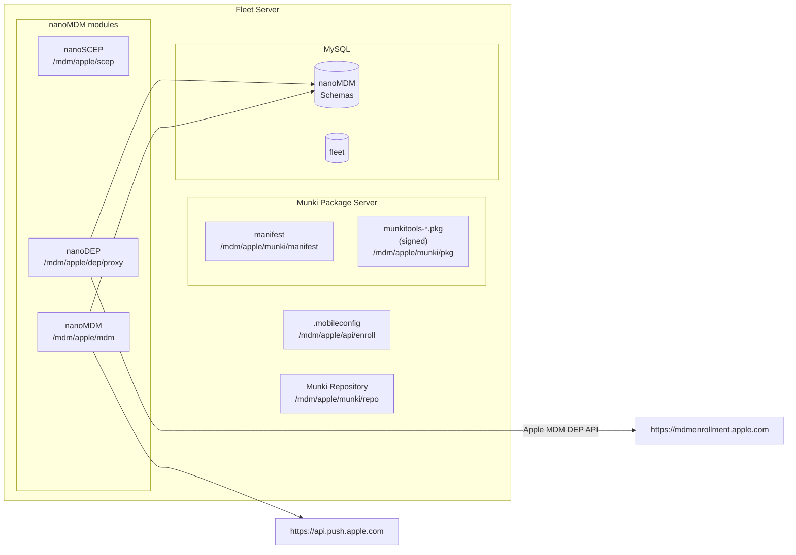

# Fleet MDM plan

This proposal aims to document the plan to make Fleet an MDM server for Apple devices (see [*MDM Protocol Reference*](https://developer.apple.com/business/documentation/MDM-Protocol-Reference.pdf)).

## MVP requirements

- **On-premises**, meaning customers can run Fleet with MDM functionality on their infrastructure.
- Solution must be **100% open source**.
- **Ease of deployment**, meaning as few new dependencies as possible.
- MVP will be headless:
    - All MDM functionality will be available via `fleetctl` commands only.
    - However, all new APIs must be designed and implemented to be consumed by UI at a later iteration.
    - Initially, there won't be `edit` commands for entities. The admin will have to use `list`, `delete`, and `create`...
- Apple credentials should not be stored in MySQL or they should be stored encrypted. Fleet should receive key material via environment variables. (The customer will be in charge of storing them securely on a KMS.)
    - We will document what configuration needs secure storage/management.

## Deliverable

🐶 Dogfood-MVP: Fleet with MDM functionality to be used by Fleet's dogfood instance.
Agreed upon simplifications:
- We will not make use of the "teams" feature for MDM. In other words, all MDM settings and entities will be applied globally.
- All MDM interface will be through `fleetctl` commands: `fleetctl apple-mdm <commands>`.

This document describes the plan for the "Dogfood-MVP" deliverable. 

The PoC can be found in: https://github.com/fleetdm/fleet/tree/apple-mdm.

## Dependencies

- MySQL >= 8.0.19 (because nanoMDM modules require it)
- S3 object storage (for Munki).

## High-level architecture

### MDM functionality and services

We will make use of the most widely-used open-source MDM project: [MicroMDM](https://github.com/micromdm).

To implement an MDM server, we will embed the following three "nanoMDM" modules into Fleet:
1. SCEP service: https://github.com/micromdm/scep
2. MDM core: https://github.com/micromdm/nanomdm
3. DEP functionality: https://github.com/micromdm/nanodep

Such modules contain all the functionality and APIs/endpoints needed to implement an MDM server.

For more information around "micro" vs "nano" MDM, see [*Introducting NanoMDM*](https://micromdm.io/blog/introducing-nanomdm/).

Architecture of the current PoC:

## Plan for Dogfood-MVP

### Setup

See [Setup](./setup.md).

### Authority

Only global admins will be allowed to use MDM functionality.

### Enrollments

See [Enrollments](./enrollments.md).

### DEP

See [DEP](./dep.md)

### Hosts

Initially, we want to account for hosts that are MDM enrolled but not in osquery.
TODO(Lucas): We'll need to test whether our system and UI support a `hosts` entry w/ an empty `osquery_host_id`...

### Commands

See [MDM Commands](./commands.md)

### Profiles

See [MDM Profiles](./profiles.md)

### Application deployment

See [Application deployment](./application-deployment.md).