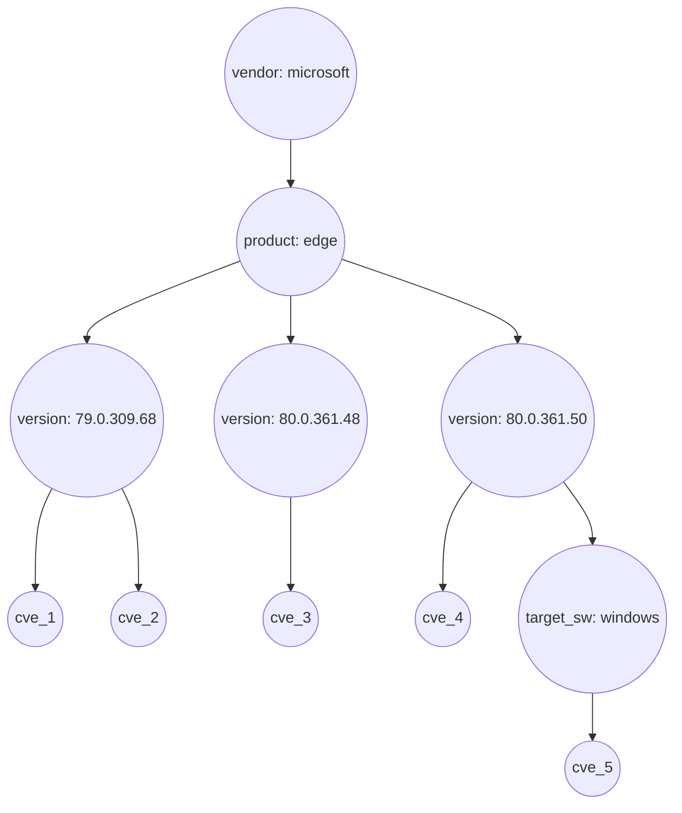
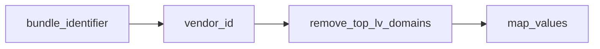
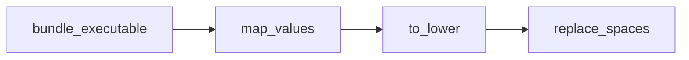

# Improving vulnerability detection for MacOS

[6001](https://github.com/fleetdm/fleet/issues/6001) identified some problems with our
current approach to vulnerability detection on MacOS:

- The version reported by software does not fit the standard format. For example, Zoom reports the version as 5.8.3 (2240).
- The app name includes extra terms that don't appear in the title. For example, zoom.us is treated
  as zoom us (2 terms) and does not match the title commonly used for zoom eg "Zoom 4.6.9 for macOS"
  or "Zoom Meetings 5.8.0 for macOS".
- Sometimes the CPE dictionary is incomplete. For example, CVE-2021-24043 should have a matching CPE `cpe:2.3:a:whatsapp:whatsapp:2.2145.0:*:*:*:desktop:*:*:*`, but it is absent. Also not that it would not match on windows because target_sw is empty, but we try to match on windows*. Removing the target_sw would lead to many false positives.

Our current approach to CPE binding consists of matching the `software name` against the `CPE title` along with the `software version`. Instead, I propose we
try to match the software vendor and name parts against the CPE vendor and product parts (standardizing the values when
needed) and then we can programmatically look at the version (and the rest of the CPE parts) to
determine what CVEs match a given CPE. In other words, instead of looking at CPEs as just strings,
we should be looking at them as sets:

So this:

```
cpe:2.3:a:microsoft:edge:79.0.309.68:*:*:*:*:*:*:*
cpe:2.3:a:microsoft:edge:80.0.361.48:*:*:*:*:*:*:*
cpe:2.3:a:microsoft:edge:80.0.361.50:*:*:*:*:*:*:*
cpe:2.3:a:microsoft:edge:80.0.361.50:*:*:*:*:windows:*:*
```
Can be visualized as this:



So having version `80.0.361.50` of `Edge` installed on MacOS should only return `cve_4` but having
the same program in Windows should return both `cve_4` and `cve_5`.

So basically our vulnerability detection problem can be broken down into two sub-problems:
1. Binding the software `vendor` and `name` attributes to known CPE `vendor` and `product` attributes (a.k.a the
   binding problem).
2. Once we have the `vendor` and `product`, we will need to match that along with the version and other
   characteristics (like language, platform, etc) to one or more target CPEs contained in the NVD
   dataset (a.k.a the matching problem).

## Binding the vendor portion

For binding the `vendor`, we can use the `bundle_identifier` - using
[this](https://developer.apple.com/documentation/uikit/uidevice/1620059-identifierforvendor) as a
guideline - we can extract a 'pseudo vendor id' and filter out any top level domain names (since
the `bundle_identifier` is assumed to be in reverse-DNS format) and finally, transform the resulting
value if necessary.


Using the data [in
here](https://docs.google.com/spreadsheets/d/1D6Ub8_6YhLpVkmxLwTdGP8VWTH7rMS6-ZoBmJcrDDLE/edit?usp=sharing)
the following vendor translations where required (this list is not exhaustive):

| bundle_identifier | extracted vendor | mapped vendor |
|---|---|---|
| com.postmanlabs.mac | postmanlabs | getpostman |
| com.tinyspeck.slackmacgap | tinyspeck | slack |
| com.getdropbox.dropbox | getdropbox | dropbox |
| ru.keepcoder.Telegram | keepcoder | telegram |
| org.virtualbox.app.VirtualBox | virtualbox | oracle |
| org.virtualbox.app.VirtualBox | Cisco-Systems | cisco |
| net.kovidgoyal.calibre | kovidgoyal | calibre-ebook |

We will need to host and maintain some kind of metadata like this somewhere.

## Binding the product portion

For binding the `product`, we can use both the `bundle_executable` and the `bundle_name`
(sometimes we get matches with the `bundle_executable` sometimes we get matches with the
`bundle_name`) - the data processing pipeline would look something like this:


Again, like with the vendor portion, some translation was required. When testing this approach the
following translation were used:

| vendor | bundle name/ executable | translation |
|---|---|---|
| oracle | VirtualBox| vm_virtualbox|
| agilebits | 1Password 7| 1password|
| zoom | zoom.us | zoom |
| microsoft | Microsoft AutoUpdate | autoupdate |
| microsoft | Microsoft Edge | edge |
| microsoft | Code | visual_studio_code |
| osquery | oqueryd | osquery |

## Reference
To test this approach I used
[this](https://docs.google.com/spreadsheets/d/1D6Ub8_6YhLpVkmxLwTdGP8VWTH7rMS6-ZoBmJcrDDLE/edit?usp=sharing)
data as input (the apps sheet). Both the not_found and found sheets contain the apps that were not
found and found in the NVD dataset respectively. I checked that all entries in the `not_found` sheet
did have entries in the NVD dataset.

For extracting the vendor and product portions from the NVD dataset I used the [following
script](https://gist.github.com/juan-fdz-hawa/52a9a54646a1cdc26359104d4f1a57e3).

To determine matches/mismatches I used [following script](https://gist.github.com/juan-fdz-hawa/a3eb1cf33f149f7473a37469ecb9feda)