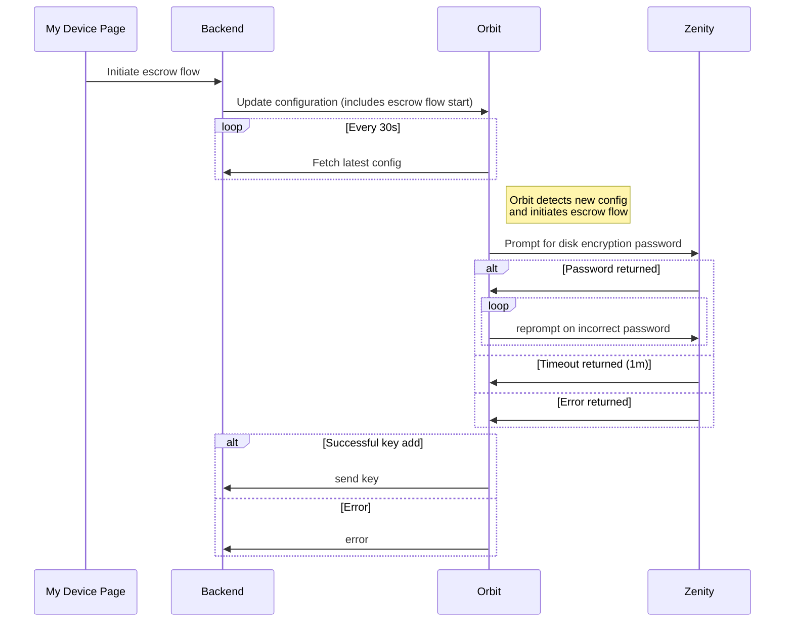

# Linux encryption key sequence

```mermaid
sequenceDiagram   
    participant MyDevicePage as My Device Page
    participant Backend as Backend
    participant Orbit as Orbit
    participant Zenity as Zenity

    MyDevicePage->>Backend: Initiate escrow flow
    Backend->>Orbit: Update configuration (includes escrow flow start)
    
    loop Every 30s
        Orbit->>Backend: Fetch latest config
    end
    
    Note right of Orbit: Orbit detects new config<br>and initiates escrow flow
    Orbit->>Zenity: Prompt for disk encryption password
    
    alt Password returned
        Zenity->>Orbit: 
        loop 
            Orbit->>Zenity: reprompt on incorrect password
        end
    else Timeout returned (1m)
        Zenity->>Orbit: 
    else Error returned
        Zenity->>Orbit: 
    end

    alt Successful key add
        Orbit->>Backend: send key
    else Error
        Orbit->>Backend: error
    end
```
