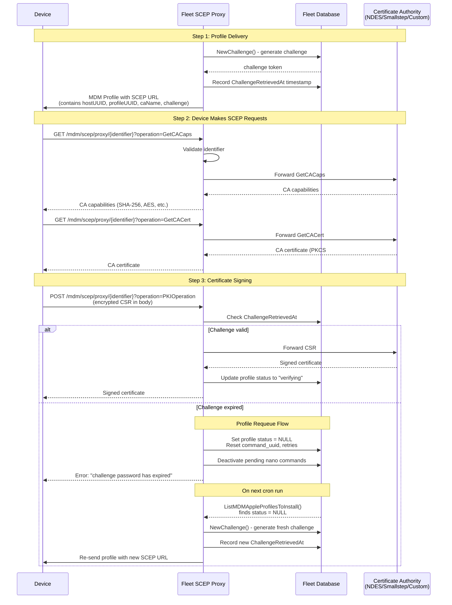

# Overview

  Fleet implements a SCEP proxy that sits between devices and various Certificate Authorities (NDES, Smallstep, or custom SCEP servers). The proxy validates requests and forwards them to the appropriate CA.

## Architecture Components

  1. Handler Registration (server/service/handler.go:1224)

     func RegisterSCEPProxy(...)

     This sets up two HTTP endpoints:
       - GET /mdm/scep/proxy/{identifier} - For GetCACaps and GetCACert operations
       - POST /mdm/scep/proxy/{identifier} - For PKIOperation (certificate signing)

     The {identifier} is a comma-separated string containing: hostUUID,profileUUID,caName,challenge

  2. SCEP Operations

        The SCEP protocol defines these operations:

        GetCACaps (ee/server/service/scep_proxy.go:63)

        - Returns capabilities supported by the CA (e.g., "SHA-256", "AES", "POSTPKIOperation")
        - Simple pass-through to the upstream SCEP server
        - Used by clients to discover what the CA supports

        GetCACert (ee/server/service/scep_proxy.go:82)

        - Returns the CA certificate(s) in PKCS#7 format
        - Clients need this to verify certificates and encrypt requests
        - Also a pass-through to the upstream server

        PKIOperation (ee/server/service/scep_proxy.go:101) - Most important

        - The actual certificate signing request (CSR)
        - This is where Fleet validates the challenge and forwards to CA
        - Only happens after GetCACaps and GetCACert succeed

## Flow Diagram

## How a Device Enrolls (Step-by-step)

### Step 1: Profile Delivery

  When Fleet sends a certificate profile to a device (server/mdm/profiles/profile_variables.go:61):
  challenge, err := ds.NewChallenge(ctx)
  proxyURL := fmt.Sprintf("%s%s%s", appConfig.MDMUrl(), apple_mdm.SCEPProxyPath,
      url.PathEscape(fmt.Sprintf("%s,%s,%s,%s", hostUUID, profUUID, caName, challenge)))

  The profile contains a SCEP URL like:
  `https://fleet.example.com/mdm/scep/proxy/abc123,w-uuid-456,NDES,xyz789`

### Step 2: Device Makes SCEP Requests

  The device makes 3 requests to this URL:

  1. GET ?operation=GetCACaps
    - Fleet validates the identifier
    - Proxies to upstream CA at groupedCAs.NDESSCEP.URL
    - Returns CA capabilities
  2. GET ?operation=GetCACert
    - Fleet proxies to CA
    - Returns CA certificate
  3. POST ?operation=PKIOperation (with CSR in body)
    - This is where challenge validation happens
    - Fleet calls validateIdentifier(ctx, identifier, true) with checkChallenge=true
    - Validates the challenge is still valid (not expired)
    - Proxies encrypted CSR to CA
    - Returns signed certificate

### Step 3: Challenge Validation (ee/server/service/scep_proxy.go:120)

For different CA types:

NDES (Microsoft's CA):

- Challenge expires after 57 minutes (line 38)
- Fleet retrieves challenge from NDES admin URL using NTLM auth
- Parses HTML response for password: The enrollment challenge password is: {password}

Smallstep:

- Challenge expires after 4 minutes (line 39)
- Fleet requests challenge via webhook endpoint
- Gets challenge from Smallstep API

Custom SCEP Proxy:

- Fleet generates its own challenge and stores in database
- Validates via ds.ConsumeChallenge(ctx, fleetChallenge)
- Challenge is one-time use

### Step 4: Profile Status Tracking

   Fleet validates profile status (line 169):
   if profile.Status != fleet.MDMDeliveryPending

   - Profile must be in "pending" state
   - If challenge expired, Fleet calls ResendHostMDMProfile() to regenerate
   - Status updates to "verifying" when cert is issued

## Profile Requeuing

When a challenge expires before the device completes the PKIOperation, Fleet automatically requeues the profile for redelivery with a fresh challenge.

### Requeue Trigger (ee/server/service/scep_proxy.go:189-220)

During `validateIdentifier()`, Fleet checks the `ChallengeRetrievedAt` timestamp against expiration windows:

- **NDES**: 57 minutes (`NDESChallengeInvalidAfter`)
- **Smallstep**: 4 minutes (`SmallstepChallengeInvalidAfter`)
- **Custom SCEP**: One-time use, validated via `ConsumeChallenge()`

### Requeue Functions

Two functions handle requeuing depending on CA type:

1. **ResendHostMDMProfile()** (server/datastore/mysql/mdm.go:1735-1756)
   - Used for NDES
   - Sets profile `status = NULL` to trigger resend on next cron run

2. **ResendHostCertificateProfile()** (server/datastore/mysql/apple_mdm.go:914-965)
   - Used for Smallstep and Custom SCEP
   - Sets profile `status = NULL`
   - Deactivates pending nano enrollment commands
   - Resets `command_uuid`, `detail`, and `retries`
   - Updates `variables_updated_at` to force profile variable regeneration

### Profile Reconciliation

The cron job picks up requeued profiles via `ListMDMAppleProfilesToInstall()` (server/datastore/mysql/apple_mdm.go:3318), which queries for profiles where `status IS NULL`.

When a profile is re-sent:
1. `NewChallenge()` generates a fresh challenge token
2. Profile variables are regenerated with new SCEP URL
3. `BulkUpsertMDMManagedCertificates()` records new `ChallengeRetrievedAt`
4. Profile is delivered to device with the new challenge

## Security Features

  1. Identifier Validation: Ensures request matches a valid host+profile+CA combination
  2. Challenge Expiration: Prevents replay attacks
  3. One-time Use: Custom SCEP challenges consumed after use (line 276)
  4. Profile Status: Only pending profiles can proceed
  5. Path Escape: Identifiers are URL-encoded to prevent injection

## Key Files Reference

- server/service/handler.go:1224 - Proxy registration
- ee/server/service/scep_proxy.go - Core proxy logic and challenge validation
- server/mdm/scep/server/service.go - SCEP protocol interface
- server/mdm/scep/server/transport.go - HTTP encoding/decoding
- server/mdm/profiles/profile_variables.go:61 - Profile URL generation
- server/datastore/mysql/mdm.go:1735 - ResendHostMDMProfile() for NDES requeue
- server/datastore/mysql/apple_mdm.go:914 - ResendHostCertificateProfile() for cert profile requeue
- server/datastore/mysql/apple_mdm.go:3318 - ListMDMAppleProfilesToInstall() for reconciliation
- server/datastore/mysql/challenges.go - Challenge generation and consumption

## Why a Proxy?

Fleet acts as a proxy instead of being a CA because:

1. Enterprises already have CAs (NDES, Smallstep)
2. Fleet can inject per-device/per-profile validation
3. Tracks which hosts requested which certificates
4. Can expire challenges and resend profiles automatically
5. Supports multiple CA types with unified interface

The proxy pattern lets Fleet add intelligence (challenge management, expiration, tracking) while letting the actual CA handle cryptographic operations.