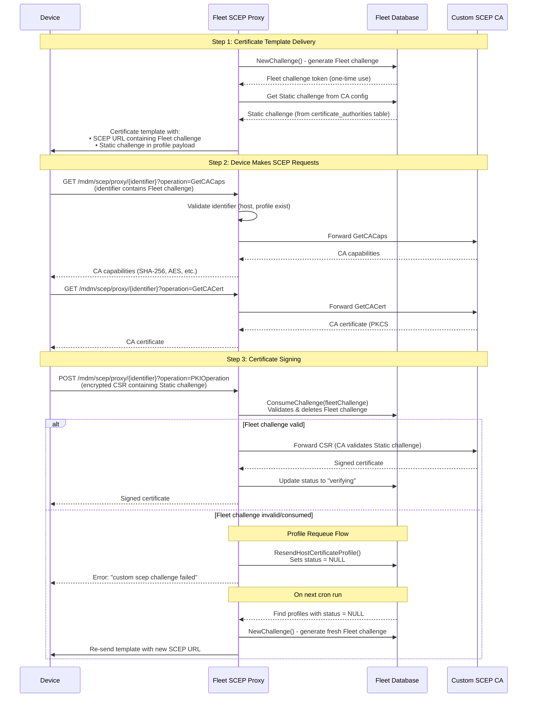

# Overview

Fleet implements a SCEP proxy that sits between devices and Certificate Authorities. For Android, only Custom SCEP Proxy is supported. The proxy validates requests and forwards them to the CA.

## Two Challenge Types

Custom SCEP uses two different challenges:

1. **Fleet Challenge** (one-time use)
   - Generated by Fleet and stored in the database
   - Embedded in the SCEP proxy URL identifier
   - Validated by Fleet via `ConsumeChallenge()` during PKIOperation
   - Prevents replay attacks and ensures request authenticity
   - Consumed (deleted) after successful validation

2. **Static Challenge** (from CA configuration)
   - Configured in the CA settings (`certificate_authorities.challenge_encrypted`)
   - Substituted into profile via `$FLEET_VAR_CUSTOM_SCEP_CHALLENGE_<CA_NAME>`
   - Embedded by the device in its encrypted CSR
   - Validated by the SCEP CA itself
   - Same challenge used across all requests to that CA

## Architecture Components

1. Handler Registration (server/service/handler.go)

   `RegisterSCEPProxy(...)` sets up two HTTP endpoints:
   - GET /mdm/scep/proxy/{identifier} - For GetCACaps and GetCACert operations
   - POST /mdm/scep/proxy/{identifier} - For PKIOperation (certificate signing)

   The {identifier} is a comma-separated string: `hostUUID,profileUUID,caName,fleetChallenge`

2. SCEP Operations (ee/server/service/scep_proxy.go)

   - **GetCACaps**: Returns CA capabilities (SHA-256, AES, etc.). Pass-through to upstream.
   - **GetCACert**: Returns CA certificate(s) in PKCS#7 format. Pass-through to upstream.
   - **PKIOperation**: Certificate signing request. This is where Fleet validates the Fleet challenge before forwarding.

## Flow Diagram (Custom SCEP for Android)



## How a Device Enrolls (Step-by-step)

### Step 1: Certificate Template Delivery

When Fleet sends a certificate template to a device:

```go
// Generate one-time Fleet challenge
fleetChallenge, err := ds.NewChallenge(ctx)

// Build SCEP proxy URL with Fleet challenge embedded
proxyURL := fmt.Sprintf("%s/mdm/scep/proxy/%s",
    appConfig.MDMUrl(),
    url.PathEscape(fmt.Sprintf("%s,%s,%s,%s", hostUUID, templateID, caName, fleetChallenge)))

// Static challenge is substituted via $FLEET_VAR_CUSTOM_SCEP_CHALLENGE_<CA_NAME>
```

The template contains:
- SCEP URL: `https://fleet.example.com/mdm/scep/proxy/abc123,tmpl-456,MyCA,xyz789`
- Challenge field: The static challenge from CA configuration

### Step 2: Device Makes SCEP Requests

The device makes 3 requests to the proxy URL:

1. **GET ?operation=GetCACaps**
   - Fleet validates the identifier (checks host/profile exist)
   - Proxies to upstream CA
   - Returns CA capabilities

2. **GET ?operation=GetCACert**
   - Fleet proxies to CA
   - Returns CA certificate

3. **POST ?operation=PKIOperation** (with encrypted CSR in body)
   - Fleet validates and consumes the Fleet challenge via `ConsumeChallenge()`
   - If valid, forwards CSR to CA (CA validates the static challenge inside the CSR)
   - Returns signed certificate

### Step 3: Challenge Validation

For Custom SCEP:
- Fleet challenge is one-time use, validated via `ConsumeChallenge(ctx, fleetChallenge)`
- If the Fleet challenge was already used or doesn't exist, the request fails
- Fleet calls `ResendHostCertificateProfile()` to requeue the profile with a fresh Fleet challenge

### Step 4: Status Tracking

- Profile must be in "pending" state to proceed
- After successful certificate issuance, status updates to "verifying"
- If Fleet challenge validation fails, profile is requeued (status set to NULL)
