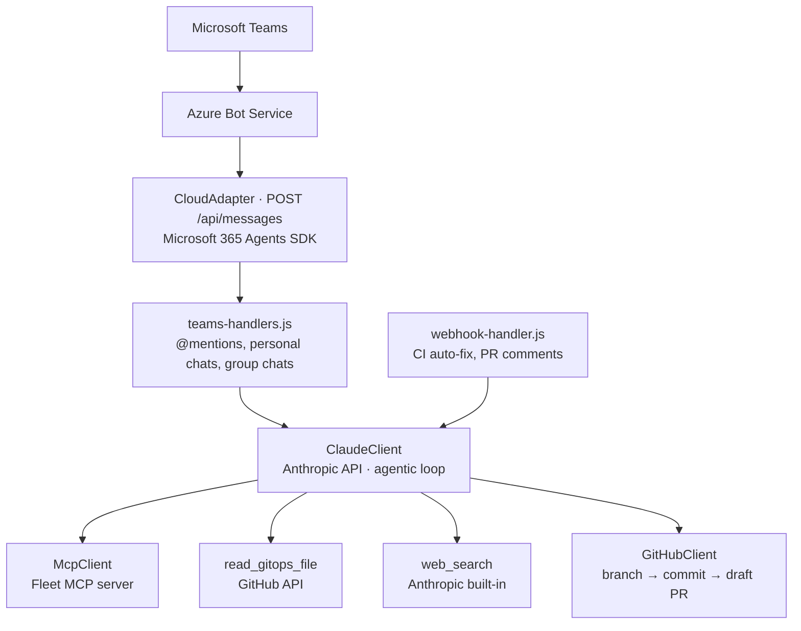

# Fleet Teams bot

A Microsoft Teams bot that lets IT and security teams manage their [Fleet](https://fleetdm.com) deployment using plain English. Ask it questions about your fleet, or request configuration changes — it'll query live Fleet data and open a GitHub pull request with the necessary GitOps YAML changes.

It is the Teams counterpart of the [Fleet Slackbot](../fleet-slackbot/). The Claude agent loop, GitHub client, Fleet MCP client, YAML validation, and GitHub webhook handling are the same code; only the chat layer differs.

## What it does

**Answer questions about your fleet**
> "How many macOS endpoints do we have?"
> "Which hosts are failing the disk encryption policy?"
> "Are any of my hosts exposed to CVE-2025-12345?"

The bot queries the live Fleet environment via the Fleet MCP server and responds directly in Teams.

**Propose configuration changes**
> "Add a policy to check that Firefox is installed on all workstations."
> "Set the minimum macOS version to 15.4 with a deadline of June 1."
> "Install 1Password on the servers team."

The bot generates the required GitOps YAML and opens a draft GitHub pull request for review.

**Auto-fix CI failures**
When a GitOps CI check fails on one of its PRs, the bot automatically reads the error, proposes a fix, and pushes a corrected commit.

## Architecture



## Setup

### 1. Azure Bot

1. In the Azure portal, create an **Azure Bot** resource. Choose **Single Tenant** as the type of app and let it create a new Microsoft App ID. Note the **Microsoft App ID** and your Entra **tenant ID**.
2. In the bot's Entra app registration (**Configuration → Manage Password**), create a client secret and note its value.
3. Under **Configuration**, set the **Messaging endpoint** to `https://your-host/api/messages`. Unlike the Slack bot's Socket Mode, Teams pushes messages to the bot, so it must be reachable from the internet over HTTPS.
4. Under **Channels**, add the **Microsoft Teams** channel.

### 2. Teams app package

1. Copy `teams-manifest.json` to `manifest.json` and replace both `${{TEAMS_APP_ID}}` placeholders with the Microsoft App ID.
2. Add two icons next to it: `color.png` (192×192, full color) and `outline.png` (32×32, white on a transparent background).
3. Zip `manifest.json`, `color.png`, and `outline.png` together (the manifest must be at the root of the zip).
4. Upload the zip in Teams (**Apps → Manage your apps → Upload an app**), or publish it to your organization's app catalog from the Teams admin center.

### 3. GitHub

- Create a fine-grained personal access token with **read/write access to contents and pull requests** on your GitOps repo.
- Add a webhook on the repo pointing to `https://your-host/github/webhook`, sending `Check runs`, `Issue comments`, and `Pull request review comments` events. Note the secret you choose.

### 4. Fleet MCP server

Run the [Fleet MCP server](https://github.com/fleetdm/fleet-mcp) and note its URL (default: `http://localhost:8181/sse`).

### 5. Environment variables

Copy `.env.example` to `.env` and fill in the values:

```
TEAMS_APP_ID=...                                 # Microsoft App ID of the Azure Bot
TEAMS_APP_PASSWORD=...                           # client secret of its app registration
TEAMS_APP_TENANT_ID=...                          # Entra tenant ID; messages from other tenants are ignored

GITHUB_TOKEN=github_pat_...
GITHUB_REPO=your-org/your-repo
GITHUB_BASE_BRANCH=main
GITHUB_WEBHOOK_SECRET=your-webhook-secret
GITHUB_BOT_USERNAME=your-bot-github-username   # used to ignore the bot's own PR comments
GITOPS_BASE_PATH=it-and-security                # path within the repo to the GitOps config

ANTHROPIC_API_KEY=sk-ant-...
ANTHROPIC_MODEL=claude-opus-4-6                  # optional, this is the default
MAX_TOOL_CALLS=100                               # safety cap on tool calls per response (default: 100)

FLEET_MCP_URL=http://localhost:8181/sse
FLEET_MCP_AUTH_TOKEN=...                         # bearer token for the Fleet MCP server
PORT=3000                                        # port for the Teams messaging endpoint and GitHub webhook

GITOPS_CI_CHECK_NAME=fleet-gitops               # name of the CI check to watch for auto-fix
CI_AUTO_FIX=true                                # set to false to disable CI auto-fix
```

### 6. Run

Requires Node.js 20 or newer (the test suite uses the built-in `node --test` runner).

```bash
npm install
npm start
```

## Usage

**In a channel or group chat:** `@Fleet how many Windows hosts do we have?` — the bot replies in the thread.

**In a personal chat:** Just message the bot directly — no @mention needed.

The bot remembers the last 10 exchanges in each conversation (per thread in channels) for a day and includes them as context with every new message, so follow-up questions work. In a personal chat that context carries over from your previous question unless a day has passed.

## Differences from the Slack bot

- Teams bots can't react to messages, so progress is shown in a status message the bot edits in place (⏳ → ✅ or ❌) rather than a reaction on your message.
- Teams has no bot API for reading messages, so conversation history is kept in the bot's memory. It only covers exchanges the bot took part in and is lost when the bot restarts.
- Replies use Teams' extended Markdown (bold, lists, code blocks, tables) instead of Slack mrkdwn.
