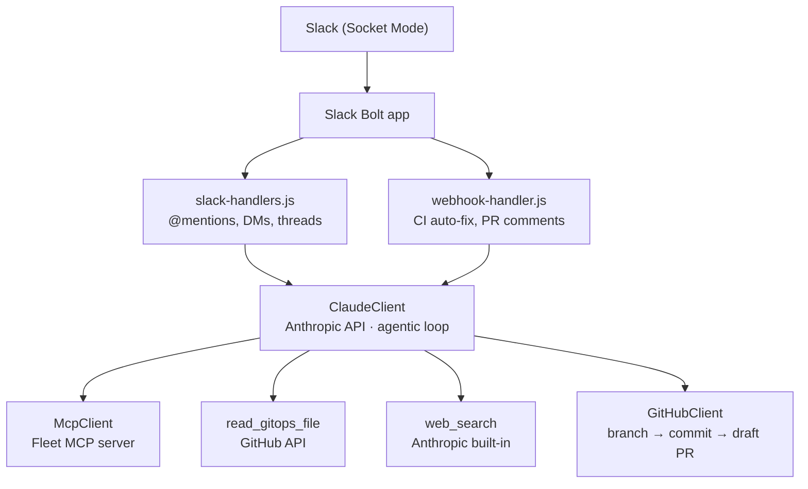

# Fleetbot

A Slack bot that lets IT and security teams manage their [Fleet](https://fleetdm.com) deployment using plain English. Ask it questions about your fleet, or request configuration changes — it'll query live Fleet data and open a GitHub pull request with the necessary GitOps YAML changes.

## What it does

**Answer questions about your fleet**
> "How many macOS endpoints do we have?"
> "Which hosts are failing the disk encryption policy?"
> "Are any of my hosts exposed to CVE-2025-12345?"

The bot queries the live Fleet environment via the Fleet MCP server and responds directly in Slack.

**Propose configuration changes**
> "Add a policy to check that Firefox is installed on all workstations."
> "Set the minimum macOS version to 15.4 with a deadline of June 1."
> "Install 1Password on the servers team."

The bot generates the required GitOps YAML and opens a draft GitHub pull request for review.

**Auto-fix CI failures**
When a GitOps CI check fails on one of its PRs, the bot automatically reads the error, proposes a fix, and pushes a corrected commit.

## Architecture



## Setup

### 1. Slack app

Create a Slack app at [api.slack.com/apps](https://api.slack.com/apps) with:

- **Socket Mode** enabled (generates the App-Level Token)
- **Bot Token Scopes:** `chat:write`, `app_mentions:read`, `channels:history`, `groups:history`, `im:history`, `reactions:write`, `reactions:read`, `files:write`
- **Event Subscriptions:** `app_mention`, `message.im`

### 2. GitHub

- Create a fine-grained personal access token with **read/write access to contents and pull requests** on your GitOps repo.
- Add a webhook on the repo pointing to `http://your-host:3000/github/webhook`, sending `Check runs` and `Pull request review comments` events. Note the secret you choose.

### 3. Fleet MCP server

Run the [Fleet MCP server](https://github.com/fleetdm/fleet-mcp) and note its URL (default: `http://localhost:8080/sse`).

### 4. Environment variables

Copy `.env.example` to `.env` and fill in the values:

```
SLACK_BOT_TOKEN=xoxb-...
SLACK_APP_TOKEN=xapp-...

GITHUB_TOKEN=github_pat_...
GITHUB_REPO=your-org/your-repo
GITHUB_BASE_BRANCH=main
GITHUB_WEBHOOK_SECRET=your-webhook-secret
GITHUB_BOT_USERNAME=your-bot-github-username   # used to ignore the bot's own PR comments
GITOPS_BASE_PATH=it-and-security                # path within the repo to the GitOps config

ANTHROPIC_API_KEY=sk-ant-...
ANTHROPIC_MODEL=claude-sonnet-4-5-20250514      # optional, this is the default

FLEET_MCP_URL=http://localhost:8080/sse
PORT=3000                                        # port for the GitHub webhook listener

GITOPS_CI_CHECK_NAME=fleet-gitops               # name of the CI check to watch for auto-fix
CI_AUTO_FIX=true                                # set to false to disable CI auto-fix
```

### 5. Run

```bash
npm install
npm start
```

## Usage

**In any channel:** `@Fleet how many Windows hosts do we have?`

**In a DM:** Just message the bot directly — no @mention needed.
