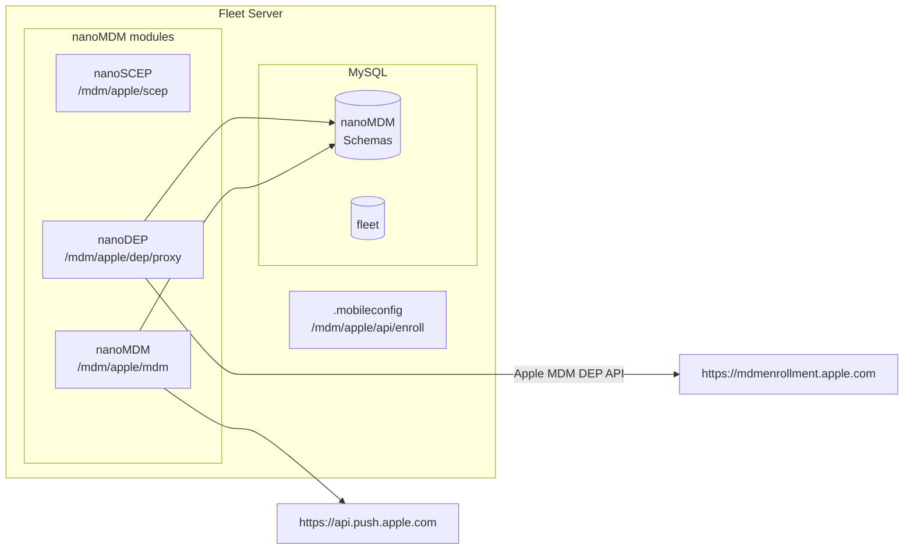

# Apple MDM Fleet Demo

## 0. Architecture



## 1. Setup deployment from scratch

```sh
FLEET_MYSQL_IMAGE=mysql:8.0.19 docker-compose down
docker volume rm fleet_mysql-persistent-volume
FLEET_MYSQL_IMAGE=mysql:8.0.19 docker-compose up
make fleet-dev
```

## 2. Setup APNS Push Certificate and Key

From https://developer.apple.com/account, download push certificate and private key to:
- ~/mdm-apple-test/mdmcert.download.push.pem
- ~/mdm-apple-test/mdmcert.download.push.key

What we did for this test is:
- Zach has an account in https://mdmcert.download/
- Generate CSR with `mdmctl mdmcert.download -new -email=zach@fleetdm.com` (this step generates a private key too, place it in `~/mdm-apple-test/mdmcert.download.push.key`)
- Zach received a certificate `mdm_signed_request.20220712_121945_1267.plist.b64.p7`
- Decrypt the received CSR with `mdmctl mdmcert.download -decrypt=~/Downloads/mdm_signed_request.20220712_121945_1267.plist.b64.p7`
- Zach uploads the decrypted CSR to identity.apple.com and downloads the final certificate.
- Place certificate in `~/mdm-apple-test/mdmcert.download.push.pem`

## 3. Fleet prepare db

Initial prepare db populates the MySQL database with the MDM tables:
```sh
FLEET_MDM_APPLE_ENABLE=1 ./build/fleet prepare db --dev --logging_debug
```

## 4. SCEP setup

```sh
fleetctl apple-mdm setup scep --validity-years=1 --cn "Acme" --organization "Acme Inc." --organizational-unit "Acme Inc. IT" --country US
Successfully generated SCEP CA: fleet-mdm-apple-scep.crt, fleet-mdm-apple-scep.key.
Set FLEET_MDM_APPLE_SCEP_CA_CERT_PEM=$(cat fleet-mdm-apple-scep.crt) FLEET_MDM_APPLE_SCEP_CA_KEY_PEM=$(cat fleet-mdm-apple-scep.key) when running Fleet.
```

## 5. DEP setup

1. Init:
```sh
fleetctl apple-mdm setup dep init
Successfully generated DEP public and private key: fleet-mdm-apple-dep.crt, fleet-mdm-apple-dep.key
Upload fleet-mdm-apple-dep.crt to your Apple Business MDM server. (Don't forget to click "Save" after uploading it.)%
```
2. Copy file to ~/Downloads for easy access when uploading to Apple:
```sh
cp fleet-mdm-apple-dep.crt ~/Downloads/
```
3. In https://business.apple.com:
   1. select your MDM server in "Your MDM Servers".
   2. Click "Edit" and upload the generated `fleet-mdm-apple-dep.crt`.
   3. Then download DEP token to a file named `./dep_encrypted_token.p7m`:
    ```sh
    cp ~/Downloads/YourMDMServer_Token_2022-09-02T17-13-49Z_smime.p7m ./dep_encrypted_token.p7m
    ```
4. Finalize:
```sh
fleetctl apple-mdm setup dep finalize \
    --certificate ./fleet-mdm-apple-dep.crt \
    --private-key ./fleet-mdm-apple-dep.key \
    --encrypted-token ./dep_encrypted_token.p7m
Successfully generated token file: fleet-mdm-apple-dep.token.
Set FLEET_MDM_APPLE_DEP_TOKEN=$(cat fleet-mdm-apple-dep.token) when running Fleet.
```

## 6. Run Fleet behind ngrok

Fleet needs to run behind TLS with valid certificates (otherwise Apple devices won't trust it).
```
ngrok http https://localhost:8080
```

## 7. Run Fleet

```sh
FLEET_MDM_APPLE_ENABLE=1 \
FLEET_MDM_APPLE_SCEP_CHALLENGE=scepchallenge \
FLEET_MDM_APPLE_SERVER_ADDRESS=ab51-181-228-157-44.ngrok.io \
FLEET_MDM_APPLE_SCEP_CA_CERT_PEM=$(cat fleet-mdm-apple-scep.crt) \
FLEET_MDM_APPLE_SCEP_CA_KEY_PEM=$(cat fleet-mdm-apple-scep.key) \
FLEET_MDM_APPLE_DEP_TOKEN=$(cat fleet-mdm-apple-dep.token) \
FLEET_MDM_APPLE_MDM_PUSH_CERT_PEM=$(cat ~/mdm-apple-test/mdmcert.download.push.pem) \
FLEET_MDM_APPLE_MDM_PUSH_KEY_PEM=$(cat ~/mdm-apple-test/mdmcert.download.push.key) \
./build/fleet serve --dev --dev_license --logging_debug 2>&1 | tee ~/fleet.txt
```

Run the setup as usual (you will need a user for administrative commands below):
```sh
fleetctl setup --email foo@example.com --name Gandalf --password p4ssw0rd.123 --org-name "Fleet Device Management Inc."
Fleet Device Management Inc. periodically collects information about your instance.
Sending usage statistics from your Fleet instance is optional and can be disabled in settings.
[+] Fleet setup successful and context configured!
```

## 8. Create manual enrollment

```sh
fleetctl apple-mdm enrollments create-manual --name foo
Manual enrollment created, URL: https://ab51-181-228-157-44.ngrok.io/mdm/apple/api/enroll?id=1, id: 1
```

## 9. Create automatic (DEP) enrollment

```sh
cat ./tools/mdm/apple/dep_sample_profile.json
{
  "profile_name": "Fleet Device Management Inc.",
  "allow_pairing": true,
  "auto_advance_setup": false,
  "await_device_configured": false,
  "department": "it@fleetdm.com",
  "is_supervised": false,
  "is_multi_user": false,
  "is_mandatory": false,
  "is_mdm_removable": true,
  "language": "en",
  "org_magic": "1",
  "region": "US",
  "support_phone_number": "+1 408 555 1010",
  "support_email_address": "support@fleetdm.com",
  "anchor_certs": [],
  "supervising_host_certs": [],
  "skip_setup_items": [
    "Accessibility", "Appearance", "AppleID", 
    "AppStore", "Biometric", "Diagnostics", "FileVault",
    "iCloudDiagnostics", "iCloudStorage", "Location", "Payment",
    "Privacy", "Restore", "ScreenTime", "Siri", "TermsOfAddress",
    "TOS", "UnlockWithWatch"
  ]
}

fleetctl apple-mdm enrollments create-automatic \
    --name foo \
    --profile ./tools/mdm/apple/dep_sample_profile.json
Automatic enrollment created, URL: https://ab51-181-228-157-44.ngrok.io/mdm/apple/api/enroll?id=2, id: 2
```

## 10. Inspect MDM tables

```sh
mysql --host=127.0.0.1 --port=3306 --user=fleet --password
select id from devices;
```

## 11. Trigger a device restart

```sh
./tools/mdm/apple/cmdr.py RestartDevice | curl -k -T - 'https://127.0.0.1:8080/mdm/apple/mdm/api/v1/enqueue/<ID_FROM_PREVIOUS_STEP>'
```

## 12. DEP test

1. Assign the device to our MDM server in https://business.apple.com
2. Fleet should pick it up and assign an DEP enroll profile that points to itself (must either trigger a sync or wait for ~1h).
3. Start the VM and enroll.
