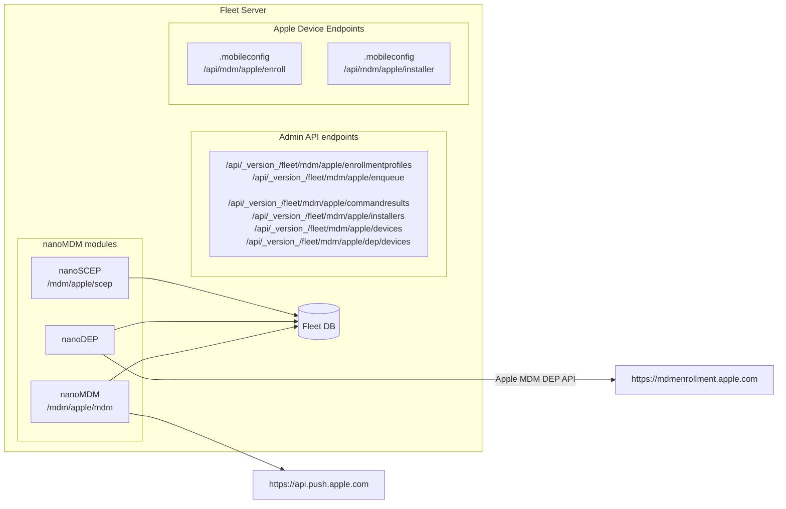

# Apple MDM Fleet Demo

## 0. Architecture



## New Fleet Endpoints

1. API endpoints
- Path: `/api/_version_/fleet/mdm/apple/*`
- Authentication: Fleet admin authenticated

2. MDM protocol endpoints
- Path: `/mdm/apple/scep` and `/mdm/apple/mdm`.
- Authentication: MDM authentication.

3. Enroll endpoint
- Path: `/api/mdm/apple/enroll?token=`
- Authentication: A token is provided via a query parameter. SSO may be added later.

4. Installers URL (on manifest)
- Path: `/api/mdm/apple/installer?token=`
- Authentication: Secret token is provided via a query parameter.

## 1. Setup APNS Push Certificate and Key

From https://developer.apple.com/account, download push certificate and private key to:
- ~/mdm-apple-test/mdmcert.download.push.pem
- ~/mdm-apple-test/mdmcert.download.push.key

What we did for this test is:
- Zach has an account in https://mdmcert.download/
- Generate CSR with `mdmctl mdmcert.download -new -email=zach@fleetdm.com` (this step generates a private key too, place it in `~/mdm-apple-test/mdmcert.download.push.key`)
- Zach received a certificate `mdm_signed_request.20220712_121945_1267.plist.b64.p7`
- Decrypt the received CSR with `mdmctl mdmcert.download -decrypt=~/Downloads/mdm_signed_request.20220712_121945_1267.plist.b64.p7`
- Zach uploads the decrypted CSR to identity.apple.com and downloads the final certificate.
- Place certificate in `~/mdm-apple-test/mdmcert.download.push.pem`

## 2. SCEP setup

```sh
fleetctl apple-mdm setup scep \
    --validity-years=1 \
    --cn "Acme" \
    --organization "Acme Inc." \
    --organizational-unit "Acme Inc. IT" \
    --country US
Successfully generated SCEP CA: fleet-mdm-apple-scep.crt, fleet-mdm-apple-scep.key.
Set FLEET_MDM_APPLE_SCEP_CA_CERT_PEM=$(cat fleet-mdm-apple-scep.crt) FLEET_MDM_APPLE_SCEP_CA_KEY_PEM=$(cat fleet-mdm-apple-scep.key) when running Fleet.
```

## 3. DEP setup

1. Init:
```sh
fleetctl apple-mdm setup dep init
Successfully generated DEP public and private key: fleet-mdm-apple-dep.crt, fleet-mdm-apple-dep.key
Upload fleet-mdm-apple-dep.crt to your Apple Business MDM server. (Don't forget to click "Save" after uploading it.)%
```
2. Copy file to ~/Downloads for easy access when uploading to Apple:
```sh
cp fleet-mdm-apple-dep.crt ~/Downloads/
```
3. In https://business.apple.com:
   1. Under "Preferences" (which can be accessed via the upper-right dropdown menu), select your MDM server in "Your MDM Servers".
   2. Click "Edit" and upload the generated `fleet-mdm-apple-dep.crt`.
   3. Then download DEP token to a file named `./dep_encrypted_token.p7m`:
    ```sh
    cp ~/Downloads/YourMDMServer_Token_2022-09-02T17-13-49Z_smime.p7m ./dep_encrypted_token.p7m
    ```
4. Finalize:
```sh
fleetctl apple-mdm setup dep finalize \
    --certificate ./fleet-mdm-apple-dep.crt \
    --private-key ./fleet-mdm-apple-dep.key \
    --encrypted-token ./dep_encrypted_token.p7m
Successfully generated token file: fleet-mdm-apple-dep.token.
Set FLEET_MDM_APPLE_DEP_TOKEN=$(cat fleet-mdm-apple-dep.token) when running Fleet.
```

## 4. Run Fleet behind ngrok

Fleet needs to run behind TLS with a valid certificate (otherwise Apple devices won't trust it).

```sh
ngrok http https://localhost:8080
```

## 5. Run Fleet

```sh
    FLEET_MDM_APPLE_SCEP_CHALLENGE=scepchallenge \
    FLEET_MDM_APPLE_SCEP_CA_CERT_PEM=$(cat fleet-mdm-apple-scep.crt) \
    FLEET_MDM_APPLE_SCEP_CA_KEY_PEM=$(cat fleet-mdm-apple-scep.key) \
    FLEET_MDM_APPLE_DEP_TOKEN=$(cat fleet-mdm-apple-dep.token) \
    FLEET_MDM_APPLE_MDM_PUSH_CERT_PEM=$(cat ~/mdm-apple-test/mdmcert.download.push.pem) \
    FLEET_MDM_APPLE_MDM_PUSH_KEY_PEM=$(cat ~/mdm-apple-test/mdmcert.download.push.key) \
    ./build/fleet serve --dev --dev_license
```

Run the setup as usual (you will need a user for administrative commands below):

```sh
fleetctl setup \
    --email foo@example.com \
    --name Gandalf \
    --password p4ssw0rd.123 \
    --org-name "Fleet Device Management Inc."
```

Note, you will need to update the `server_settings.server_url` after setup and whenever you restart `ngrok`. This can be done with `fleetctl apply`.

```sh
cat <<EOF > config.yaml
apiVersion: v1
kind: config
spec:
  server_settings:
    server_url: "{{ngrok url}}"
EOF
fleetctl apply -f config.yaml
```

## 6. Create manual enrollment

```sh
fleetctl apple-mdm enrollment-profiles create-manual
Manual enrollment created, URL: https://{{ngrog url}}/api/mdm/apple/enroll?token={{token}}.
```

## 7. Create automatic (DEP) enrollment profile

There is a sample dep profile available at `tools/mdm/apple/dep_sample_profile.json` which can be used to create an automatic (DEP) enrollment profile.

```sh
fleetctl apple-mdm enrollment-profiles create-automatic --dep-profile ./tools/mdm/apple/dep_sample_profile.json
Automatic enrollment profile created, ID: 2
```

## 8. DEP Enroll

0. You need an uninitialized macOS VM with a specific configuration to allow for DEP testing.
Carefully follow https://travellingtechguy.blog/macos-big-sur-on-vmware-fusion-12/ to create a VMWare macOS VM with a serial number that Fleet's ABM manages (@lucasmrod has successfully created a "test DEP VM" following the above guide).
1. Assign the device to our "MDM server" in https://business.apple.com
2. Fleet should pick it up and assign an DEP enroll profile that points to itself (must wait for one minute after executing the `create-automatic` command).
3. Start the VM created in step (0).

### Examples

Get a list of enrolled devices:
```sh
fleetctl apple-mdm devices list
+--------------------------------------+---------------+----------+
|              DEVICE ID               | SERIAL NUMBER | ENROLLED |
+--------------------------------------+---------------+----------+
| D2F1D7F9-8EA9-4420-AF09-4C4EC4275D8A | CMXXXXXXXX    | true     |
+--------------------------------------+---------------+----------+
```

```
Install a profile to allow for enabling debug mode of MDM on a device (useful when developing/testing MDM features):
```sh
fleetctl apple-mdm enqueue-command InstallProfile --device-ids=D2F1D7F9-8EA9-4420-AF09-4C4EC4275D8A --mobileconfig ./tools/mdm/apple/turn_on_debug_mdm_logging.mobileconfig
```

Install 1Password on a macOS device:
```sh
fleetctl apple-mdm installers upload --path ~/Downloads/1Password-7.9.6.pkg

fleetctl apple-mdm enqueue-command InstallEnterpriseApplication --device-ids=D2F1D7F9-8EA9-4420-AF09-4C4EC4275D8A --installer-id=1
```
