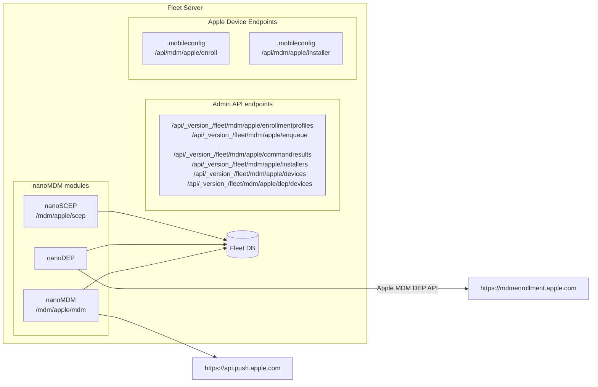

# Apple MDM Fleet Demo

## 0. Architecture



## New Fleet Endpoints

1. API endpoints
- Path: `/api/_version_/fleet/mdm/apple/*`
- Authentication: Fleet admin authenticated

2. MDM protocol endpoints
- Path: `/mdm/apple/scep` and `/mdm/apple/mdm`.
- Authentication: MDM authentication.

3. Enroll endpoint
- Path: `/api/mdm/apple/enroll`
- Authentication: SSO/Basic-Auth (TBD)

4. Installers URL (on manifest)
- Path: `/api/mdm/apple/installer`
- Authentication: Secret token in URL.

## 1. Setup deployment from scratch

```sh
FLEET_MYSQL_IMAGE=mysql:8.0.19 docker-compose up
make db-reset
```

## 2. Setup APNS Push Certificate and Key

From https://developer.apple.com/account, download push certificate and private key to:
- ~/mdm-apple-test/mdmcert.download.push.pem
- ~/mdm-apple-test/mdmcert.download.push.key

What we did for this test is:
- Zach has an account in https://mdmcert.download/
- Generate CSR with `mdmctl mdmcert.download -new -email=zach@fleetdm.com` (this step generates a private key too, place it in `~/mdm-apple-test/mdmcert.download.push.key`)
- Zach received a certificate `mdm_signed_request.20220712_121945_1267.plist.b64.p7`
- Decrypt the received CSR with `mdmctl mdmcert.download -decrypt=~/Downloads/mdm_signed_request.20220712_121945_1267.plist.b64.p7`
- Zach uploads the decrypted CSR to identity.apple.com and downloads the final certificate.
- Place certificate in `~/mdm-apple-test/mdmcert.download.push.pem`

## 3. SCEP setup

```sh
fleetctl apple-mdm setup scep --validity-years=1 --cn "Acme" --organization "Acme Inc." --organizational-unit "Acme Inc. IT" --country US
Successfully generated SCEP CA: fleet-mdm-apple-scep.crt, fleet-mdm-apple-scep.key.
Set FLEET_MDM_APPLE_SCEP_CA_CERT_PEM=$(cat fleet-mdm-apple-scep.crt) FLEET_MDM_APPLE_SCEP_CA_KEY_PEM=$(cat fleet-mdm-apple-scep.key) when running Fleet.
```

## 4. DEP setup

1. Init:
```sh
fleetctl apple-mdm setup dep init
Successfully generated DEP public and private key: fleet-mdm-apple-dep.crt, fleet-mdm-apple-dep.key
Upload fleet-mdm-apple-dep.crt to your Apple Business MDM server. (Don't forget to click "Save" after uploading it.)%
```
2. Copy file to ~/Downloads for easy access when uploading to Apple:
```sh
cp fleet-mdm-apple-dep.crt ~/Downloads/
```
3. In https://business.apple.com:
   1. select your MDM server in "Your MDM Servers".
   2. Click "Edit" and upload the generated `fleet-mdm-apple-dep.crt`.
   3. Then download DEP token to a file named `./dep_encrypted_token.p7m`:
    ```sh
    cp ~/Downloads/YourMDMServer_Token_2022-09-02T17-13-49Z_smime.p7m ./dep_encrypted_token.p7m
    ```
4. Finalize:
```sh
fleetctl apple-mdm setup dep finalize \
    --certificate ./fleet-mdm-apple-dep.crt \
    --private-key ./fleet-mdm-apple-dep.key \
    --encrypted-token ./dep_encrypted_token.p7m
Successfully generated token file: fleet-mdm-apple-dep.token.
Set FLEET_MDM_APPLE_DEP_TOKEN=$(cat fleet-mdm-apple-dep.token) when running Fleet.
```

## 5. Run Fleet behind ngrok

Fleet needs to run behind TLS with valid certificates (otherwise Apple devices won't trust it).
```sh
ngrok http https://localhost:8080
```

## 6. Run Fleet

```sh
FLEET_MDM_APPLE_ENABLE=1 \
    FLEET_MDM_APPLE_SCEP_CHALLENGE=scepchallenge \
    FLEET_MDM_APPLE_SCEP_CA_CERT_PEM=$(cat fleet-mdm-apple-scep.crt) \
    FLEET_MDM_APPLE_SCEP_CA_KEY_PEM=$(cat fleet-mdm-apple-scep.key) \
    FLEET_MDM_APPLE_DEP_TOKEN=$(cat fleet-mdm-apple-dep.token) \
    FLEET_MDM_APPLE_MDM_PUSH_CERT_PEM=$(cat ~/mdm-apple-test/mdmcert.download.push.pem) \
    FLEET_MDM_APPLE_MDM_PUSH_KEY_PEM=$(cat ~/mdm-apple-test/mdmcert.download.push.key) \
    ./build/fleet serve --dev --dev_license --logging_debug 2>&1 | tee ~/fleet.txt
```

Run the setup as usual (you will need a user for administrative commands below):

TODO: add server url flag set to ngrok ...
```sh
fleetctl setup --email foo@example.com --name Gandalf --password p4ssw0rd.123 --org-name "Fleet Device Management Inc."
Fleet Device Management Inc. periodically collects information about your instance.
Sending usage statistics from your Fleet instance is optional and can be disabled in settings.
[+] Fleet setup successful and context configured!
```

## 7. Create manual enrollment

```sh
fleetctl apple-mdm enrollments create-manual --name foo
Manual enrollment created, URL: https://ab51-181-228-157-44.ngrok.io/api/mdm/apple/enroll?id=1.
```

## 8. Create automatic (DEP) enrollment

```sh
cat ./tools/mdm/apple/dep_sample_profile.json
{
  "profile_name": "Fleet Device Management Inc.",
  "allow_pairing": true,
  "auto_advance_setup": false,
  "await_device_configured": false,
  "department": "it@fleetdm.com",
  "is_supervised": false,
  "is_multi_user": false,
  "is_mandatory": false,
  "is_mdm_removable": true,
  "language": "en",
  "org_magic": "1",
  "region": "US",
  "support_phone_number": "+1 408 555 1010",
  "support_email_address": "support@fleetdm.com",
  "anchor_certs": [],
  "supervising_host_certs": [],
  "skip_setup_items": [
    "Accessibility", "Appearance", "AppleID", 
    "AppStore", "Biometric", "Diagnostics", "FileVault",
    "iCloudDiagnostics", "iCloudStorage", "Location", "Payment",
    "Privacy", "Restore", "ScreenTime", "Siri", "TermsOfAddress",
    "TOS", "UnlockWithWatch"
  ]
}

fleetctl apple-mdm enrollments create-automatic \
    --name foo \
    --profile ./tools/mdm/apple/dep_sample_profile.json
Automatic enrollment created, URL: https://ab51-181-228-157-44.ngrok.io/api/mdm/apple/enroll?id=2.
```

## 9. DEP Enroll

1. Assign the device to our MDM server in https://business.apple.com
2. Fleet should pick it up and assign an DEP enroll profile that points to itself (must wait for 5m after executing the `create-automatic` command).
3. Start the VM and enroll.

## 10. Fleetctl MDM commands

```sh
NAME:
   fleetctl apple-mdm - Apple MDM functionality

USAGE:
   fleetctl apple-mdm command [command options] [arguments...]

COMMANDS:
   setup            Setup commands for Apple MDM
   enrollments      Commands to manage enrollments
   enqueue-command  Enqueue an MDM command. See the results using the command-results command and passing the command UUID that is returned from this command.
   dep              Device Enrollment Program commands
   devices          Inspect enrolled devices
   command-results  Get MDM command results
   installers       Commands to manage macOS installers
   help, h          Shows a list of commands or help for one command

OPTIONS:
   --config value   Path to the fleetctl config file (default: "/Users/luk/.fleet/config") [$CONFIG]
   --context value  Name of fleetctl config context to use (default: "default") [$CONTEXT]
   --debug          Enable debug http request logging (default: false) [$DEBUG]
   --help, -h       show help (default: false)
```
```sh
fleetctl apple-mdm setup
NAME:
   fleetctl apple-mdm setup - Setup commands for Apple MDM

USAGE:
   fleetctl apple-mdm setup command [command options] [arguments...]

COMMANDS:
   scep     Create SCEP certificate authority
   apns     Commands to setup APNS certificate
   dep      Configure DEP token
   help, h  Shows a list of commands or help for one command

OPTIONS:
   --help, -h  show help (default: false)

```
```sh
fleetctl apple-mdm enrollments
NAME:
   fleetctl apple-mdm enrollments - Commands to manage enrollments

USAGE:
   fleetctl apple-mdm enrollments command [command options] [arguments...]

COMMANDS:
   create-automatic  Create a new automatic enrollment
   create-manual     Create a new manual enrollment
   delete            Delete an enrollment
   list              List all enrollments
   help, h           Shows a list of commands or help for one command

OPTIONS:
   --help, -h  show help (default: false)
```
```sh
fleetctl apple-mdm enqueue-command --help
NAME:
   fleetctl apple-mdm enqueue-command - Enqueue an MDM command. See the results using the command-results command and passing the command UUID that is returned from this command.

USAGE:
   fleetctl apple-mdm enqueue-command command [command options] [arguments...]

COMMANDS:
   InstallProfile                Enqueue the InstallProfile MDM command.
   ProfileList                   Enqueue the ProfileList MDM command.
   RemoveProfile                 Enqueue the RemoveProfile MDM command.
   InstallEnterpriseApplication  Enqueue the InstallEnterpriseApplication MDM command.
   ProvisioningProfileList       Enqueue the ProvisioningProfileList MDM command.
   CertificateList               Enqueue the CertificateList MDM command.
   SecurityInfo                  Enqueue the SecurityInfo MDM command.
   RestartDevice                 Enqueue the RestartDevice MDM command.
   ShutdownDevice                Enqueue the ShutdownDevice MDM command.
   StopMirroring                 Enqueue the StopMirroring MDM command.
   ClearRestrictionsPassword     Enqueue the ClearRestrictionsPassword MDM command.
   UserList                      Enqueue the UserList MDM command.
   LogOutUser                    Enqueue the LogOutUser MDM command.
   PlayLostModeSound             Enqueue the PlayLostModeSound MDM command.
   DisableLostMode               Enqueue the DisableLostMode MDM command.
   DeviceLocation                Enqueue the DeviceLocation MDM command.
   ManagedMediaList              Enqueue the ManagedMediaList MDM command.
   DeviceConfigured              Enqueue the DeviceConfigured MDM command.
   AvailableOSUpdates            Enqueue the AvailableOSUpdates MDM command.
   NSExtensionMappings           Enqueue the NSExtensionMappings MDM command.
   OSUpdateStatus                Enqueue the OSUpdateStatus MDM command.
   EnableRemoteDesktop           Enqueue the EnableRemoteDesktop MDM command.
   DisableRemoteDesktop          Enqueue the DisableRemoteDesktop MDM command.
   ActivationLockBypassCode      Enqueue the ActivationLockBypassCode MDM command.
   ScheduleOSUpdateScan          Enqueue the ScheduleOSUpdateScan MDM command.
   EraseDevice                   Enqueue the EraseDevice MDM command.
   DeviceLock                    Enqueue the DeviceLock MDM command.
   DeviceInformation             Enqueue the DeviceInformation MDM command.
   help, h                       Shows a list of commands or help for one command

OPTIONS:
   --device-ids value       Comma separated device IDs to send the MDM command to. This is the same as the hardware UUID.
   --command-payload value  A plist file containing the raw MDM command payload. Note that a new CommandUUID will be generated automatically. See https://developer.apple.com/documentation/devicemanagement/commands_and_queries for available commands.
   --help, -h               show help (default: false)
```
```
fleetctl apple-mdm dep
NAME:
   fleetctl apple-mdm dep - Device Enrollment Program commands

USAGE:
   fleetctl apple-mdm dep command [command options] [arguments...]

COMMANDS:
   list     List all DEP devices from the linked MDM server in Apple Business Manager
   help, h  Shows a list of commands or help for one command

OPTIONS:
   --help, -h  show help (default: false)
```
```sh
fleetctl apple-mdm devices
NAME:
   fleetctl apple-mdm devices - Inspect enrolled devices

USAGE:
   fleetctl apple-mdm devices command [command options] [arguments...]

COMMANDS:
   list     List all devices
   help, h  Shows a list of commands or help for one command

OPTIONS:
   --help, -h  show help (default: false)
```
```sh
fleetctl apple-mdm command-results
NAME:
   fleetctl apple-mdm command-results - Get MDM command results

USAGE:
   fleetctl apple-mdm command-results [command options] [arguments...]

OPTIONS:
   --command-uuid value  The command uuid.
   --help, -h            show help (default: false)
```
```sh
fleetctl apple-mdm installers
NAME:
   fleetctl apple-mdm installers - Commands to manage macOS installers

USAGE:
   fleetctl apple-mdm installers command [command options] [arguments...]

COMMANDS:
   upload   Upload an Apple installer to Fleet
   list     List all Apple installers
   delete   Delete an Apple installer
   help, h  Shows a list of commands or help for one command

OPTIONS:
   --help, -h  show help (default: false)
```

### Samples

Install profile on a device:
```sh
fleetctl apple-mdm enqueue-command InstallProfile --device-ids=564DB340-7435-FA4D-B124-9480B239BE88 --mobileconfig some_profile.plist
```

Install 1Password on a macOS device:
```sh
fleetctl apple-mdm installers upload --path ~/Downloads/1Password-7.9.6.pkg

fleetctl apple-mdm enqueue-command InstallEnterpriseApplication --device-ids=564DB340-7435-FA4D-B124-9480B239BE88 --installer-id=1
```
