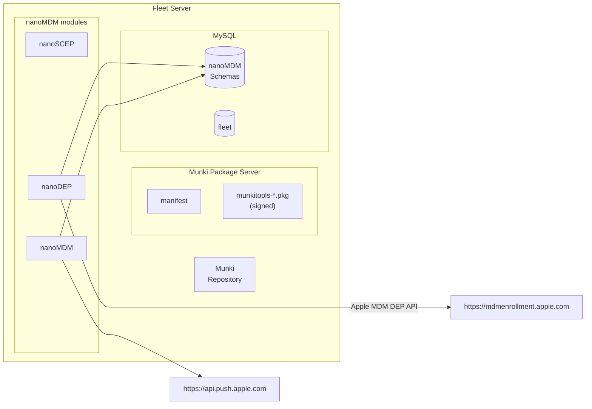

# Apple MDM Fleet Demo

## 0. Architecture



## 1. Setup deployment from scratch

```sh
FLEET_MYSQL_IMAGE=mysql:8.0.19 docker-compose down
docker volume rm fleet_mysql-persistent-volume
FLEET_MYSQL_IMAGE=mysql:8.0.19 docker-compose up
make fleet-dev
```

## 2. Setup APNS Push Certificate and Key

From https://developer.apple.com/account, download push certificate and private key to:
- ~/mdm-apple-test/mdmcert.download.push.pem
- ~/mdm-apple-test/mdmcert.download.push.key

What we did for this test is:
- Zach has an account in https://mdmcert.download/
- Generate CSR with `mdmctl mdmcert.download -new -email=zach@fleetdm.com` (this step generates a private key too, place it in `~/mdm-apple-test/mdmcert.download.push.key`)
- Zach received a certificate `mdm_signed_request.20220712_121945_1267.plist.b64.p7`
- Decrypt the received CSR with `mdmctl mdmcert.download -decrypt=~/Downloads/mdm_signed_request.20220712_121945_1267.plist.b64.p7`
- Zach uploads the decrypted CSR to identity.apple.com and downloads the final certificate.
- Place certificate in `~/mdm-apple-test/mdmcert.download.push.pem`

## 2. Fleet prepare commands

```sh
FLEET_MDM_APPLE_ENABLE=1 ./build/fleet prepare db --dev --logging_debug
[...]
FLEET_MDM_APPLE_ENABLE=1 \
FLEET_MDM_APPLE_SCEP_CA_PASSPHRASE=sceppassphrase \
FLEET_MDM_APPLE_MDM_PUSH_CERT_PEM=$(cat ~/mdm-apple-test/mdmcert.download.push.pem) \
FLEET_MDM_APPLE_MDM_PUSH_KEY_PEM=$(cat ~/mdm-apple-test/mdmcert.download.push.key) \
./build/fleet prepare mdm-apple setup --dev --logging_debug
```

In https://business.apple.com, upload generated `dep_public_key.pem`.
Then Download DEP token to `~/mdm-apple-test/dep_encrypted_token.p7m`.

## 3. Run Fleet behind ngrok

Fleet needs to run behind TLS with valid certificates (otherwise Apple devices won't trust it).
```
ngrok http https://localhost:8080
```

## 4. More Fleet prepare

```sh
FLEET_MDM_APPLE_ENABLE=1 \
FLEET_MDM_APPLE_DEP_ENCRYPTED_AUTH_TOKEN=$(cat ~/mdm-apple-test/dep_encrypted_token.p7m) \
FLEET_MDM_APPLE_DEP_SERVER_URL=ae8a-181-228-157-44.ngrok.io \
./build/fleet prepare mdm-apple dep-auth-token --dev --logging_debug
```

## 5. Setup Munki repository

```sh
REPO_DIR=~/munki_repo ./tools/mdm/apple/setup-test-munki.sh
```

## 6. Download and Sign Vanilla Munki Pkg

```sh
curl -O -L https://github.com/munki/munki/releases/download/v5.7.3/munkitools-5.7.3.4444.pkg
```

```sh
productsign \
    --sign "Developer ID Installer: Some Developer (12ABCDE3FG)" \
    munkitools-5.7.3.4444.pkg ~/munki_pkg/munkitools-5.7.3.4444-signed.pkg
```

## 7. Run Fleet

```sh
FLEET_MDM_APPLE_ENABLE=1 \
FLEET_MDM_APPLE_SCEP_CA_PASSPHRASE=sceppassphrase \
FLEET_MDM_APPLE_SCEP_CHALLENGE=scepchallenge \
FLEET_MDM_APPLE_DEP_SERVER_URL=ae8a-181-228-157-44.ngrok.io \
FLEET_MDM_APPLE_MUNKI_REPO_PATH=~/munki_repo \
FLEET_MDM_APPLE_MUNKI_HTTP_BASIC_AUTH_USERNAME=fleetmunki \
FLEET_MDM_APPLE_MUNKI_HTTP_BASIC_AUTH_PASSWORD=munkipass \
FLEET_MDM_APPLE_MUNKI_PKG_FILE_PATH=~/munki_pkg/munkitools-5.7.3.4444-signed.pkg \
FLEET_MDM_APPLE_MUNKI_PKG_SERVER_URL=ae8a-181-228-157-44.ngrok.io \
./build/fleet serve --dev --dev_license --logging_debug 2>&1 | tee ~/fleet.txt
```

> The following will obviously be required once we add authentication to the endpoints, not rn.
```sh
fleetctl setup --email foo@example.com --name Gandalf --password p4ssw0rd.123 --org-name "Fleet Device Management Inc."
```

## 8. Download MDM enroll profile

```sh
curl -k https://localhost:8080/mdm/apple/api/enroll --output ~/shared-macos/enroll.mobileconfig
```

Enroll an already setup macOS VM.

## 9. Inspect MDM tables

```sh
mysql --host=127.0.0.1 --port=3306 --user=fleet --password
select id from devices;
```

## 10. Trigger a device restart

```sh
./tools/mdm/apple/cmdr.py RestartDevice | curl -k -T - 'https://127.0.0.1:8080/mdm/apple/mdm/api/v1/enqueue/<ID_FROM_PREVIOUS_STEP>'
```

## 11. DEP test

1. Assign the device to our MDM server in https://business.apple.com
2. Fleet should pick it up and assign an DEP enroll profile that points to itself.
3. Start the VM and enroll.
