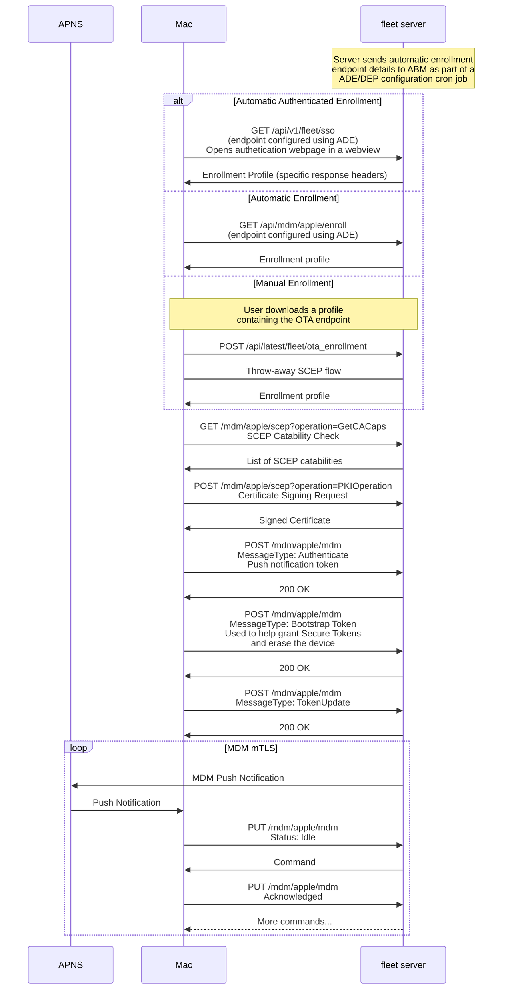

## Overview

## Glossary

### SCEP: Simple Certificate Enrollment Protocol

SCEP is a protocol that allows devices to get a certificate from a CA (in our
case, the Fleet server). This certificate is used later on to authenticate to
the MDM server.

Resources:

- [SCEP summary](#scep-summary) below
- [RFC 8894](https://datatracker.ietf.org/doc/html/rfc8894)

### ADE: Automatic Device Enrollment (formerly DEP)

A device enrolled via ADE prompts the user to enroll in MDM during the initial
device setup process (right after macOS is installed.)

ADE is also called "automatic" enrollment because it doesn't require user
action to download and activate a profile like [manual
enrollment](#manual-enrollment) does.

Resources:

- [ADE Workflow Summary](#ade-workflow-summary)
- [MDM protocol specification](https://developer.apple.com/documentation/devicemanagement)

### Manual enrollment

A method to enroll a device to an MDM server by manually getting and
installing (generally by downloading from a URL) an [enrollment
profile](#enrollment-profile).

### ABM: Apple Business Manager

Interface to administer Devices and MDM servers, mainly used for [ADE
enrollment](#ade-enrollment).

Can be accessed at https://business.apple.com/ .

### APNs: Apple Push Notification Service

MDM uses the Apple Push Notification Service (APNs) to deliver a "wake up"
message to managed devices. The device then connects to the MDM server to
retrieve [commands](#commands) and return results.

APNs are servers managed by Apple, the MDM server needs a certificate signed by
Apple to authenticate with them.

Resources:

- [MDM Protocol summary](#mdm-protocol-summary)
- [MDM protocol specification](https://developer.apple.com/business/documentation/MDM-Protocol-Reference.pdf)
- [MicroMDM documentation](https://github.com/micromdm/micromdm/blob/main/docs/user-guide/quickstart.md#configure-an-apns-certificate)

### Profile

A configuration profile is an XML file that allows to distribute configuration
information, for example: restrictions on device features, VPN settings, etc.

Profiles have the `.mobileconfig` extension and can be administered in a device
from "Settings > Profiles."

Resources:

- [Configuration Profile Reference](https://developer.apple.com/business/documentation/Configuration-Profile-Reference.pdf).

### Enrollment profile

An enrollment profile is a [profile](#profile) that contains special directives
to enroll a device to an MDM server.

For [manual enrollment](#manual-enrollment) the profile needs to be downloaded
and installed by the user.

For [ADE enrollment](#ade-device-enrollment-program) the enrollment profile is downloaded from the MDM server specified in the ADE JSON profile (see below), fields `url` and `configuration_web_url`.

### ADE profile

This (JSON) profile is used to configure a device in Apple Business Manager.
It contains all the necessary information that a device needs to automatically enroll to an MDM server during device setup.

[Example](https://fleetdm.com/example-dep-profile)

See all fields [here](https://developer.apple.com/documentation/devicemanagement/profile).

### Commands

After a device is enrolled, an MDM server can send commands to be executed in
the device (e.g: install an application, shut down the device, etc.)

The server first sends a (optional) [push
notification](#apons-apple-push-notification-service), then the device polls
the server for the command, processes the command, and reports the command
results to the server.

### CSR: Certificate Signing Request

Issued by the server that needs validation from a signing authority, the
request has the public key in the pair and information about the server
(organization name, etc)

The CSR itself is usually created in a Base-64 based PEM format

### PKI: Public Key Infrastructure

Allows authenticating users and devices. The basic idea is to have one or more
trusted parties digitally sign documents certifying that a particular
cryptographic key belongs to a particular user or device. The key can then be
used as an identity for the user.

Resources:

- https://www.ssh.com/academy/pki
- https://en.wikipedia.org/wiki/Public_key_infrastructure

### CA: Certificate Authority

The primary role of the CA is to digitally sign and publish a public key
bound to a given user.

This is done using the CA's own private key, so that
trust in the user key relies on one's trust in the validity of the CA's key.

Resources:

- https://en.wikipedia.org/wiki/Public_key_infrastructure#Certificate_authorities

### SCEP summary

SCEP is a [PKI](#pki-public-key-infrastructure) protocol that allows devices to
request certificates from a [CA](#ca-certificate-authoriy) (in our context, the
Fleet server acts as a CA) that will be later used to authenticate with the MDM
server (in our context, the Fleet server also acts as the MDM server.)

To enroll, a client provides a distinguished name and a public key, and the
server responds with a X.509 certificate.

During enrollment, the SCEP CA server may also require a `challengePassword`,
a shared secret essential for authenticating certificate access. Its absence could lead to
unauthorized enrollment requests.

More generally, the protocol is specified in [RFC
8894](https://datatracker.ietf.org/doc/html/rfc8894) and allows:

- [CA](#ca-certificate-authority) public key distribution
- Certificate enrolment and issue
- Certificate renewal
- Certificate query
- Query (not perform) certificate revocation

### MDM Protocol summary

This is a rough summary of the [MDM Protocol
Reference](https://developer.apple.com/business/documentation/MDM-Protocol-Reference.pdf).

The protocol is composed by the MDM Check-in protocol and the main MDM protocol.

#### MDM Check-in Protocol

Used during initialization, validates if the device can be enrolled and
notifies the server.

It's composed by three different messages sent by the device to the server.

Check-in requests are also used to implement [DDM](#ddm-declarative-device-management) on top of the MDM protocol.

**Authenticate**

When the enrollment profile is being installed, the device tries to establish a
connection with the server. This is when the
[SCEP](#scep-simple-certificate-enrollment-protocol) exchange takes place.

The device sends its UDID and the [topic](#push-notification-topic) that should
be used for push notifications.

The server shouldn't assume that the device has installed the enrollment profile, as
other payloads in the profile may still fail to install. When the device has
successfully installed the enrollment profile, it sends a `TokenUpdate` message.

**TokenUpdate**

A device sends a token update message to the server when it has installed the
enrollment profile or whenever its device push token, push magic, or unlock token
change. These fields are needed by the server to send the device push
notifications or passcode resets.

The server should send push messages to the device only after receiving the
first token update message.

**CheckOut**

The device attempts to notify the server when the MDM profile is removed.

- In macOS v10.9, this only happens if the `CheckOutWhenRemoved` key in the
  enrollment profile is set to `true`.
- In macOS v10.8, this always happens.

If network conditions don't allow the message to be delivered successfully,
the device makes no further attempts to send the message.

#### Main MDM Protocol

After the device is enrolled, the server (at some point in the future) sends
out a push notification to the device, then:

- The device polls the server for a [command](#commands) in response to the
  push notification.
- The device performs the command.
- The device contacts the server to report the result of the last command and
  to request the next command.

To see all available commands, look under "Support for macOS Requests" in the
MDM Protocol Reference.

### ADE Workflow Summary

In order to get information about devices enrolled through ADE, the MDM server
needs to communicate with Apple servers periodically.

The workflow looks like:

1. The MDM server gets a token that will use to authenticate to Apple servers.
   This process is described in detail in the MDM protocol reference. Some parts
   of it can be automated by MDM solutions.
2. The MDM server periodically pings
   `GET https://mdmenrollment.apple.com/server/devices` and
   `GET https://mdmenrollment.apple.com/devices/sync` to get
   information about newly enrolled devices and changes on devices already
   enrolled.
3. The MDM server defines and assigns [ADE profiles](https://developer.apple.com/documentation/devicemanagement/profile) (JSON) to devices using `POST
   https://mdmenrollment.apple.com/profile` and `PUT
   https://mdmenrollment.apple.com/profile/devices`
4. The MDM server removes ADE profiles (JSON) from a device using `DELETE
   https://mdmenrollment.apple.com/profile/devices`

### DDM: Declarative Device Management

Declarative device management is an update to the existing protocol for device management that can be used in combination with the existing MDM protocol capabilities. It allows the device to asynchronously apply settings and report status back to the MDM server without constant polling.

Some new MDM features will only be available through DDM.

All DDM messages are JSON messages embedded (base64 encoded) within XML messages (because DDM is built on top of the existing MDM protocol).
- DDM uses the `DeclarativeManagement` MDM command, used to enable DDM and set a set of declarations for the device (from server to device).
- DDM uses the `CheckIn` MDM command to send `DeclarativeManagement` commands from device to MDM server.

Resources: 
- [WWDC21](https://developer.apple.com/videos/play/wwdc2021/10131)
- [WWDC22](https://developer.apple.com/videos/play/wwdc2022/10046)
- [WWDC23](https://developer.apple.com/videos/play/wwdc2023/10041)
