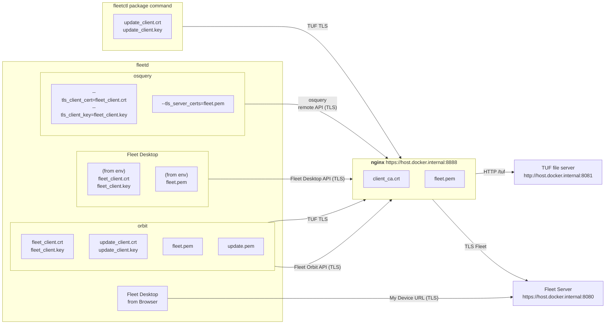

# Test Orbit mTLS

> WARNING: All of these scripts are for testing only, they are not safe for production use.

Following is a guide to help you run and test Orbit with TLS client certificate authentication.

All commands are executed in the repository's root directory.
All commands were tested on an Intel macOS.

## Diagram of components



The nginx proxy is configured to authenticate all TLS requests with the provided `client_ca.crt`.

## 1. Setup

This guide assumes the following [Local TUF setup](../tuf/test/README.md#setup).

## 2. Start nginx proxy with client certificate verification

```sh
docker compose -f ./tools/test-orbit-mtls/docker-compose.yml up
```

The proxy will listen to port 8888 and use TLS client certificates for authentication.

> Note: If you would like to use a public URL, see [public mTLS reverse proxy instructions](../../docs/Contributing/guides/mtls-reverse-proxy-setup.md)

## 3. Generate Orbit installers with custom flags

```sh
rm -rf test_tuf

SYSTEMS="macos windows linux" \
PKG_FLEET_URL=https://host.docker.internal:8888 \
PKG_TUF_URL=https://host.docker.internal:8888/tuf \
DEB_FLEET_URL=https://host.docker.internal:8888 \
DEB_TUF_URL=https://host.docker.internal:8888/tuf \
RPM_FLEET_URL=https://host.docker.internal:8888 \
RPM_TUF_URL=https://host.docker.internal:8888/tuf \
MSI_FLEET_URL=https://host.docker.internal:8888 \
MSI_TUF_URL=https://host.docker.internal:8888/tuf \
GENERATE_PKG=1 \
GENERATE_DEB=1 \
GENERATE_RPM=1 \
GENERATE_MSI=1 \
ENROLL_SECRET=OokY/M85nibwa3WjDtC091QzXqkoVCwX \
FLEET_DESKTOP=1 \
USE_FLEET_SERVER_CERTIFICATE=1 \
USE_FLEET_CLIENT_CERTIFICATE=1 \
USE_UPDATE_SERVER_CERTIFICATE=1 \
USE_UPDATE_CLIENT_CERTIFICATE=1 \
FLEET_DESKTOP_ALTERNATIVE_BROWSER_HOST=host.docker.internal:8080 \
./tools/tuf/test/main.sh
```

We need to define `FLEET_DESKTOP_ALTERNATIVE_BROWSER_HOST` because we are not expecting users to configure client certificates on their browser.

Once the packages are generated, they are ready to be installed on devices for testing.