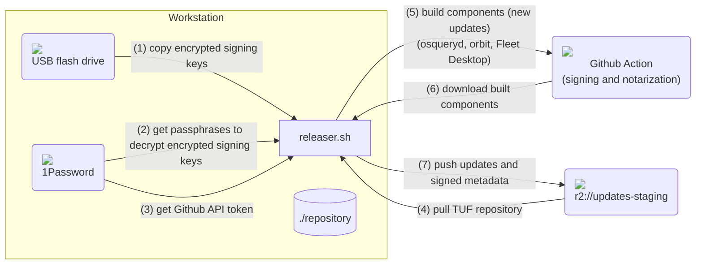
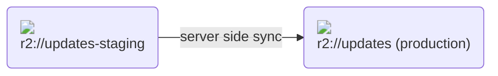

# Releasing updates to Fleet's TUF repository

The `releaser.sh` script automates the building and releasing of fleetd and osquery updates on [Fleet's TUF repository](https://updates.fleetdm.com).

> - The script was developed and tested on macOS Intel.
> - It currently supports pushing new `fleetd` and `osqueryd` versions.
> - By storing credentials encrypted in a USB flash drive and storing their decryption passphrase on 1Password we are enforcing a form of 2FA.
> - First, new releases are pushed to https://updates-staging.fleetdm.com. After verification (smoke test), releases are pushed to production, by syncing https://updates-staging.fleetdm.com to https://updates.fleetdm.com.

1. Push to staging:

2. Push to production:


## Permissions and configuration

Following is the checklist for all credentials and configuration needed to run the script.

### Dependencies

- `make`
- `git`
- 1Password 8 application.
- Install and configure 1Password's `op` cli to connect to the application: https://developer.1password.com/docs/cli/get-started/
- `rclone`
- `fleetctl`: Either built from source or installed by npm.
- `tuf`: Download the release from https://github.com/theupdateframework/go-tuf/releases/tag/v0.5.2 and place the `tuf` executable in `/usr/local/bin/tuf`. You will need to make an exception in "Privacy & Security" because the executable is not signed.
- `gh`: `brew install gh`.

### 1Password

You need to create three passphrases on your private 1Password vault for encrypting the signing keys (more on signing keys below).
Create three private "passwords" with the following names: `UPDATES TARGETS`, `UPDATES SNAPSHOT` and `UPDATES TIMESTAMP`.
The resulting credentials will have the following "path" within 1Password (these paths will be provided to the `releaser.sh` script)
```sh
Private/UPDATES TARGETS/password
Private/UPDATES SNAPSHOT/password
Private/UPDATES TIMESTAMP/password
```

### R2

The following is required to be able to run `rclone` cli commands that can read/write to R2 buckets.

1. You will need to request the infrastructure team to provide you with access key and secret key that can read+write to the R2 buckets.
2. Set the following settings on `~/.config/rclone/rclone.conf`:
```conf
[r2]
type = s3
provider = Cloudflare
access_key_id = <ACCESS_KEY>
secret_access_key = <SECRET_ACCESS_KEY>
region = auto
endpoint = https://<ACCOUNT_ID>.r2.cloudflarestorage.com
acl = private
```
`ACCESS_KEY`, `SECRET_ACCESS_KEY`, and `ACCOUNT_ID` are provided by the infrastructure team.

To smoke test (read) access you can run:
```sh
rclone copy --verbose --checksum r2://updates-staging/timestamp.json .
cat timestamp.json
```

### TUF signing keys

> You can skip this step if you already have authorized keys to sign and publish updates.

To release updates to our TUF repository you need the `root` role (ask in Slack who has such `root` role) to sign your signing keys.

1. First, run the following script
```sh
tuf gen-key targets && echo
tuf gen-key snapshot && echo
tuf gen-key timestamp && echo
```
2. Store the '$TUF_DIRECTORY/keys' folder (that contains the encrypted keys) on a USB flash drive that you will ONLY use for releasing fleetd updates.
3. Share '$TUF_DIRECTORY/staged/root.json' with Fleet member with the 'root' role, who will sign with its root key and push it to the remote repository.
4. The human with the `root` role will run the following commands to sign the provided `staged/root.json`:
```sh
tuf sign
tuf snapshot
tuf timestamp
tuf commit
```
And push the newly signed `root.json` to the remote repository.

### Encrypted keys in USB

For releasing fleetd you need to plug in the USB that contains encrypted signing keys.
In this guide we assume the USB device will be mounted in `/Volumes/FLEET-UPD/` and it ONLY contains a `keys/` directory.

### Github

#### Personal access token

> A personal access token is required to download artifacts from Github Actions using the Github API.

1. Create a personal access token at https://github.com/settings/tokens. Check `repo` and `workflow` permissions for the token.
2. Store the token on 1Password as a "password" with name "Github Token"
The resulting credential will have the following "path" within 1Password (this path will be provided to the script)
```sh
Private/Github Token/password
```

#### Github session

You need to log in to your Github account using the cli (`gh`).
```sh
gh auth login
```
It will be used to create a PR which is used to update the changelog and trigger the Github actions to build components.

## Releasing

Following are samples of the script execution to release components to `edge` and `stable`.

> When releasing fleetd you need to checkout the branch (e.g. `main`) you want to release.

> NOTE: When releasing fleetd:
> If there are only `orbit` changes on a release we still have to release the `desktop` component with its version string bumped
> (even if there are no changes in it). This is due to the fact that we want users to see the new version in the tray icon,
> e.g. `"Fleet Desktop v1.21.0"`. Technical debt: We could improve this process to reduce the complexity of releasing
> fleetd when there are no Fleet Desktop changes.

### Releasing to `edge`

#### Releasing fleetd `1.23.0` to `edge`

1. Push to staging:
```sh
TUF_DIRECTORY=/Users/foobar/updates-staging.fleetdm.com \
COMPONENT=fleetd \
ACTION=release-to-edge \
VERSION=1.23.0 \
KEYS_SOURCE_DIRECTORY=/Volumes/FLEET-UPD/keys \
TARGETS_PASSPHRASE_1PASSWORD_PATH="Private/UPDATES TARGETS/password" \
SNAPSHOT_PASSPHRASE_1PASSWORD_PATH="Private/UPDATES SNAPSHOT/password" \
TIMESTAMP_PASSPHRASE_1PASSWORD_PATH="Private/UPDATES TIMESTAMP/password" \
GITHUB_USERNAME=foobar \
GITHUB_TOKEN_1PASSWORD_PATH="Private/Github Token/password" \
./tools/tuf/releaser.sh
```
2. Smoke test release on staging.
3. Push to production:
```sh
ACTION=release-to-production ./tools/tuf/releaser.sh
```
4. Smoke test release on production.


#### Releasing osquery `5.12.1` to `edge`

1. Push to staging:
```sh
TUF_DIRECTORY=/Users/foobar/updates-staging.fleetdm.com \
COMPONENT=osqueryd \
ACTION=release-to-edge \
VERSION=5.12.1 \
KEYS_SOURCE_DIRECTORY=/Volumes/FLEET-UPD/keys \
TARGETS_PASSPHRASE_1PASSWORD_PATH="Private/UPDATES TARGETS/password" \
SNAPSHOT_PASSPHRASE_1PASSWORD_PATH="Private/UPDATES SNAPSHOT/password" \
TIMESTAMP_PASSPHRASE_1PASSWORD_PATH="Private/UPDATES TIMESTAMP/password" \
GITHUB_USERNAME=foobar \
GITHUB_TOKEN_1PASSWORD_PATH="Private/Github Token/password" \
./tools/tuf/releaser.sh
```
2. Smoke test release on staging.
3. Push to production:
```sh
ACTION=release-to-production ./tools/tuf/releaser.sh
```
4. Smoke test release on production.

### Promoting from `edge` to `stable`

#### Promoting fleetd `1.23.0` from `edge` to `stable`

1. Push to staging:
```sh
TUF_DIRECTORY=/Users/foobar/updates-staging.fleetdm.com \
COMPONENT=fleetd \
ACTION=promote-edge-to-stable \
VERSION=1.23.0 \
KEYS_SOURCE_DIRECTORY=/Volumes/FLEET-UPD/keys \
TARGETS_PASSPHRASE_1PASSWORD_PATH="Private/UPDATES TARGETS/password" \
SNAPSHOT_PASSPHRASE_1PASSWORD_PATH="Private/UPDATES SNAPSHOT/password" \
TIMESTAMP_PASSPHRASE_1PASSWORD_PATH="Private/UPDATES TIMESTAMP/password" \
./tools/tuf/releaser.sh
```
2. Smoke test release on staging.
3. Push to production:
```sh
ACTION=release-to-production ./tools/tuf/releaser.sh
```
4. Smoke test release on production.

#### Promoting osqueryd `5.12.1` from `edge` to `stable`

1. Push to staging:
```sh
TUF_DIRECTORY=/Users/foobar/updates-staging.fleetdm.com \
COMPONENT=osqueryd \
ACTION=promote-edge-to-stable \
VERSION=5.12.1 \
KEYS_SOURCE_DIRECTORY=/Volumes/FLEET-UPD/keys \
TARGETS_PASSPHRASE_1PASSWORD_PATH="Private/UPDATES TARGETS/password" \
SNAPSHOT_PASSPHRASE_1PASSWORD_PATH="Private/UPDATES SNAPSHOT/password" \
TIMESTAMP_PASSPHRASE_1PASSWORD_PATH="Private/UPDATES TIMESTAMP/password" \
./tools/tuf/releaser.sh
```
2. Smoke test release on staging.
3. Push to production:
```sh
ACTION=release-to-production ./tools/tuf/releaser.sh
```
4. Smoke test release on production.

#### Releasing `swiftDialog` to `stable`

> `releaser.sh` doesn't support `swiftDialog` yet.
> macOS only component

The `swiftDialog` executable can be generated from a macOS host by running:
```sh
make swift-dialog-app-tar-gz version=2.2.1 build=4591 out-path=.
```
```sh
fleetctl updates add --target /path/to/macos/swiftDialog.app.tar.gz --platform macos --name swiftDialog --version 2.2.1 -t edge
```

#### Releasing `nudge` to `stable`

> `releaser.sh` doesn't support `nudge` yet.
> macOS only component

The `nudge` executable can be generated from a macOS host by running:
```sh
make nudge-app-tar-gz version=1.1.10.81462 out-path=.
```
```sh
fleetctl updates add --target /path/to/macos/nudge.app.tar.gz --platform macos --name nudge --version 1.1.10.81462 -t edge
```

#### Releasing `Escrow Buddy` to `stable`

> `releaser.sh` doesn't support `Escrow Buddy` yet.
> macOS only component

The `Escrow Buddy` pkg installer can be generated by running:
```sh
make escrow-buddy-pkg version=1.0.0 out-path=.
```
```sh
fleetctl updates add --target /path/to/escrowBuddy.pkg --platform macos --name escrowBuddy --version 1.0.0 -t stable
```

#### Updating timestamp

1. Push to staging:
```sh
TUF_DIRECTORY=/Users/foobar/updates-staging.fleetdm.com \
ACTION=update-timestamp \
KEYS_SOURCE_DIRECTORY=/Volumes/FLEET-UPD/keys \
TIMESTAMP_PASSPHRASE_1PASSWORD_PATH="Private/UPDATES TIMESTAMP/password" \
./tools/tuf/releaser.sh
```
2. Push to production:
```sh
ACTION=release-to-production ./tools/tuf/releaser.sh
```

### Doing a patch release of fleetd

Patch releases follow the same process as releasing a minor version, except instead of checking out the `main` branch of Fleet locally, you check out a patch branch of Fleet, e.g.:

```
git checkout rc-minor-fleetd-v1.41.1
```

As always, the `VERSION` env var used when running `releaser.sh` should match the version of the fleetd release, e.g.

```sh
TUF_DIRECTORY=/Users/foobar/updates-staging.fleetdm.com \
COMPONENT=fleetd \
ACTION=release-to-edge \
VERSION=1.41.1 # <-- note the patch version \
KEYS_SOURCE_DIRECTORY=/Volumes/FLEET-UPD/keys \
TARGETS_PASSPHRASE_1PASSWORD_PATH="Private/UPDATES TARGETS/password" \
SNAPSHOT_PASSPHRASE_1PASSWORD_PATH="Private/UPDATES SNAPSHOT/password" \
TIMESTAMP_PASSPHRASE_1PASSWORD_PATH="Private/UPDATES TIMESTAMP/password" \
GITHUB_USERNAME=foobar \
GITHUB_TOKEN_1PASSWORD_PATH="Private/Github Token/password" \
./tools/tuf/releaser.sh
```

See https://github.com/fleetdm/fleet/blob/main/orbit/TUF.md to find the latest released version.

After following the rest of the "Releasing to edge" steps above, publish your release using the instructions in "Promoting from edge to stable" above as you would for a minor release, again remembering to set the `VERSION` accordingly.

## Testing and improving the script

- You can specify `GIT_REPOSITORY_DIRECTORY` to set a separate path for the Fleet repository (it uses the current by default).
This is sometimes necessary if the tooling the script uses is not present in the branch we are trying to release from.
```sh
git clone git@github.com:fleetdm/fleet.git <SOME_DIRECTORY>
GIT_REPOSITORY_DIRECTORY=<SOME_DIRECTORY>
```

- If the PR and orbit tag were already generated but you need to run the script again you can set `SKIP_PR_AND_TAG_PUSH=1` to skip that part.

## TODOs to improve releaser.sh

- Support releasing `nudge` and `swiftDialog`. 

## Troubleshooting

### Invalid timestamp.json version

The following issue was solved by resigning the timestamp metadata `fleetctl updates timestamp` (executed three times to increase the version to `4175`)
```sh
2022-08-23T13:44:48-03:00 INF update failed error="update metadata: update metadata: tuf: failed to decode timestamp.json: version 4172 is lower than current version 4174"
2022-08-23T13:59:48-03:00 INF update failed error="update metadata: update metadata: tuf: failed to decode timestamp.json: version 4172 is lower than current version 4174"
```
