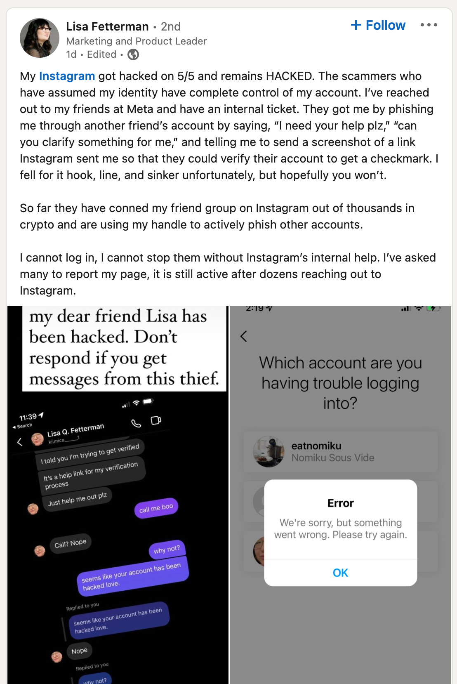
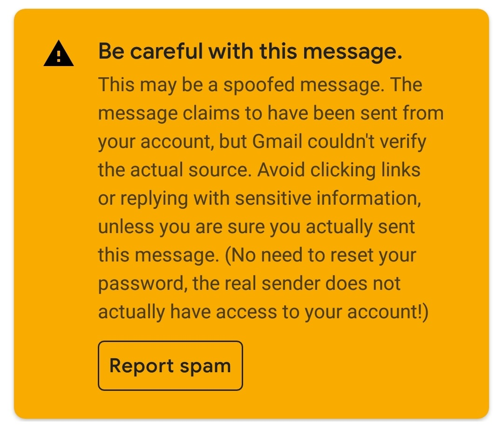
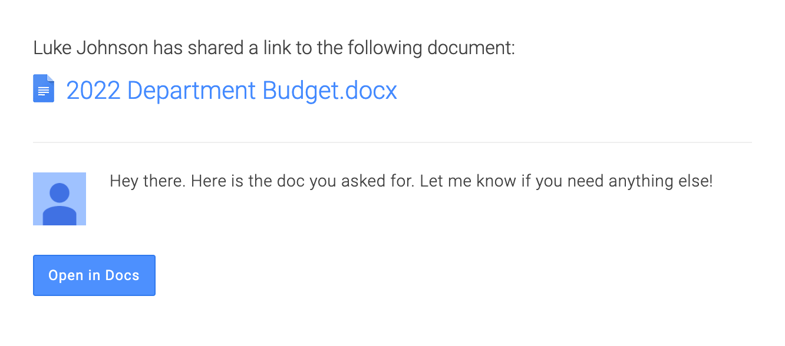
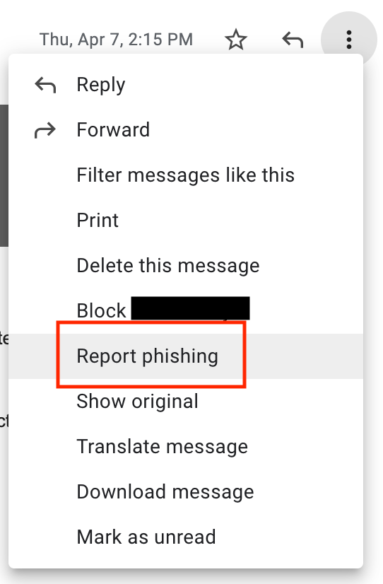
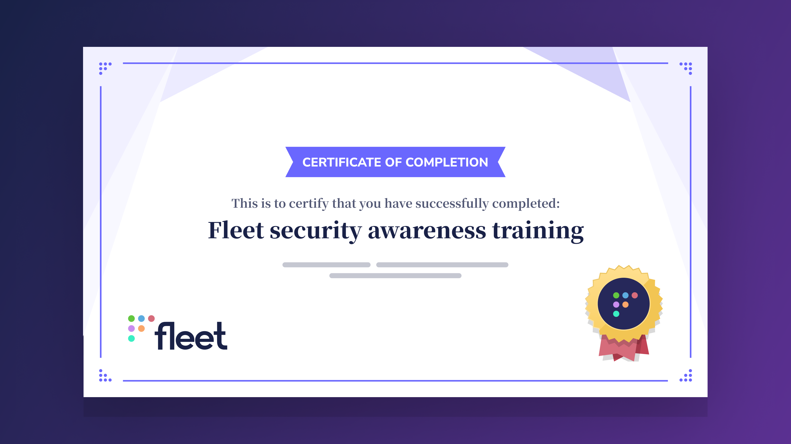

<!-- headingDivider: 2 -->

# Fleet security awareness

| Version |
| ------- |
| 2022-05 |

## About this

* This is done upon hire and annually. 
* It focuses on the tools we use.
* It also applies to securing your personal devices and accounts.
* This takes about 15 minutes.

More info is available in our [handbook](https://fleetdm.com/handbook/security#security-awareness-training).

## Enrolling your Fleet laptop (MDM)

### Which ones?
**Fleet-owned Macs**

* Most work is allowed from personal devices.
* Personal computers are allowed on internal Fleet instances.
* You probably don't want MDM on your personal Mac.

## Enrolling your Fleet laptop (MDM)
### Why?

* MDM will [configure your Mac securely](https://fleetdm.com/handbook/security#how-we-protect-end-user-devices).
* It will push osquery and enroll you to our [dogfood instance of Fleet](https://dogfood.fleetdm.com/dashboard).
* This provides a catalog of apps you can install easily.

[Enrollment
instructions](https://docs.google.com/document/d/1vRrI9x5ch_Yuw2ihq3JDkNcxP32KhDt5RXasQ9A5Bmk/edit) (Private)

## Strong unique passwords and 2FA

Why?

* Sites leak your passwords (HaveIbeenPwned.com)
* Attackers find value in many things
* Phishing will always work

## Authentication and passwords

Password "best practices" can be confusing.

Ours are simple:

1. Single Sign-On (SSO)
2. 2FA (Two-factor authentication) all the things
3. Long, unique passwords

## What type of 2FA?

From best to worst:
1. [Hardware security keys](https://fleetdm.com/handbook/security#hardware-security-keys)
2. App/push notification based
3. Time-based One-Time Password (TOTP)
4. SMS/Voice

[Details](https://fleetdm.com/handbook/security#2-step-verification)

[Lunch & Learn on 2FA methods](https://www.youtube.com/watch?v=0JnE4ezgu6Q)

## 2FA

1. Enable it on your Google, Slack and GitHub accounts.
2. Make sure your Yubikeys are on their way.
3. When you receive them, add them to your accounts and let *#g-security* know.

## Password manager

* Install 1Password from the "Managed Software Center." 
* Generate random passwords for everything that does not support SSO.
* Avoid sharing passwords when it can be avoided. If it can't, share with the password manager.

## Phishing

Good phishing looks real. 

* Take this quiz: https://phishingquiz.withgoogle.com/.
* Use Gmail directly (mobile app or web).
* Assume phishing can be so well targeted that you can't spot it.

Ask around!

## Alternate phishing methods

* Calendar 
* Documents 
* LinkedIn 

## Report phishing

* Directly in Gmail
* In *#g-security* when it feels like "better" phishing

## Business email compromise
BEC leverages our willingness to help people.

* Always check the "**from**" on email. If the **from** is FleetDM.com, it could still be phishing. If it's not, it very likely IS.
* Beware of emergencies, pressure and anything related to money transfers or purchases

## Money transfers

We have a strict process related to payments and wire transfers. If you are in the Digital Experience team, make sure you are aware of it.

## Working from shady networks and cool locations

* We assume all networks are shady.
* Fleet enrolled laptops have firewalls configured, + the protocols we use are encrypted and can be used on public Wi-Fi.

## Installing apps

Install apps from the following sources:

1. Our Managed Software Center.
2. Package managers such as *brew* or *apt*.
3. Official websites of vendors / open source projects.

## Apps and Google Workspace

Apps are only automatically allowed if they do not access confidential data.

If you need an app hooked up, ask in *#g-security*!

## Browser extensions

An ad-blocker [for Chrome](https://chrome.google.com/webstore/detail/ublock-origin/cjpalhdlnbpafiamejdnhcphjbkeiagm?hl=en) is provided on Fleet-managed computers.

* Limit extension usage to well-trusted ones.
* Disable extensions you do not use.
* If in doubt, ask about it in *#g-security*.

## Keeping stuff up to date
Enrolled laptops will have their OS and Chrome kept up to date.

1. Install updates promptly.
2. Update your package manager if you use one (`brew update && brew upgrade`).
3. Enable automatic updates on your mobile devices.

## What if you leaked something to GitHub
Undoing git history is complicated. Consider this secret forever leaked.

1. Post about it in #g-security.
2. Get ready to rotate said secret!
3. If it was not an actual "secret" but sensitive information in an issue, delete the comment/post, **including the history**.

## If... you lose your laptop

1. Don't panic. It's encrypted.
2. Post about it in #g-security.
3. In the thread in #g-security, inform someone from the Digital Experience team. They'll help you get a new one ASAP!

## If... you lose your Yubikey(s)

1. Don't panic.
2. Post about it in #g-security.
3. Your key will be disabled. New ones will be ordered, but in the meantime, you can use your phone
   [as a security
   key](https://support.google.com/accounts/answer/9289445?hl=en&co=GENIE.Platform%3DAndroid).
4. If you find your keys after they've been disabled, just set them up again!

## If you see something suspicious

**NEVER** hesitate to ask questions. 

It collectively takes us a minute to inform you about something being legitimate. 

We can't all know everything going on individually, so leverage the power of the team!

#g-security

## 

